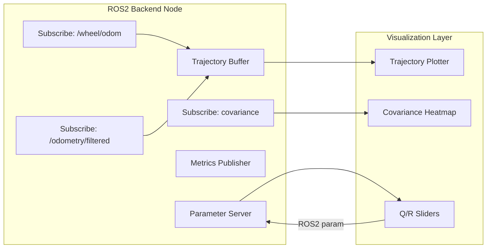

# AeroFuse — ROS2 Multi-Sensor Odometry Diagnostic Dashboard

> **Source:** `Desktop/Anirudh/My apps/aerofuse/idea.txt`
> **Status:** Design spec (MVP roadmap defined)
> **Target:** ROS2 Humble / Jazzy
> **Update Rate:** ~30 Hz
> **Communication:** Native ROS2 (`rclpy`/`rclcpp`) or WebSocket bridge

---

## For future agent
This is a **personal robotics build** — a diagnostic tool to make sensor-fusion odometry observable and tunable in real time. Addresses the "black box" problem of `robot_localization` / EKF by exposing raw vs fused trajectories, covariance evolution, and live Q/R parameter adjustment. Cross-links: [[wiki/01-Areas/Engineering/robotics/robotics-fundamentals]], [[wiki/01-Areas/Engineering/robotics/ros2-communication]], [[wiki/01-Areas/Engineering/robotics/worked-example-odom-ekf]], [[wiki/00-Current-Projects/retrieval-agent]].

---

## 1. Problem Statement

Sensor fusion (EKF/UKF in `robot_localization`) is often treated as a black box:
- Wheel odometry drifts → filter should correct
- But *how much* does it correct? Is it over/under-confident?
- Tuning Q (process noise) / R (measurement noise) requires restart → slow iteration

**AeroFuse makes this visible:** compare trajectories, watch covariance heatmap, tune Q/R live.

---

## 2. System Architecture



**Two UI Paths:**
| Option | Stack | Best For |
|--------|-------|----------|
| **A: Foxglove Studio** | Native ROS2 panels, minimal code | Internal teams, early validation |
| **B: Standalone Dashboard** | PyQt6 / DearPyGui | Productized tooling, custom workflows |

---

## 3. Core Features

### Feature 1: Dual-Path Trajectory Plotter
- **Raw Path:** `/wheel/odom` or `/encoder/odom`
- **Fused Path:** `/odometry/filtered` or `/ekf/odom`
- **Visualizes:** Both paths + current pose marker + historical trail
- **Insights:** Wheel slip, drift accumulation, fusion corrections, localization instability

### Feature 2: Live Covariance Heatmap
- **Source:** `nav_msgs/Odometry.pose.covariance` (6×6 matrix)
- **State Dimensions:** X, Y, Z, Roll, Pitch, Yaw
- **Visualization:** Heatmap (low uncertainty = light, high = dark)
- **Metrics:** Max covariance, average covariance, trend over time
- **Detects:** Sensor degradation, poor tuning, growing uncertainty

### Feature 3: Dynamic Parameter Sliders
- **Q Matrix (Process Noise):** Position, Velocity, Orientation
- **R Matrix (Measurement Noise):** Wheel encoder, IMU, GPS
- **Controls:** Logarithmic sliders (1e-6 to 10), numeric input, reset-to-default
- **Flow:** User adjusts → ROS2 param update → Filter reconfigures → Views update live

---

## 4. Communication Architecture

### Option 1: Native ROS2 (Recommended)
```
Dashboard Node (rclpy) ↔ Robot Node (rclpy/rclcpp)
  - Direct topic subscription
  - Parameter service calls
  - Zero-copy possible
```

### Option 2: WebSocket Bridge
```
ROS2 Backend → WebSocket Server → Browser Dashboard
  - Remote monitoring
  - Multi-user access
  - Platform independent
```

---

## 5. Key Technical Challenges & Solutions

| Challenge | Solution |
|-----------|----------|
| **High-frequency viz (30Hz)** | Buffer messages, fixed-interval UI refresh, limit history length |
| **Parameter safety** | Bounds enforcement, reset-to-default, profile save/load |
| **Data synchronization** | Timestamp all messages, ROS2 message_filters, latency indicators |
| **Cross-platform** | rclpy for Python dashboard, rclcpp for performance-critical backend |

---

## 6. MVP Roadmap

| Phase | Deliverables |
|-------|--------------|
| **1** | ROS2 data collection node, dual-path trajectory plot, covariance heatmap |
| **2** | Real-time Q/R parameter sliders, parameter persistence, session recording |
| **3** | Tuning presets, automated drift analysis, filter performance reports, multi-robot monitoring |

---

## 7. ROS2 Integration Points

| Component | Topic/Service | Message Type |
|-----------|---------------|--------------|
| Wheel Odometry | `/wheel/odom` | `nav_msgs/Odometry` |
| Fused Odometry | `/odometry/filtered` | `nav_msgs/Odometry` |
| Covariance | Embedded in Odometry | `float64[36]` |
| Parameter Updates | `/ekf_node/set_parameters` | `rcl_interfaces/SetParameters` |

---

## 8. Cross-References

- [[wiki/01-Areas/Engineering/robotics/robotics-fundamentals]] — EKF derivation, differential drive odometry
- [[wiki/01-Areas/Engineering/robotics/ros2-communication]] — DDS, QoS, parameter services
- [[wiki/01-Areas/Engineering/robotics/worked-example-odom-ekf]] — Runnable odom+EKF example
- [[wiki/01-Areas/Engineering/robotics/ros2-beginner-guide]] — Nav2 pipeline context
- [[wiki/00-Current-Projects/retrieval-agent]] — RAG for robotics docs

---

## 9. Implementation Status

- [x] Design spec complete (`idea.txt`)
- [x] MVP roadmap defined
- [ ] Phase 1: ROS2 node + Foxglove panels
- [ ] Phase 2: PyQt6 standalone dashboard
- [ ] Phase 3: Parameter persistence + automated analysis

---

## See Also
- [[wiki/01-Areas/Engineering/robotics/index]] — Robotics module hub
- [[wiki/00-Current-Projects/neural-engine]] — Could integrate learned process noise models