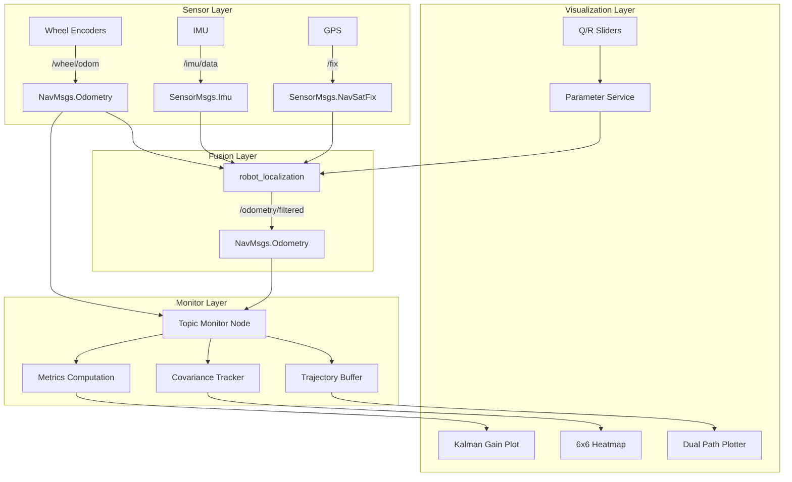

# AeroFuse — ROS2 Multi-Sensor Odometry Diagnostic Dashboard

> **Source:** `Desktop/Anirudh/My apps/aerofuse/idea.txt`
> **Status:** Design spec (MVP roadmap defined)
> **Target:** ROS2 Humble / Jazzy
> **Update Rate:** ~30 Hz
> **Communication:** Native ROS2 (`rclpy`/`rclcpp`) or WebSocket bridge

---

## For future agent
This is a **personal robotics build** — a diagnostic tool to make sensor-fusion odometry observable and tunable in real time. Addresses the "black box" problem of `robot_localization` / EKF by exposing raw vs fused trajectories, covariance evolution, and live Q/R parameter adjustment. Cross-links: [[wiki/01-Areas/Engineering/robotics/robotics-fundamentals]], [[wiki/01-Areas/Engineering/robotics/ros2-communication]], [[wiki/01-Areas/Engineering/robotics/worked-example-odom-ekf]], [[wiki/00-Current-Projects/retrieval-agent]].

---

## 1. Problem Statement — Why This Exists

Sensor fusion (EKF/UKF in `robot_localization`) is often treated as a black box:
- Wheel odometry drifts → filter should correct
- But *how much* does it correct? Is it over/under-confident?
- Tuning Q (process noise) / R (measurement noise) requires restart → slow iteration

**AeroFuse makes this visible:** compare trajectories, watch covariance heatmap, tune Q/R live.

### The EKF Black Box Problem
```python
# Typical robot_localization setup:
# Subscriber → EKF → Fused Output
# You see: /wheel/odom (noisy, drifting)
# You see: /odometry/filtered (smooth, but how?)
# You DON'T see: Q matrix evolution, Kalman gain, innovation sequence
```

**AeroFuse exposes:**
1. **Raw vs fused trajectories** — visual drift comparison
2. **Covariance heatmap** — 6×6 matrix evolution over time
3. **Q/R sliders** — real-time parameter adjustment without restart

---

## 2. System Architecture — Detailed



### Message Types (ROS2 Standard)

| Topic | Message Type | Fields Used |
|-------|--------------|-------------|
| `/wheel/odom` | `nav_msgs/msg/Odometry` | `pose.pose.position.{x,y}`, `pose.pose.orientation.z` (yaw), `twist.twist.linear.x`, `pose.covariance[36]` |
| `/odometry/filtered` | `nav_msgs/msg/Odometry` | Same structure, fused output |
| `/imu/data` | `sensor_msgs/msg/Imu` | `angular_velocity`, `linear_acceleration`, `orientation` |
| `/fix` | `sensor_msgs/msg/NavSatFix` | `latitude`, `longitude`, `altitude` |

### Covariance Matrix Structure (6×6)
```
Row/Col: [X, Y, Z, Roll, Pitch, Yaw]

covariance[0]  = Var(X)
covariance[7]  = Var(Y)
covariance[14] = Var(Z)
covariance[21] = Var(Roll)
covariance[28] = Var(Pitch)
covariance[35] = Var(Yaw)

Off-diagonals: Cov(X,Y), Cov(X,Yaw), etc.
```

---

## 3. Feature 1 — Dual-Path Trajectory Plotter

### Visualization Modes
```python
class TrajectoryPlotter:
    MODES = {
        'overlay': 'Both paths on same axes (default)',
        'side_by_side': 'Left=raw, Right=fused',
        'difference': 'Fused - Raw (drift vector)',
        'animated': 'Real-time trace with fade'
    }
```

### Data Flow
```python
# Subscriber callback (30 Hz)
def odom_callback(self, msg):
    stamp = msg.header.stamp
    x = msg.pose.pose.position.x
    y = msg.pose.pose.position.y
    yaw = 2 * math.atan2(
        msg.pose.pose.orientation.z,
        msg.pose.pose.orientation.w
    )
    
    # Buffer with timestamp
    self.raw_trajectory.append((stamp, x, y, yaw))
    self.fused_trajectory.append((stamp, x, y, yaw))
    
    # Trim to last N seconds
    cutoff = self.get_clock().now() - Duration(seconds=30)
    self.raw_trajectory = [(t,x,y,y) for t,x,y,y in self.raw_trajectory if t > cutoff]
```

### Insights Detected
| Pattern | Interpretation |
|---------|----------------|
| **Raw path diverges from fused** | Wheel slip or encoder drift |
| **Fused path oscillates** | Over-tuned Q (process noise too high) |
| **Fused path lags raw** | Under-tuned R (measurement noise too high) |
| **Both paths drift equally** | GPS/IMU not contributing (check sensor calibration) |

---

## 4. Feature 2 — Live Covariance Heatmap

### Mathematical Foundation
The EKF covariance matrix P represents estimation uncertainty:
```
P = [Var(x)    Cov(x,y)  ... ]
    [Cov(y,x)  Var(y)    ... ]
    [...       ...       ... ]
```

### Visualization Implementation
```python
class CovarianceHeatmap:
    def update(self, covariance: list[float]):
        """Update from nav_msgs/Odometry.pose.covariance (36-element array)"""
        # Reshape to 6x6
        self.matrix = np.array(covariance).reshape(6, 6)
        
        # Extract diagonal (variances) for quick view
        self.variances = np.diag(self.matrix)
        
        # Compute metrics
        self.max_cov = np.max(np.abs(self.matrix))
        self.avg_cov = np.mean(np.abs(self.matrix))
        self.condition_number = np.linalg.cond(self.matrix)
        
        # Detect issues
        self.issues = []
        if self.condition_number > 1e6:
            self.issues.append("ILL-CONDITIONED — numerical instability")
        if self.variances[0] > 1.0:  # X variance > 1m²
            self.issues.append("HIGH X UNCERTAINTY — check wheel calibration")
        if self.variances[5] > 0.1:  # Yaw variance > 0.1 rad²
            self.issues.append("HIGH YAW UNCERTAINTY — check IMU")
```

### Heatmap Color Mapping
```python
# Color scale: blue (low uncertainty) → red (high uncertainty)
def color_map(value, max_val):
    ratio = min(value / max_val, 1.0)
    r = int(255 * ratio)
    b = int(255 * (1 - ratio))
    return (r, 30, b)  # Red channel varies, green fixed at 30

# Covariance matrix rendering
for i in range(6):
    for j in range(6):
        color = color_map(abs(self.matrix[i,j]), self.max_cov)
        draw_rect(x=i*cell_size, y=j*cell_size, color=color)
```

---

## 5. Feature 3 — Dynamic Q/R Parameter Tuning

### Kalman Filter Parameters
```python
# Q Matrix (Process Noise) — 6×6
# Models how much the state changes between predictions
Q = diag([
    q_pos_x,      # Position X noise (m²/s)
    q_pos_y,      # Position Y noise
    q_pos_z,      # Position Z noise
    q_orient_roll, # Roll noise (rad²/s)
    q_orient_pitch, # Pitch noise
    q_orient_yaw   # Yaw noise
])

# R Matrix (Measurement Noise) — 6×6
# Models sensor uncertainty
R_wheel = diag([r_wheel_x, r_wheel_y, r_wheel_z, 
                r_wheel_roll, r_wheel_pitch, r_wheel_yaw])
R_imu   = diag([r_imu_x, r_imu_y, r_imu_z,
                r_imu_roll, r_imu_pitch, r_imu_yaw])
```

### Slider Implementation (PyQt6)
```python
class ParameterSlider(QWidget):
    def __init__(self, name: str, min_val: float = 1e-6, max_val: float = 10.0):
        super().__init__()
        self.name = name
        
        # Logarithmic slider (1e-6 to 10)
        self.slider = QSlider(Qt.Horizontal)
        self.slider.setRange(0, 1000)  # 1000 steps
        self.slider.valueChanged.connect(self.update_value)
        
        # Numeric input
        self.spinbox = QDoubleSpinBox()
        self.spinbox.setRange(min_val, max_val)
        self.spinbox.setDecimals(6)
        self.spinbox.valueChanged.connect(self.update_slider)
        
        # Label
        self.label = QLabel(f"{name}: {self.get_value():.6f}")
    
    def get_value(self) -> float:
        # Map linear slider to logarithmic scale
        t = self.slider.value() / 1000.0
        return 1e-6 * (10.0 / 1e-6) ** t
    
    def update_value(self):
        value = self.get_value()
        self.label.setText(f"{self.name}: {value:.6f}")
        self.emit_parameter_update(value)
    
    def emit_parameter_update(self, value: float):
        """Send to ROS2 parameter service"""
        # POST to /ekf_node/set_parameters
        pass
```

### Slider Layout
```
┌─────────────────────────────────────────────────┐
│  Process Noise (Q)          │  Measurement Noise (R)  │
├─────────────────────────────────────────────────┤
│  [Q Pos X  ] ═══════●════   │  [R Wheel X ] ═══●════  │
│  [Q Pos Y  ] ════●═══════   │  [R Wheel Y ] ═●═══════  │
│  [Q Yaw    ] ═══════●════   │  [R IMU Roll] ════●═════  │
│  [Q Vel X  ] ═●══════════   │  [R IMU Yaw] ═════●════  │
├─────────────────────────────────────────────────┤
│  [Reset to Default]  [Save Profile] [Load Profile]   │
└─────────────────────────────────────────────────┘
```

---

## 6. Communication Architecture — Detailed

### Option 1: Native ROS2 (Recommended)
```python
import rclpy
from rclpy.node import Node
from nav_msgs.msg import Odometry
from rcl_interfaces.srv import SetParameters
from rcl_interfaces.msg import Parameter, ParameterType

class AeroFuseNode(Node):
    def __init__(self):
        super().__init__('aerofuse_node')
        
        # Subscribers
        self.raw_sub = self.create_subscription(
            Odometry, '/wheel/odom', self.raw_odom_cb, 10
        )
        self.fused_sub = self.create_subscription(
            Odometry, '/odometry/filtered', self.fused_odom_cb, 10
        )
        
        # Parameter client (for EKF node)
        self.param_client = self.create_client(
            SetParameters, '/ekf_node/set_parameters'
        )
        
        # Timer for UI refresh (30 Hz)
        self.timer = self.create_timer(1.0/30.0, self.update_ui)
    
    def set_q_parameter(self, param_name: str, value: float):
        """Update Q matrix parameter on EKF node"""
        request = SetParameters.Request()
        request.parameters = [
            Parameter(name=param_name, value=ParameterType.PARAMETER_DOUBLE, 
                     double_value=value)
        ]
        future = self.param_client.call_async(request)
```

### Option 2: WebSocket Bridge
```python
# WebSocket server (ROS2 side)
import asyncio
import websockets
import json

async def odom_stream(websocket, path):
    async for msg in odom_subscriber:
        data = {
            'stamp': msg.header.stamp.sec,
            'x': msg.pose.pose.position.x,
            'y': msg.pose.pose.position.y,
            'yaw': extract_yaw(msg.pose.pose.orientation),
            'covariance': msg.pose.covariance
        }
        await websocket.send(json.dumps(data))

# Browser dashboard
ws = new WebSocket('ws://localhost:9090/odom');
ws.onmessage = (event) => {
    const data = JSON.parse(event.data);
    updateTrajectory(data);
    updateHeatmap(data.covariance);
};
```

---

## 7. Key Technical Challenges & Solutions

| Challenge | Solution | Implementation |
|-----------|----------|----------------|
| **30 Hz viz refresh** | Buffer messages, fixed-interval UI timer, limit history to last 1000 points | `self.timer = node.create_timer(1/30, self.update_ui)` |
| **Parameter safety** | Bounds enforcement (1e-6 to 10), reset-to-default button, profile save/load as JSON | `QDoubleSpinBox.setRange(1e-6, 10.0)` |
| **Data synchronization** | Timestamp all messages, use `message_filters::TimeSynchronizer`, display latency | `TimeSynchronizer([odom_sub, imu_sub], 10)` |
| **Cross-platform** | `rclpy` for Python dashboard, `rclcpp` for performance-critical backend | Separate nodes, communicate via topics |
| **Covariance visualization** | Reshape 36-element array to 6×6, log-scale color mapping, condition number alert | `np.array(covariance).reshape(6,6)` |
| **Historical trend** | Store covariance snapshots in circular buffer, plot time-series of diagonal elements | `collections.deque(maxlen=1000)` |

---

## 8. ROS2 Integration Points — Complete Reference

| Component | Topic/Service | Message Type | Frequency |
|-----------|---------------|--------------|-----------|
| Wheel Odometry | `/wheel/odom` | `nav_msgs/msg/Odometry` | 50 Hz |
| IMU Data | `/imu/data` | `sensor_msgs/msg/Imu` | 100 Hz |
| GPS Fix | `/fix` | `sensor_msgs/msg/NavSatFix` | 1 Hz |
| Fused Odometry | `/odometry/filtered` | `nav_msgs/msg/Odometry` | 50 Hz |
| Covariance | Embedded in Odometry | `float64[36]` | 50 Hz |
| Parameter Updates | `/ekf_node/set_parameters` | `rcl_interfaces/msg/SetParameters` | On-demand |
| Diagnostics | `/diagnostics` | `diagnostic_msgs/msg/DiagnosticArray` | 1 Hz |

---

## 9. MVP Roadmap — Detailed Deliverables

| Phase | Deliverables | Dependencies |
|-------|--------------|--------------|
| **1** | ROS2 data collection node, dual-path trajectory plot, covariance heatmap | `rclpy`, `matplotlib`/`pyqtgraph` |
| **2** | Real-time Q/R parameter sliders, parameter persistence (JSON), session recording (ROS bag) | `rcl_interfaces`, `rosbag2` |
| **3** | Tuning presets (indoor/outdoor/fast/slow), automated drift analysis (AUC of trajectory error), filter performance reports (RMSE, NEES), multi-robot monitoring | Custom analytics node |

---

## 10. Cross-References

- [[wiki/01-Areas/Engineering/robotics/robotics-fundamentals]] — EKF derivation, differential drive odometry
- [[wiki/01-Areas/Engineering/robotics/ros2-communication]] — DDS, QoS, parameter services
- [[wiki/01-Areas/Engineering/robotics/worked-example-odom-ekf]] — Runnable odom+EKF example
- [[wiki/01-Areas/Engineering/robotics/ros2-beginner-guide]] — Nav2 pipeline context
- [[wiki/00-Current-Projects/retrieval-agent]] — RAG for robotics docs
- [[wiki/00-Current-Projects/neural-engine]] — Could integrate learned process noise models (Bayesian EKF)

---

## 11. Implementation Status

- [x] Design spec complete (`idea.txt`)
- [x] MVP roadmap defined
- [ ] Phase 1: ROS2 node + Foxglove panels
- [ ] Phase 2: PyQt6 standalone dashboard
- [ ] Phase 3: Parameter persistence + automated analysis

---

## See Also
- [[wiki/01-Areas/Engineering/robotics/index]] — Robotics module hub
- [[wiki/00-Current-Projects/neural-engine]] — Could integrate learned process noise models
- [[wiki/01-Areas/Engineering/robotics/ros2-humble]] — ROS2 installation guide