# Foundry — Full-Stack Startup Validation Platform

> **Source:** `C:\Users\Vijaykumar\foundry-backup`
> **Stack:** Express.js 4.x, Prisma ORM, PostgreSQL, Stripe, JWT (jsonwebtoken + bcryptjs), Zod validation, Helmet security, CSV export, Markdown rendering
> **Architecture:** Monorepo (`packages/api` + `packages/db`)
> **Platform:** Node.js (Docker-ready)

---

## For future agent
This is a **full-stack startup validation platform** — a complete system for launching, tracking, and validating startup ideas. Demonstrates advanced backend patterns: Prisma schema design with 14 models, Stripe payment integration, JWT auth with refresh tokens, canvas landing page builder, experiment-driven validation, and data export. Cross-links: [[wiki/00-Current-Projects/inventory-system]], [[wiki/00-Current-Projects/budget-tracker]].

---

## 1. Architecture Overview

```mermaid
flowchart TD
    subgraph API[Express.js API Server]
        A[server.ts] --> B[Middleware]
        B --> C[Validation - Zod]
        B --> D[Error Handler]
        B --> E[Security - Helmet/CORS]
        
        A --> F[Routes]
        F --> G[auth]
        F --> H[projects]
        F --> I[experiments]
        F --> J[waitlist]
        F --> K[preorder]
        F --> L[analytics]
        F --> M[portfolio]
        F --> N[canvas]
        F --> O[blog]
        F --> P[export-offramp]
        F --> Q[deployment]
    end
    
    subgraph DB[PostgreSQL + Prisma]
        R[Prisma Client] --> S[14 Models]
        S --> T[User]
        S --> U[Project]
        S --> V[Experiment]
        S --> W[WaitlistEntry]
        S --> X[CanvasConfig]
        S --> Y[PortfolioItem]
        S --> Z[Session]
        S --> AA[Notification]
        S --> AB[AnalyticsEvent]
        S --> AC[WebhookEvent]
        S --> AD[Ledger]
        S --> AE[BlogPost]
        S --> AF[ExportTask]
        S --> AG[VerificationToken]
    end
    
    A --> R
```



---

## 2. Database Schema — 14 Models (Prisma)

### Core Models

#### User
```prisma
model User {
  id                String      @id @default(cuid())
  email             String      @unique
  emailVerified     DateTime?
  name              String?
  avatar            String?
  bio               String?     @db.Text
  role              UserRole    @default(FOUNDER)  // FOUNDER, ADMIN, VIEWER
  passwordHash      String?
  provider          String?     // github, google, email
  providerId        String?

  // Onboarding
  skills            String[]
  interests         String[]
  budgetRange       String?
  timeAvailability  String?
  founderArchetype  String?
  onboardingComplete Boolean    @default(false)

  // Metrics
  totalExperiments  Int         @default(0)
  totalSignups      Int         @default(0)
  totalRevenue      Decimal     @default(0) @db.Decimal(12, 2)
  velocityScore     Float       @default(0)

  // Relations
  projects          Project[]
  experiments       Experiment[]
  waitlistEntries   WaitlistEntry[]
  portfolioItems    PortfolioItem[]
  sessions          Session[]
  notifications     Notification[]
}
```

#### Project
```prisma
model Project {
  id              String        @id @default(cuid())
  name            String
  slug            String        @unique
  description     String        @db.Text
  problemStatement String       @db.Text
  solution        String        @db.Text
  targetAudience  String        @db.Text
  valueProposition String       @db.Text
  status          ProjectStatus @default(IDEA)
  // Status: IDEA → VALIDATING → BUILDING → LAUNCHING → SCALING → ARCHIVED/FAILED

  // Validation metrics
  validationScore Float         @default(0)
  assumptionScore Float         @default(0)
  marketSize      String?
  competitors     String        @db.Text
  differentiators String        @db.Text

  // Deployment
  subdomain       String?       @unique
  customDomain    String?       @unique
  deployedUrl     String?
  deployedAt      DateTime?

  // Settings
  isPublic        Boolean       @default(false)
  allowIndexing   Boolean       @default(true)
  analyticsEnabled Boolean      @default(true)

  // Relations
  ownerId         String
  owner           User          @relation(fields: [ownerId], references: [id], onDelete: Cascade)
  experiments     Experiment[]
  waitlistEntries WaitlistEntry[]
  canvasConfigs   CanvasConfig[]
  portfolioItems  PortfolioItem[]
}
```

#### Experiment
```prisma
model Experiment {
  id                String          @id @default(cuid())
  name              String
  hypothesis        String          @db.Text
  successCriteria   String          @db.Text
  durationDays      Int             @default(30)
  status            ExperimentStatus @default(ACTIVE)
  // Status: ACTIVE → PAUSED/ARCHIVED/COMPLETED

  // Results
  totalVisitors     Int             @default(0)
  totalSignups      Int             @default(0)
  tier1Signups      Int             @default(0)  // Newsletter/waitlist
  tier2Signups      Int             @default(0)  // Detailed feedback
  tier3Signups      Int             @default(0)  // Stripe pre-order
  conversionRate    Float           @default(0)
  revenue           Decimal         @default(0) @db.Decimal(12, 2)

  // Validation
  validatedAt       DateTime?
  results           String          @db.Text  // JSON results summary

  // Relations
  projectId         String
  project           Project         @relation(fields: [projectId], references: [id], onDelete: Cascade)
  ownerId           String
  owner             User            @relation(fields: [ownerId], references: [id], onDelete: Cascade)
  waitlistEntries   WaitlistEntry[]
}
```

#### WaitlistEntry
```prisma
model WaitlistEntry {
  id              String         @id @default(cuid())
  email           String
  name            String?
  company         String?
  role            String?
  tier            ValidationTier @default(TIER_1_LOW)
  // TIER_1_LOW: Newsletter opt-in
  // TIER_2_MEDIUM: Detailed feedback form
  // TIER_3_HIGH: Stripe pre-order/credit auth
  source          String?        // direct, referral, social
  referrerCode    String?
  utmSource       String?
  utmMedium       String?
  utmCampaign     String?
  utmContent      String?
  utmTerm         String?
  metadata        String         @db.Text  // JSON

  // Engagement
  openedEmails    Int            @default(0)
  clickedLinks    Int            @default(0)
  submittedForms  Int            @default(0)
  lastEngagedAt   DateTime?

  // Stripe
  stripeCustomerId String?
  stripeSubscriptionId String?
  preorderAmount  Decimal?       @db.Decimal(10, 2)

  // Relations
  projectId       String
  project         Project        @relation(fields: [projectId], references: [id], onDelete: Cascade)
  experimentId    String?
  experiment      Experiment?    @relation(fields: [experimentId], references: [id], onDelete: SetNull)
  userId          String?
  user            User?          @relation(fields: [userId], references: [id], onDelete: SetNull)

  @@unique([email, projectId])
}
```

### Supporting Models

| Model | Purpose |
|-------|---------|
| **CanvasConfig** | Landing page builder: theme (colors, fonts), layout (hero, features, pricing, FAQ), SEO (meta, OG images), analytics (GA, Plausible), performance (lazy load, preload) |
| **PortfolioItem** | Showcase: experiments, projects, achievements with metrics, visibility controls, media |
| **Session** | JWT session tracking with IP/user-agent, expiry |
| **Notification** | User notifications: info/success/warning/error/experiment_complete/milestone |
| **AnalyticsEvent** | Event tracking: project, experiment, waitlist, user, session scope |
| **WebhookEvent** | Stripe/provider webhook processing with retry logic |
| **Ledger** | Immutable audit trail: hash-verified entries for velocity, revenue events |
| **BlogPost** | CMS: slug, content (Markdown), tags, categories, read time, view count |
| **ExportTask** | Data export: CSV/React/full export with status tracking |
| **VerificationToken** | Email verification + password reset tokens |

---

## 3. API Routes — Complete Reference

| Route | Methods | Purpose |
|-------|---------|---------|
| `/api/auth` | POST | signup, login, refresh, logout, reset-request, reset-confirm |
| `/api/projects` | GET/POST | List/create projects |
| `/api/projects/:id` | GET/PATCH/DELETE | Read/update/delete project |
| `/api/experiments` | GET/POST | List/create experiments |
| `/api/experiments/:id` | GET/PATCH/DELETE | Read/update/delete experiment |
| `/api/waitlist` | GET/POST | List/add waitlist entries |
| `/api/preorder` | POST | Stripe pre-order processing |
| `/api/analytics` | GET/POST | Event tracking + analytics queries |
| `/api/portfolio` | GET/POST | Portfolio items CRUD |
| `/api/canvas` | GET/PUT | Landing page configuration |
| `/api/blog` | GET/POST | Blog posts CRUD |
| `/api/export` | POST | Data export (CSV/React/full) |
| `/api/deploy` | POST | Project deployment |
| `/api/account` | DELETE | Account deletion (cascades) |
| `/api/health` | GET | Liveness check |

---

## 4. Security Implementation

### Authentication Flow
```typescript
// 1. Signup: email + password → PBKDF2 hash → store
// 2. Login: verify hash → generate JWT access (1h) + refresh (7d) tokens
// 3. Refresh: validate refresh token → mint new access token
// 4. Logout: blacklist refresh token
// 5. Password reset: generate reset token → email → confirm with token
```

### Security Middleware Stack
```typescript
// Helmet: CSP, HSTS, X-Frame-Options, X-Content-Type-Options
app.use(helmet({
  contentSecurityPolicy: {
    directives: {
      defaultSrc: ["'none'"],
      styleSrc: ["'self'", "'unsafe-inline'"],
      scriptSrc: ["'self'", "'unsafe-inline'"],
      imgSrc: ["'self'", "data:", "https:"],
      connectSrc: ["'self'", "wss:", "https:"],
    }
  }
}));

// CORS: explicit origins only
app.use(cors({
  origin: process.env.ALLOWED_ORIGINS?.split(',') || ['http://localhost:3000'],
  credentials: true,
  optionsSuccessStatus: 200
}));

// Zod validation middleware
app.use(validationMiddleware);

// Error handler: generic responses, no stack traces
app.use(errorHandler);
```

---

## 5. Canvas Landing Page Builder

### Configuration Schema
```typescript
interface CanvasConfig {
  // Theme
  primaryColor: string;    // Default: "#0066FF"
  secondaryColor: string;  // Default: "#00D4AA"
  fontFamily: string;      // Default: "Inter"
  borderRadius: string;    // Default: "8px"

  // Layout
  heroType: 'minimal' | 'video' | 'demo' | 'split';
  showSocialProof: boolean;
  showTimeline: boolean;
  showPricing: boolean;
  showFAQ: boolean;

  // Content (JSON)
  heroContent: string;
  features: string;
  testimonials: string;
  pricingTiers: string;
  faqItems: string;
  footerContent: string;

  // SEO
  metaTitle?: string;
  metaDescription?: string;
  ogImage?: string;
  ogTitle?: string;
  ogDescription?: string;
  twitterCard: 'summary_large_image';

  // Analytics
  gaMeasurementId?: string;
  plausibleDomain?: string;
  customScripts: string;

  // Performance
  enableLazyLoad: boolean;
  enablePreload: boolean;
  enableServiceWorker: boolean;
}
```

---

## 6. Stripe Integration

### Payment Flow
```typescript
// 1. Pre-order: create Stripe checkout session
// 2. Webhook: receive payment_intent.succeeded
// 3. Verify signature with RAZORPAY_WEBHOOK_SECRET
// 4. Update WaitlistEntry: stripeCustomerId, preorderAmount, tier → TIER_3_HIGH
// 5. Update Experiment: tier3Signups++, conversionRate recalc
// 6. Update Project: totalRevenue += amount
// 7. Ledger entry: hash-verified audit trail
```

### Validation Tiers
| Tier | Trigger | Value |
|------|---------|-------|
| **TIER_1_LOW** | Newsletter opt-in | Low intent |
| **TIER_2_MEDIUM** | Detailed feedback form | Medium intent |
| **TIER_3_HIGH** | Stripe pre-order / credit auth | High intent (paying) |

---

## 7. Data Export System

### Export Types
| Type | Format | Contents |
|------|--------|----------|
| **CSV** | `.csv` | All project data: experiments, waitlist, analytics |
| **React** | `.tsx` | React component with project data embedded |
| **Full** | `.json` | Complete project export with all relations |

### Export Task Pipeline
```typescript
// 1. Create ExportTask (status: pending)
// 2. Queue background job
// 3. Generate export file
// 4. Upload to storage (S3/R2)
// 5. Update ExportTask: status=completed, downloadUrl, fileSize
// 6. Notify user via Notification
```

---

## 8. Docker Deployment

```dockerfile
# Multi-stage build
FROM node:20-alpine AS builder
WORKDIR /app
COPY packages/db/prisma ./prisma
COPY packages/api/src ./src
COPY package.json pnpm-lock.yaml ./
RUN pnpm install --frozen-lockfile
RUN pnpm --filter @foundry/db generate
RUN pnpm --filter @foundry/api build

FROM node:20-alpine AS runner
WORKDIR /app
COPY --from=builder /app/dist ./dist
COPY --from=builder /app/node_modules ./node_modules
EXPOSE 3001
CMD ["node", "dist/server.cjs"]
```

---

## 9. Cross-References

- [[wiki/00-Current-Projects/inventory-system]] — Another full-stack build (Python + SQLite)
- [[wiki/00-Current-Projects/budget-tracker]] — VBA financial modeling
- [[wiki/00-Current-Projects/quote-pomodoro]] — Personal productivity tool
- [[wiki/01-Areas/Business/]] — Business domain hub
- [[wiki/01-Areas/Programming/web-development]] — Full-stack patterns

---

## 10. Known Limitations / TODOs

| Limitation | Impact | Fix |
|------------|--------|-----|
| **No rate limiting on API** | Potential abuse | Add express-rate-limit per route |
| **In-memory token store** | Lost on restart | Move to Redis/PostgreSQL |
| **No WebSocket** | No real-time updates | Add Socket.io for live experiment metrics |
| **No i18n** | English only | Add i18n middleware |
| **No API versioning** | Breaking changes | Add `/api/v1/` prefix |
| **No OpenAPI spec** | No auto-generated docs | Add swagger-jsdoc |

---

## See Also
- [[wiki/00-Current-Projects/inventory-system]] — Python offline inventory system
- [[wiki/00-Current-Projects/budget-tracker]] — VBA financial modeling
- [[wiki/01-Areas/Business/financial-modeling]] — Financial modeling concepts