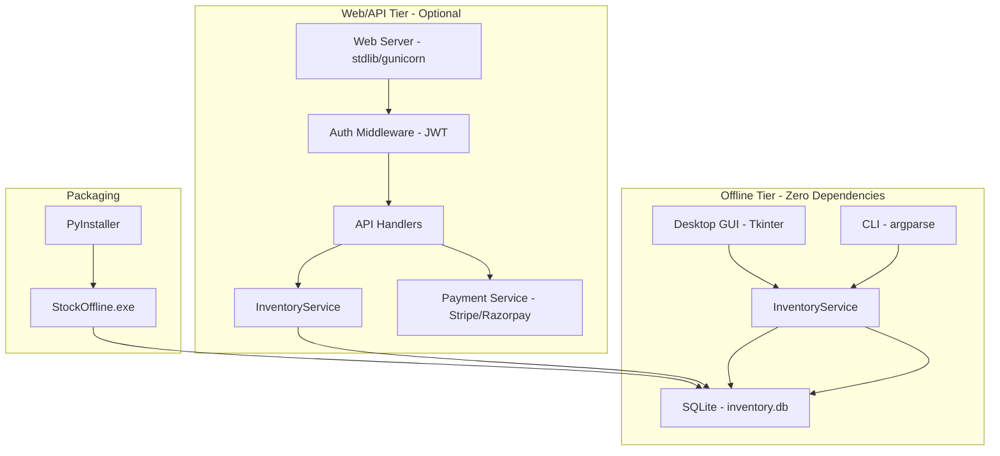

# StockOffline — Secure Offline Inventory System

> **Source:** `C:\Users\Vijaykumar\inventory-system`
> **Stack:** Python 3.x, SQLite (offline), Tkinter (GUI), JWT auth, PBKDF2 password hashing, Docker, PyInstaller
> **Architecture:** Offline-first (zero deps) + optional web/API tier
> **Platform:** Windows (primary), Linux/macOS (CLI)

---

## For future agent
This is a **personal inventory build** — a complete offline-first inventory management system with desktop GUI, CLI, and optional web/API tier. Demonstrates advanced Python patterns: Tkinter dark theme UI, SQLite with parameterized queries, JWT authentication with refresh tokens, PBKDF2 password hashing, per-tenant data isolation, rate limiting, Stripe/Razorpay payment integration, and PyInstaller packaging. Security-hardened: no SQL injection, CORS, security headers, generic errors with correlation IDs. Cross-links: [[wiki/00-Current-Projects/foundry-backup]], [[wiki/00-Current-Projects/budget-tracker]].

---

## 1. Architecture — Three-Tier Design



### Three Modes
| Mode | Entry Point | Dependencies | Data Storage |
|------|-------------|--------------|--------------|
| **Desktop GUI** | `python gui.py` | `tkinter` (stdlib) | `inventory.db` (SQLite) |
| **CLI** | `python main.py` | None | `inventory.db` (SQLite) |
| **Web/API** | `python web_app.py` | `gunicorn` (optional) | `inventory.db` (SQLite) |

---

## 2. Core Domain Models

### Product
```python
@dataclass
class Product:
    id: str              # SKU (unique)
    name: str
    price: float         # INR
    stock: int
    reorder_level: int   # Low-stock threshold
    category: str
    created_at: datetime
    updated_at: datetime
```

### Transaction
```python
@dataclass
class Transaction:
    id: str
    product_id: str      # FK → Product.id
    type: str            # 'sale', 'restock', 'adjustment'
    quantity: int
    unit_price: float
    total: float
    timestamp: datetime
    notes: str?
```

### InventoryService
```python
class InventoryService:
    def __init__(self, db_path: str):
        self.db_path = db_path
        self._init_db()
    
    # CRUD
    def add_product(self, name, price, stock, sku, reorder, category) -> Product
    def edit_product(self, sku, **kwargs) -> Product
    def delete_product(self, sku) -> bool
    def get_product(self, sku) -> Product?
    def list_products(self, category=None) -> list[Product]
    
    # Operations
    def sell(self, sku, qty) -> Transaction
    def restock(self, sku, qty) -> Transaction
    def adjust(self, sku, qty, reason) -> Transaction
    
    # Reports
    def get_stock_status(self) -> dict  # low-stock flags
    def get_category_report(self) -> dict
    def get_sales_report(self, period=None) -> dict
    
    # Export
    def export_csv(self, path) -> str
```

---

## 3. Desktop GUI — Tkinter Dark Theme

### Color Palette
```python
# Dark theme constants
BG       = "#15151f"   # Window background
PANEL    = "#1d1d2b"   # Cards / surfaces
PANEL_2  = "#262638"   # Raised surfaces / inputs
INPUT    = "#2b2b40"   # Entry field background
BORDER   = "#34344e"   # Hairline separators
TEXT     = "#ecedf5"   # Primary text (high contrast)
MUTED    = "#9a9ab5"   # Secondary text
ACCENT   = "#6366f1"   # Primary action (indigo)
ACCENT_H = "#818cf8"   # Hover
ACCENT_P = "#4f46e5"   # Pressed
SUCCESS  = "#34d399"   # Green
DANGER   = "#f87171"   # Red
WARN     = "#fbbf24"   # Yellow
ROW_ODD  = "#1a1a27"   # Alternating rows
ROW_EVEN = "#1f1f2e"
ROW_LOW  = "#2a1d24"   # Low-stock tint
```

### UI Components
```python
class InventoryGUI:
    def __init__(self):
        self.root = tk.Tk()
        self.root.title("StockOffline")
        self.root.geometry("1200x800")
        self.root.configure(bg=BG)
        
        # Components
        self.search_bar = self._create_search()      # Barcode/SKU/name search
        self.product_table = self._create_table()     # Treeview with sorting
        self.stats_panel = self._create_stats()       # KPIs: total items, value, low-stock
        self.action_buttons = self._create_actions()  # Add, Edit, Delete, Sell, Restock
        self.form_dialog = None                       # Modal for add/edit
    
    def _create_table(self):
        """Product table with alternating row colors"""
        style = ttk.Style()
        style.configure("Treeview", 
                       background=PANEL, 
                       foreground=TEXT,
                       rowheight=34,
                       fieldbackground=PANEL)
        style.map("Treeview", 
                 background=[("selected", ACCENT)],
                 foreground=[("selected", "#ffffff")])
        
        columns = ("SKU", "Name", "Price", "Stock", "Category", "Status")
        tree = ttk.Treeview(self.root, columns=columns, show="headings")
        
        # Low-stock highlighting
        for item in tree.get_children():
            stock = tree.item(item)["values"][3]
            if stock <= reorder_level:
                tree.item(item, tags=("low_stock",))
        
        tree.tag_configure("low_stock", background=ROW_LOW)
        return tree
```

### Barcode Support
```python
# USB barcode scanners act as keyboard input
# Scanner types barcode → presses Enter
# Search box captures input automatically

def _create_search(self):
    search_var = tk.StringVar()
    search_entry = tk.Entry(self.root, textvariable=search_var, 
                           font=FONT_BODY, bg=INPUT, fg=TEXT,
                           insertbackground=TEXT)
    search_entry.bind("<Return>", self._on_search)
    return search_entry

def _on_search(self, event):
    query = self.search_var.get()
    # Search by SKU, name, or barcode
    results = self.service.search_products(query)
    self._refresh_table(results)
```

---

## 4. CLI Interface

### Commands
```bash
# Product management
python main.py add --name "Widget" --price 9.99 --stock 100 --sku W-1 --reorder 20 --category "Electronics"
python main.py edit --sku W-1 --price 12.99
python main.py delete --sku W-1
python main.py list [--category "Electronics"] [--low-stock]

# Operations
python main.py sale --id W-1 --qty 5
python main.py restock --id W-1 --qty 50
python main.py adjust --id W-1 --qty 95 --reason "Inventory count correction"

# Reports
python main.py status                    # Stock health overview
python main.py report                    # Category + sales report
python main.py export                    # CSV export
```

### CLI Implementation
```python
import argparse
from inventory_system import InventoryService

def main():
    parser = argparse.ArgumentParser(description="StockOffline Inventory CLI")
    subparsers = parser.add_subparsers(dest="command")
    
    # Add product
    add_parser = subparsers.add_parser("add")
    add_parser.add_argument("--name", required=True)
    add_parser.add_argument("--price", type=float, required=True)
    add_parser.add_argument("--stock", type=int, required=True)
    add_parser.add_argument("--sku", required=True)
    add_parser.add_argument("--reorder", type=int, default=10)
    add_parser.add_argument("--category", default="General")
    
    # Sale
    sale_parser = subparsers.add_parser("sale")
    sale_parser.add_argument("--id", required=True)
    sale_parser.add_argument("--qty", type=int, required=True)
    
    args = parser.parse_args()
    service = InventoryService(os.getenv("INVENTORY_DB_PATH", "./inventory.db"))
    
    if args.command == "add":
        product = service.add_product(args.name, args.price, args.stock, 
                                      args.sku, args.reorder, args.category)
        print(f"Added: {product.name} (SKU: {product.id})")
    elif args.command == "sale":
        txn = service.sell(args.id, args.qty)
        print(f"Sold {args.qty}x {args.id} = ₹{txn.total}")
```

---

## 5. Web/API Tier — Security-Hardened

### Authentication System
```python
# auth.py — JWT + PBKDF2 password hashing

SECRET_KEY = os.getenv("JWT_SECRET_KEY")
if not SECRET_KEY or SECRET_KEY == "replace-with-strong-random-secret":
    raise RuntimeError("JWT_SECRET_KEY must be set; refusing to start.")

def hash_password(password: str, salt: str = None) -> tuple:
    """PBKDF2-HMAC-SHA256 with 100k iterations"""
    if salt is None:
        salt = secrets.token_hex(16)
    key = hashlib.pbkdf2_hmac('sha256', password.encode(), salt.encode(), 100000)
    return key.hex(), salt

def verify_password(password: str, stored_hash: str, salt: str) -> bool:
    """Constant-time comparison"""
    key, _ = hash_password(password, salt)
    return hmac.compare_digest(key, stored_hash)

def generate_tokens(user_id: str) -> Dict[str, str]:
    """Access (1h) + Refresh (7d) tokens"""
    access_expiry = int(time.time()) + 3600
    refresh_expiry = int(time.time()) + 604800
    
    access_token = create_jwt({
        'sub': user_id,
        'exp': access_expiry,
        'type': 'access',
        'jti': str(uuid.uuid4())
    })
    
    refresh_token = create_jwt({
        'sub': user_id,
        'exp': refresh_expiry,
        'type': 'refresh',
        'jti': str(uuid.uuid4())
    })
    
    return {
        'access_token': access_token,
        'refresh_token': refresh_token,
        'expires_in': 3600
    }
```

### API Endpoints
| Method | Path | Auth | Purpose |
|--------|------|------|---------|
| POST | `/api/auth/signup` | — | Create account |
| POST | `/api/auth/login` | — | Get access + refresh tokens |
| POST | `/api/auth/refresh` | — | Exchange refresh token |
| POST | `/api/auth/logout` | ✅ | Revoke current token |
| POST | `/api/auth/reset-request` | — | Request password reset |
| POST | `/api/auth/reset-confirm` | — | Confirm password reset |
| DELETE | `/api/account` | ✅ | Delete account + all data |
| GET/POST | `/api/products` | ✅ | List / create products |
| GET/PATCH/DELETE | `/api/products/{id}` | ✅ | CRUD product |
| POST | `/api/products/{id}/sale` | ✅ | Record sale |
| POST | `/api/products/{id}/adjust` | ✅ | Adjust stock |
| GET | `/api/stock-status` | ✅ | Stock health (own data) |
| GET | `/api/report` | ✅ | Category + sales report |
| POST | `/api/payments/calculate` | ✅ | Server-side order total |
| POST | `/api/payments/webhook` | Signature | Payment provider webhook |
| GET | `/api/health` | — | Liveness check |

### Security Features
| Feature | Implementation |
|---------|----------------|
| **Passwords** | PBKDF2-HMAC-SHA256, 100k iterations, per-user salt, constant-time comparison |
| **JWT** | HMAC-SHA256 signatures, expiry checks, logout blacklist |
| **Per-tenant isolation** | Every query scoped to authenticated user; ownership verified server-side (no IDOR) |
| **SQL injection** | All queries parameterized |
| **Security headers** | `X-Content-Type-Options: nosniff`, `X-Frame-Options: DENY`, `Strict-Transport-Security: 1 year`, restrictive CSP |
| **Rate limiting** | Login: 5/min, Signup: 3/hr, Password reset: 3/hr per IP |
| **CORS** | Explicit origins only (never `*`) |
| **Error handling** | Generic responses with correlation ID; details to server logs only |
| **Payments** | Server-side verification; webhook signatures required |
| **Data deletion** | `DELETE /api/account` cascades to products + transactions (password confirmation) |

---

## 6. Payment Integration

### Supported Providers
| Provider | Status | Webhook Secret |
|----------|--------|----------------|
| **Razorpay** | ✅ Active | `RAZORPAY_WEBHOOK_SECRET` |
| **Stripe** | 🔜 Reserved | `STRIPE_WEBHOOK_SECRET` |

### Server-Side Payment Verification
```python
def verify_webhook(payload, signature, secret):
    """Verify Stripe/Razorpay webhook signature"""
    expected = hmac.new(
        secret.encode(),
        payload,
        hashlib.sha256
    ).hexdigest()
    return hmac.compare_digest(expected, signature)

def calculate_order_total(items):
    """Server-side total calculation (never trust client)"""
    total = 0
    for item in items:
        product = get_product(item['sku'])
        total += product.price * item['qty']
    return total
```

---

## 7. Deployment

### Docker (Web Tier)
```dockerfile
FROM python:3.11-slim
WORKDIR /app
COPY requirements.txt .
RUN pip install --no-cache-dir -r requirements.txt
COPY src/ ./src/
EXPOSE 8000
CMD ["gunicorn", "web.wsgi:application", "--bind", "0.0.0.0:8000", "--workers", "4"]
```

### PyInstaller (Desktop .exe)
```bash
pip install pyinstaller
python marketing/build_exe.py
# Outputs: marketing/dist/StockOffline.exe
```

### Build Configuration (StockOffline.spec)
- Relative paths (no developer info baked in)
- Database next to executable (persists between runs)
- UPX disabled (avoids antivirus false-positives)
- **Not code-signed** — first-run SmartScreen warning

---

## 8. Environment Variables

| Variable | Required | Description |
|----------|----------|-------------|
| `INVENTORY_DB_PATH` | ✅ | Path to SQLite database file |
| `JWT_SECRET_KEY` | ✅ | Strong random secret for JWT signing |
| `RAZORPAY_WEBHOOK_SECRET` | If payments enabled | Verifies payment webhooks |
| `STRIPE_WEBHOOK_SECRET` | Optional | Reserved for future Stripe support |
| `WEB_HOST` | Optional | Bind address (default `127.0.0.1`) |
| `WEB_PORT` | Optional | Bind port (default `8000`) |
| `ALLOWED_ORIGINS` | Optional | Comma-separated CORS origins |
| `DEBUG` | Optional | Must be `false` in production |
| `LOG_LEVEL` | Optional | `DEBUG`/`INFO`/`WARNING`/`ERROR` |

---

## 9. Cross-References

- [[wiki/00-Current-Projects/foundry-backup]] — Another full-stack build (Express + Prisma)
- [[wiki/00-Current-Projects/budget-tracker]] — VBA financial modeling
- [[wiki/00-Current-Projects/quote-pomodoro]] — Personal productivity tool
- [[wiki/01-Areas/Business/]] — Business domain hub
- [[wiki/01-Areas/Programming/learn-python-fast-system]] — Python patterns

---

## 10. Known Limitations / TODOs

| Limitation | Impact | Fix |
|------------|--------|-----|
| **SQLite concurrent writes** | Lock contention under heavy load | Migrate to PostgreSQL for web tier |
| **No real-time sync** | Multi-device requires manual sync | Add WebSocket sync or CRDT |
| **No barcode hardware API** | Relies on keyboard-emulating scanners | Add `python-barcode` library |
| **No image support** | Products text-only | Add product images via SQLite BLOB |
| **No audit trail** | No change history | Add `AuditLog` table |
| **No i18n** | English only | Add `gettext` localization |

---

## See Also
- [[wiki/00-Current-Projects/foundry-backup]] — Full-stack startup platform
- [[wiki/00-Current-Projects/budget-tracker]] — VBA financial modeling
- [[wiki/01-Areas/Programming/learn-python-fast-system]] — Python project patterns