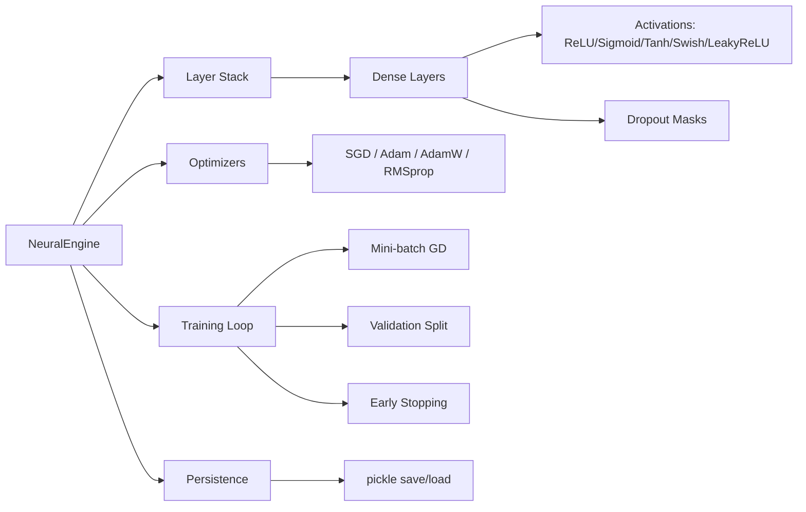

# Neural Engine — From-Scratch Neural Network Library

> **Source:** `Desktop/Anirudh/My apps/Neural net 2/neuralnet.py`
> **Status:** Complete, production-ready library
> **Dependencies:** `numpy`, `matplotlib` (optional for plotting), `pickle` (serialization)

---

## For future agent
This is a **personal build** — a fully functional neural network library written from scratch in NumPy. It implements modern deep learning primitives (optimizers, regularization, initialization schemes) without PyTorch/TensorFlow. Use as reference for understanding backprop mechanics, optimizer internals, or as a lightweight dependency-free ML engine. Cross-links: [[stock-predictor]] (uses this engine), [[quant-finance/quant-toolkit-and-skills]], [[ai-ml/reinforcement-learning-ppo]].

---

## 1. Architecture Overview



---

## 2. Core Features

| Feature | Implementation |
|---------|----------------|
| **Layer API** | `add_layer(neurons, activation, input_size, dropout)` — fluent builder |
| **Activations** | ReLU, LeakyReLU, Sigmoid, Tanh, Swish, Linear |
| **Initialization** | He (ReLU) / Xavier (others) — automatic per activation |
| **Optimizers** | SGD, Adam, AdamW (decoupled weight decay), RMSprop |
| **Regularization** | L2 (weight decay), Dropout (inverted, training-only) |
| **Training** | Mini-batch, validation split, early stopping (patience), metrics history |
| **Serialization** | `save(path)` / `load(path)` — architecture + weights + optimizer state |
| **Visualization** | `plot_training_history()` — loss/accuracy curves (matplotlib) |
| **Inspection** | `summary()` — parameter count per layer, total params |

---

## 3. Quick Start

```python
from neuralnet import NeuralEngine
import numpy as np

# 1. Create engine
engine = NeuralEngine(
    learning_rate=0.01,
    optimizer='adam',
    l2_lambda=0.001,
    dropout_rate=0.1,
    early_stopping_patience=20
)

# 2. Build architecture
engine.add_layer(64, 'relu')      # input_size inferred from data
engine.add_layer(32, 'relu', dropout=0.2)
engine.add_layer(1, 'sigmoid')    # binary classification

# 3. Train
X = np.random.randn(1000, 10)
y = (np.random.rand(1000, 1) > 0.5).astype(float)
engine.fit(X, y, epochs=200, batch_size=32, val_split=0.2, verbose=True)

# 4. Predict & evaluate
preds = engine.predict(X_test)
results = engine.evaluate(X_test, y_test)
print(f"Accuracy: {results['accuracy']:.2%}")

# 5. Persist
engine.save('my_model.pkl')
# Later: engine.load('my_model.pkl')
```

---

## 4. Optimizer Details

| Optimizer | Update Rule | Key Hyperparameters |
|-----------|-------------|---------------------|
| **SGD** | $W \leftarrow W - \eta \nabla W$ | `learning_rate` |
| **Adam** | Momentum + RMSprop + bias correction | $\beta_1=0.9, \beta_2=0.999, \epsilon=10^{-8}$ |
| **AdamW** | Adam + decoupled weight decay | `weight_decay=0.01` (separate from L2) |
| **RMSprop** | Exponential moving avg of squared grads | $\beta=0.9, \epsilon=10^{-8}$ |

All optimizers maintain per-layer state (`mW, mb, vW, vb, sW, sb`).

---

## 5. Training Pipeline (`fit()`)

```python
engine.fit(
    X, y,
    epochs=100,           # max epochs
    batch_size=32,        # mini-batch size
    val_split=0.2,        # validation fraction
    verbose=True,         # print every 10 epochs
    plot=True             # show matplotlib curves
)
```

**Early stopping:** Monitors validation loss; stops if no improvement for `early_stopping_patience` epochs. Restores best weights implicitly (tracks `best_val_loss`).

---

## 6. Model Persistence

```python
# Save
engine.save('model.pkl')
# Contains: layer configs (neurons, activation, dropout), optimizer, lr, L2, weights, biases

# Load
engine2 = NeuralEngine()
engine2.load('model.pkl')
# Reconstructs architecture, restores weights + optimizer state
```

---

## 7. Example: XOR Problem (Built-in Demo)

```python
if __name__ == "__main__":
    engine = NeuralEngine(learning_rate=0.1, optimizer='adam', l2_lambda=0.001)
    engine.add_layer(16, 'relu')
    engine.add_layer(8, 'relu')
    engine.add_layer(1, 'sigmoid')
    
    X = np.array([[0,0], [0,1], [1,0], [1,1]])
    y = np.array([[0], [1], [1], [0]])
    engine.fit(X, y, epochs=500, batch_size=2, val_split=0.0)
    engine.save('xor_model.pkl')
```

---

## 8. Cross-References

- [[stock-predictor]] — Uses this engine for S&P 500 direction prediction
- [[quant-finance/quant-toolkit-and-skills]] — From-scratch ML for quant
- [[ai-ml/reinforcement-learning-ppo]] — Policy/value networks could use this engine
- [[mathematics-of-creativity]] — Neural nets as combinatorial creativity engines

---

## 9. Known Limitations / TODOs

- No GPU acceleration (pure NumPy CPU)
- No convolutional/recurrent layers (dense only)
- No automatic differentiation graph (manual backprop per layer)
- No batch normalization layer
- No learning rate schedulers (fixed LR per optimizer)

---

## See Also
- [[Neural net 2/xor_model.pkl]] — Saved XOR demo model
- [[stock-predictor]] — Financial application of this engine