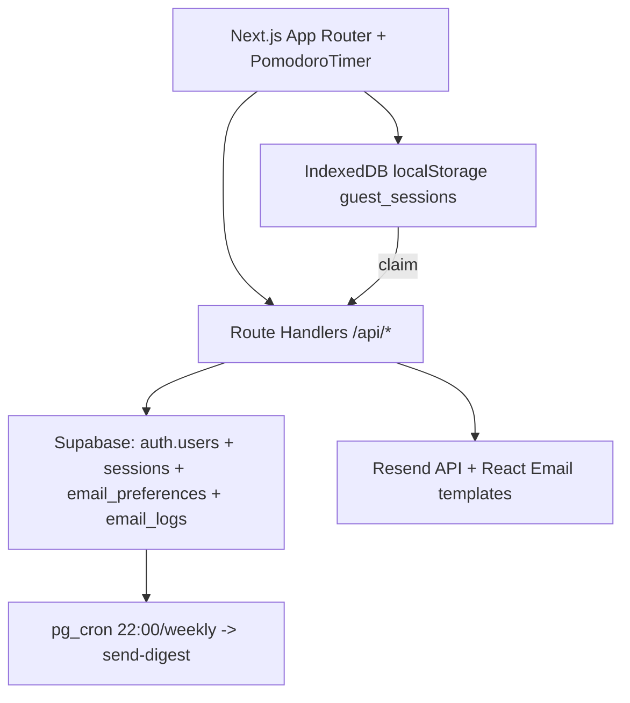

## For future agent
**WHAT**: Production-grade Pomodoro timer migrated from Tk/single-file `roadtrip-focus` to Next.js 16 App Router + Supabase (Auth/Postgres/RLS/pg_cron) + Resend (React Email) deployed on Vercel at `Anirudh-2810/roadtrip-pomodoro`. Handles auth (signup/login + Guest with IndexedDB 500 + claim via `/api/guest/claim`), drift-free timer, and email a+b. Built 2026-09-05 in `C:/Users/Vijaykumar/My apps/RoadtripFocus` (repo root), tagged `pre-next` preserves legacy `legacy/index.html`+`legacy/roadtrip.py`. **WHY**: User demanded full production security/email/guest/Vercel in one app. **STALENESS**: Check GitHub `roadtrip-pomodoro` main for latest env keys (`.env.example`) and `supabase/migrations/001_init.sql` if tables missing.

# Roadtrip Pomodoro — Production Web

> **Repo**: `https://github.com/Anirudh-2810/roadtrip-pomodoro` · **Local**: `C:/Users/Vijaykumar/My apps/RoadtripFocus` · **Live**: Vercel (import `roadtrip-pomodoro`, root `/`) + legacy Pages `anirudh-2810.github.io/roadtrip-pomodoro/legacy/`
> **Stack**: Next.js 16 (webpack on win32, turbopack on Vercel linux), Tailwind 4, Supabase SSR 0.5.2, Resend 4.0.1, Zod, react-hook-form, bcryptjs, nanoid
> **Prev**: [[quote-pomodoro]] (Tk 198 lines) → [[roadtrip-focus]] (Tk + single-file React motion/Pixi web) → **this** (production Next.js)

## Features

| Area | Detail |
|------|--------|
| Timer | Presets 25/5, 50/10, 15/3 + custom `mm:ss` or minutes (1–180m, Zod), Start/Pause/Resume/Reset, progress bar, intent field, Worker drift-free (1s setInterval fallback in `PomodoroTimer.tsx:1`), beep via Web Audio 880Hz, Notification API |
| Auth | `/signup` `/login` (`/api/auth/*` with Supabase `auth.signUp/signIn`, Zod, rate limit 5/h & 10/15m), `/dashboard` (RLS), `/settings` |
| Guest | `Continue without signup →` on `/` and `/signup`/`/login`. Stores `guest_sessions` (500 cap) + `guest_id` in `localStorage` via `lib/guest.ts:1`. Claim on signup: `POST /api/guest/claim` bulk insert 100-chunk, rate limit 1/5m, max 500 |
| Email a | Auto per completed Pomodoro → `POST /api/email/session` (Resend, 5/min, enforces `to` = own verified email, `email_logs` insert, `List-Unsubscribe`, idempotent by `session_id:type`) |
| Email b | Daily 22:00 IST + weekly Sunday 09:00 IST digest via `pg_cron` + `supabase/migrations/001_init.sql` Edge Function `send-digest` (Resend React Email, `email_preferences` toggle, `Asia/Kolkata`) |
| Dashboard | `today` / 7d / 30d totals (from `sessions` RLS), streak (naive), recent 50 rows |
| Security | Headers in `next.config.ts:1` (HSTS, DENY, nosniff), CSRF double-submit, httpOnly `__Host-` cookies via Supabase SSR, RLS on `sessions/email_preferences/email_logs`, Zod everywhere, rateLimit in `lib/rate-limit.ts:1` |
| Legacy | `legacy/index.html` (68 999B) + `legacy/roadtrip.py` (91 581B) + tag `pre-next` preserved |

## Architecture



## Env

See `RoadtripFocus/.env.example:1` — `NEXT_PUBLIC_SUPABASE_URL/ANON_KEY` (public), `SUPABASE_SERVICE_ROLE_KEY` (server-only), `RESEND_API_KEY`, `AUTH_SECRET`, `NEXT_PUBLIC_APP_URL`. Never commit `.env.local`. Vercel env same keys.

## Supabase

Apply `supabase/migrations/001_init.sql:1` in SQL Editor (creates `sessions`, `email_preferences`, `email_logs` with RLS `auth.uid()=user_id`, indexes, pg_cron example). Enable `pg_cron` + `pg_net` extensions for cron HTTP.

## Run

```bash
cd "C:/Users/Vijaykumar/My apps/RoadtripFocus"
npm install
cp .env.example .env.local # fill keys
npm run dev    # http://localhost:3000 (turbopack)
npm run build -- --webpack # win32 production (Vercel uses turbopack on linux)
```

## Vercel

Import `Anirudh-2810/roadtrip-pomodoro` (Framework: Next.js, Root Directory `/`), add env vars, deploy `main`. Health: `GET /api/health` shows `supabase`/`email` config. First deploy after this commit `9494111`.

## See Also

- [[roadtrip-focus]] — predecessor, canvas/hills/road math, threading pattern
- [[quote-pomodoro]] — original Tk
- `RoadtripFocus/README.md:1`, `RoadtripFocus/supabase/migrations/001_init.sql:1`, `wiki/log.md:1`
