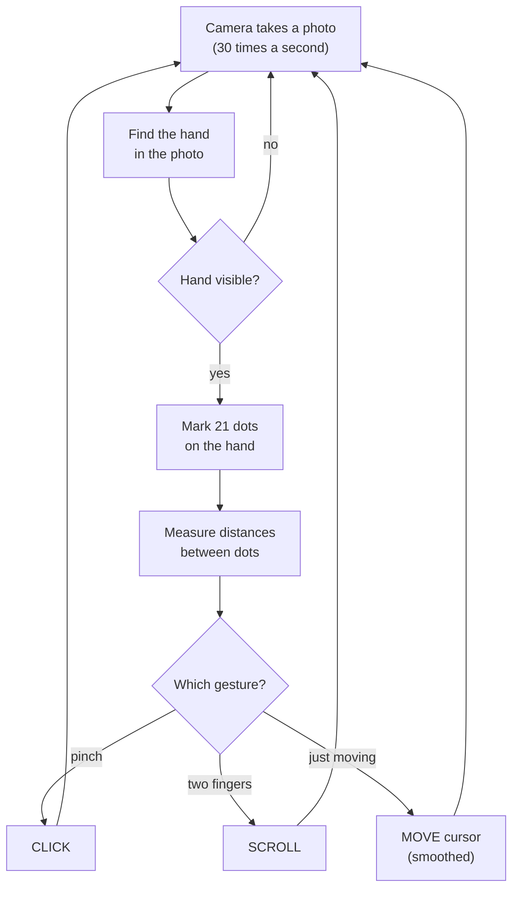
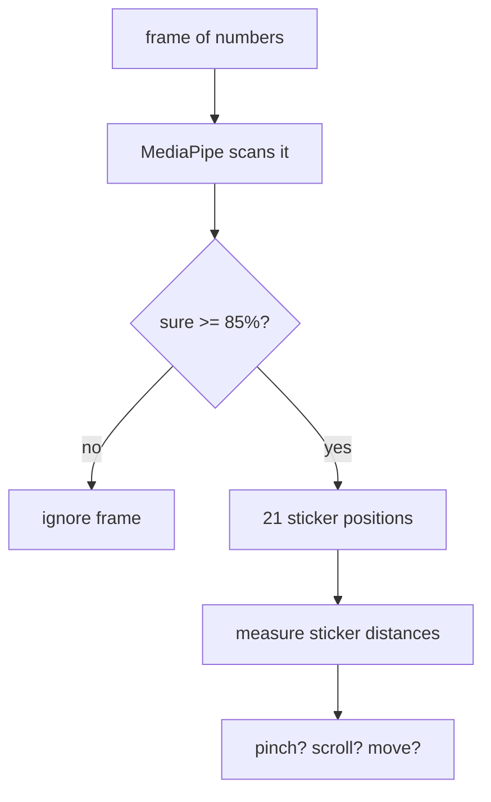

## For future agent
ELI5 explainer for [[00-Current-Projects/projects/handsens101|handsens101]] (`src/main.py`, class `JarvisUltimaPro`), written for the [[01-Areas/Engineering/nexus-robotics/INDEX|Nexus interview]] (2026-10-06). Reader knows Python basics but not computer vision. Facts sourced from the catalogue page + README extraction 2026-08-23; repo not on this machine so line numbers are not claimed. Catalogue page stays the facts record; this page is the *understanding* layer.

# handsens101 — Explained Like You're Five

## 0. What it is, in one sentence

**Your webcam watches your hand, and your fingers become the mouse** — move your hand to move the cursor, pinch to click, hold two fingers together to scroll.

## 1. The big picture — a loop that never stops



That is the whole program: photo → find hand → measure → decide → act → repeat. In robotics this loop has a grand name — **sense → decide → act** — but it's the same loop as a person catching a ball: eyes see, brain decides, hand moves.

**Say in the interview:** *"It's a perception-to-action loop: the camera senses, the code decides which gesture it sees, and pyautogui acts by moving the real cursor. Same shape as any robot control loop."*

---

## 2. The libraries — what each one is and why it's there

The program is small because three big libraries do the heavy lifting. Think of `import` as hiring specialists:

### `import cv2` — OpenCV, the eyes

```python
import cv2
cap = cv2.VideoCapture(0)   # open webcam number 0 (your laptop camera)
ret, frame = cap.read()     # take ONE photo, get it as numbers
```

**Kid version:** OpenCV is the program's eyes. `VideoCapture(0)` opens your laptop camera. `.read()` snaps one photo — and a photo here isn't a picture, it's a giant grid of numbers (brightness per pixel). Everything downstream works on those numbers.

**Why it's there:** somebody has to talk to the camera hardware. Writing that yourself means USB drivers — months of work. OpenCV does it in two lines.

**Say in the interview:** *"OpenCV handles camera capture — it gives me each frame as a pixel array I can feed to the detector."*

### `import mediapipe` — the hand-finder (the clever one)

```python
# conceptually:
landmarker = HandLandmarker(model="hand_landmarker.task")  # auto-downloaded first run
result = landmarker.detect(frame)   # returns 21 hand points (or nothing)
```

**Kid version:** Imagine a friend who is insanely good at "spot the hand in this photo" and, when he finds one, puts 21 stickers on it: wrist, knuckles, fingertips. That's MediaPipe. It was **already trained by Google on thousands of hand photos** — you did NOT train it, you just *use* it. The model file downloads itself the first time you run the program.

The 21 stickers have fixed meanings: sticker 4 = thumb tip, sticker 8 = index fingertip, sticker 12 = middle fingertip. Your whole gesture logic is just measuring distances between stickers:

- **Pinch** = sticker 4 and sticker 8 are very close together → CLICK
- **Scroll** = index + middle held together → SCROLL
- **Otherwise** = just track the index fingertip → MOVE cursor there

Settings that matter: **IMAGE mode** (it looks at one photo at a time, not a video stream) and **detection confidence 0.85** (only believe it if it's 85% sure — this kills false clicks from background junk).



**Say in the interview:** *"MediaPipe's pre-trained HandLandmarker gives me 21 hand landmarks per frame. I raised detection confidence to 0.85 to cut false positives, and my gesture logic is just distance checks between landmarks — pinch for click, two fingers for scroll."*

### `import pyautogui` — the hands

```python
import pyautogui
pyautogui.PAUSE = 0              # don't wait between actions (speed)
pyautogui.moveTo(x, y)           # move the REAL mouse cursor
pyautogui.click()                # real click
pyautogui.scroll(amount)         # real scroll
```

**Kid version:** OpenCV is the eyes, MediaPipe is the brain's pattern-finder, pyautogui is the hands — it moves the *actual* mouse pointer on your screen. `PAUSE = 0` means "don't rest between moves" (default adds a tiny delay that makes everything laggy); failsafe off means "don't panic-stop if the cursor hits a corner" (needed because gesture control throws the cursor around).

The hand sticker positions are fractions (0.0–1.0 across the photo), so they get scaled up: `screen_x = sticker_x × screen_width`. Then **exponential smoothing** (`smooth = 5.0`) blends each new position with the previous one — like a moving average with memory — so hand tremor doesn't make the cursor shake. Smoothing before acting is THE embedded habit: never feed raw noisy sensor data straight to an actuator.

**Say in the interview:** *"pyautogui drives the OS cursor. I map normalized landmarks to screen pixels and smooth with an exponential moving average first — raw landmark jitter would make the cursor shake, same reason you filter any sensor before actuating."*

---

## 3. Brain overview — the whole thing on one napkin

| Stage | Does what | Owned by |
|---|---|---|
| **See** | webcam → frame of numbers, 30×/sec | OpenCV |
| **Find** | frame → 21 hand dots (or nothing) | MediaPipe (pre-trained) |
| **Decide** | dot distances → pinch / scroll / move | your code (few `if`s) |
| **Smooth** | blend new position with old | your code (one formula) |
| **Act** | move/click/scroll the real cursor | pyautogui |

Two things YOU actually wrote and own: the **gesture rules** (distance checks + a tiny state machine remembering drag/scroll state between frames) and the **smoothing + coordinate mapping**. Everything else is borrowed specialists. That is completely fine — knowing which parts to borrow and which to write is itself the skill.

**Drag state, simply:** a click must fire ONCE when the pinch starts, not 30 times a second while pinched. So the code remembers "was I already pinching last frame?" — new pinch → click once; still pinched → do nothing. Same idea as a doorbell (rings on press, not while held).

---

## 4. 60-second interview script

> "handsens101 turns my webcam into a mouse. OpenCV grabs frames, MediaPipe's pre-trained hand model marks 21 points on the hand, and my code measures distances between those points — thumb-to-index close together means click, index-plus-middle means scroll, otherwise the fingertip position drives the cursor. Two things I actually decided myself: I raised detection confidence to 0.85 because a false positive in this loop means a phantom click, and I smooth positions with an exponential moving average before moving the cursor, because raw landmark jitter shakes the pointer. The gesture rules are plain distance checks plus a small state machine so a held pinch clicks once instead of thirty times a second."

Then stop. Let them ask.

## 5. Likely follow-ups

| They ask | You say |
|---|---|
| *Did you train the model?* | "No — MediaPipe ships pre-trained. My code is the capture, the gesture rules, the mapping and smoothing. Using a pre-trained detector instead of training one is the right call for a small tool." |
| *Why 0.85 confidence?* | "Trade-off knob: higher means fewer false clicks but occasionally misses a real hand. In a loop whose output is clicks, false positives cost more than misses." |
| *What if no hand is visible?* | "Detector returns nothing, frame is skipped, cursor stays. The system degrades to doing nothing, which is the safe failure." |
| *Why smooth?* | "Landmark positions jitter frame to frame. Feeding that raw to the cursor makes it shake. Exponential average blends new with old — one formula, no buffer needed." |
| *Latency?* | "Honest answer: I didn't benchmark it. PAUSE=0 removes pyautogui's built-in delay; a real answer would time frame-in to cursor-move. That's the measurement I'd add." |
| *How is this robotics?* | "Sense-decide-act loop with noisy sensors and smoothing before actuation — same shape as any robot control loop, just with a hand instead of a lidar." |

## 6. Provenance (say it if asked, don't volunteer nervously)

AI-assisted build (owner-confirmed 2026-09-24). Your line: *"I built it with AI assistance — the architecture, the gesture rules, the confidence and smoothing choices are mine and I can walk through every line."* Never claim solo authorship; never apologise for the assistance either.

---

## See also

- [[00-Current-Projects/projects/handsens101|handsens101 catalogue]] — repo facts, README gestures, provenance record
- [[01-Areas/Programming/python-revision-eli5]] — `import` = borrowing toolboxes (§7)
- [[01-Areas/Engineering/nexus-robotics/nexus-python-drills]] — same loop shape in the telemetry tasks
- Home: [[01-Areas/Engineering/nexus-robotics/INDEX]]
