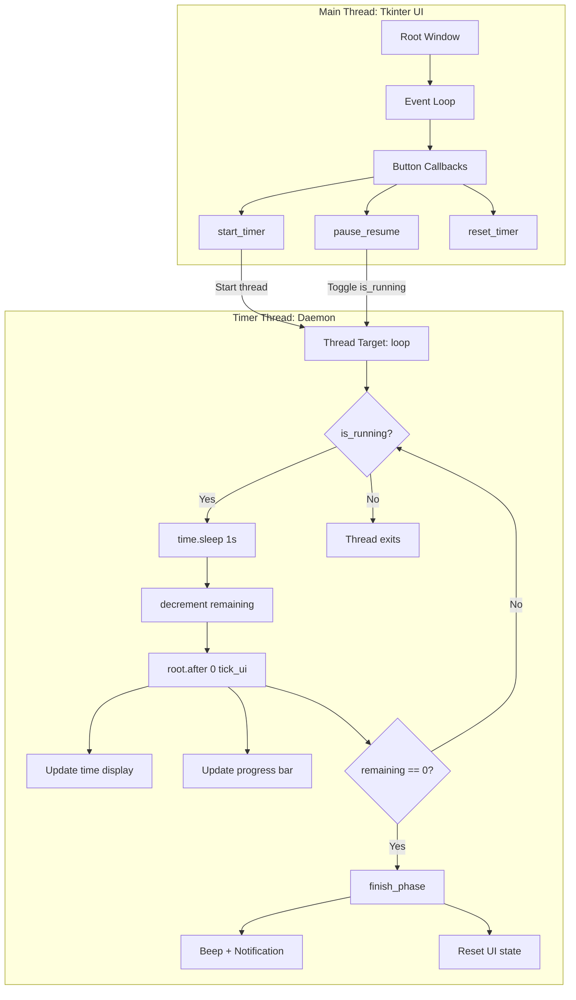

# Quote Pomodoro — Dark-Mode Focus Timer

> **Source:** `Desktop/Anirudh/My apps/Focus app/flightproductivity.py` (198 lines)
> **Stack:** `tkinter`, `ttk`, `threading`, `plyer` (notifications), `winsound` (Windows beeps)
> **Platform:** Windows (primary), Linux/macOS (fallback beeps)
> **Theme:** Pure black background, mint green (#00ff88) accents

---

## For future agent
This is a **personal productivity build** — a minimal, distraction-free Pomodoro timer with motivational quotes. Demonstrates Tkinter threading pattern (UI thread + timer thread), cross-platform sound/notifications, and clean dark UI. Cross-links: [[wiki/01-Areas/Self-Dev/]], [[wiki/01-Areas/Productivity/]], [[wiki/00-Current-Projects/budget-tracker]].

---

## 1. Features (Detailed)

| Feature | Implementation | Details |
|---------|----------------|---------|
| **Editable Timer** | `tk.Entry` widget | Click time display → type `mm:ss` → Start validates format |
| **Presets** | 3 preset buttons | 25/5 (classic), 50/10 (deep work), 15/3 (quick) |
| **Progress Bar** | `ttk.Progressbar` | Mint green fill, updates every second |
| **Quotes** | 10 rotating quotes | Auto-refresh every ~5 minutes (300s) |
| **Sounds** | `winsound.Beep()` | Start: 800Hz/160ms, End: 600Hz/220ms + 450Hz/220ms |
| **Notifications** | `plyer.notification` | Windows toast (optional dependency) |
| **Pause/Resume** | Toggle button | Pauses timer thread, preserves remaining time |
| **Reset** | Button | Restores to last preset value |
| **Dark Theme** | Pure black `#000000` | Mint green `#00ff88` accents, no window chrome |

---

## 2. Architecture — Threading Model



### Thread-Safety Pattern
```python
# CRITICAL: Tkinter is NOT thread-safe
# Must use root.after() for cross-thread UI updates

class QuotePomodoro:
    def __init__(self, root):
        self.root = root
        self.is_running = False
        self.is_paused = False
        self.remaining = 0
        self.total = 0
    
    def start_timer(self):
        """Start timer in daemon thread"""
        self.is_running = True
        self.is_paused = False
        threading.Thread(target=self.loop, daemon=True).start()
    
    def loop(self):
        """Timer loop (runs in background thread)"""
        while self.is_running and self.remaining > 0:
            time.sleep(1)  # Wait 1 second
            
            if self.is_paused:
                continue  # Skip decrement if paused
            
            self.remaining -= 1
            
            # CRITICAL: Use root.after() for thread-safe UI update
            self.root.after(0, self.tick_ui)
        
        # Timer finished
        if self.remaining <= 0:
            self.root.after(0, self.finish_phase)
    
    def tick_ui(self):
        """Update UI (runs on main thread via root.after)"""
        self.time_var.set(self.format_time(self.remaining))
        self.progress["value"] = self.total - self.remaining
    
    def finish_phase(self):
        """Called when timer completes"""
        self.play_beep_end()
        self.send_notification()
        self.is_running = False
        # Update UI to show "Done" state
```

---

## 3. Code Structure — Full Implementation

### Main Class
```python
import tkinter as tk
from tkinter import ttk
import threading
import time
import sys

# Platform-specific imports
try:
    import winsound
    HAS_WINSOUND = True
except ImportError:
    HAS_WINSOUND = False

try:
    from plyer import notification
    HAS_NOTIFICATIONS = True
except ImportError:
    HAS_NOTIFICATIONS = False

class QuotePomodoro:
    QUOTES = [
        "Focus is a muscle; train it every day.",
        "Small consistent sessions beat long distracted ones.",
        "Deep work now, freedom later.",
        "Discipline is choosing what you want most.",
        "One Pomodoro at a time.",
        "Silence the noise, follow the task.",
        "You don't rise to your goals, you fall to your systems.",
        "Future you is grateful for this focus.",
        "Less scrolling, more solving.",
        "Progress, not perfection."
    ]
    
    PRESETS = {
        "25/5": (25*60, 5*60),    # Classic Pomodoro
        "50/10": (50*60, 10*60),  # Deep work
        "15/3": (15*60, 3*60)     # Quick session
    }
    
    def __init__(self, root):
        self.root = root
        self.root.title("Quote Pomodoro")
        self.root.geometry("600x320")
        self.root.resizable(False, False)
        self.root.configure(bg="#000000")
        
        # State
        self.is_running = False
        self.is_paused = False
        self.remaining = 0
        self.total = 0
        self.is_break = False
        self.last_preset = "25/5"
        self.quote_index = 0
        self.last_quote_time = time.time()
        
        self.build_ui()
```

### UI Construction
```python
def build_ui(self):
    """Build dark-themed UI"""
    
    # Title
    self.title_label = tk.Label(
        self.root, text="🍅 QUOTE POMODORO",
        font=("Segoe UI", 16, "bold"),
        fg="#00ff88", bg="#000000"
    )
    self.title_label.pack(pady=(15, 5))
    
    # Time display (editable)
    self.time_var = tk.StringVar(value="25:00")
    self.time_entry = tk.Entry(
        self.root, textvariable=self.time_var,
        font=("Consolas", 48, "bold"),
        fg="#00ff88", bg="#111111",
        insertbackground="#00ff88",
        width=7, justify="center",
        borderwidth=0
    )
    self.time_entry.pack(pady=10)
    self.time_entry.bind("<Return>", lambda e: self.start_timer())
    
    # Progress bar
    style = ttk.Style()
    style.theme_use('default')
    style.configure("green.Horizontal.TProgressbar",
                   troughcolor="#111111",
                   background="#00ff88",
                   thickness=8)
    
    self.progress = ttk.Progressbar(
        self.root, orient="horizontal",
        length=400, mode="determinate",
        style="green.Horizontal.TProgressbar"
    )
    self.progress.pack(pady=10)
    
    # Preset buttons
    preset_frame = tk.Frame(self.root, bg="#000000")
    preset_frame.pack(pady=5)
    
    for name, (work, break_) in self.PRESETS.items():
        btn = tk.Button(
            preset_frame, text=name,
            command=lambda w=work, b=break_: self.set_preset(w, b, name),
            font=("Segoe UI", 10),
            fg="#ffffff", bg="#222222",
            activebackground="#333333",
            width=8, borderwidth=0
        )
        btn.pack(side="left", padx=5)
    
    # Control buttons
    control_frame = tk.Frame(self.root, bg="#000000")
    control_frame.pack(pady=10)
    
    self.start_btn = tk.Button(
        control_frame, text="▶ Start",
        command=self.start_timer,
        font=("Segoe UI", 12, "bold"),
        fg="#000000", bg="#00ff88",
        activebackground="#00cc6a",
        width=10, borderwidth=0
    )
    self.start_btn.pack(side="left", padx=5)
    
    self.pause_btn = tk.Button(
        control_frame, text="⏸ Pause",
        command=self.pause_resume,
        font=("Segoe UI", 12),
        fg="#ffffff", bg="#222222",
        activebackground="#333333",
        width=10, borderwidth=0,
        state="disabled"
    )
    self.pause_btn.pack(side="left", padx=5)
    
    self.reset_btn = tk.Button(
        control_frame, text="↻ Reset",
        command=self.reset_timer,
        font=("Segoe UI", 12),
        fg="#ffffff", bg="#222222",
        activebackground="#333333",
        width=10, borderwidth=0
    )
    self.reset_btn.pack(side="left", padx=5)
    
    # Quote display
    self.quote_label = tk.Label(
        self.root,
        text=f'"{self.QUOTES[0]}"',
        font=("Segoe UI", 9, "italic"),
        fg="#666666", bg="#000000",
        wraplength=500
    )
    self.quote_label.pack(pady=(5, 10))
```

### Timer Methods
```python
def set_preset(self, work_sec, break_sec, name):
    """Set timer to preset values"""
    if not self.is_running:
        self.total = work_sec
        self.remaining = work_sec
        self.is_break = False
        self.last_preset = name
        self.time_var.set(self.format_time(work_sec))
        self.progress["maximum"] = work_sec
        self.progress["value"] = 0
        self.update_quote()

def start_timer(self):
    """Start timer in daemon thread"""
    if self.is_running:
        return
    
    # Parse time from entry
    try:
        time_str = self.time_var.get()
        mins, secs = map(int, time_str.split(":"))
        self.total = mins * 60 + secs
        self.remaining = self.total
    except:
        self.time_var.set("25:00")
        self.total = 1500
        self.remaining = 1500
    
    if self.remaining <= 0:
        return
    
    self.is_running = True
    self.is_paused = False
    self.progress["maximum"] = self.total
    self.progress["value"] = 0
    
    self.play_beep_start()
    
    # Start daemon thread
    threading.Thread(target=self.loop, daemon=True).start()
    
    # Update UI state
    self.start_btn.config(state="disabled")
    self.pause_btn.config(state="normal")
    self.time_entry.config(state="disabled")

def pause_resume(self):
    """Toggle pause/resume"""
    if not self.is_running:
        return
    
    self.is_paused = not self.is_paused
    if self.is_paused:
        self.pause_btn.config(text="▶ Resume")
    else:
        self.pause_btn.config(text="⏸ Pause")

def reset_timer(self):
    """Reset to last preset"""
    self.is_running = False
    self.is_paused = False
    
    # Restore last preset
    work, break_ = self.PRESETS[self.last_preset]
    self.total = work
    self.remaining = work
    self.is_break = False
    
    self.time_var.set(self.format_time(work))
    self.progress["value"] = 0
    
    # Reset UI state
    self.start_btn.config(state="normal")
    self.pause_btn.config(state="disabled", text="⏸ Pause")
    self.time_entry.config(state="normal")

def loop(self):
    """Timer loop (background thread)"""
    while self.is_running and self.remaining > 0:
        time.sleep(1)
        
        if self.is_paused:
            continue
        
        self.remaining -= 1
        self.root.after(0, self.tick_ui)
        
        # Quote rotation every 5 minutes
        if time.time() - self.last_quote_time > 300:
            self.root.after(0, self.update_quote)
            self.last_quote_time = time.time()
    
    if self.remaining <= 0:
        self.root.after(0, self.finish_phase)

def finish_phase(self):
    """Handle phase completion"""
    self.play_beep_end()
    self.send_notification()
    
    self.is_running = False
    self.start_btn.config(state="normal")
    self.pause_btn.config(state="disabled")
    self.time_entry.config(state="normal")
    
    if not self.is_break:
        # Switch to break
        self.is_break = True
        work, break_ = self.PRESETS[self.last_preset]
        self.total = break_
        self.remaining = break_
        self.time_var.set(self.format_time(break_))
        self.progress["value"] = 0
        self.title_label.config(text="☕ BREAK TIME")
    else:
        # Break done, back to work
        self.is_break = False
        work, break_ = self.PRESETS[self.last_preset]
        self.total = work
        self.remaining = work
        self.time_var.set(self.format_time(work))
        self.progress["value"] = 0
        self.title_label.config(text="🍅 QUOTE POMODORO")

def update_quote(self):
    """Rotate to next quote"""
    self.quote_index = (self.quote_index + 1) % len(self.QUOTES)
    self.quote_label.config(text=f'"{self.QUOTES[self.quote_index]}"')
```

### Sound & Notification Helpers
```python
def format_time(self, seconds):
    """Format seconds as MM:SS"""
    mins = seconds // 60
    secs = seconds % 60
    return f"{mins:02d}:{secs:02d}"

def play_beep_start(self):
    """Play start beep (800Hz, 160ms)"""
    if HAS_WINSOUND and sys.platform.startswith("win"):
        winsound.Beep(800, 160)
    else:
        print("\a", end="")  # Terminal bell

def play_beep_end(self):
    """Play end beep (600Hz + 450Hz, 220ms each)"""
    if HAS_WINSOUND and sys.platform.startswith("win"):
        winsound.Beep(600, 220)
        winsound.Beep(450, 220)
    else:
        print("\a\a", end="")

def send_notification(self):
    """Send Windows toast notification"""
    if HAS_NOTIFICATIONS:
        try:
            notification.notify(
                title="⏰ Time's Up!",
                message="Pomodoro session complete." if not self.is_break 
                        else "Break over. Ready to focus?",
                timeout=5
            )
        except:
            pass  # Silently fail if notifications unavailable
```

### Entry Point
```python
def main():
    root = tk.Tk()
    app = QuotePomodoro(root)
    root.mainloop()

if __name__ == "__main__":
    main()
```

---

## 4. UI Details — Complete Styling

| Element | Property | Value |
|---------|----------|-------|
| **Window** | size | 600×320 |
| | resizable | False |
| | bg | `#000000` (pure black) |
| **Title** | font | Segoe UI 16 bold |
| | fg | `#00ff88` (mint green) |
| **Time Entry** | font | Consolas 48 bold |
| | fg | `#00ff88` |
| | bg | `#111111` |
| | insertbackground | `#00ff88` |
| **Progress Bar** | troughcolor | `#111111` |
| | background | `#00ff88` |
| | thickness | 8px |
| **Buttons** | font | Segoe UI 10-12 |
| | fg | `#ffffff` (white) |
| | bg | `#222222` |
| | activebackground | `#333333` |
| **Start Button** | fg | `#000000` (black on green) |
| | bg | `#00ff88` |
| **Quote Label** | font | Segoe UI 9 italic |
| | fg | `#666666` (gray) |
| | wraplength | 500px |

---

## 5. Quote Bank (10 Quotes)

```python
QUOTES = [
    "Focus is a muscle; train it every day.",
    "Small consistent sessions beat long distracted ones.",
    "Deep work now, freedom later.",
    "Discipline is choosing what you want most.",
    "One Pomodoro at a time.",
    "Silence the noise, follow the task.",
    "You don't rise to your goals, you fall to your systems.",
    "Future you is grateful for this focus.",
    "Less scrolling, more solving.",
    "Progress, not perfection."
]
```

**Rotation Logic:** Index increments every 300 seconds (5 minutes). Uses modulo for wrapping.

---

## 6. Cross-Platform Sounds — Exact Frequencies

| Event | Platform | Sound | Duration |
|-------|----------|-------|----------|
| **Start** | Windows | `winsound.Beep(800, 160)` | 160ms at 800Hz |
| **End** | Windows | `winsound.Beep(600, 220)` + `Beep(450, 220)` | Two-tone descending |
| **Start** | Linux/macOS | `\a` (terminal bell) | 75ms system bell |
| **End** | Linux/macOS | `\a\a` (double bell) | Two system bells |

---

## 7. Usage — Complete Workflow

```bash
# Install dependencies
pip install plyer  # Optional, for Windows toast notifications

# Run
python flightproductivity.py
```

**Workflow:**
1. Launch → shows "25:00" default
2. Edit time directly in entry OR click preset (25/5, 50/10, 15/3)
3. Click **Start** → beep sounds, timer counts down, progress bar fills
4. **Pause** / **Resume** as needed (preserves remaining time)
5. At 0:00 → double beep, toast notification, "BREAK TIME" mode
6. Break timer runs → another notification → "QUOTE POMODORO" mode
7. **Reset** to restart with last preset

---

## 8. Cross-References

- [[wiki/01-Areas/Self-Dev/]] — Pomodoro, Deep Work, productivity systems
- [[wiki/01-Areas/Productivity/]] — Atomic Habits, GTD, timeboxing
- [[wiki/00-Current-Projects/budget-tracker]] — Another personal productivity tool
- [[wiki/01-Areas/Programming/learn-python-fast-system]] — Tkinter GUI basics

---

## 9. Known Limitations / TODOs (Detailed)

| Limitation | Impact | Fix |
|------------|--------|-----|
| **No session logging** | Can't track completed Pomodoros | Add CSV export: `pomodoro_log.csv` |
| **No task association** | Can't link timer to specific task | Add task name entry field |
| **No statistics** | No daily/weekly totals, streaks | Add dashboard: total Pomodoros, streak, avg/session |
| **Single timer** | No multi-project support | Add project tabs or list |
| **No auto-break** | Doesn't auto-start break timer | Add auto-start toggle after focus completes |
| **Windows-only sounds** | Linux/macOS get terminal bell only | Add `osascript` (macOS) or `aplay` (Linux) |
| **No system tray** | Can't minimize to tray | Add `pystray` integration |
| **No dark mode toggle** | Pure black only | Add theme switcher (dark/light) |

---

## See Also
- [[wiki/01-Areas/Self-Dev/learning-methodology]] — Pomodoro in learning context
- [[wiki/01-Areas/Productivity/atomic-habits-systems]] — Habit tracking
- [[wiki/00-Current-Projects/budget-tracker]] — Another personal tool