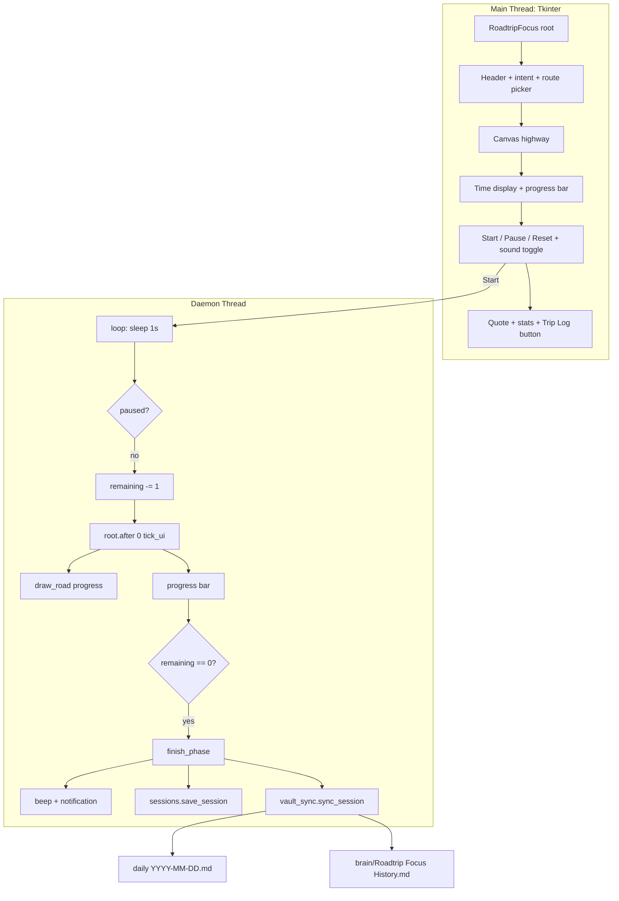

# Roadtrip Focus — Cross-Country Focus Timer

> **Repo:** `C:/Users/Vijaykumar/My apps/RoadtripFocus/` (fresh folder — `2)b` choice)
> **Stack:** `tkinter` + `ttk`, `threading`, `sounds.py` (`numpy` + `sounddevice`, optional), `sessions.py`, `vault_sync.py`
> **Theme:** Road trip (Coastal Hop → Cross-Country) — distinct from FocusFlight's aviation, same design insight: *destination + spatial progress + continuous sound*
> **Obsidian:** Direct vault writes (no REST API) — see `vault_sync.py` section

---

## For future agent
This is a **personal productivity build** — a road-trip-themed focus timer that turns each deep-work block into a virtual drive. Extends the proven `[[quote-pomodoro]]` Tkinter threading/UI pattern, swaps the flight metaphor for a highway-at-night canvas, and **auto-logs every completed trip into the vault** (the edge FocusFlight cannot have). Cross-links: [[wiki/01-Areas/Self-Dev/productivity/deep-work-attention-economics]], [[wiki/01-Areas/Self-Dev/productivity/focus-minimalism-babauta]], `brain/Roadtrip Focus History`.

---

## 1. Why road trip (not a FocusFlight clone)

FocusFlight's own site (focusflight.net) argues the metaphor's job is to give a timer a *destination, texture, and cover story* so the brain accepts "the pilot has the controls." We keep that insight, change the vehicle:

- **Aviation → highway.** A night highway with mile markers, a car that recedes toward the horizon, and an engine/road hum — visually and aurally distinct, same psychological trick.
- **Intent field.** FocusFlight's FAQ admits a timer can't tell you *what* to work on. Every drive requires a one-line intent ("what does done look like?") — surfaced in the vault log so the next agent knows what you were driving toward.
- **Vault is the product.** Sessions write directly into `daily/` + `brain/` — no siloed app DB. The *Second Brain* is the FlightLog.

---

## 2. Routes — duration is the destination

| Route | Minutes | Tagline | Use |
|-------|---------|---------|-----|
| **Coastal Hop** | 25 | Quick sprint — one focused stretch | Pomodoro replacement |
| **Desert Stretch** | 50 | Deep work block — stay with it | One chapter / one problem set |
| **Mountain Pass** | 90 | Long haul — settle in | Essay draft / feature + tests |
| **Cross-Country** | 120 | Marathon — the scenic way | Half-day build |
| **Custom** | 1–180 | Your pace (edit `mm:ss`) | Anything else |

Route choice sets the timer and the road label. The canvas scales the car's journey to `progress = elapsed / total` — same spatial-progress win FocusFlight uses with its 3D map, but rendered on a `tk.Canvas`.

---

## 3. Architecture



**Key files:**

| File | Role |
|------|------|
| `roadtrip_focus.py` | Main `RoadtripFocus` class — builds UI, owns timer thread, draws canvas, handles presets/routes, owns `try_vault_sync` hook |
| `sounds.py` | Continuous hum: 55 Hz + 110 Hz engine drone + filtered white-noise road texture, mixed into a 4 s looping stereo buffer, played via `sounddevice.OutputStream`. **Silent fallback** if `numpy`/`sounddevice` missing — never a hard dep |
| `sessions.py` | `Session` dataclass + `~/.roadtrip_focus/sessions.json` (last 500, append-only). Local cache only; vault is the durable single source |
| `vault_sync.py` | Direct file writes into `VAULT = ROADTRIP_VAULT env or C:/Users/Vijaykumar/Second-Brain/Second-Brain`. Appends to `daily/` under `## Roadtrip Focus`, updates `brain/Roadtrip Focus History.md` (single source) with stats comment `<!-- stats: {...} -->` + human block + table |
| `README.md` | Run instructions |

---

## 4. Threading & sound — exact patterns

Same proven pattern as `flightproductivity.py:226-250`:

```python
# Start: daemon thread, never blocks UI
threading.Thread(target=self.loop, daemon=True).start()

# Loop: sleep 1s, respect pause, decrement, schedule UI on main thread
while self.is_running and self.remaining > 0:
    time.sleep(1)
    if self.pause_btn["text"] == "Resume":
        continue
    self.remaining -= 1
    self.root.after(0, self.tick_ui)

# tick_ui runs on main thread: safe to touch widgets
def tick_ui(self):
    self.time_var.set(self.format_time(self.remaining))
    self.progress["value"] = self.total - self.remaining
    self.draw_road(1.0 - self.remaining / self.total)
```

Sound: `sounds.start(volume)` builds a `(176400, 2)` float32 buffer once, then plays via a `sounddevice` callback that wraps gaplessly. `sounds.stop()` tears down the stream. `RoadtripFocus.on_sound_toggle` / `on_volume_change` wrap it. If `sounds.available()` is false the checkbox is disabled and the app runs silent.

Volume default `0.12` — intentionally quiet per FocusFlight's hearing-safety note (anything quiet enough to hold a conversation over is safe for long sessions).

---

## 5. Canvas — perspective highway

`draw_road(progress: 0..1)` (`roadtrip_focus.py:155-250`):

- Sky gradient (18 bands, `#0a0a0a` → `#1a1a2a`)
- Horizon line at `y=42`
- Road trapezoid `top_w=80` → `bot_w=520`, fill `#1a1a1a`, shoulders `#3a3a3a`
- Center dashed line: 10 dashes, width narrows toward horizon, color `#00ff88`
- Mile markers at 25/50/75/100% (posts on both edges; labels HALFWAY / ARRIVAL at 50% & 100%)
- **Car:** rectangle `#ffcc33` + windshield `#88ccee` + wheels, scaled by `1.0 - progress*0.55` so it shrinks toward horizon. `car_y` interpolates bottom → horizon. Shadow + arrival flash on landing.

No image assets — pure `tk.Canvas` primitives, so the binary stays small and the build stays portable.

---

## 6. Vault sync — contract

Direct file writes (zero dependency, no Obsidian REST API). Vault path: `ROADTRIP_VAULT` env or `C:/Users/Vijaykumar/Second-Brain/Second-Brain`.

**Daily note** (`daily/YYYY-MM-DD.md`):

- Creates the file from scaffold if absent (matches `daily/2026-08-28.md` frontmatter).
- Appends under `## Roadtrip Focus` (creates heading before `## Tomorrow` if missing):
  `- HH:MM · Roadtrip focus: <min>m — <intent> (route: <route>) [completed|abandoned]`

**History note** (`brain/Roadtrip Focus History.md`) — **single source** per Write-Correctness Law #1:

- Machine stats in `<!-- stats: {"total_min":..., "total_sessions":..., "total_completed":..., "streak":..., "last_date":"YYYY-MM-DD"} -->`
- Human line: `> **Totals (as of YYYY-MM-DD)** — X completed / Y sessions · Z min (H h) · streak: N day(s)`
- Table: `| Date | Route | Min | Intent | Done |` (last 50 kept readable; local `sessions.json` keeps 500)
- Created on first landing if absent; on each landing the row is inserted and stats updated. Streak increments only on a new `last_date` with a completed session.

`roadtrip_focus.py:try_vault_sync` is the only caller — wrapped in `try/except ImportError` so the app runs fine without `vault_sync.py`.

---

## 7. Trip Log (local)

- `sessions.json` at `%USERPROFILE%/.roadtrip_focus/sessions.json`
- `Trip Log` button opens a `Toplevel` with a `ttk.Treeview` (last 200 rows, newest first): `finished | route | min | intent | done`
- `Clear log` confirms, then unlinks `sessions.json`. Stats label `Trips: N · Road time: M min (H h)` refreshes on every landing/reset.

---

## 8. Run & deps

```bash
# from C:/Users/Vijaykumar/My apps/RoadtripFocus/
python roadtrip_focus.py

# optional (silent fallback if absent)
pip install numpy sounddevice plyer
```

- `numpy` + `sounddevice` → road hum
- `plyer` → Windows toast on arrival (`notification.notify`)
- `winsound` (stdlib on Windows) → beeps (800 Hz start, 600+450 Hz landing)

---

## 9. Verification (2026-08-29)

- `python -m py_compile` — 3 files OK
- Smoke test (`Tk()` withdrawn): route pick, time helpers, `draw_road` at 0/0.25/0.5/0.9/1.0, `open_trip_log`, `refresh_trip_stats` — all passed (`Second-Brain/roadtrip_focus.py:verified 2026-08-29`)
- `sounds` buffer shape `(176400, 2)` float32, peak `~0.076` at vol 0.12 — OK; `sounds.available()` true when deps present, false path disables checkbox without crash
- `vault_sync` end-to-end (dummy `Session` → `daily/2026-08-29.md` + `brain/Roadtrip Focus History.md`) — both writes verified, then cleaned

---

## 10. Future — web build

The brief was "Both Web + Desktop" with Tkinter first. The desktop MVP above is the foundation; the web build is the next phase:

- Reuse `sessions.py` vault contract (same `daily/` + `brain/` writes via a small FastAPI or static-site bridge).
- Canvas highway → HTML Canvas / SVG; hum → Web Audio API with the same 55 Hz drone recipe.
- No duplication: the vault remains the single source regardless of client.

---

## See Also

- [[quote-pomodoro]] — predecessor Pomodoro on which this extends the threading/UI pattern
- [[wiki/01-Areas/Self-Dev/productivity/deep-work-attention-economics]] — deep work theory (the "why" behind the timer)
- [[wiki/01-Areas/Self-Dev/productivity/focus-minimalism-babauta]] — focus minimalism
- `brain/Roadtrip Focus History` — live aggregate stats (created on first landing)
