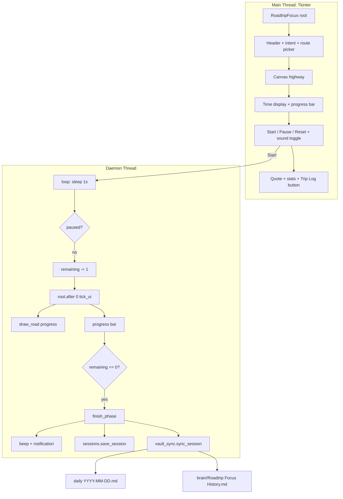

# Roadtrip Focus — Cross-Country Focus Timer

> **Repo:** `C:/Users/Vijaykumar/My apps/RoadtripFocus/` (fresh folder — `2)b` choice)
> **Stack:** `tkinter` + `ttk`, `threading`, `sounds.py` (`numpy` + `sounddevice`, optional), `sessions.py`, `vault_sync.py`
> **Theme:** Road trip (Coastal Hop → Cross-Country) — distinct from FocusFlight's aviation, now an endless **Slow Roads** cruise: *no destination, just winding road + continuous sound* — same spatial-progress insight, opposite arrival semantics
> **Obsidian:** Direct vault writes (no REST API) — see `vault_sync.py` section

---

## For future agent
This is a **personal productivity build** — a road-trip-themed focus timer that turns each deep-work block into an endless Slow Roads-style cruise. Extends the proven `[[quote-pomodoro]]` Tkinter threading/UI pattern, swaps the flight metaphor for a night highway that procedurally winds through 3-layer parallax hills with scrolling trees/poles while the car stays fixed with an engine bob, and **auto-logs every completed trip into the vault** (the edge FocusFlight cannot have). Cross-links: [[wiki/01-Areas/Self-Dev/productivity/deep-work-attention-economics]], [[wiki/01-Areas/Self-Dev/productivity/focus-minimalism-babauta]], `brain/Roadtrip Focus History`.

---

## 1. Why road trip (not a FocusFlight clone)

FocusFlight's own site (focusflight.net) argues the metaphor's job is to give a timer a *destination, texture, and cover story* so the brain accepts "the pilot has the controls." We keep that insight, change the vehicle:

- **Aviation → highway.** A night highway with mile markers, a car that recedes toward the horizon, and an engine/road hum — visually and aurally distinct, same psychological trick.
- **Intent field.** FocusFlight's FAQ admits a timer can't tell you *what* to work on. Every drive requires a one-line intent ("what does done look like?") — surfaced in the vault log so the next agent knows what you were driving toward.
- **Vault is the product.** Sessions write directly into `daily/` + `brain/` — no siloed app DB. The *Second Brain* is the FlightLog.

---

## 2. Routes — duration is the destination

| Route | Minutes | Tagline | Use |
|-------|---------|---------|-----|
| **Coastal Hop** | 25 | Quick sprint — one focused stretch | Pomodoro replacement |
| **Desert Stretch** | 50 | Deep work block — stay with it | One chapter / one problem set |
| **Mountain Pass** | 90 | Long haul — settle in | Essay draft / feature + tests |
| **Cross-Country** | 120 | Marathon — the scenic way | Half-day build |
| **Custom** | 1–180 | Your pace (edit `mm:ss`) | Anything else |

Route choice sets the timer and the road label. The canvas scales the car's journey to `progress = elapsed / total` — same spatial-progress win FocusFlight uses with its 3D map, but rendered on a `tk.Canvas`.

---

## 3. Architecture



**Key files:**

| File | Role |
|------|------|
| `roadtrip_focus.py` | Main `RoadtripFocus` class — builds UI, owns timer thread, draws canvas, handles presets/routes, owns `try_vault_sync` hook |
| `sounds.py` | Continuous hum: 55 Hz + 110 Hz engine drone + filtered white-noise road texture, mixed into a 4 s looping stereo buffer, played via `sounddevice.OutputStream`. **Silent fallback** if `numpy`/`sounddevice` missing — never a hard dep |
| `sessions.py` | `Session` dataclass + `~/.roadtrip_focus/sessions.json` (last 500, append-only). Local cache only; vault is the durable single source |
| `vault_sync.py` | Direct file writes into `VAULT = ROADTRIP_VAULT env or C:/Users/Vijaykumar/Second-Brain/Second-Brain`. Appends to `daily/` under `## Roadtrip Focus`, updates `brain/Roadtrip Focus History.md` (single source) with stats comment `<!-- stats: {...} -->` + human block + table |
| `README.md` | Run instructions |

---

## 4. Threading & sound — exact patterns

Same proven pattern as `flightproductivity.py:226-250`:

```python
# Start: daemon thread, never blocks UI
threading.Thread(target=self.loop, daemon=True).start()

# Loop: sleep 1s, respect pause, decrement, schedule UI on main thread
while self.is_running and self.remaining > 0:
    time.sleep(1)
    if self.pause_btn["text"] == "Resume":
        continue
    self.remaining -= 1
    self.root.after(0, self.tick_ui)

# tick_ui runs on main thread: safe to touch widgets
def tick_ui(self):
    self.time_var.set(self.format_time(self.remaining))
    self.progress["value"] = self.total - self.remaining
    self.draw_road(1.0 - self.remaining / self.total)
```

Sound: `sounds.start(volume)` builds a `(176400, 2)` float32 buffer once, then plays via a `sounddevice` callback that wraps gaplessly. `sounds.stop()` tears down the stream. `RoadtripFocus.on_sound_toggle` / `on_volume_change` wrap it. If `sounds.available()` is false the checkbox is disabled and the app runs silent.

Volume default `0.12` — intentionally quiet per FocusFlight's hearing-safety note (anything quiet enough to hold a conversation over is safe for long sessions).

---

## 5. Canvas — Slow Roads endless cruise

`draw_road(progress: 0..1)` (`roadtrip_focus.py`):

- **Endless, not arrival.** `progress` drives a counter/bar; the *world* distance is `dist = progress * total * (SCENERY_SPEED*0.35)` — constant cruise speed so every route feels the same, only duration differs. The road never ends; `HALFWAY`/`CRUISING` markers are perspective mile posts, not a bay.
- **Winding road ribbon.** 18 depth stations from horizon (`visible_world=140`) to bumper (`h-6`). At station `depth_world` the road center = `W/2 + _road_center(dist+depth_world)` where `_road_center` is a seeded two-sine sum (`A1 sin(w1·d+p1)+A2 sin(w2·d+p2)`, `A1∈[38,62]`, `A2∈[16,28]`, `w1∈[0.035,0.055]`, `w2∈[0.10,0.16]`). Width tapers `half_far 42 → half_near 262`. The polygon is left-far→left-near plus right-near→right-far; shoulders follow the edges with smoothing, center dashes follow the winding center (every other segment, 45% length, width perspective-scaled).
- **Parallax hills — 3 layers.** Far (`#0e1a14`, speed `0.22`, tile `420`), mid (`#132019`, `0.45`, `360`), near (`#16261d`, `0.85`, `300`). Each is a tiled sine silhouette whose `x` offset = `-(dist*speed) % tile`; amplitude modulated by a second harmonic so hills don't alias.
- **Scrolling scenery.** Deterministic poles/trees beside the road, spaced `18` world units. For `world_d` in `[dist-12, dist+visible+18]` and `depth=world_d-dist` in `[4, visible-2]`, hash `(int(seed*100000), int(world_d))` picks side/kind: tree (triangle foliage `#1a3326` + trunk `#2b1a0e`) or pole (`#3a3a3a` + cap `#c9a86a`). Perspective `scale = 0.28+0.72*t` where `t=1-depth/visible`; jitter ±5. At most ~9 on-screen; pure canvas.
- **Car — fixed.** Near road center (`centers[-1]`) with a lean `0.12*(centers[-1]-centers[-3])` that follows local curvature and an engine bob `0.9 sin(dist*0.55 + progress*13)`. Gentle shrink `scale=1 - min(0.18, progress*0.18)` so long trips feel slightly farther. Shadow/body/windshield/wheels as before, plus a headlight glint. World scrolls, car stays.
- **Overlays.** Kept `pct%` + route label, plus a new `dist_km = dist/42.0` cruise readout (`"X.X km · CRUISE"` top-right).

No image assets — pure `tk.Canvas` primitives, so the binary stays small and the build stays portable.

### 5.1 Evolution (2026-08-29): Slow Roads rewrite — full vibe, endless cruise

** supersedes: §5 destination-slide (2026-08-29, now removed).**

**Motivation:** user wanted "more like a slowroads gameplay" — the prior straight-road-then-slide-to-bay felt like an airport exit, not a relaxing endless drive.

**User decisions baked in:** *Full vibe: terrain + moving scenery* and *Drop destination bay for endless cruise* (random per session reseeding kept: curve seed replaces side).

**What changed** (`roadtrip_focus.py`):

- Removed `DEST_BAY_*`, `_slide_window/_slide_start/_destination_geometry`, `destination_side` / EXIT/bay/blink/lateral-slide code.
- Added Slow Roads constants `HILL_FAR/MID/NEAR`, `TREE_COLOR/TRUNK`, `POLE_COLOR`, `SCENERY_SPEED=18.0`.
- `__init__` now holds `self.dist`, `self._curve_seed`, `self._curve_params = _make_curve_params(seed)` instead of `destination_side`.
- New helpers: `_make_curve_params(seed)` → `(A1,A2,w1,w2,p1,p2)` via `random.Random(seed)`, `_road_center(world_d)` → sine sum, `_dist_for_progress(progress)` → `progress*total*(SCENERY_SPEED*0.35)`.
- `start_timer()` re-seeds `self._curve_seed/_curve_params` and resets `self.dist=0` before calling `draw_road(0)`; `tick_ui()` now sets `self.dist = _dist_for_progress(prog)` then draws; `reset_timer()` resets `self.dist`.
- `draw_road()` rewritten to the pipeline above (sky → 3 hill layers → winding ribbon + shoulders/dashes → mile markers → scrolling scenery → fixed bobbing car → overlays). Overlays kept.
- Correction sweep: every `DESTINATION/EXIT/bay/slide_start` reference removed in this pass (Write-Correctness Law #2).

**Verification:** py_compile + withdrawn-Tk smoke at `progress 0/0.1/0.25/0.5/0.75/0.9/1.0` and totals 25 m/120 m → `dist` linear, road stays inside canvas for seeds `0.1/0.5/0.9/0.01/0.99` and an extreme `A1=70,A2=35`, scenery count bounded (~65 items), reseeding verified. Manual-verification flagged: parallax speed, curve gentleness, tree/pole pacing need an eyeball run.

---

## 6. Vault sync — contract

Direct file writes (zero dependency, no Obsidian REST API). Vault path: `ROADTRIP_VAULT` env or `C:/Users/Vijaykumar/Second-Brain/Second-Brain`.

**Daily note** (`daily/YYYY-MM-DD.md`):

- Creates the file from scaffold if absent (matches `daily/2026-08-28.md` frontmatter).
- Appends under `## Roadtrip Focus` (creates heading before `## Tomorrow` if missing):
  `- HH:MM · Roadtrip focus: <min>m — <intent> (route: <route>) [completed|abandoned]`

**History note** (`brain/Roadtrip Focus History.md`) — **single source** per Write-Correctness Law #1:

- Machine stats in `<!-- stats: {"total_min":..., "total_sessions":..., "total_completed":..., "streak":..., "last_date":"YYYY-MM-DD"} -->`
- Human line: `> **Totals (as of YYYY-MM-DD)** — X completed / Y sessions · Z min (H h) · streak: N day(s)`
- Table: `| Date | Route | Min | Intent | Done |` (last 50 kept readable; local `sessions.json` keeps 500)
- Created on first landing if absent; on each landing the row is inserted and stats updated. Streak increments only on a new `last_date` with a completed session.

`roadtrip_focus.py:try_vault_sync` is the only caller — wrapped in `try/except ImportError` so the app runs fine without `vault_sync.py`.

---

## 7. Trip Log (local)

- `sessions.json` at `%USERPROFILE%/.roadtrip_focus/sessions.json`
- `Trip Log` button opens a `Toplevel` with a `ttk.Treeview` (last 200 rows, newest first): `finished | route | min | intent | done`
- `Clear log` confirms, then unlinks `sessions.json`. Stats label `Trips: N · Road time: M min (H h)` refreshes on every landing/reset.

---

## 8. Run & deps

```bash
# from C:/Users/Vijaykumar/My apps/RoadtripFocus/
python roadtrip_focus.py

# optional (silent fallback if absent)
pip install numpy sounddevice plyer
```

- `numpy` + `sounddevice` → road hum
- `plyer` → Windows toast on arrival (`notification.notify`)
- `winsound` (stdlib on Windows) → beeps (800 Hz start, 600+450 Hz landing)

---

## 9. Verification (2026-08-29)

- `python -m py_compile` — 3 files OK (re-verified after Slow Roads rewrite)
- Smoke test (`Tk()` withdrawn): route pick, time helpers, `draw_road` at 0/0.25/0.5/0.9/1.0, `open_trip_log`, `refresh_trip_stats` — all passed (`Second-Brain/roadtrip_focus.py:verified 2026-08-29`)
- **Slow Roads rewrite smoke (2026-08-29):** `draw_road` at `0/0.1/0.25/0.5/0.75/0.9/1.0` for totals 25 m (`dist 0→9450`) / 120 m (`0→45360`) with seeds `0.1/0.5/0.9/0.01/0.99` + an extreme `A1=70,A2=35` — `dist` linear via `_dist_for_progress`, road stays inside canvas (clamped `max_offset`), scenery bounded (~59-65 items), per-session reseed verified, `self.dist` updated in `tick_ui`. Manual-verification flagged: parallax hill speeds, curve amplitude/frequency, tree/pole spacing need an eyeball run (run `python roadtrip_focus.py` and watch a 1–2 min drive).
- `sounds` buffer shape `(176400, 2)` float32, peak `~0.076` at vol 0.12 — OK; `sounds.available()` true when deps present, false path disables checkbox without crash
- `vault_sync` end-to-end (dummy `Session` → `daily/2026-08-29.md` + `brain/Roadtrip Focus History.md`) — both writes verified, then cleaned (re-cleaned after Slow Roads tests)

---

## 10. Future — web build

The brief was "Both Web + Desktop" with Tkinter first. The desktop MVP above is the foundation; the web build is the next phase:

- Reuse `sessions.py` vault contract (same `daily/` + `brain/` writes via a small FastAPI or static-site bridge).
- Canvas highway → HTML Canvas / SVG; hum → Web Audio API with the same 55 Hz drone recipe.
- No duplication: the vault remains the single source regardless of client.

---

## See Also

- [[quote-pomodoro]] — predecessor Pomodoro on which this extends the threading/UI pattern
- [[wiki/01-Areas/Self-Dev/productivity/deep-work-attention-economics]] — deep work theory (the "why" behind the timer)
- [[wiki/01-Areas/Self-Dev/productivity/focus-minimalism-babauta]] — focus minimalism
- `brain/Roadtrip Focus History` — live aggregate stats (created on first landing)
