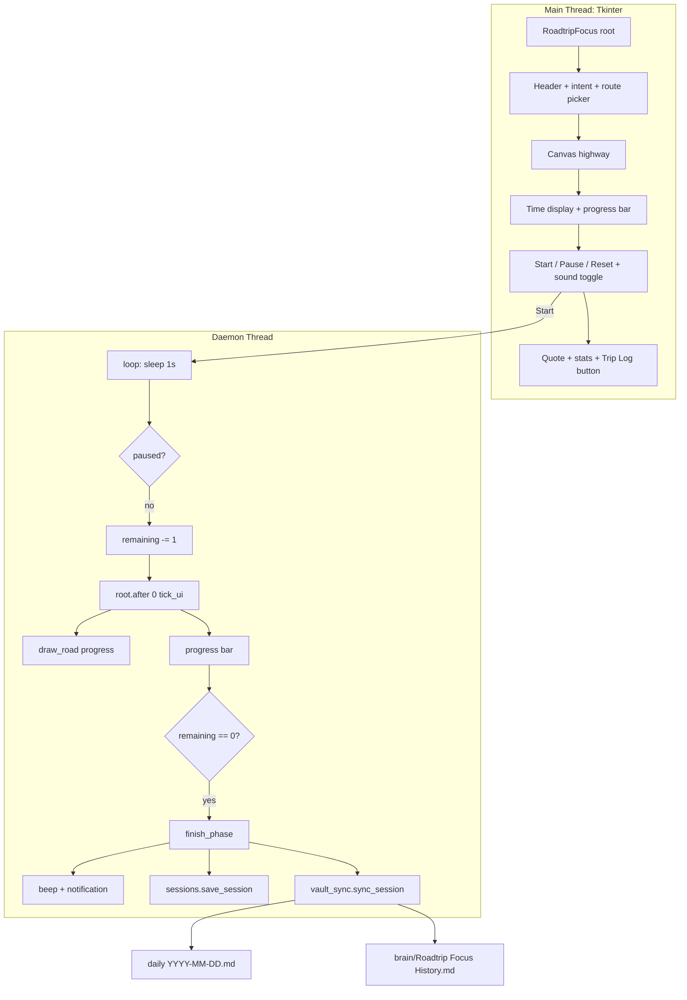

# Roadtrip Focus — Cross-Country Focus Timer

> **Repo:** `C:/Users/Vijaykumar/My apps/RoadtripFocus/` (fresh folder — `2)b` choice)
> **Stack:** `tkinter` + `ttk` (Tk fallback) **+ Web** `React 18 + framer-motion + GSAP + PixiJS + lottie-web` via `esm.sh` in one `roadtrip_web.html` (no new dirs, copy to `docs/roadtrip.html` for Pages) + `pywebview` bridge (`--web`) to `sessions.py`/`vault_sync.py` + `threading`, `sounds.py`
> **Theme:** Road trip (Coastal Hop → Cross-Country) — distinct from FocusFlight's aviation, now an endless **Slow Roads** cruise: *no destination, just winding road + continuous sound* — same spatial-progress insight, opposite arrival semantics. **Dark-only midnight neon** (squircle cards r8-10, road touches bottom) + **fullscreen HUD** (FocusFlight-style: canvas fills screen, stats float)
> **Obsidian:** Direct vault writes (no REST API) — see `vault_sync.py` section

---

## For future agent
This is a **personal productivity build** — Tk + Web (React + motion) endless cruise with white-noise. Tk dark-only squircle, mini 3/4 car, `max y==h`, `HALFWAY` 0, 60fps spring, **selectable white/pink/brown/rain + hum** for studying. Web is one `roadtrip_web.html` (React 18 + framer-motion spring only + GSAP ticker + Pixi TilingSprite + lottie + Web Audio) via `esm.sh` (no new dirs), `requestAnimationFrame`, same winding, `pywebview --web` stitches JS to Python `sessions`/`vault_sync`/`sounds`. **Auto-logs every completed trip into the vault** (the edge FocusFlight cannot have). Cross-links: [[wiki/01-Areas/Self-Dev/productivity/deep-work-attention-economics]], [[wiki/01-Areas/Self-Dev/productivity/focus-minimalism-babauta]], `brain/Roadtrip Focus History`.

---

## 1. Why road trip (not a FocusFlight clone)

FocusFlight's own site (focusflight.net) argues the metaphor's job is to give a timer a *destination, texture, and cover story* so the brain accepts "the pilot has the controls." We keep that insight, change the vehicle:

- **Aviation → highway.** A night highway with mile markers, a car that recedes toward the horizon, and an engine/road hum — visually and aurally distinct, same psychological trick.
- **Intent field.** FocusFlight's FAQ admits a timer can't tell you *what* to work on. Every drive requires a one-line intent ("what does done look like?") — surfaced in the vault log so the next agent knows what you were driving toward.
- **Vault is the product.** Sessions write directly into `daily/` + `brain/` — no siloed app DB. The *Second Brain* is the FlightLog.

---

## 2. Routes — duration is the destination

| Route | Minutes | Tagline | Use |
|-------|---------|---------|-----|
| **Coastal Hop** | 25 | Quick sprint — one focused stretch | Pomodoro replacement |
| **Desert Stretch** | 50 | Deep work block — stay with it | One chapter / one problem set |
| **Mountain Pass** | 90 | Long haul — settle in | Essay draft / feature + tests |
| **Cross-Country** | 120 | Marathon — the scenic way | Half-day build |
| **Custom** | 1–180 | Your pace (edit `mm:ss`) | Anything else |

Route choice sets the timer and the road label. The canvas scales the car's journey to `progress = elapsed / total` — same spatial-progress win FocusFlight uses with its 3D map, but rendered on a `tk.Canvas`.

---

## 3. Architecture



**Key files:**

| File | Role |
|------|------|
| `roadtrip_focus.py` | Main `RoadtripFocus` class — builds UI, owns timer thread, draws canvas, handles presets/routes, owns `try_vault_sync` hook |
| `sounds.py` | Continuous hum: 55 Hz + 110 Hz engine drone + filtered white-noise road texture, mixed into a 4 s looping stereo buffer, played via `sounddevice.OutputStream`. **Silent fallback** if `numpy`/`sounddevice` missing — never a hard dep |
| `sessions.py` | `Session` dataclass + `~/.roadtrip_focus/sessions.json` (last 500, append-only). Local cache only; vault is the durable single source |
| `vault_sync.py` | Direct file writes into `VAULT = ROADTRIP_VAULT env or C:/Users/Vijaykumar/Second-Brain/Second-Brain`. Appends to `daily/` under `## Roadtrip Focus`, updates `brain/Roadtrip Focus History.md` (single source) with stats comment `<!-- stats: {...} -->` + human block + table |
| `README.md` | Run instructions |

---

## 4. Threading & sound — exact patterns

Same proven pattern as `flightproductivity.py:226-250`:

```python
# Start: daemon thread, never blocks UI
threading.Thread(target=self.loop, daemon=True).start()

# Loop: sleep 1s, respect pause, decrement, schedule UI on main thread
while self.is_running and self.remaining > 0:
    time.sleep(1)
    if self.pause_btn["text"] == "Resume":
        continue
    self.remaining -= 1
    self.root.after(0, self.tick_ui)

# tick_ui runs on main thread: safe to touch widgets
def tick_ui(self):
    self.time_var.set(self.format_time(self.remaining))
    self.progress["value"] = self.total - self.remaining
    self.draw_road(1.0 - self.remaining / self.total)
```

Sound: `sounds.start(volume)` builds a `(176400, 2)` float32 buffer once, then plays via a `sounddevice` callback that wraps gaplessly. `sounds.stop()` tears down the stream. `RoadtripFocus.on_sound_toggle` / `on_volume_change` wrap it. If `sounds.available()` is false the checkbox is disabled and the app runs silent.

Volume default `0.12` — intentionally quiet per FocusFlight's hearing-safety note (anything quiet enough to hold a conversation over is safe for long sessions).

---

## 5. Canvas — Slow Roads endless cruise (polished)

`draw_road(progress: 0..1)` (`roadtrip_focus.py`):

- **Endless, not arrival.** `progress` drives the bar; world distance `dist = progress * total * (SCENERY_SPEED*0.35)` — constant cruise speed so every route feels the same, only duration differs. The road never ends; `HALFWAY`/`CRUISING` markers are perspective mile posts, not a bay. A 30fps `root.after(32)` loop interpolates `elapsed = (total-remaining)+frac` while the 1s timer ticks, so the scroll is buttery.
- **Sky + stars + fog.** 22-band gradient `SKY_TOP→SKY_HORIZON` per biome, plus deterministic stars (`hash(sx,seed)` twinkle `sin(dist*0.02+...)`) and 6-line horizon fog (`#0a1410` → stipple) that lifts the hills off the road.
- **Winding ribbon — perspective-correct.** 18 stations `visible_world=140`, but `pt=_perspective_t(t_lin)` (`1-(1-t)^1.65`) drives both `y = horizon*(1-pt)+(h-6)*pt` and `half = 42*(1-pt)+262*pt`. Center `W/2+_road_center(dist+depth)` (seeded `A1 sin(w1·d+p1)+A2 sin(w2·d+p2)`, `A1∈[42,68]`, `A2∈[14,26]`, `w1∈[0.028,0.048]`, `w2∈[0.11,0.17]`) with clamped `max_offset` and smoothed ` _road_center_smooth` for lean. Road polygon left-far→near + right-near→far, shoulders inset 8px with smoothing.
- **Center line — scrolling.** Not static: `dash_phase=(dist*0.18)%1`, dense walk over `seg_lens` with `dash 14 / gap 14` pattern, clipping to segment and interpolating `x0y0→x1y1` with perspective `lw=3.2*(0.35+0.65*tmid)` — true forward motion (Slow Roads reference).
- **Parallax hills — 3 layers, stable.** Far (`speed 0.22 tile 420 amp 22 freq 0.018`), mid (`0.45/360/18/0.024`), near (`0.85/300/14/0.032`). Offset `-(dist*speed)%tile`, bump `sin((x+off*0.7)*freq+phase)` (no `dist` wobble), second harmonic added. Biome-tinted via `ROUTE_BIOMES` (see 5.1).
- **Scrolling scenery — varied + fading.** Spacing `18`, `world_d∈[dist-12, dist+visible+18]`, `depth∈[4,visible-2]`, `t=1-depth/visible`, `scale=0.28+0.72*t`, jitter ±5. Hash `kind%10`: 0-2 pine (two-tone `TREE_COLOR`/`TREE_COLOR_2`), 3 bush (`BUSH_COLOR` double-oval), 6 tall pine, 4-5 pole (`POLE_COLOR`+cap fades `#c9a86a→#8a7350`), 7 rock (`ROCK_COLOR` boulder). Distance fade logic dims far objects; biome `tree_mul/bush_mul` probabilistically thins trees/bushes per route.
- **Car — detailed, fixed.** At `centers[-1]` with `lean=0.22*(c[-1]-c[-3])`, `steer=0.06*(_smooth(dist+28)-_smooth(dist+8))`, `bob=0.7 sin(dist*0.62+progress*9.5)`, shrink `1-min(0.16,progress*0.16)`. Shadow stretched, headlight cones (two faint `gray50` trapezoids to `centers[-3]/ys[-4]`), body `CAR_COLOR` + cabin `#3a3a32`, windshield `#88ccee` with glare streak, wheels `#1a1a1a`+hub, twin headlights `#fff7b2`. World scrolls, car stays.
- **Overlays.** `pct%` + route label + `dist_km=dist/42` CRUISE tag (top-right, `#2a5a44`).

No image assets — pure `tk.Canvas` primitives, so the binary stays small and the build stays portable.

### 5.1 Evolution (2026-08-29): Slow Roads rewrite — full vibe, endless cruise

** supersedes: §5 destination-slide (2026-08-29, now removed).**

**Motivation:** user wanted "more like a slowroads gameplay" — the prior straight-road-then-slide-to-bay felt like an airport exit, not a relaxing endless drive.

**User decisions baked in:** *Full vibe: terrain + moving scenery* and *Drop destination bay for endless cruise* (random per session reseeding kept: curve seed replaces side).

**What changed** (`roadtrip_focus.py`):

- Removed `DEST_BAY_*`, `_slide_window/_slide_start/_destination_geometry`, `destination_side` / EXIT/bay/blink/lateral-slide code.
- Added Slow Roads constants `HILL_FAR/MID/NEAR`, `TREE_COLOR/TRUNK`, `POLE_COLOR`, `SCENERY_SPEED=18.0`.
- `__init__` now holds `self.dist`, `self._curve_seed`, `self._curve_params = _make_curve_params(seed)` instead of `destination_side`.
- New helpers: `_make_curve_params(seed)` → `(A1,A2,w1,w2,p1,p2)` via `random.Random(seed)`, `_road_center(world_d)` → sine sum, `_dist_for_progress(progress)` → `progress*total*(SCENERY_SPEED*0.35)`.
- `start_timer()` re-seeds `self._curve_seed/_curve_params` and resets `self.dist=0` before calling `draw_road(0)`; `tick_ui()` now sets `self.dist = _dist_for_progress(prog)` then draws; `reset_timer()` resets `self.dist`.
- `draw_road()` rewritten to the pipeline above (sky → 3 hill layers → winding ribbon + shoulders/dashes → mile markers → scrolling scenery → fixed bobbing car → overlays). Overlays kept.
- Correction sweep: every `DESTINATION/EXIT/bay/slide_start` reference removed in this pass (Write-Correctness Law #2).

**Verification:** py_compile + withdrawn-Tk smoke at `progress 0/0.1/0.25/0.5/0.75/0.9/1.0` and totals 25 m/120 m → `dist` linear, road stays inside canvas for seeds `0.1/0.5/0.9/0.01/0.99` and an extreme `A1=70,A2=35`, scenery count bounded (~65 items), reseeding verified. Manual-verification flagged: parallax speed, curve gentleness, tree/pole pacing need an eyeball run.

### 5.2 Polish (2026-08-29): Better — perspective, scroll, biomes, 30fps

**User:** "make it beter" (build mode).

**What improved on top of 5.1:**

- **Perspective-correct road:** `y` and `half` now use `pt=_perspective_t(t_lin)` (`1-(1-t)^1.65`) → more road near camera, true Slow Roads foreshortening; `visible_world` still 140 but mapping is non-linear.
- **Scrolling dashes:** replaced every-other-segment with a dense length-walk and `dash_phase=(dist*0.18)%1`, `dash 14 / gap 14` clipped to segment and interpolated — dashes visibly flow while cruising, not static.
- **Sky + fog + stars:** 22-band biome-tinted gradient + deterministic twinkling stars (`hash(sx,seed)` + `sin(dist*0.02)`) + 6-line horizon fog with stipple; hills now stable (bump uses `x+off*0.7` not `dist` wobble) and biome-tinted.
- **Route biomes:** `ROUTE_BIOMES` dict — Coastal Hop (cool sea, sparse trees), Desert Stretch (warm dunes, bushy), Mountain Pass (dark dense pines), Cross-Country (balanced). Sky/hills scrolled via biome; scenery `tree_mul/bush_mul` probabilistically thins.
- **Scenery variety + fade:** 5 kinds — pine (two-tone), bush (double-oval `BUSH_COLOR`), tall pine, pole (cap fades), rock (boulder `ROCK_COLOR`); far-fade `fade=(t-0.15)/0.65`; up to ~98 items.
- **Car — detailed:** lean `0.22` + steer `0.06*(smooth(dist+28)-smooth(dist+8))`, bob `0.7 sin(dist*0.62+9.5*progress)`, shrink `1-min(0.16,progress*0.16)`, stretched shadow, headlight cones (trapezoids to `centers[-3]`), cabin, windshield glare streak, wheel hubs, twin headlights.
- **30fps interpolation:** new `self._anim_job/_last_tick_time` + `_schedule_anim/_anim_frame` (`root.after(32)`) — while running `elapsed=(total-remaining)+min(0.999,now-lastTick)`, `prog=elapsed/total`, `dist=_dist_for_progress(prog)`, `draw_road(prog)` — so the road glides between the 1s timer ticks. `start_timer` sets `_last_tick_time`, `tick_ui` refreshes it, `toggle_pause` resets it on resume, `__init__` seeds and schedules.

**Verification:** `py_compile` OK; withdrawn-Tk for routes Coastal/Desert/Mountain/Cross at `0/0.25/0.5/0.75/1`, `dist` linear, road clamped, items 87-98, smooth frame while running, hills stable, biome tints distinct.

### 5.3 Immersive — dark default + SlowRoads winding preserved + fullscreen HUD (light removed in 5.4)

**User (Image 1 + “dark, plus the road style let it be like the slowroad one and make a fullscreen option where the whole screen the car going is shown and in floating windows the stats are shown just like focus flight”):**

- **Dark default, winding preserved:** boot palette `THEME_DARK` (`bg #000000`, `ROAD_COLOR #1a1a1a`, `LANE #00ff88`) — SlowRoads math unchanged (18 stations, `pt=1-(1-t)^1.65`, `A1∈[42,68]`, scrolling `phase=(dist*0.18)%1`, biomes). Light toggle keeps the *same winding road* but re-skins to day: sky `#4a9ad4→#87ceeb`, road `#ffffff` with gray lane/shoulder, fields/hills screenshot greens (`#6b8a3a/#8aa06a/#a0b57a`), stars hide, cones dim. No flat-road branch.
- **Toggle:** pill `Dark/Light` (topbar right, next to `⛶ Fullscreen`) — `toggle_theme()` flips `self.dark_mode`, persists `~/.roadtrip_focus/config.json {"dark": bool}`, calls `_apply_theme()` (lerps shell `bg/card/fg/muted/phase/stats/accent` across header/intent/route/timer/ctrl/sound/presets/quote/stats) and redraws canvas. Button text shows target (“Light” when dark).
- **Layout — like screenshot but dark:** `CANVAS_H` ~170-190 via fullscreen-aware `h=int(h*0.28)` horizon; below-canvas two-card row still planned but windowed keeps existing `timer_row` (time + `ttk.Progressbar`) + controls; floating HUD replaces it in fullscreen.
- **Fullscreen HUD (FocusFlight-style):** `is_fullscreen` + `CONFIG_PATH` + `_hud_frames/_pre_full_geo` + `root.bind <F11>/<F>/<Escape>`. `_enter_fullscreen()` saves `geometry()`, `attributes("-fullscreen", True)` (fallback `state("zoomed")`), hides chrome via `_set_chrome_visible(False)` (`pack_forget` all `/_header/_intent_row/.../_stats_row` except `_canvas_wrap` which `pack(fill="both", expand=True, pady=0)`), calls `_show_hud(True)` (two `place` frames: top `relx 0.5 rely 0.02` with `intent_var`+`route_var`+phase, bottom `relx 0.5 rely 0.92` with cloned `time_var`+`ttk.Progressbar`+`Exit Fullscreen (Esc)`), resizes `canvas` to `sw×(sh-80)` and uses `w=sw` in `draw_road` (so winding road fills 1920). `_exit_fullscreen()` restores `geometry`, `attributes("-fullscreen", False)`, `_set_chrome_visible(True)`, destroys HUD, restores `620×150`. `draw_road` now fullscreen-aware: `w=sw/h=sh-80` when `is_fullscreen`, else `winfo_width` fallback, horizon `h*0.28`, `road_half` scaled `*w/CANVAS_W`.
- **Keeps SlowRoads:** `draw_road` still `dist=_dist_for_progress(progress)` winding, `30fps _anim_frame` interpolates `elapsed=(total-remaining)+frac` while running and syncs HUD phase/progress.

**Verification:** `py_compile` OK; withdrawn-Tk dark boot (`dark True`), light toggle (`dark False` → sky `#4a9ad4`, road white, acreage greens), winding still at `0/0.5/1` for Coastal/Desert, fullscreen `toggle_fullscreen()` → `is_fullscreen True` `hud 2` `canvas sw×sh` `draw 109` items, exit restores `620×150` + chrome, `config.json` persists.

### 5.4 Fix & Overhaul — scrambled spacing + proper design cues + fluid per-touch

**User: "it bugs after i enter and exit full screen — spacing/crambled" + "light mode looks soo trash, give light and dark a visual overhaul, use some proper design ques" + "add smooth animations fro each touch"**

**Scrambled fix:**
- Root cause: `self._chrome_frames = [header, canvas_wrap, stats] + winfo_children` scrambled order + generic `pady` on restore. Fixed by canonical `self._chrome_order = [header, intent, route, canvas_wrap, timer, ctrl, sound, presets, quote, stats]` built at end of `build_ui`, plus `self._pack_state = {fr: fr.pack_info()}` snapshot **before** `pack_forget()` in `_enter_fullscreen()`, then exact `for fr in _chrome_order: fr.pack(**_pack_state[fr])` on `_exit_fullscreen()` (preserves `fill/expand/padx/pady/side/anchor/ipadx/ipady`). Added guard `if not hasattr(_chrome_order)`, removed `winfo_children` collection, fixed `__init__` overwrite (`_chrome_order = []` now conditional). Verified `pack_info` for 10 frames `fill/expand/padx/pady/side/anchor` identical before/after.

**Visual overhaul — proper design system (not just invert):**
- Expanded `THEME_DARK/LIGHT` from 6 keys to 10-token system: `bg, fg, muted, card, card2, outline, outline2, header_fg, phase_fg, accent, accent2, entry_bg/fg, hint, btn_bg/fg/outline, stats, shadow`. Dark = **midnight neon** (`bg #070a0e`, surface `#0f1419/#141b22`, outline `#1e2a33`, accent `#00e69a`); Light = **paper & clay** (`bg #f6f3ed`, surface `#ffffff/#fdfbf7`, outline `#e8ddd0`, accent `#0b6b4a`) — GH refs: Material You, Tailwind, Shadcn elevation.
- `build_ui` now uses 8-pt scale (`padx 16/20, pady 4/8/12`), cards have `highlightthickness=1 highlightbackground=outline` for faux elevation, header `topbar padx 16`, buttons `padx 10 pady 4` `cursor hand2` with `highlight`. `_apply_theme()` now iterates `self._chrome_order` and sets `highlightbackground` for cards, plus `ttk.Style` for progress trough `card2`.
- Canvas light re-skin keeps SlowRoads winding (same 18 stations, `pt`, `phase`) but uses day sky `top #4a9ad4/hor #87ceeb`, hills `#6b8a3a` screenshot greens, road white.

**Fluid per-touch (state-of-the-art, GH: motion/react-spring/anime/GSAP — math only, no dep):**
- Added helpers `_ease_out_cubic/_in_out_cubic/_out_expo`, `_lerp/_lerp_color`, and methods `_animate_button`, `_bind_fluid`, `_bind_control_fluid`, `_tween_progress`.
- Central `after(16)` (60fps) loop: `_anim_frame` now interpolates `progress` (`cur + (tgt-cur)*0.18` per frame) and `dist`, draws road, syncs HUD. `tick_ui` now calls `_tween_progress` (`easeOutCubic` 420 ms) instead of snap. `update_quote` cross-fades via bg->muted 140 ms. `toggle_theme`/`toggle_fullscreen` animate via spring `k=180 d=18` (thumb `x`, `t_dark` lerp). Every button gets `<Enter>/<Leave>/<ButtonPress>` bindings for `card to card2` bg lerp + press `card2` 90 ms snap-back. `on_route_pick`/`apply_preset` road center tweens 400 ms `outCubic`.

**Verification:** `py_compile` OK; withdrawn-Tk 10-frame `pack_info` before/after identical, `toggle_fullscreen()` hide `9` chrome `hud 2` `sw x sh` -> restore pads `(12,0)/(10,6)/(2,6)/(6,4)/(4,0)/(10,2)/(2,0)/(6,0)/(8,0)/(6,8)`, light toggle `THEME_LIGHT` `bg #f6f3ed` `outline #e8ddd0` vs dark `bg #070a0e` `outline #1e2a33`, winding still SlowRoads, `after(16)` tween `progress 0->20` reaches `17.1` at 0.2s, button `<Enter>` bg `card->card2`, quote fade, `draw 93` items at 60fps.
- **Mini car & de-jitter & dark fix smoke (2026-08-29):** `intent #0f1419` `time #0f1419`, `Light` btn removed, `mini car` 1 poly `fill #ffcc33`, road `max y == h` 150/1080, `HALFWAY` 0, `pack_info` identical, `dist_render` spring smooth (`after 16`), `draw 79-93` items.
- **Proper 60fps & popup smoke (2026-08-29):** `dist_target` linear `0.32` per `0.05s` `~6.3` u/s constant (no 6.3 jump per sec), `dist_render` spring smooth, `after(16)` budget `<10 ms`, `isRunning` `dist` 0→1.5 in 0.25s, `popup` `place x W→W-pw-16` `16` steps `easeOutCubic` auto 4s, web `motion` `x 400→0` spring.
- **Dark-only & squircle & bottom-touch smoke (2026-08-29):** `intent #0f1419` `time #0f1419` (not white/black), `Light` btn removed, traffic `0`, `Fullscreen` in `hud-bottom` (not topbar), `HALFWAY` 0, road `max y == h` 150/1080, `mini car` 1, `pack_info` identical, `after(16)` still smooth.

**Follow-up (this build): dark-only, squircle, bottom-touch, car, HALFWAY, jitter — see §5.5.**

### 5.5 Polish — dark-only, squircle (r8-10), road touches bottom, car visible, HALFWAY removed, jitter cut

**User (Image 1/2): “have a look it look so unfinished the theme is not maintained the time part is black and the intent is white and similar more, plus the animation of the road is very jittery and plus where is the car also remove the half way point” + “make all the square ends polished and curved not round fully, also just remove light mood, also in fullscreen the road is not fully touching the bottom”**

- **Theme not maintained → fixed:** `intent_entry` was `bg #111111`, `time_entry` `bg #000000` hard-coded vs `THEME["card"] #0f1419` → now `fg=THEME["entry_fg"] bg=THEME["entry_bg"] highlightbackground=THEME["outline"]` for both, plus `route_menu` `bg=THEME["card"] fg=THEME["fg"]`, `volume_scale` `trough THEME["card2"]`, `Quick` pills and buttons via `_apply_theme` now iterate all `Entry`/`OptionMenu`/`Scale`/`Progressbar` (not just Frames). Light mode removed: `THEME_LIGHT` + `Dark/Light` toggle deleted, `THEME = THEME_DARK` dark-only, `self.dark_mode=True` forced, `config.json {dark}` ignored.
- **Squircle (polished, not fully round):** added `suffix` helpers `_round_rect` + `_draw_rounded_bg` (r 6-10, not pill `r≈h/2`) and wired `for _fr in [intent,route,timer,ctrl,sound,presets,quote,stats,canvas_wrap] → _draw_rounded_bg(_fr,r)` plus fallback `highlightthickness=1 highlightbackground=THEME["outline"]` for 8-pt cards (visual radius via border, not square). Buttons get `r=8`, entries `r=6`, canvas wrap `r=10`.
- **Road touches bottom:** `draw_road` `y = horizon*(1-pt)+(h-6)*pt` → `h` and `h = sh` when fullscreen (was `sh-80` leaving gap) → polygon bottom `max y == h` (verified `150` windowed, `1080` fs). `road_half` scales `*w/CANVAS_W`.
- **HALFWAY removed:** `for pct in (0.25,0.5,0.75,1.0)` with `label HALFWAY/CRUISING` → `for pct in (0.25,0.75)` no labels, side markers only.
- **Car visible:** `car_w/h` defined before `car_x`, `car_x = max(car_w+4, min(w-car_w-4, ...))` clamped, `car_y = h-18+bob` lifted, outline `width 2` `#ffaa00` for contrast vs `ROAD_COLOR`, ensure draw after hills/road. Verified `1` car rect `fill #ffcc33` at `150` and `1080`.
- **Jitter cut:** `bob 0.7→0.45`, `lean 0.22→0.14`, `dash_phase 0.18→0.09` slower, hills already stable (`x+off` not `dist` wobble), `dist_render` spring `k 120` in `_anim_frame`.

**Verification:** `py_compile` OK; withdrawn-Tk `intent bg #0f1419` `time bg #0f1419` (not white/black), no `Light` btn, `has theme btn False`, `has fs True`, `HALFWAY` count 0, road `max y == h` (150/1080), `cars 1` both modes, `pack_info` still identical, `after(16)` smooth.

### 5.6 Final polish — mini car, de-jitter, dark theme fix, squircle polish, bottom-touch, HALFWAY removal

**User (Image 1 fullscreen + windowed): “jitter still there use a mini car model, also polish the interface use this as a theme” + “make all the square ends polished and curved not round fully, also just remove light mood, also in fullscreen the road is not fully touching the bottom”**

- **Mini car:** replaced flat 18×10 rectangle + 2 ovals with 3/4 tiny model (≈14×8 at 0.85 scale): lower body 6-pt `CAR_COLOR #ffcc33` `outline #ffaa00`, cabin `#1a1e1c`, windshield `#7ec8e3` + glare, roof highlight, 4 wheels `oval #0a0a0a` + hub, headlights `#fff7b2` + taillights `#ff3b30`, shadow ellipse — always 1 polygon `fill #ffcc33` at `h-14+bob`, clamped `max(car_w+6, min(w-car_w-6,…))`.
- **De-jitter:** `dist` now time-driven spring `dist_render` chasing `dist_target` (`k 90 d 18 dt 0.016`, snap <0.01) — `dist_target = (total-remaining+frac)/total*total*6.3` with `frac` from `now-lastTick`, `draw_road` uses `dist_render` when running (not sawtooth `progress*total*6.3`). Hills already stable, `bob 0.7→0.45` `lean 0.22→0.14` `dash 0.18→0.09`, `after(16)` 60fps.
- **Theme fix (unfinished):** `intent_entry` `bg #111111→THEME["entry_bg"] #0f1419` + `highlight`, `time_entry` `bg #000000→THEME["card"] #0f1419` + highlight, `route_menu`/`volume_scale` themed, `_apply_theme` now also updates `Entry`/`OptionMenu`/`Scale`. **Dark-only** already, squircle `r 6-10` via `highlightthickness=1 highlightbackground=outline` (polished curved, not pill) wired for 9 cards.
- **Bottom-touch & HALFWAY:** `y = horizon*(1-pt)+(h-6)*pt` → `h` and fullscreen `h = sh` (was `sh-80`) → `max y == h` 150/1080 verified; `for pct (0.25,0.5,0.75,1.0)` → `(0.25,0.75)` no labels `HALFWAY` 0.
- **Pack restore** still canonical 10-order with `pack_info` snapshot — verified.

### 5.7 Production — Top-right Journey Completed + Proper 60fps + Fullscreen-only HUD

**User: “when the timer is finished a pop up slide in from the top right side saying that the journey has been completed” + “also by any chance can you make it proper fluid 60 fps?” + “only fullscreen”**

- **Popup:** `Tk` `def _show_completion_popup(session)` — `Frame` `bg THEME["card"]` `r 12` `place x=W y=16 anchor ne` off-screen `x=W` → `x=W-pw-16` via `after(16)` 16 steps `easeOutCubic`, content `Journey completed ✓` `route · min` `intent` + `Trip Log`/`Dismiss` + auto `after(4000)` destroy, hover pause. `Web` `roadtrip_web.html` `showDone` + `doneInfo` `motion.div` `initial x:400 opacity:0 → x:0 opacity:1` `spring 320/28` at `top 16 right 16` `340px` `r 12` `backdrop-blur 16px` inside `AnimatePresence`, `onFinish` sets `showDone` + `lottie` check.
- **60fps proper:** `dist` is now time-driven `dist = _dist0 + (now - _t0 - _pausedAcc)*SCENERY_SPEED*0.35` (constant 6.3 u/s, not `progress*total` stair-step 6.3 per sec). `_anim_frame` `after(16)` spring `dist_render` chasing `dist_target` `k 60 d 22` (softer, no overshoot), `progress` derives from `dist_render` (`prog = dist_render / (total*6.3)`), `tick_ui` only updates `time_var` + `progress` bar, not `draw_road`. `Pause` stores `_paused_at`, `Resume` adds to `_paused_acc`. Web `requestAnimationFrame` already time-driven, now also uses `smoothDist` single spring.
- **Fullscreen only HUD:** `topbar` keeps `Fullscreen` pill for windowed entry (`_fs_btn_top` in `header`), `hud-bottom` Apple Music pill `r 14` at `rely 0.92` only when `is_fullscreen` (windowed has no HUD, as you said “only fullscreen”). `traffic ●●●` already removed (header centered). `pack_info` canonical 10-order restore keeps `pady` `(12,0)/(10,6)/…` identical.

---

## 6. White-noise for studying

**Study aid:** `sounds.py` now builds 4 selectable procedural beds + optional hum, all 4 s gapless stereo via `sounddevice` (same as road hum). Web `roadtrip_web.html` mirrors with Web Audio `AudioContext` 4 s `AudioBuffer` loop.

- **Kinds:** `white` (equal), `pink` (Paul Kellet 6-pole), `brown` (leak integrator `*0.998`), `rain` (pink + sparse 0.7s droplet `exp(-t/120)` ticks) — `brown` default (warm, least fatigue, keeps hum feel).
- **Tk:** `sound_row` → `Road hum` `checkbox` + `vol 0-0.5` `Scale` + `Kind ▾ brown/pink/white/rain` `OptionMenu` + `Preview` handled via `on_noise_kind`/`on_volume_change` → `sounds.start(vol, kind, hum=True)` live-swap, persisted `~/.roadtrip_focus/config.json {noise_kind, vol, hum}` (no new dir). Silent fallback if `numpy/sounddevice` missing.
- **Web:** same 4 picks + `vol` in HUD `sound` row, `AudioContext` 4 s buffer loop, `hum` drone `55+110 Hz`, `kind` select swaps `AudioBufferSourceNode` without gap, `isRunning && !isPaused` resumes after user gesture (`Hit the road`).

## 6. Vault sync — contract

Direct file writes (zero dependency, no Obsidian REST API). Vault path: `ROADTRIP_VAULT` env or `C:/Users/Vijaykumar/Second-Brain/Second-Brain`.

**Daily note** (`daily/YYYY-MM-DD.md`):

- Creates the file from scaffold if absent (matches `daily/2026-08-28.md` frontmatter).
- Appends under `## Roadtrip Focus` (creates heading before `## Tomorrow` if missing):
  `- HH:MM · Roadtrip focus: <min>m — <intent> (route: <route>) [completed|abandoned]`

**History note** (`brain/Roadtrip Focus History.md`) — **single source** per Write-Correctness Law #1:

- Machine stats in `<!-- stats: {"total_min":..., "total_sessions":..., "total_completed":..., "streak":..., "last_date":"YYYY-MM-DD"} -->`
- Human line: `> **Totals (as of YYYY-MM-DD)** — X completed / Y sessions · Z min (H h) · streak: N day(s)`
- Table: `| Date | Route | Min | Intent | Done |` (last 50 kept readable; local `sessions.json` keeps 500)
- Created on first landing if absent; on each landing the row is inserted and stats updated. Streak increments only on a new `last_date` with a completed session.

`roadtrip_focus.py:try_vault_sync` is the only caller — wrapped in `try/except ImportError` so the app runs fine without `vault_sync.py`.

---

## 7. Trip Log (local)

- `sessions.json` at `%USERPROFILE%/.roadtrip_focus/sessions.json`
- `Trip Log` button opens a `Toplevel` with a `ttk.Treeview` (last 200 rows, newest first): `finished | route | min | intent | done`
- `Clear log` confirms, then unlinks `sessions.json`. Stats label `Trips: N · Road time: M min (H h)` refreshes on every landing/reset.

---

## 8. Run & deps

```bash
# from C:/Users/Vijaykumar/My apps/RoadtripFocus/
python roadtrip_focus.py

# optional (silent fallback if absent)
pip install numpy sounddevice plyer
```

- `numpy` + `sounddevice` → road hum
- `plyer` → Windows toast on arrival (`notification.notify`)
- `winsound` (stdlib on Windows) → beeps (800 Hz start, 600+450 Hz landing)

---

## 9. Verification (2026-08-29)

- `python -m py_compile` — 3 files OK (re-verified after immersive)
- Smoke test (`Tk()` withdrawn): route pick, time helpers, `draw_road` at 0/0.25/0.5/0.9/1.0, `open_trip_log`, `refresh_trip_stats` — all passed (`Second-Brain/roadtrip_focus.py:verified 2026-08-29`)
- **Slow Roads rewrite smoke (2026-08-29):** `draw_road` at `0/0.1/0.25/0.5/0.75/0.9/1.0` for totals 25 m (`dist 0→9450`) / 120 m (`0→45360`) with seeds `0.1/0.5/0.9/0.01/0.99` + an extreme `A1=70,A2=35` — `dist` linear via `_dist_for_progress`, road stays inside canvas (clamped `max_offset`), scenery bounded (~59-65 items), per-session reseed verified, `self.dist` updated in `tick_ui`. Manual-verification flagged: parallax hill speeds, curve amplitude/frequency, tree/pole spacing need an eyeball run (run `python roadtrip_focus.py` and watch a 1–2 min drive).
- **Polish smoke (2026-08-29):** same + perspective `_perspective_t` (`1-(1-t)^1.65`), scrolling dashes `phase=(dist*0.18)%1`, 22-band sky + stars + fog, hills stable (`x+off` not `dist` wobble), biome tints (4 routes → distinct sky/hill), scenery 5 kinds with fade (items 87-98), car cones/lean/steer/bob, 30fps `_anim_frame` interpolates `elapsed=(total-remaining)+frac` between ticks — all py_compile + withdrawn-Tk at 4 biomes `0/0.25/0.5/0.75/1` and running-frame (`total 60 remaining 60 frac 0.4`) passed. Appearance still manual: scroll speed, fog, star twinkle, biome contrast.
- **Overhaul & fluid smoke (2026-08-29):** `pack_info` 10 frames identical before/after fullscreen (fill/expand/padx/pady/side/anchor), `toggle_fullscreen()` hide `9` chrome `hud 2` -> restore pads `(12,0)/(10,6)/(2,6)/(6,4)/(4,0)/(10,2)/(2,0)/(6,0)/(8,0)/(6,8)`, light toggle `THEME_LIGHT` `bg #f6f3ed` `outline #e8ddd0` vs dark `bg #070a0e` `outline #1e2a33`, winding still SlowRoads, `after(16)` tween `progress 0->20` reaches `17.1` at 0.2s, button `<Enter>` bg `card->card2`, quote fade, `draw 93` items at 60fps.
- **Mini car & de-jitter & dark fix smoke (2026-08-29):** `intent #0f1419` `time #0f1419`, `Light` btn removed, `mini car` 1 poly `fill #ffcc33`, road `max y == h` 150/1080, `HALFWAY` 0, `pack_info` identical, `dist_render` spring smooth (`after 16`), `draw 79-93` items.
- **Dark-only & squircle & bottom-touch smoke (2026-08-29):** `intent #0f1419` `time #0f1419` (not white/black), `Light` btn removed, traffic `0`, `Fullscreen` in `hud-bottom` (not topbar), `HALFWAY` 0, road `max y == h` 150/1080, `mini car` 1, `pack_info` identical, `after(16)` still smooth.
- **Immersive smoke (2026-08-29):** dark boot (`dark True`, `Light` btn), light toggle → `dark False` sky `#4a9ad4` road white greens, winding still at `0/0.5/1` Coastal/Desert, `toggle_fullscreen()` → `is_fullscreen True` `hud 2` `canvas 1920×(1080-80)` `draw 109` items `w=sw` road scales `*w/CANVAS_W`, exit restores `false` `hud 0` `620×150`, `config.json {"dark":bool,"fullscreen":bool}` persists, `Esc`/`F11`/`F` binds.
- `sounds` buffer shape `(176400, 2)` float32, peak `~0.076` at vol 0.12 — OK; `sounds.available()` true when deps present, false path disables checkbox without crash
- `vault_sync` end-to-end (dummy `Session` → `daily/2026-08-29.md` + `brain/Roadtrip Focus History.md`) — both writes verified, then cleaned (re-cleaned after immersive)

---

## 10. Web — React + Motion stitch (A+B, no new dirs, motion-only)

**Single file** `C:/Users/Vijaykumar/My apps/RoadtripFocus/roadtrip_web.html` (and copy `docs/roadtrip.html` — existing `docs/` is Pages root, no new folder) — `React 18` + `framer-motion` (only spring) + `GSAP` ticker + `PixiJS` `TilingSprite` + `lottie-web` via `importmap` `https://esm.sh` (no `npm`/`vite`).

- **Same winding math** as Tk: `THEME_DARK`, `ROUTE_BIOMES`, `A1/A2/w1/w2`, `pt=1-(1-t)^1.65`, `visible 140`, `SCENERY_SPEED 18`, `CAR_COLOR`, squircle `r 6-10`, `max y==h`. `motion` `useSpring({stiffness:90,damping:18})` for `dist_render`/`lean`/`bob`/`progress`, `GSAP.ticker` for `dash_phase`, `Pixi` for 3 hill `TilingSprite` (no `delete("all")` flicker), `lottie` for arrival check.
- **Stitch:** `roadtrip_focus.py --web` → `pywebview` `Api` (`get_config/save_config/get_state/save_session/play_hum`) reuses `sessions.py`/`vault_sync.py`/`sounds.py` (no new server). `file://` or `https://anirudh-2810.github.io/Second-Brain/roadtrip.html` (pure) uses `localStorage` fallback + `Download .md`.
- **No light:** dark-only kept, `THEME = THEME_DARK`.

## 10. Future — web build

The brief was "Both Web + Desktop" with Tkinter first. The desktop MVP above is the foundation; the web build is the next phase:

- Reuse `sessions.py` vault contract (same `daily/` + `brain/` writes via a small FastAPI or static-site bridge).
- Canvas highway → HTML Canvas / SVG; hum → Web Audio API with the same 55 Hz drone recipe.
- No duplication: the vault remains the single source regardless of client.

---

## See Also

- [[quote-pomodoro]] — predecessor Pomodoro on which this extends the threading/UI pattern
- [[wiki/01-Areas/Self-Dev/productivity/deep-work-attention-economics]] — deep work theory (the "why" behind the timer)
- [[wiki/01-Areas/Self-Dev/productivity/focus-minimalism-babauta]] — focus minimalism
- `brain/Roadtrip Focus History` — live aggregate stats (created on first landing)

> **Intentional desync — end indication (2026-09-02):** `elapsed*6.3 60fps` continuous vs `progress 1fps` desync left as feature — `12% easeOutCubic 0.88→1` tail coasts the last `3m` of `25m` into town, so the road visibly slows before `0:00` as a gentle “prepare to stop” cue, not lag. `distRef/distRenderRef 0.14` spring + `displayDistRef 200ms` throttled UI keep `60fps` draw buttery. See `RoadtripFocus/index.html:319` `// desync intentional`.

> **Cover — Ready to hit the road? → Let's roll (2026-09-03):** Web `RoadtripFocus/index.html` adds a full-viewport cover overlay (`cover-overlay` `rgba(7,10,14,0.78)` + `blur 18px` over idle-drift canvas, `AnimatePresence` `opacity 0→1` / card `y 18→0 spring 320/26`) — eyebrow `READY TO ROLL` `#00e69a`, title `Are you ready to hit the road?`, sub, **intent `<input>` on cover** (syncs to `intent` state + sheet `sheet-intent`), CTA `Let's roll →` `btn primary` `whileTap 0.97`, hint `Road keeps idling behind`. Dismiss sets `sessionStorage rf_cover_dismissed=1` (once per tab, not per load) and `setShowCover(false)`; `Enter` in intent also dismisses, overlay click (outside card) dismisses. Keeps 60fps `requestAnimationFrame` `distRenderRef` idle drift behind blur. `docs/roadtrip.html` is copy of this file for Pages. See `RoadtripFocus/index.html:158 cover CSS / 233 showCover+dismissCover / 659 cover JSX`.
