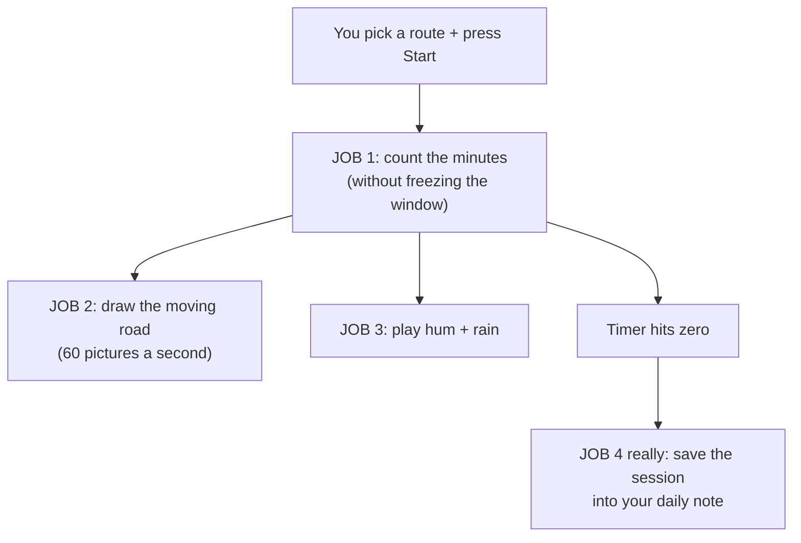
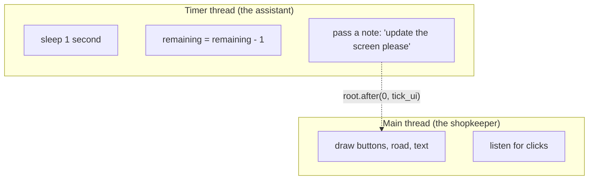
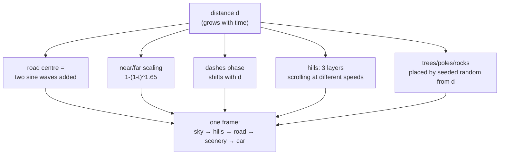
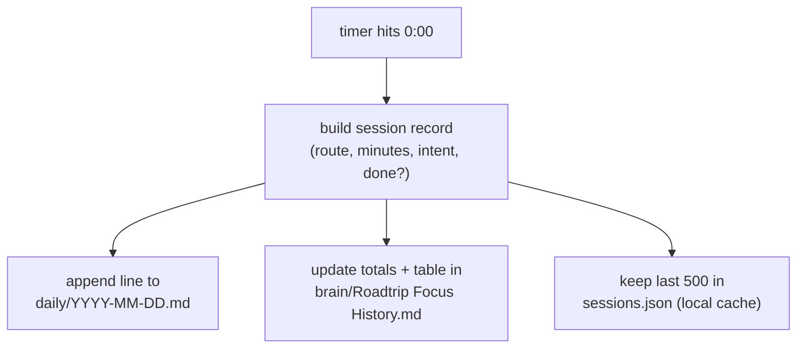

## For future agent
ELI5 explainer for Roadtrip Focus / **roadtrip-pomodoro** ([repo](https://github.com/Anirudh-2810/roadtrip-pomodoro)), written for the [[01-Areas/Engineering/nexus-robotics/INDEX|Nexus interview]] (2026-10-06). Reader knows Python basics, not GUI/threading/audio. Facts from [[00-Current-Projects/roadtrip-focus|roadtrip-focus]] (48 KB build log = source of truth for constants) and [[00-Current-Projects/quote-pomodoro|quote-pomodoro]] (predecessor, full 198-line source on file). Two builds exist: Tkinter desktop (`roadtrip_focus.py` + `sounds.py` + `sessions.py` + `vault_sync.py`) and Next.js 16 web production (closed 2026-09-06). This page explains the *desktop* build simply and maps each idea to its web twin. Repo not on this machine — no line numbers claimed.

# roadtrip-pomodoro — Explained Like You're Five

## 0. What it is, in one sentence

**A Pomodoro focus timer disguised as a night drive** — instead of watching numbers count down, you watch a little car cruise an endless winding road, with engine hum and rain sounds, and when the trip ends it writes the session into your notes automatically.

Why a road trip and not a plain timer: a bare countdown feels like waiting; a drive feels like *going somewhere*. Same minutes, completely different feeling. Routes are just durations with names: Coastal Hop 25 min, Desert Stretch 50, Mountain Pass 90, Cross-Country 120.

## 1. The big picture — three jobs



Four jobs, each simple alone. The interesting part is how they run *at the same time* without tripping over each other.

---

## 2. JOB 1 — counting without freezing (threads)

**The problem, kid version:** the app window and the timer share one worker (Tkinter's main thread). If that worker counts "1… 2… 3…" by sleeping, the window can't repaint, buttons can't be clicked — the whole app freezes for 25 minutes. Like a shopkeeper who stops serving customers to stare at the clock.

**The fix — hire a second worker (a thread):**



```python
import threading, time

threading.Thread(target=self.loop, daemon=True).start()  # hire the assistant

def loop(self):
    while self.is_running and self.remaining > 0:
        time.sleep(1)                 # assistant waits a second...
        if self.is_paused:
            continue                  # ...unless paused
        self.remaining -= 1           # ...then counts down
        self.root.after(0, self.tick_ui)  # passes a note, never touches the screen itself
```

Three things to understand, each one interview-worthy:

1. **`threading`** = hiring a second worker so two things happen at once. The timer counts over here, the window stays alive over there.
2. **`daemon=True`** = "this worker goes home when the shop closes." Without it, closing the window leaves the timer thread running invisibly and the program never actually quits.
3. **`root.after(0, tick_ui)`** = the golden rule: **only the main thread may touch the screen.** The timer thread is forbidden from drawing — it just slips a note (`tick_ui`) into the main thread's to-do list. Break this rule and Tkinter crashes randomly, the worst kind of bug.

**Say in the interview:** *"Tkinter is single-threaded, so the countdown runs on a daemon thread and marshals every screen update back through root.after. The worker thread never touches a widget — that's the rule that keeps it from crashing."*

Pause/resume falls out naturally: pausing just flips a flag the loop checks (`if paused: continue` — count nothing this second). Reset stops the loop and restores the route's minutes.

---

## 3. JOB 2 — drawing a road that never ends (canvas + maths)

**Kid version:** there are no pictures in this app. No road image, no car image, no hill image. Every frame, the program *computes* where every pixel goes from one number: **how far you've driven**. Because the world is a formula of distance, it can never run out — drive forever, road forever.



Piece by piece, simply:

- **Perspective** (`1-(1-t)^1.65`): far-away road squishes into few pixels, near road spreads wide. That single curve is what makes it look 3D instead of flat. (Exponent >1 = things grow faster as they approach you — exactly like real vision.)
- **Winding centre** (two sine waves added, e.g. a big slow S plus a small fast wiggle): at every distance, "where is the middle of the road?" A straight road is one sine with zero amplitude; a fun road is two sines. Re-seeded per trip so every drive curves differently.
- **Parallax hills** (3 layers, different speeds): far hills crawl, near hills rush. Your brain reads speed-difference as depth — same trick as looking out of a train window.
- **Dashes**: the centre-line dashes slide backwards with distance. Moving dashes = moving car, to your eyes, even though the car never moves. (The car sits fixed; the *world* flows past it.)
- **Scenery** (trees, poles, rocks): placed by seeded random numbers derived from distance, so the same trip always shows the same trees in the same spots — no storage needed,it's recomputed identically each frame.
- **60 fps smooth**: the timer ticks once per second but the road redraws ~60×/sec, interpolating between ticks through a spring so motion eases instead of stepping.

**`import tkinter`** is the whole drawing kit: `tk.Canvas` is a blank board you place rectangles, ovals, polygons and lines on, then wipe and re-place every frame. No game engine, no images.

**Say in the interview:** *"The entire scene is procedural — road centre from summed sines, perspective from a power curve, parallax hills at three speeds, seeded scenery. No assets means a tiny binary and identical behaviour on desktop and web, which is also why the Next.js port reused the same maths."*

---

## 4. JOB 3 — sound from maths (no audio files either)

Same philosophy as the road: **no sound files.** Four noise "beds" generated from formulas (white / pink / brown / rain) plus a low engine hum (55 + 110 Hz sine waves mixed in).

- **White noise** = pure static, every frequency equally loud (harsh).
- **Pink** = softer static, loudness falls as frequency rises.
- **Brown** = deep rumble, falls faster still — the default, because it's the least tiring over a 2-hour drive.
- **Rain** = pink + random droplet plinks.

`import numpy` does the number-crunching (build the 4-second stereo buffer once, loop it gaplessly). `import sounddevice` sends it to your speakers. `import winsound` (Windows built-in) plays the start/finish beeps — no install needed on Windows. `plyer` fires the Windows toast notification ("Journey complete").

**Graceful degradation**, simply: if numpy/sounddevice aren't installed, the app doesn't crash — the sound checkbox just disables itself and everything else works. Optional features must never be load-bearing.

**Say in the interview:** *"Audio is procedural too — noise beds generated with numpy, played through sounddevice, with a silent fallback if the libraries are missing. The default is brown noise because its low-frequency weight is least fatiguing over long sessions."*

---

## 5. JOB 4 — the session saves itself (vault sync)

When the timer ends, the app appends one line to today's daily note and updates a history note:



**The design decision that matters:** the app has **no database of its own**. The markdown vault *is* the database. A normal timer app keeps its own log file and your notes separately, and the two drift apart; here there is exactly one record, in files you already read. The local `sessions.json` is only a fast cache for the Trip Log window — cache, not truth.

**Say in the interview:** *"Persistence is append-to-markdown in my notes vault — one source of truth instead of an app database plus notes that drift. The local JSON is explicitly a cache for the log UI, not the record."*

---

## 6. The imports table — every library, why it's there

**Desktop (`roadtrip_focus.py` + helpers):**

| Import | What it is | Job in this app | If removed |
|---|---|---|---|
| `tkinter` (+`ttk`) | Python's built-in GUI kit | window, buttons, canvas road, progress bar | no app at all |
| `threading` | second workers | timer loop off the UI thread | frozen window |
| `time` | clocks | `sleep(1)` ticks, quote rotation timing | no counting |
| `numpy` | fast number arrays | builds the 4-sec audio buffer | silent mode (by design) |
| `sounddevice` | speaker output | plays the buffer in a loop | silent mode (by design) |
| `winsound` | Windows beep (stdlib) | start/finish beeps | no beeps on Windows |
| `plyer` | cross-platform notifications | Windows toast on arrival | no popup |
| `pywebview` | web-in-desktop bridge | `--web` mode reusing one codebase | desktop-only |

**Web production (Next.js 16, closed 2026-09-06):** same road maths in `RoadtripCanvas.tsx` (Canvas2D), same beds via Web Audio, sessions in Supabase with row-level security (`auth.uid() = user_id`), guests capped at 500 local with a claim flow, CSP nonce + CSRF double-submit + rate limiting. Tk build preserved as the offline reference.

**Say in the interview:** *"Desktop is tkinter plus a daemon-thread timer, procedural Canvas road, numpy-generated audio with silent fallback, and markdown persistence. The web port kept the same maths and moved sessions to Supabase with RLS."*

---

## 7. 60-second interview script

> "roadtrip-pomodoro is a focus timer disguised as a night drive — you pick a route length and watch a car cruise an endless road while you work, and it logs the session into my notes when you finish. Three things I'd point at. One, concurrency: Tkinter is single-threaded, so the countdown runs on a daemon thread and every screen update goes back through root.after — the worker never touches a widget. Two, everything is procedural: the road, hills, rain sounds, all computed from a distance number each frame, no image or audio files, which is also why the Next.js port reused the same maths. Three, there's no app database — sessions append straight into my markdown vault, one source of truth. The honest gap: I never benchmarked real-device frame timing."

Then stop. Let them ask.

## 8. Likely follow-ups

| They ask | You say |
|---|---|
| *Why two threads?* | "So the window stays alive while counting. Timer thread counts, main thread draws, root.after is the bridge." |
| *What does daemon=True do?* | "Thread dies with the program. Without it, closing the window leaves the timer running invisibly." |
| *Why no image files?* | "Procedural = tiny binary, infinite road, same code on desktop and web. Assets would need storing, loading, and licensing." |
| *How do the hills look 3D?* | "Parallax — three layers scrolling at different speeds. Plus a perspective curve so near road spreads wide." |
| *Where do sessions go?* | "Appended to the daily markdown note plus a history note. Local JSON is only a UI cache." |
| *Why Supabase + RLS on web?* | "Sessions become user data once there's login, so row-level security keeps users to their own rows; guests stay local with a claim flow." |
| *What breaks most often?* | "Threading bugs — touching widgets from the worker thread crashes randomly. The root.after discipline exists because of that class of bug." |

## 9. Provenance

AI-assisted across builds (owner-confirmed 2026-09-24). Your line: *"Built with AI assistance — the threading design, the procedural-world approach, and the vault-as-database decision are mine and I can walk through all of them."*

---

## See also

- [[00-Current-Projects/roadtrip-focus|Roadtrip Focus]] — the full 48 KB build log, source of truth for constants
- [[00-Current-Projects/quote-pomodoro|Quote Pomodoro]] — the predecessor (full source on file, same threading pattern)
- [[00-Current-Projects/projects/handsens101-eli5|handsens101 ELI5]] — the sibling story
- [[01-Areas/Programming/python-revision-eli5]] — threads, `import`, `with` (§5–8)
- Home: [[01-Areas/Engineering/nexus-robotics/INDEX]]
