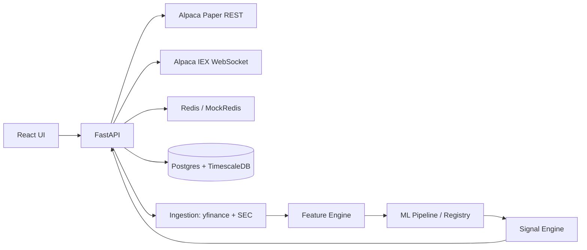

# Stock Agent — Overview & System Map

> **Deep-analysis module for the user-built trading app** at `C:\Users\Vijaykumar\stock-agent`. This module documents what the app is, how it is built, which functions actually work, where it fails, what it helps you do, and how it can become better. Built by reading the full codebase (backend + frontend + migrations + infra).

---

## What the app is

An **algorithmic trading platform** ("Stock Agent") that:

- Places **paper-trading** orders through **Alpaca** (live brokerage API in simulation mode)
- Shows **real-time quotes & positions** on a dashboard
- Generates **buy/hold/sell signals** from a weighted technical-score blend + ML probability
- Runs **backtests** (VectorBT) for SMA-cross, RSI mean-reversion, and ML-driven strategies
- Trains **ML models** (XGBoost / LightGBM) with walk-forward validation
- Ingests **market data** (yfinance OHLCV) + **SEC fundamentals** (EDGAR XBRL)
- Enforces **circuit breakers** (kill switch, rate limit, drawdown, position & sector limits)

| Layer | Stack |
|---|---|
| Backend API | FastAPI (async) |
| Data layer | PostgreSQL + TimescaleDB (hypertables) |
| Cache / state | Redis (with MockRedis fallback) |
| Broker | Alpaca Paper Trading (REST + IEX WebSocket) |
| ML | XGBoost, LightGBM, optional MLflow |
| Backtest | VectorBT (optional), custom walk-forward |
| Frontend | React 18 + TypeScript + Vite + Tailwind + Lightweight Charts + Zustand |
| Infra | Docker Compose, Railway deployment |

---

## Repository layout

| Path | Purpose |
|---|---|
| `backend/app/main.py` | FastAPI app factory, lifespan, router mounting |
| `backend/app/core/` | config (env), security (X-API-Key), database, redis |
| `backend/app/api/v1/` | routers: trading, backtest, signals, analysis, data_health, websocket |
| `backend/app/services/` | alpaca_rest, alpaca_ws, ws_manager, execution_guards, data_ingestion, yfinance_ingester, sec_parser, feature_engine, ml_features, ml_pipeline, xgboost_trainer, model_registry, signal_engine |
| `backend/app/models/__init__.py` | all SQLAlchemy models (inline) |
| `backend/app/schemas/__init__.py` | Pydantic request/response schemas |
| `backend/alembic/` | migrations: `001_initial.py` (hypertables), `002_point_in_time_features.py` |
| `frontend/src/` | App, pages (Overview/Signals/Analysis/BacktestLab/DataHealth/PaperTrading), components, hooks, store, api service |

---

## Data flow (happy path)

---

## Status at a glance (2026-08-21)

| Area | Verdict | Detail |
|---|---|---|
| Architecture | Strong | Clean layering, async API, graceful degradation everywhere |
| Paper execution | Works | Real Alpaca REST order placement |
| Live streaming | **Broken in this env** | Alpaca WS disabled on Python 3.14 (websockets incompat) → mock mode |
| Scheduler | Disabled | `start_scheduler()` commented out "Disabled for testing" |
| Signals | Works | Weighted technical blend + optional ML overlay |
| Backtest | Works | VectorBT strategies + walk-forward |
| ML pipeline | Works | XGBoost/LightGBM, registry, optional MLflow |
| Security | Weak | Single shared X-API-Key, WS auth via query param |
| Deployment | Partial | Docker Compose has no PostgreSQL service (external Neon expected) |

## CROSS-REFERENCES

- [[deep-review-report]] — **the full-depth audit** (strengths, ranked bugs with file:line, action plan) — start here for the report
- [[architecture]] — every service and how it fits
- [[functions-and-features]] — full inventory of what the app does
- [[what-works-and-fails]] — the honest scorecard
- [[value-and-standalone]] — what it helps you do, where it stands alone
- [[improvement-roadmap]] — prioritized path to make it better