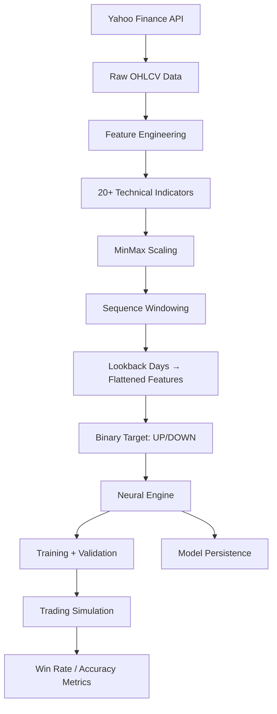

# Stock Predictor — S&P 500 Direction Forecasting

> **Source:** `Desktop/Anirudh/My apps/Neural net 2/stockmarketcode.py`
> **Dependencies:** `yfinance`, `pandas`, `sklearn.preprocessing.MinMaxScaler`, `matplotlib`, `numpy`, [[neural-engine]]
> **Default Ticker:** `SPY` (S&P 500 ETF) — configurable to any Yahoo Finance symbol

---

## For future agent
This is a **personal quant build** — a complete ML pipeline for predicting next-day stock direction (UP/DOWN) using technical indicators as features and the [[neural-engine]] as the classifier. Includes data fetching, feature engineering (20+ indicators), sequence windowing, training with validation, trading simulation, and model serialization. Cross-links: [[quant-finance/quant-toolkit-and-skills]], [[quant-finance/market-microstructure]], [[quant-finance/applications-of-quantitative-finance]].

---

## 1. Pipeline Architecture



---

## 2. Feature Engineering (20+ Indicators)

| Category | Indicators |
|----------|------------|
| **Price Returns** | `Returns`, `Log_Returns` |
| **Moving Averages** | `SMA_5`, `SMA_20`, `SMA_50`, `EMA_12`, `EMA_26` |
| **Momentum** | `MACD`, `MACD_Signal`, `RSI_14`, `Momentum_5`, `Momentum_10` |
| **Volatility** | `BB_Upper`, `BB_Middle`, `BB_Lower`, `BB_Width`, `Volatility_20`, `HL_Spread` |
| **Volume** | `Volume_SMA`, `Volume_Ratio` |
| **Target** | Next-day direction: `1` if `Close[t] > Close[t-1]` else `0` |

**Sequence Preparation:**
- Lookback window: `lookback_days` (default 30, configurable)
- Each sample: flattened sequence of `lookback_days × n_features`
- Target: binary next-day direction

---

## 3. Neural Network Architecture

```python
engine = NeuralEngine(
    learning_rate=0.001,
    optimizer='adam',
    l2_lambda=0.001,
    dropout_rate=0.2,
    early_stopping_patience=15
)

# Architecture for tabular time-series
engine.add_layer(128, 'relu', dropout=0.3)
engine.add_layer(64, 'relu', dropout=0.2)
engine.add_layer(32, 'relu', dropout=0.2)
engine.add_layer(16, 'relu')
engine.add_layer(1, 'sigmoid')  # Binary: UP=1, DOWN=0
```

**Total parameters:** ~15K (depends on feature count × lookback)

---

## 4. Usage

```python
from stockmarketcode import StockPredictor

# Quick start
predictor = StockPredictor(ticker='SPY', lookback_days=30)
predictor.train(epochs=150, batch_size=64, val_split=0.2)

# Predict tomorrow
prediction = predictor.predict_tomorrow()
# Output: Current Price, Direction (UP/DOWN), Confidence, Raw Score

# Save for production
predictor.save_model('spy_predictor.pkl')
```

**Output Example:**
```
🔮 PREDICTION FOR SPY
Current Price: $456.78
Prediction: 📈 UP
Confidence: 67.3%
Raw Score: 0.6734
```

---

## 5. Trading Simulation (Built-in Backtest)

After training, `simulate_trading()` runs a naive strategy:
- **Signal:** Predict UP → Buy (long), Predict DOWN → Hold/Flat
- **Metrics:** Win rate on BUY signals, win rate on SELL signals, overall strategy win rate

```python
# Called automatically in train()
# Output:
# BUY signals (predict UP): 1,247
#   Correct: 698 (55.9%)
# SELL signals (predict DOWN): 983
#   Correct: 512 (52.1%)
# Strategy Win Rate: 54.2%
# Total Trades: 1,247
```

---

## 6. Key Classes

### `StockPredictor`
| Method | Purpose |
|--------|---------|
| `fetch_data(period='2y')` | Download OHLCV from Yahoo Finance |
| `create_features(df)` | Compute 20+ technical indicators |
| `prepare_sequences(data)` | Windowing + scaling + binary target |
| `build_model(input_size)` | Construct NeuralEngine architecture |
| `train(epochs, batch_size, val_split)` | Full pipeline + trading sim + plots |
| `predict_tomorrow()` | Live inference on latest data |
| `save_model(filename)` | Persist trained engine + scaler |

---

## 7. Configuration Options

```python
StockPredictor(
    ticker='SPY',           # Any Yahoo Finance symbol: AAPL, GOOGL, TSLA, NVDA, BTC-USD
    lookback_days=30        # History window (10-60 typical)
)
```

**Training hyperparameters:**
- `epochs=150` (early stopping usually triggers ~50-80)
- `batch_size=64`
- `val_split=0.2` (chronological split, not random)

---

## 8. Cross-References

- [[neural-engine]] — Core ML engine (from-scratch NumPy)
- [[quant-finance/quant-toolkit-and-skills]] — ML for quant workflows
- [[quant-finance/market-microstructure]] — Market data considerations
- [[quant-finance/applications-of-quantitative-finance]] — Strategy deployment
- [[quant-finance/momentum-jegadeesh-titman]] — Momentum factor literature

---

## 9. Known Limitations / TODOs

- **Binary classification only** — no magnitude prediction (regression head)
- **Single ticker** — no multi-asset portfolio optimization
- **No transaction costs** in simulation (slippage, commissions)
- **Lookahead bias risk** — features use `Close` which is available at EOD; ensure `shift(1)` logic is correct
- **No regime detection** — model may degrade in bear markets / high vol
- **No walk-forward validation** — single train/val split

---

## See Also
- [[Neural net 2/neuralnet.py]] — Core engine source
- [[Neural net 2/xor_model.pkl]] — Demo model