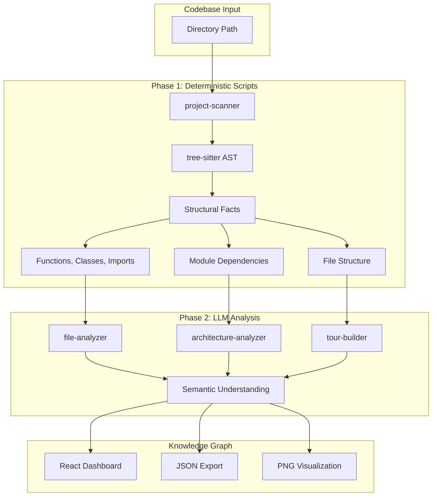
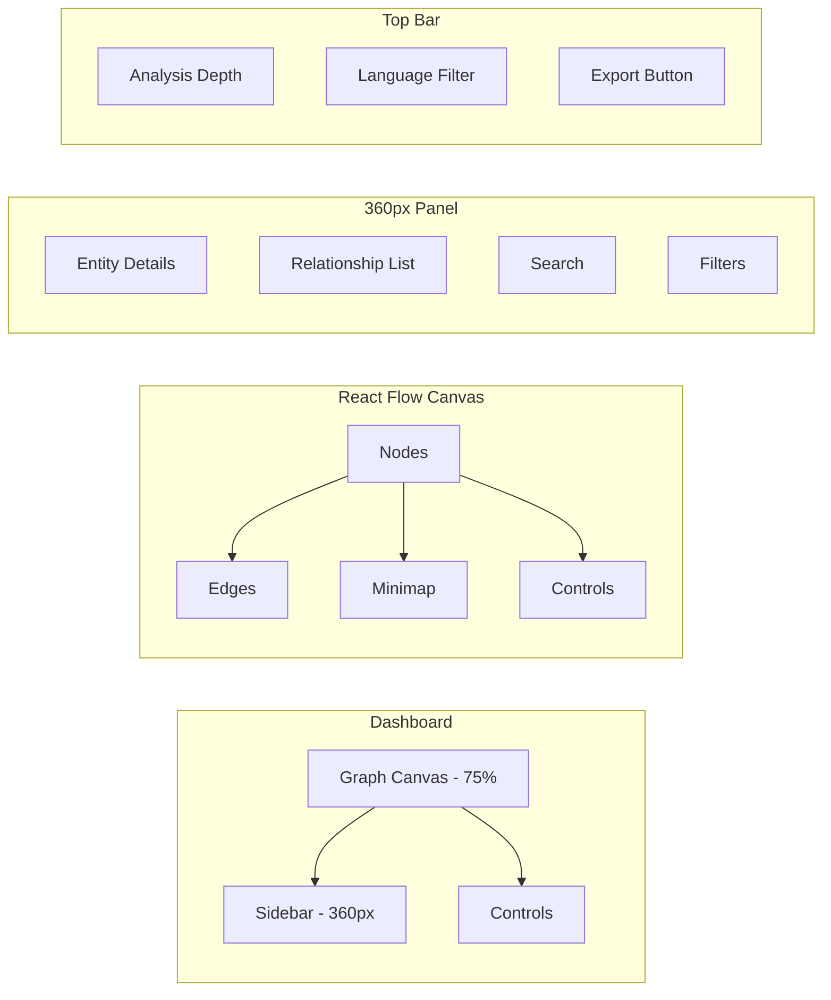

# Understand-Anything — Knowledge Graph Tool for Codebases

> **Source:** `C:\Users\Vijaykumar\Understand-Anything`
> **Stack:** pnpm workspaces, Node.js, tree-sitter, React 18, TypeScript, React Flow, Zustand, TailwindCSS v4
> **Architecture:** Plugin system (9 skills + 10 agents), deterministic + LLM two-phase pipeline
> **Output:** Interactive knowledge graph, PNG visualization, JSON export

---

## For future agent
This is an **understanding tool** — not just a codebase analyzer but a methodology for building agent-driven pipelines. Demonstrates: deterministic scripts + LLM hybrid analysis, skill/agent file structure (SKILL.md for skills, phase-based .md for agents), graph-first UI patterns, dark luxury design system, monorepo plugin architecture. Cross-links: [[wiki/01-Areas/AI-Data/agent-systems]], [[wiki/01-Areas/Programming/case-studies/cs-codebase-health]].

---

## 1. Architecture — Two-Phase Agent Pipeline

### Core Concept: Deterministic + LLM Hybrid
```
Phase 1 (Deterministic): tree-sitter AST parsing → structural facts
Phase 2 (LLM): semantic analysis → understanding
```

This is the key design insight: **don't send raw code to LLMs — extract structure first, then analyze semantics.**



---

## 2. Plugin Architecture — Skills + Agents

### Skills (SKILL.md files)
Skills are **structured prompts** that define a specific analysis capability:

```markdown
# understand

Analyze a codebase to produce an interactive knowledge graph.

## Inputs
- `path`: Directory path to analyze
- `depth`: Analysis depth (shallow/medium/deep)

## Process
1. Scan directory structure
2. Parse AST for each file
3. Extract entities and relationships
4. Generate knowledge graph

## Output
- Interactive dashboard
- JSON export
```

### Skills Catalog (9)
| Skill | Purpose |
|-------|---------|
| `understand` | Main knowledge graph generation |
| `understand-chat` | Ask questions about a codebase |
| `understand-dashboard` | Launch interactive visualization |
| `understand-diff` | Analyze git diffs/PRs |
| `understand-domain` | Extract business domain knowledge |
| `understand-explain` | Deep-dive file/function explanation |
| `understand-figma` | Figma design → knowledge graph |
| `understand-knowledge` | LLM wiki knowledge base analysis |
| `understand-onboard` | Generate onboarding guides |

### Agents (.md files)
Agents are **phase-based task decompositions** with explicit step sequences:

```markdown
# project-scanner

## Phase 1: Discovery
1. List all files in directory
2. Identify language by extension
3. Filter ignored patterns (.gitignore, node_modules)

## Phase 2: Structural Analysis
1. For each file, parse AST
2. Extract: functions, classes, imports, exports
3. Build dependency graph

## Phase 3: Aggregation
1. Count entities per file
2. Calculate complexity metrics
3. Output structural facts JSON
```

### Agents Catalog (10)
| Agent | Purpose |
|-------|---------|
| `project-scanner` | Initial directory scan + AST parsing |
| `file-analyzer` | Deep file-level analysis |
| `architecture-analyzer` | System architecture detection |
| `tour-builder` | Generate codebase tour |
| `graph-reviewer` | Review knowledge graph quality |
| `dependency-mapper` | Map module dependencies |
| `pattern-detector` | Detect design patterns |
| `security-scanner` | Identify security concerns |
| `performance-profiler` | Detect performance bottlenecks |
| `documentation-generator` | Auto-generate docs |

---

## 3. Dashboard — React + React Flow

### Design System (Dark Luxury Theme)
```css
:root {
  /* Background */
  --bg-primary: #0a0a0a;      /* Near-black */
  --bg-secondary: #111111;     /* Card backgrounds */
  --bg-tertiary: #1a1a1a;      /* Elevated surfaces */
  
  /* Accent */
  --accent-primary: #d4a574;   /* Gold/Amber */
  --accent-secondary: #b8956a; /* Muted gold */
  --accent-hover: #e0b68a;     /* Light gold */
  
  /* Text */
  --text-primary: #ffffff;
  --text-secondary: #a0a0a0;
  --text-muted: #666666;
  
  /* Borders */
  --border-subtle: #1f1f1f;
  --border-default: #333333;
  
  /* Node colors */
  --node-function: #4f46e5;    /* Indigo */
  --node-class: #059669;       /* Emerald */
  --node-module: #d97706;      /* Amber */
  --node-import: #7c3aed;      /* Violet */
}
```

### Dashboard Layout


### State Management (Zustand)
```typescript
interface KnowledgeStore {
  // Graph state
  nodes: Node[];
  edges: Edge[];
  selectedNode: Node | null;
  
  // Analysis state
  isAnalyzing: boolean;
  progress: number;
  error: string | null;
  
  // UI state
  sidebarOpen: boolean;
  searchQuery: string;
  filters: {
    languages: string[];
    entityTypes: string[];
    minComplexity: number;
  };
  
  // Actions
  setGraph: (nodes: Node[], edges: Edge[]) => void;
  selectNode: (node: Node | null) => void;
  analyzeCodebase: (path: string, depth: string) => Promise<void>;
  exportGraph: (format: 'json' | 'png') => void;
}
```

---

## 4. Data Flow — Complete Pipeline

```typescript
// 1. User provides directory path
const path = "/path/to/codebase";

// 2. project-scanner: deterministic scan
const scanner = new ProjectScanner(path);
const files = await scanner.scan();           // List all files
const asts = await scanner.parseAST(files);   // tree-sitter parsing
const facts = scanner.extractFacts(asts);     // Structural facts

// 3. architecture-analyzer: LLM analysis
const architect = new ArchitectureAnalyzer(facts);
const architecture = await architect.analyze();

// 4. file-analyzer: per-file LLM analysis
const analyzer = new FileAnalyzer(facts);
const analyses = await analyzer.analyzeAll();

// 5. graph-builder: construct knowledge graph
const graph = new GraphBuilder();
graph.addNodes(analyses);
graph.addEdges(architecture.dependencies);
const { nodes, edges } = graph.build();

// 6. Dashboard renders
<Dashboard nodes={nodes} edges={edges} />
```

---

## 5. Entity Types in Knowledge Graph

| Entity | Color | Description |
|--------|-------|-------------|
| **Function** | Indigo | Standalone functions |
| **Class** | Emerald | Classes with methods |
| **Module** | Amber | File-level modules |
| **Import** | Violet | External dependencies |
| **Interface** | Cyan | TypeScript interfaces |
| **Type** | Pink | Type definitions |
| **Constant** | Orange | Exported constants |

---

## 6. Key Design Patterns

### 1. Skill/Agent Separation
- **Skills** = What to do (structured prompts)
- **Agents** = How to do it (phase-based execution)

### 2. Deterministic + LLM Hybrid
- Phase 1: Fast, deterministic, no API costs
- Phase 2: Rich semantic analysis, API costs

### 3. Plugin Architecture
- Easy to add new skills/agents
- Each skill is self-contained SKILL.md
- Agents are composable phases

### 4. Graph-First UI
- 75% canvas, 360px sidebar
- React Flow for interactive visualization
- Zustand for state management

### 5. Dark Luxury Theme
- Near-black backgrounds (#0a0a0a)
- Gold/amber accents (#d4a574)
- High contrast text (#ffffff)

---

## 7. Supported Languages

| Language | Status | AST Parser |
|----------|--------|------------|
| Python | ✅ | tree-sitter-python |
| JavaScript | ✅ | tree-sitter-javascript |
| TypeScript | ✅ | tree-sitter-typescript |
| Go | ✅ | tree-sitter-go |
| Rust | ✅ | tree-sitter-rust |
| Java | 🔜 | tree-sitter-java |
| C++ | 🔜 | tree-sitter-cpp |

---

## 8. Export Formats

| Format | Contents | Use Case |
|--------|----------|----------|
| **JSON** | Complete knowledge graph | Import into other tools |
| **PNG** | Rendered visualization | Documentation, presentations |
| **HTML** | Interactive standalone | Sharing with team |
| **Markdown** | Textual tour | README generation |

---

## 9. Cross-References

- [[wiki/01-Areas/AI-Data/agent-systems]] — Multi-agent patterns
- [[wiki/01-Areas/Programming/case-studies/cs-codebase-health]] — Codebase analysis patterns
- [[wiki/01-Areas/Programming/web-development]] — React dashboard patterns
- [[wiki/00-Current-Projects/foundry-backup]] — Another full-stack build

---

## 10. Learnings for Our Vault

### What We Can Inculcate

1. **Deterministic + LLM Hybrid Pattern**
   - Don't send raw data to LLMs — extract structure first
   - Use tree-sitter for AST, regex for simple patterns
   - LLM for semantic understanding only

2. **Skill/Agent File Structure**
   - Skills: SKILL.md with Inputs/Process/Output
   - Agents: Phase-based .md with explicit steps
   - Easy to version control and iterate

3. **Graph-First UI**
   - 75% canvas for visualization
   - 360px sidebar for details
   - React Flow for interactive graphs

4. **Dark Luxury Theme**
   - Near-black backgrounds (#0a0a0a)
   - Gold/amber accents (#d4a574)
   - High contrast for readability

5. **Plugin Architecture**
   - Skills are self-contained
   - Agents are composable
   - Easy to extend

---

## See Also
- [[wiki/01-Areas/AI-Data/agent-systems]] — Multi-agent patterns
- [[wiki/01-Areas/Programming/case-studies/cs-codebase-health]] — Codebase analysis
- [[wiki/00-Current-Projects/foundry-backup]] — Full-stack startup platform