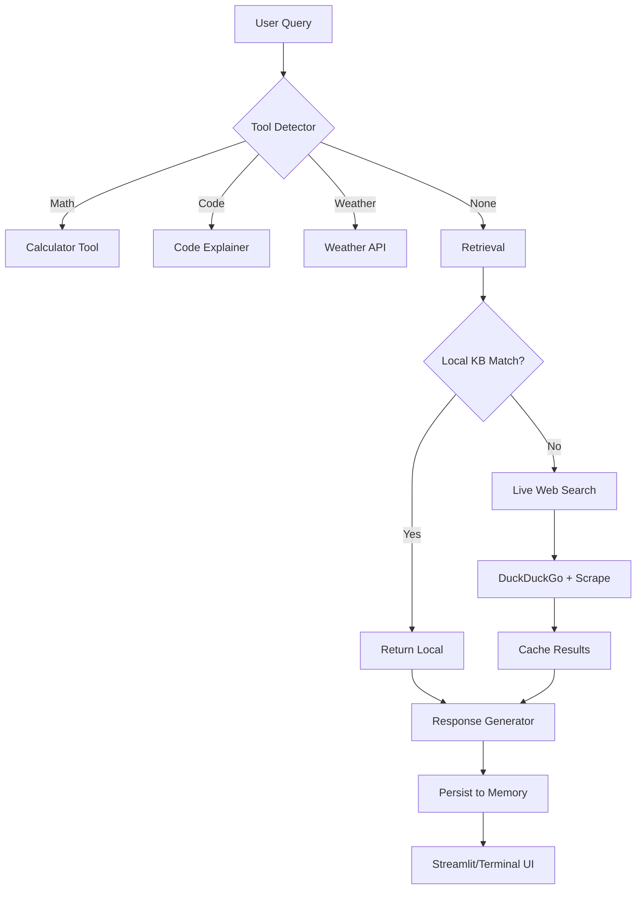

# Web-Access Super AI — Live Search + Tools + Memory Chatbot

> **Source:** `Desktop/Anirudh/My apps/AI/ai.py`
> **Stack:** `streamlit`, `duckduckgo-search`, `beautifulsoup4`, `requests`, `PyPDF2`, `nltk`
> **Modes:** Terminal (CLI) + Web (Streamlit)
> **Memory:** JSON file (`web_ai_memory.json`)

---

## For future agent
This is a **personal AI build** — a chatbot that automatically searches the live web when local knowledge is insufficient, with tool use (math, code, weather), PDF reading, and persistent memory. Demonstrates RAG + tool-use + web-search patterns without external LLM APIs (uses keyword matching + web search). Cross-links: [[wiki/01-Areas/AI-Data/]], [[wiki/00-Current-Projects/retrieval-agent]], [[wiki/01-Areas/Programming/learn-python-fast-system]].

---

## 1. Architecture



---

## 2. Core Components

### WebSearcher
- **Live search:** DuckDuckGo HTML scraping (no API key needed)
- **Caching:** In-memory query cache
- **URL scraping:** `requests` + `BeautifulSoup` (first 1000 chars)
- **PDF reading:** `PyPDF2` from URL (first 2 pages, 500 chars each)

### Tool System
| Tool | Trigger | Implementation |
|------|---------|----------------|
| **Calculator** | Regex: `\d+\s*[\+\-\*\/\(\)]\s*\d+` | Safe `eval` with `numpy` namespace |
| **Code Explainer** | Keywords: `def`, `import`, `for`, `if`, `class` | Keyword-to-explanation mapping |
| **Weather** | Keywords: "weather" + city names | OpenWeatherMap API (optional key) |

### Retrieval Strategy
1. **Local KB first** — keyword overlap with `LOCAL_KNOWLEDGE` (CBSE physics/chem/math, study tips)
2. **Web fallback** — automatic DuckDuckGo search when local overlap < 2 keywords
3. **Caching** — avoids repeat searches

### Memory Persistence
- **File:** `web_ai_memory.json`
- **Stores:** Web search history, conversation log
- **Auto-save:** After every interaction

---

## 3. Usage

### Web Mode (Streamlit)
```bash
pip install streamlit duckduckgo-search beautifulsoup4 requests PyPDF2 nltk
python ai.py --web
```
- Chat interface with sidebar (features, stats, Fiverr link)
- Streaming responses with spinner
- Session state preserves chat history

### Terminal Mode
```bash
python ai.py
```
```
🌐 WEB-ACCESS SUPER AI READY!
💬 Try: 'Latest CBSE exam dates 2026', 'Mumbai weather', '2+3*4', 'def hello()'
======================================================================

You: Latest CBSE dates 2026
🌐 Searching web for: 'Latest CBSE dates 2026'
AI: 📚 Sources:
• **CBSE Class 12 Date Sheet 2026 Released**: The Central Board... [link]
• **CBSE 2026 Exam Schedule**: Practical exams from Jan... [link]

🤖 Need more help? Ask specifically (chapter name, code error, math problem).
```

---

## 4. Configuration

```python
# Local knowledge base (extend as needed)
LOCAL_KNOWLEDGE = [
    "CBSE Class 12 Physics: Electrostatics, EMI, Optics, Modern Physics.",
    "Chemistry: Organic reactions SN1/SN2, Coordination compounds.",
    "Maths: Calculus, Vectors, Probability, Differential Equations.",
    "Study Tips: Pomodoro 25/5, PYQs 2015-2024, Active recall."
]

# Weather API (optional)
api_key = "YOUR_OPENWEATHERMAP_KEY"
```

---

## 5. Extending the System

### Add New Tool
```python
def my_tool(input_str):
    return f"Result: {process(input_str)}"

TOOLS["my_tool"] = my_tool

# Add detector
def detect_tool(self, query):
    if "my_trigger" in query.lower():
        return "my_tool", query
    # ... existing detectors
```

### Add Data Source
```python
# In WebSearcher
def search_arxiv(self, query):
    # Implement arXiv API search
    pass

# In retrieval
if "paper" in query or "arxiv" in query:
    return web_searcher.search_arxiv(query)
```

---

## 6. Cross-References

- [[wiki/00-Current-Projects/retrieval-agent]] — Production RAG with n8n + Supabase + pgvector
- [[wiki/01-Areas/AI-Data/]] — ML/AI theory, MLOps
- [[wiki/01-Areas/Programming/learn-python-fast-system]] — Python project structure
- [[wiki/01-Areas/Programming/SAAS_BUILD_NOTES]] — Streamlit deployment patterns

---

## 7. Known Limitations

- **No LLM** — uses keyword matching + web search, not generative AI
- **DuckDuckGo scraping** — may break if HTML changes; no official API
- **Single-threaded** — no async/concurrent searches
- **Memory grows unbounded** — no TTL/cleanup on `web_ai_memory.json`
- **PDF reading** — only first 2 pages, no OCR for scanned PDFs
- **Weather API** — requires OpenWeatherMap key (free tier available)

---

## 8. Roadmap

- [ ] Integrate local LLM (Ollama/Llama.cpp) for generation
- [ ] Add arXiv / PubMed / Wikipedia APIs
- [ ] Implement semantic search (embeddings + FAISS)
- [ ] Add conversation summarization
- [ ] Multi-user support with auth
- [ ] Deploy to Hugging Face Spaces / Streamlit Cloud

---

## See Also
- [[wiki/00-Current-Projects/retrieval-agent]] — Business brain RAG system
- [[wiki/01-Areas/Programming/SAAS_BUILD_NOTES]] — Full-stack deployment reference