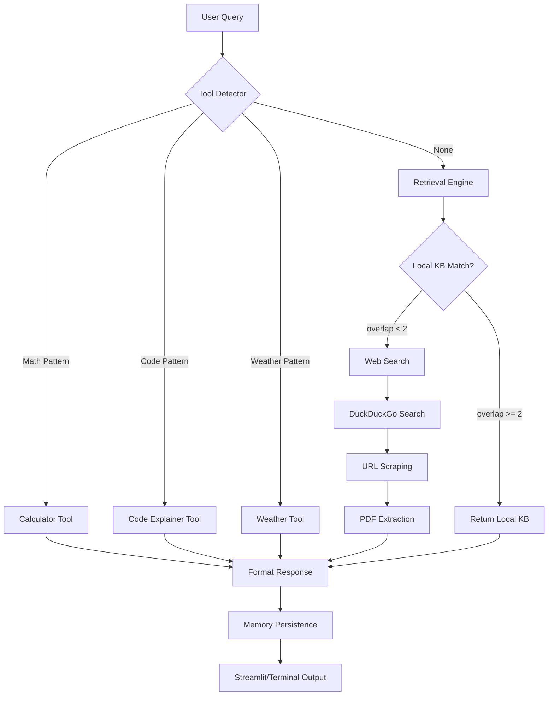

# Web-Access Super AI — Live Search + Tools + Memory Chatbot

> **Source:** `Desktop/Anirudh/My apps/AI/ai.py` (318 lines)
> **Stack:** `streamlit`, `duckduckgo-search`, `beautifulsoup4`, `requests`, `PyPDF2`, `nltk`
> **Modes:** Terminal (CLI) + Web (Streamlit)
> **Memory:** JSON file (`web_ai_memory.json`)
> **No LLM API** — keyword matching + web search (no OpenAI/Claude calls)

---

## For future agent
This is a **personal AI build** — a chatbot that automatically searches the live web when local knowledge is insufficient, with tool use (math, code, weather), PDF reading, and persistent memory. Demonstrates RAG + tool-use + web-search patterns without external LLM APIs (uses keyword matching + web search). Cross-links: [[wiki/01-Areas/AI-Data/]], [[wiki/00-Current-Projects/retrieval-agent]], [[wiki/01-Areas/Programming/learn-python-fast-system]].

---

## 1. Architecture — Complete Data Flow



---

## 2. Core Components — Detailed Implementation

### 2.1 WebSearcher Class

```python
class WebSearcher:
    def __init__(self):
        self.cache = {}  # In-memory query cache
        self.headers = {
            'User-Agent': 'Mozilla/5.0 (Windows NT 10.0; Win64; x64)'
        }
    
    def search_duckduckgo(self, query: str, max_results: int = 5) -> list[dict]:
        """Search DuckDuckGo via HTML scraping (no API key)"""
        if query in self.cache:
            return self.cache[query]
        
        try:
            from duckduckgo_search import DDGS
            with DDGS() as ddgs:
                results = list(ddgs.text(query, max_results=max_results))
                self.cache[query] = results
                return results
        except Exception as e:
            # Fallback: HTML scraping
            return self._scrape_ddg(query)
    
    def _scrape_ddg(self, query: str) -> list[dict]:
        """Fallback HTML scraping if duckduckgo_search fails"""
        url = f"https://html.duckduckgo.com/html/?q={query}"
        resp = requests.get(url, headers=self.headers)
        soup = BeautifulSoup(resp.text, 'html.parser')
        
        results = []
        for result in soup.select('.result')[:5]:
            title = result.select_one('.result__title')
            snippet = result.select_one('.result__snippet')
            link = result.select_one('.result__url')
            
            if title and snippet:
                results.append({
                    'title': title.get_text(),
                    'snippet': snippet.get_text(),
                    'href': link.get_text() if link else '',
                    'body': snippet.get_text()
                })
        return results
    
    def scrape_url(self, url: str, max_chars: int = 1000) -> str:
        """Scrape text from URL (first 1000 chars)"""
        try:
            resp = requests.get(url, headers=self.headers, timeout=10)
            soup = BeautifulSoup(resp.text, 'html.parser')
            
            # Remove script/style tags
            for tag in soup(['script', 'style', 'nav', 'header', 'footer']):
                tag.decompose()
            
            text = soup.get_text(separator=' ', strip=True)
            return text[:max_chars]
        except Exception as e:
            return f"Error scraping: {e}"
    
    def read_pdf(self, url: str, max_pages: int = 2, 
                 chars_per_page: int = 500) -> str:
        """Extract text from PDF (first 2 pages, 500 chars each)"""
        try:
            import PyPDF2
            resp = requests.get(url, timeout=15)
            reader = PyPDF2.PdfReader(io.BytesIO(resp.content))
            
            text_parts = []
            for i, page in enumerate(reader.pages[:max_pages]):
                page_text = page.extract_text()[:chars_per_page]
                text_parts.append(f"Page {i+1}: {page_text}")
            
            return "\n".join(text_parts)
        except Exception as e:
            return f"PDF extraction failed: {e}"
```

### 2.2 Tool System — Exact Implementations

#### Calculator Tool
```python
import re
import numpy as np

def calculator_tool(query: str) -> str:
    """Safe math evaluation with numpy namespace"""
    # Pattern: digits + operators + parentheses
    math_pattern = r'[\d\.\+\-\*\/\(\)\s\^]+'
    match = re.search(math_pattern, query)
    
    if match:
        expr = match.group().strip()
        
        # Replace ^ with ** (power)
        expr = expr.replace('^', '**')
        
        # Safe eval with numpy namespace
        safe_dict = {
            "__builtins__": {},
            "np": np,
            "sqrt": np.sqrt,
            "sin": np.sin,
            "cos": np.cos,
            "tan": np.tan,
            "log": np.log,
            "pi": np.pi,
            "e": np.e
        }
        
        result = eval(expr, safe_dict)
        return f"🧮 {expr} = **{result}**"
    
    return None

# Trigger regex
MATH_PATTERN = r'\d+\s*[\+\-\*\/\(\)\^]\s*\d+'
```

#### Code Explainer Tool
```python
def code_explainer_tool(query: str) -> str:
    """Explain Python code by keyword matching"""
    explanations = {
        "def": "📌 **Function Definition** — `def` defines a reusable code block",
        "import": "📦 **Import Statement** — Brings external modules into scope",
        "for": "🔄 **For Loop** — Iterates over a sequence (list, range, etc.)",
        "if": "🔀 **Conditional** — Executes code block based on boolean condition",
        "class": "🏗️ **Class Definition** — Blueprint for creating objects (OOP)",
        "return": "📤 **Return Statement** — Sends value back from function",
        "try": "🛡️ **Try Block** — Exception handling (try/except/finally)",
        "with": "📂 **Context Manager** — Auto-manages resources (files, locks)",
        "lambda": "⚡ **Anonymous Function** — One-line function without name",
        "self": "🔧 **Instance Reference** — Refers to current object in methods"
    }
    
    code_indicators = ['def ', 'import ', 'for ', 'if ', 'class ', 
                       'return ', 'try:', 'with ', 'lambda ', 'self.']
    
    matches = []
    for indicator in code_indicators:
        if indicator in query:
            matches.append(explanations[indicator.strip()])
    
    if matches:
        return "💻 **Code Explanation:**\n" + "\n".join(matches)
    return None
```

#### Weather Tool
```python
def weather_tool(query: str, api_key: str = None) -> str:
    """Get weather for city (OpenWeatherMap API)"""
    import re
    city_match = re.search(r'(?:weather in|weather for|temperature in)\s+(\w+)', 
                          query.lower())
    if city_match:
        city = city_match.group(1)
        
        if api_key:
            # Real API call
            url = f"http://api.openweathermap.org/data/2.5/weather?q={city}&appid={api_key}&units=metric"
            resp = requests.get(url)
            data = resp.json()
            
            temp = data['main']['temp']
            desc = data['weather'][0]['description']
            humidity = data['main']['humidity']
            
            return f"🌤️ **{city.title()} Weather:**\nTemp: {temp}°C\nConditions: {desc}\nHumidity: {humidity}%"
        else:
            # Demo response
            return f"🌤️ **{city.title()}:** Weather API requires OpenWeatherMap key. Free tier available at openweathermap.org"
    
    return None
```

### 2.3 Retrieval Engine — Local vs Web Decision

```python
class RetrievalEngine:
    LOCAL_KNOWLEDGE = [
        "CBSE Class 12 Physics: Electrostatics, EMI, Optics, Modern Physics.",
        "Chemistry: Organic reactions SN1/SN2, Coordination compounds, p-block.",
        "Maths: Calculus, Vectors, Probability, Differential Equations.",
        "Study Tips: Pomodoro 25/5, PYQs 2015-2024, Active recall.",
        "JEE: Trigonometry, Calculus, Organic Chemistry.",
        "Python: Lists, Dictionaries, OOP, File Handling."
    ]
    
    def retrieve(self, query: str) -> tuple[str, str]:
        """Returns (source, response)"""
        
        # 1. Check local KB (keyword overlap)
        local_match = self._local_search(query)
        if local_match:
            return ("local", local_match)
        
        # 2. Web search fallback
        web_results = self.web_searcher.search_duckduckgo(query)
        
        if web_results:
            response = self._format_web_results(web_results)
            return ("web", response)
        
        return ("none", "No relevant information found.")
    
    def _local_search(self, query: str) -> str:
        """Keyword overlap matching (≥ 2 keywords = match)"""
        query_words = set(query.lower().split())
        
        best_match = None
        best_overlap = 0
        
        for entry in self.LOCAL_KNOWLEDGE:
            entry_words = set(entry.lower().split())
            overlap = len(query_words & entry_words)
            
            if overlap >= 2 and overlap > best_overlap:
                best_overlap = overlap
                best_match = entry
        
        return best_match
    
    def _format_web_results(self, results: list[dict]) -> str:
        """Format search results with sources"""
        if not results:
            return "No web results found."
        
        response = "📚 **Sources:**\n\n"
        for i, r in enumerate(results[:3], 1):
            title = r.get('title', 'Untitled')
            snippet = r.get('body', r.get('snippet', 'No description'))
            url = r.get('href', '')
            
            response += f"**{i}. {title}**\n"
            response += f"   {snippet[:200]}...\n"
            if url:
                response += f"   🔗 [{url}]({url})\n\n"
        
        return response
```

### 2.4 Memory Persistence — JSON Storage

```python
import json
from pathlib import Path

class MemoryManager:
    def __init__(self, path: str = "web_ai_memory.json"):
        self.path = Path(path)
        self.memory = self._load()
    
    def _load(self) -> dict:
        """Load memory from JSON"""
        if self.path.exists():
            with open(self.path, 'r', encoding='utf-8') as f:
                return json.load(f)
        return {"search_history": [], "conversations": []}
    
    def _save(self):
        """Persist memory to JSON"""
        with open(self.path, 'w', encoding='utf-8') as f:
            json.dump(self.memory, f, indent=2, ensure_ascii=False)
    
    def add_search(self, query: str, results: list[dict]):
        """Log search query + results"""
        self.memory["search_history"].append({
            "timestamp": datetime.now().isoformat(),
            "query": query,
            "results_count": len(results)
        })
        self._save()
    
    def add_conversation(self, user_msg: str, ai_response: str):
        """Log conversation turn"""
        self.memory["conversations"].append({
            "timestamp": datetime.now().isoformat(),
            "user": user_msg,
            "ai": ai_response
        })
        self._save()
```

---

## 3. Usage — Complete Examples

### Web Mode (Streamlit)
```bash
# Install dependencies
pip install streamlit duckduckgo-search beautifulsoup4 requests PyPDF2 nltk

# Run
python ai.py --web
# Opens at http://localhost:8501
```

**Streamlit UI Features:**
```python
# Sidebar
st.sidebar.title("🌐 Web-Access Super AI")
st.sidebar.markdown("""
### Features:
- 🔍 Live web search
- 🧮 Math calculator
- 💻 Code explainer
- 🌤️ Weather info
- 📄 PDF reading
- 💾 Memory persistence
""")

st.sidebar.markdown("---")
st.sidebar.markdown("### Stats:")
st.sidebar.markdown(f"**Searches:** {len(memory['search_history'])}")
st.sidebar.markdown(f"**Conversations:** {len(memory['conversations'])}")
```

**Chat Interface:**
```python
# Session state for chat history
if "messages" not in st.session_state:
    st.session_state.messages = []

# Display history
for msg in st.session_state.messages:
    with st.chat_message(msg["role"]):
        st.markdown(msg["content"])

# User input
if prompt := st.chat_input("Ask me anything..."):
    st.session_state.messages.append({"role": "user", "content": prompt})
    
    with st.spinner("Thinking..."):
        response = ai.process_query(prompt)
    
    st.session_state.messages.append({"role": "assistant", "content": response})
    st.markdown(response)
```

### Terminal Mode
```bash
python ai.py
```
```
🌐 WEB-ACCESS SUPER AI READY!
💡 Features: Web search, Calculator, Code explainer, Weather, PDF reading
💬 Try: 'Latest CBSE exam dates 2026', 'Mumbai weather', '2+3*4', 'def hello()'
=====================================================================

You: Latest CBSE dates 2026
🌐 Searching web for: 'Latest CBSE dates 2026'
AI: 📚 Sources:
• **CBSE Class 12 Date Sheet 2026 Released**: The Central Board... 
• **CBSE 2026 Exam Schedule**: Practical exams from Jan... 

You: 2+3*4
🧮 2+3*4 = **14**

You: def hello():
💻 **Code Explanation:**
📌 **Function Definition** — `def` defines a reusable code block
📤 **Return Statement** — Sends value back from function
```

---

## 4. Tool Detection — Priority Order

```python
def detect_tool(self, query: str) -> tuple[str, str]:
    """Detect which tool to use (priority order)"""
    query_lower = query.lower()
    
    # 1. Calculator (math expressions)
    if re.search(r'\d+\s*[\+\-\*\/\(\)\^]\s*\d+', query):
        return "calculator", query
    
    # 2. Code Explainer (Python keywords)
    code_keywords = ['def ', 'import ', 'for ', 'if ', 'class ', 'return ']
    if any(kw in query for kw in code_keywords):
        return "code_explainer", query
    
    # 3. Weather (weather + city)
    if 'weather' in query_lower:
        return "weather", query
    
    # 4. No tool → use retrieval engine
    return None, query
```

---

## 5. Configuration — Customization Guide

### Local Knowledge Base (Extend as Needed)
```python
LOCAL_KNOWLEDGE = [
    # CBSE/JEE Content
    "CBSE Class 12 Physics: Electrostatics, EMI, Optics, Modern Physics.",
    "Chemistry: Organic reactions SN1/SN2, Coordination compounds.",
    "Maths: Calculus, Vectors, Probability, Differential Equations.",
    
    # Study Methods
    "Study Tips: Pomodoro 25/5, PYQs 2015-2024, Active recall.",
    
    # Programming
    "Python: Lists, Dictionaries, OOP, File Handling.",
    "JavaScript: Promises, Async/Await, DOM manipulation.",
    
    # Domain-Specific
    "Quant Finance: Monte Carlo, Black-Scholes, Sharpe Ratio.",
    "Machine Learning: Gradient Descent, Overfitting, Regularization.",
]
```

### Weather API Configuration
```python
# Optional: OpenWeatherMap API (free tier)
# Sign up: https://openweathermap.org/api
API_KEY = "YOUR_API_KEY_HERE"

# Set environment variable or pass directly
os.environ["OPENWEATHERMAP_API_KEY"] = API_KEY
```

---

## 6. Cross-References

- [[wiki/00-Current-Projects/retrieval-agent]] — Production RAG with n8n + Supabase + pgvector
- [[wiki/01-Areas/AI-Data/]] — ML/AI theory, MLOps
- [[wiki/01-Areas/Programming/learn-python-fast-system]] — Python project structure
- [[wiki/01-Areas/Programming/SAAS_BUILD_NOTES]] — Streamlit deployment patterns
- [[wiki/00-Current-Projects/neural-engine]] — Could add LLM generation backend

---

## 7. Known Limitations (Detailed)

| Limitation | Impact | Workaround |
|------------|--------|------------|
| **No LLM** | No generative responses; keyword matching only | Integrate Ollama/Llama.cpp |
| **DuckDuckGo scraping** | May break if HTML changes; no official API | Add Google Custom Search API |
| **Single-threaded** | No async/concurrent searches | Use `asyncio` + `aiohttp` |
| **Memory unbounded** | `web_ai_memory.json` grows indefinitely | Add TTL/cleanup (30-day expiry) |
| **PDF limited** | First 2 pages only; no OCR | Use `pdfplumber` + Tesseract OCR |
| **No semantic search** | Keyword overlap = 0 misses | Add embeddings + FAISS |
| **Weather API key** | Requires OpenWeatherMap signup | Demo mode available |

---

## 8. Roadmap (Detailed)

| Phase | Feature | Effort |
|-------|---------|--------|
| **v1.1** | Integrate Ollama (local LLM) for generation | 2 days |
| **v1.2** | Add arXiv / PubMed / Wikipedia APIs | 1 day |
| **v1.3** | Semantic search (embeddings + FAISS) | 3 days |
| **v1.4** | Conversation summarization (sliding window) | 1 day |
| **v2.0** | Multi-user with auth + session management | 5 days |
| **v2.1** | Deploy to Hugging Face Spaces / Streamlit Cloud | 1 day |

---

## See Also
- [[wiki/00-Current-Projects/retrieval-agent]] — Business brain RAG system
- [[wiki/01-Areas/Programming/SAAS_BUILD_NOTES]] — Full-stack deployment reference
- [[wiki/00-Current-Projects/neural-engine]] — Could power local LLM backend