# AI MASTER NOTES — Complete Artificial Intelligence in One Shot

> **Source:** *Complete AI Artificial Intelligence in One Shot (5 Hours)* — 5 Minutes Engineering (Shridhar Mankar)
> **Video:** https://www.youtube.com/watch?v=y39OlGrVFD8
> **Playlist:** https://www.youtube.com/watch?v=y39OlGrVFD8&list=PLYwpaL_SFmcBmfMtX5wRMAtqna7pY-YtG
> **Language:** Hindi (terminology retained in English)
> **Scope:** Covers ~90–95% of the core AI syllabus for Indian engineering universities (AKTU, SPPU, MU, VTU, etc.)

---

## Syllabus at a Glance (as covered in the video)

1. Introduction
2. Intelligent Agents
3. Fuzzy Logic
4. Problem Solving
5. Game Playing
6. Knowledge Representation
7. Planning
8. NLP
9. Neural Network
10. Genetic Algorithm

These map to the **6 Master Modules** below:

| Master Module | Video Sections Covered |
|---|---|
| Module 1 | Introduction, Intelligent Agents |
| Module 2 | Problem Solving, Game Playing |
| Module 3 | Knowledge Representation, NLP |
| Module 4 | Fuzzy Logic |
| Module 5 | Planning, Neural Network |
| Module 6 | Genetic Algorithm |

---

# MODULE 1 — AI Foundations, Agent Architecture & PEAS

---

## 1.1 Definitions & Scope of AI

### 1.1.1 What is Artificial Intelligence?

**Definition:** Artificial Intelligence (AI) is the branch of computer science that aims to build machines ("agents") capable of performing tasks that normally require human intelligence — reasoning, learning, perception, problem solving, language understanding, and decision making.

**Classic textbook definitions (Rich & Knight; Russell & Norvig):**

- **"AI is the study of how to make computers do things which, at present, people do better."** — Elaine Rich
- **"AI is concerned with the intelligent behaviour in artifacts."**
- **"The science and engineering of making intelligent machines, especially intelligent computer programs."** — John McCarthy (father of AI)

### 1.1.2 AI vs. Human (Natural) Intelligence

| Aspect | Human Intelligence | Artificial Intelligence |
|---|---|---|
| Origin | Natural (biological brain) | Man-made (programs/hardware) |
| Learning | From experience, slow, holistic | From data, fast, task-specific |
| Creativity | High, unconstrained | Limited, follows training |
| Adaptability | Easily adapts to new situations | Needs retraining/retuning |
| Energy/Storage | ~20 watts, huge associative memory | Energy-hungry, explicit storage |
| Error | Prone to fatigue/bias | Consistent (within trained scope) |
| Parallelism | Massive parallel processing | Limited by hardware |
| Consciousness | Self-aware | None (currently) |

**Key idea from the video:** AI mimics human cognitive functions (thinking, learning, understanding, deciding) but is engineered for **speed, scalability, and consistency** rather than true consciousness.

### 1.1.3 Types of AI by Capability

1. **Narrow AI (Weak AI / ANI):** Specialized in one task. Examples: spam filters, speech recognition (Siri/Alexa), chess engines, recommendation systems, ChatGPT-style language models. — *All AI in use today is Narrow AI.*
2. **General AI (Strong AI / AGI):** Can perform any intellectual task a human can — reasoning, learning, planning across domains. *Not yet achieved.*
3. **Super AI (ASI):** AI that surpasses human intelligence in all aspects (creativity, wisdom, social skills). *Hypothetical / future.*

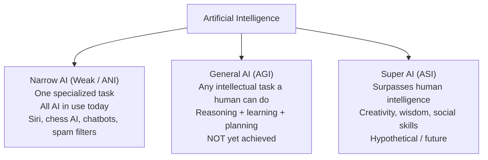

### 1.1.4 Types of AI by Functionality (Russell–Norvig classification)

- **Reactive Machines:** No memory, react to current input only. Example: IBM **Deep Blue** (chess).
- **Limited Memory:** Uses past data temporarily for decisions. Examples: **self-driving cars**, recommendation systems.
- **Theory of Mind:** Understands others' beliefs, emotions, intentions. *Research stage.*
- **Self-Aware:** AI with consciousness/self-awareness. *Fictional stage.*

**Progression of AI by functionality:**

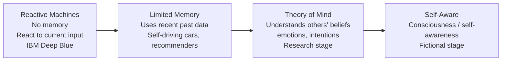

---

## 1.2 Hierarchy & Intersecting Fields: AI ⊇ ML ⊇ DL

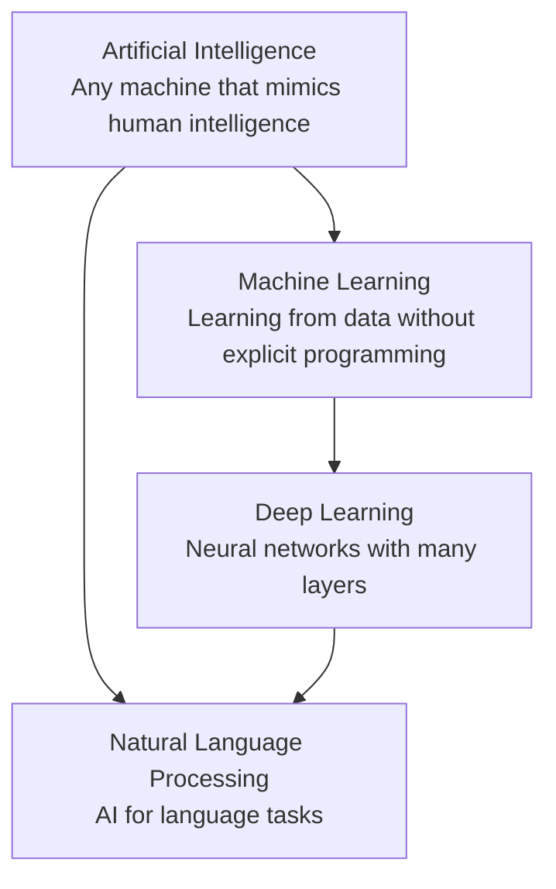

### 1.2.1 Artificial Intelligence (AI)
The umbrella discipline. Any technique that lets machines mimic human intelligence (rules, search, logic, fuzzy systems, expert systems, ML, etc.).

### 1.2.2 Machine Learning (ML)
A **subset of AI**: algorithms that **learn patterns from data** and improve with experience, *without being explicitly programmed* for every rule.

- Supervised learning (labelled data)
- Unsupervised learning (unlabelled data)
- Reinforcement learning (reward/penalty)

### 1.2.3 Deep Learning (DL)
A **subset of ML** using **Artificial Neural Networks with many hidden layers** to automatically learn hierarchical feature representations (from raw pixels/audio/text to concepts).

**Why "deep"?** Because of the *depth* (number of layers) of the network. Example: image recognition, speech recognition.

### 1.2.4 Natural Language Processing (NLP)
A field where AI is applied to **human language** — understanding, generating, translating, and responding in natural language.

- Components: morphology, syntax (grammar), semantics (meaning), pragmatics (context), discourse.
- Applications: machine translation, chatbots, sentiment analysis, text summarization, speech recognition.

### 1.2.5 Comparison Table: AI vs ML vs DL vs NLP

| Feature | AI | ML | DL | NLP |
|---|---|---|---|---|
| Scope | Broadest | Subset of AI | Subset of ML | Application of AI |
| Core idea | Mimic intelligence | Learn from data | Deep neural nets | Understand language |
| Need for rules | Yes (can use rules) | No (learns rules) | No (auto feature extraction) | Hybrid |
| Feature engineering | Sometimes | Manual | Automatic | Mostly manual + DL |
| Example | Chatbot | Spam classifier | AlexNet image model | Google Translate |

---

## 1.3 Agent Architecture: Agent, Environment, Sensor, Actuator

### 1.3.1 Definitions

- **Agent:** Anything that perceives its environment through **sensors** and acts upon that environment through **actuators**.
- **Percept:** The agent's perceptual input at any given instant — `percept(t)`.
- **Percept Sequence:** The complete history of everything the agent has perceived — `[percept(1), percept(2), ..., percept(t)]`.
- **Agent Function:** Maps every possible percept sequence to an action — `f : P* → A`.
- **Rational Agent:** For each percept sequence, performs the action that **maximizes its expected performance measure** given its built-in knowledge and the percept history.
- **Environment:** Everything the agent can perceive and interact with.
- **Sensor:** Device by which the agent perceives the environment (camera, microphone, LIDAR, thermometer).
- **Actuator:** Device by which the agent acts (wheels, robotic arm, speaker, display).

### 1.3.2 The Agent–Environment Loop

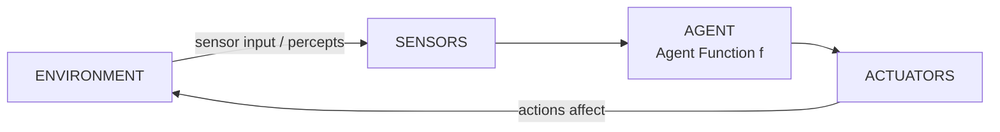

**Text loop:** Sense → Perceive → Think (Agent Function) → Act → Observe new state → Repeat.

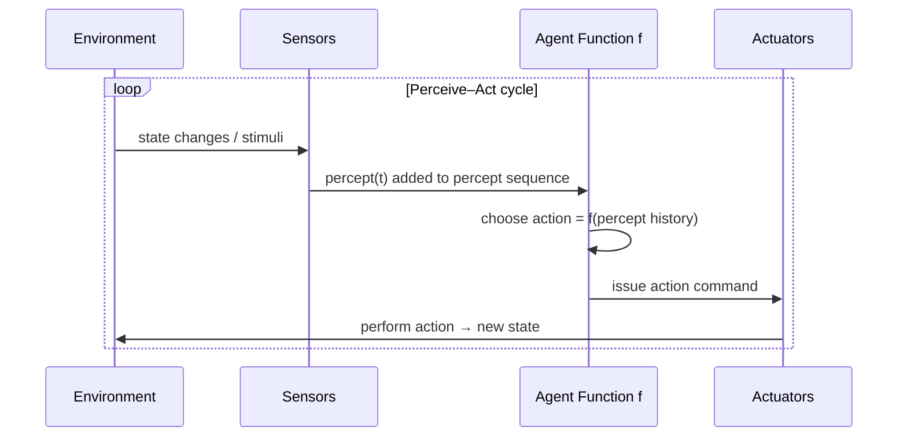

### 1.3.3 Agent Performance

- A rational agent's success is measured against a **Performance Measure** (not just whether it achieves the goal, but *how well* — speed, safety, cost, resource usage).
- **Rationality = "doing the right thing"** given what is known; it does *not* require omniscience or perfect performance.

---

## 1.4 PEAS Framework

**PEAS** is the structured way to specify the design of an intelligent agent.

| Letter | Stands for | Meaning |
|---|---|---|
| P | **P**erformance Measure | Criterion to judge agent success |
| E | **E**nvironment | The world the agent operates in |
| A | **A**ctuators | Ways the agent affects the environment |
| S | **S**ensors | Ways the agent perceives the environment |

### 1.4.1 PEAS Table for Standard Examples

#### Automated (Self-Driving) Car

| Component | Description |
|---|---|
| **Performance Measure** | Safety, time to destination, legality, passenger comfort, fuel efficiency |
| **Environment** | Roads, traffic, pedestrians, weather, signs, other vehicles |
| **Actuators** | Steering, accelerator, brake, horn, signals/indicators, display |
| **Sensors** | Cameras, LIDAR, RADAR, GPS, speedometer, odometer, ultrasonic sensors |

#### Medical Diagnosis Agent

| Component | Description |
|---|---|
| **Performance Measure** | Correct diagnosis, minimal cost/harm to patient, speed |
| **Environment** | Patient, hospital records, lab tests, symptoms |
| **Actuators** | Display of diagnosis, printout, alerts, medication recommendation |
| **Sensors** | Keyboard (symptoms entered), medical tests, patient history files |

#### Vacuum-Cleaning Robot

| Component | Description |
|---|---|
| **Performance Measure** | Amount of dirt cleaned, area covered, energy used, time |
| **Environment** | Room (table, chairs, dirt), walls, obstacles |
| **Actuators** | Wheels, vacuum motor/brush |
| **Sensors** | Dirt sensor, bump/obstacle sensor, position sensor, camera |

#### Part-Picking Robot (Factory Robot)

| Component | Description |
|---|---|
| **Performance Measure** | Number of parts correctly picked, placement accuracy, speed |
| **Environment** | Conveyor belt, bins, parts of various shapes, obstacles |
| **Actuators** | Robotic arm joints, gripper |
| **Sensors** | Camera, force/torque sensors, joint position sensors, proximity sensors |

**Rule of thumb:** Design an agent by first fixing the **Performance Measure**, then the **Environment**, then the **Actuators** and **Sensors** (P → E → A → S).

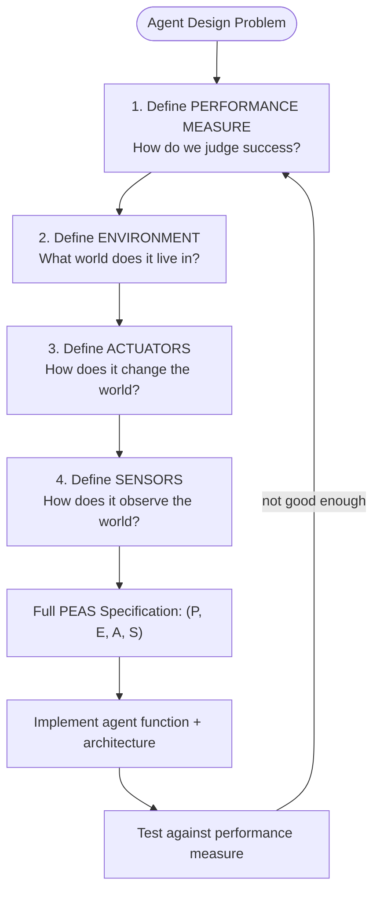

---

## 1.5 Agent Types (Five Basic Types)

### 1.5.1 Simple Reflex Agent

- Acts **only on the current percept**, ignoring history.
- Uses condition–action rules: *IF (condition on percept) THEN (action)*.

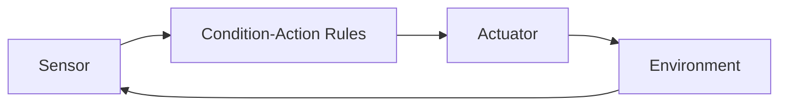

**Example:** A vacuum cleaner that vacuums only when the dirt sensor fires.
**Limitation:** Can get stuck in infinite loops (e.g., vibrating between two states).

### 1.5.2 Model-Based (Reflex) Agent

- Keeps an **internal model** of the "how the world evolves" and "how its own actions affect the world".
- Tracks the **unseen** parts of the world to choose better actions.

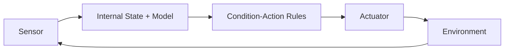

**Example:** A robot that remembers the room layout and dirt locations.

### 1.5.3 Goal-Based Agent

- Keeps an internal state **plus a Goal** (desired state).
- Uses **search and planning** to find a sequence of actions that achieves the goal.

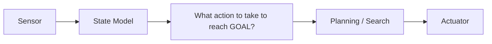

**Example:** Route-finder (navigate from A to B), GPS navigation.

### 1.5.4 Utility-Based Agent

- Keeps a **Utility Function** that scores how "happy" the agent is in each state.
- Chooses the action maximizing **expected utility**, resolving trade-offs between competing goals.

$$Action^* = \arg\max_a \sum_{s'} P(s' | a, s)\; U(s')$$

**Example:** Taxi that weighs time vs. comfort vs. safety.

### 1.5.5 Learning Agent

- **Improves itself** from experience using a **Learning Element** (improves agent function), a **Performance Element** (selects actions), a **Critic** (feedback on how well it did), and a **Problem Generator** (suggests exploratory actions).

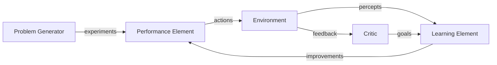

**Example:** Spam filter that improves as you flag more emails; AlphaGo.

### 1.5.6 Comparison Table: Agent Types

| Agent Type | Uses Percept History | Internal State Model | Goal | Utility | Learns |
|---|---|---|---|---|---|
| Simple Reflex | No | No | No | No | No |
| Model-Based Reflex | Yes | Yes | No | No | No |
| Goal-Based | Yes | Yes | Yes | No | No |
| Utility-Based | Yes | Yes | Yes | Yes | No |
| Learning | Yes | Yes | Yes | Optional | Yes |

### 1.5.7 Choosing an Agent Architecture

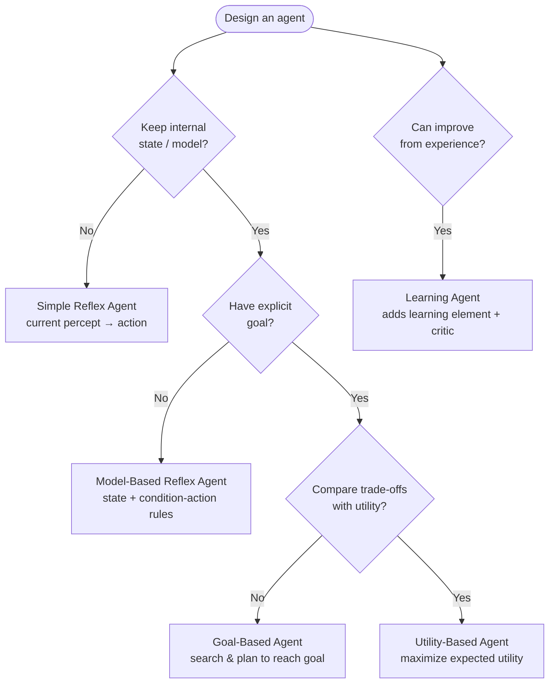

---

# MODULE 2 — Problem Solving, State Space & Search Algorithms

---

## 2.1 Problem Formulation

A search problem is defined by **5 components**:

| Component | Definition | Example (Route finding city A → B) |
|---|---|---|
| **State Space** | Set of all reachable states | All cities in the graph |
| **Initial State** | Starting state of the agent | City A |
| **Actions (Transition Model)** | Available actions & their results: `Result(s, a) = s'` | Drive from city X to city Y |
| **Goal Test** | Predicate checking whether a state is the goal | "Am I in city B?" |
| **Path Cost** | Cost of a path (sum of step costs) | Distance in km |

**Solution:** A sequence of actions that leads from the initial state to a goal state. **Optimal solution:** a solution with the lowest path cost.

### Search Tree vs State Space Graph

- **State space** = graph of all states with edges = actions.
- **Search tree** = the tree generated during search, with nodes = states and branches = actions; one state may appear many times (as different paths).

### General Tree Search Algorithm (Pseudo-code)

```
function TREE-SEARCH(problem):
    frontier = { InitialState }
    loop:
        if frontier is empty: return failure
        node = remove a node from frontier (per strategy)
        if GOAL-TEST(node.state): return SOLUTION(node)
        frontier = frontier ∪ EXPAND(node)   // apply all actions, create children
```

- **Fringe/Frontier:** nodes waiting to be expanded.
- **Explored set:** states already expanded (used to avoid re-expansion).

```mermaid
graph TD
    Start([Start]) --> Q{Is frontier empty?}
    Q -->|Yes| Fail[Return FAILURE]
    Q -->|No| R[Remove node from frontier<br/>according to search strategy]
    R --> G{GOAL-TEST node.state}
    G -->|Yes| Sol[Return SOLUTION path]
    G -->|No| Ex[Expand node:<br/>generate all child states]
    Ex --> Ad[Add children to frontier]
    Ad --> Q
```

---

## 2.2 Uninformed (Blind) Search Algorithms

*No information about the goal except the goal test itself.*

### 2.2.1 Breadth-First Search (BFS)

- Expands nodes **level by level** (FIFO queue).
- **Complete:** Yes (if branching factor is finite).
- **Optimal:** Yes, if all step costs are equal.
- **Time:** $O(b^d)$ — where $b$ = branching factor, $d$ = depth of shallowest goal.
- **Space:** $O(b^d)$ (stores the entire frontier — its biggest drawback).

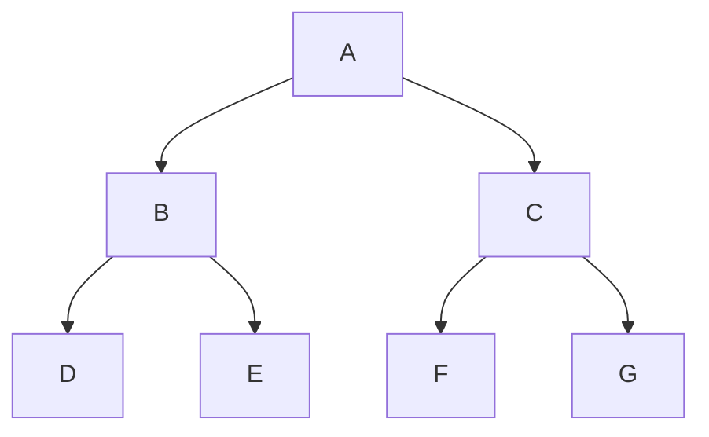

*BFS expands A, then B & C, then D, E, F, G.*

### 2.2.2 Depth-First Search (DFS)

- Expands the **deepest** node first (LIFO stack); backtrack when dead end.
- **Complete:** No for infinite state spaces; Yes for finite.
- **Optimal:** No (finds any solution, not necessarily the best).
- **Time:** $O(b^m)$ — $m$ = maximum depth.
- **Space:** $O(bm)$ (linear in depth — its main advantage).

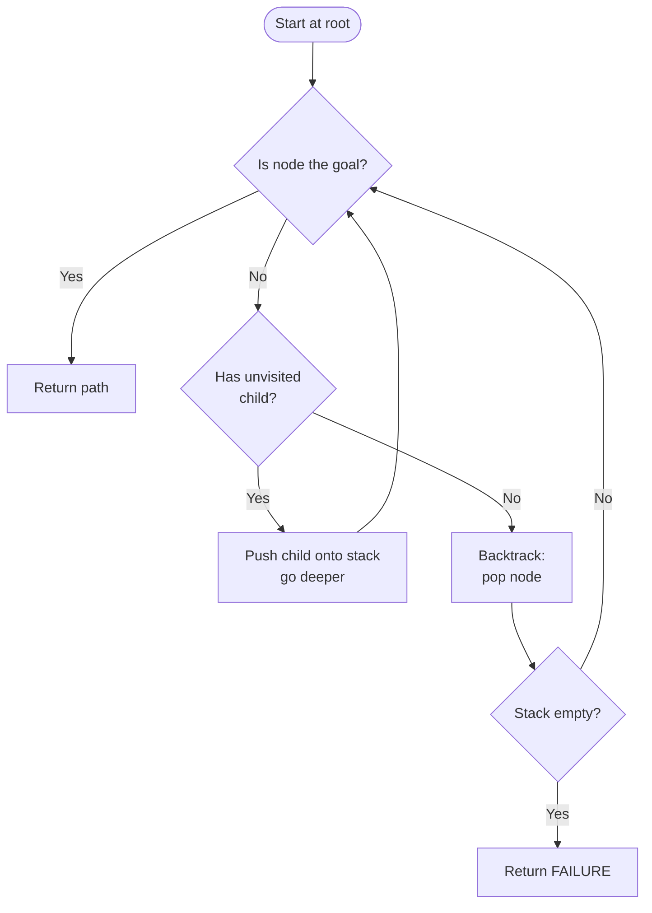

### 2.2.3 Depth-Limited Search (DLS)

- DFS with a **depth limit** $L$ to avoid infinite depth.
- Nodes deeper than $L$ are treated as leaves.
- **Complete:** No (may miss goals beyond $L$).
- **Time:** $O(b^L)$, **Space:** $O(bL)$.

### 2.2.4 Iterative Deepening DFS (IDDFS)

- Repeatedly run DLS with increasing limits $L = 0, 1, 2, 3, \dots$
- Combines **BFS completeness/optimality** with **DFS space efficiency**.
- **Complete:** Yes. **Optimal:** Yes (equal step costs).
- **Time:** $O(b^d)$; **Space:** $O(bd)$.

```
for L = 0 to ∞:
    result = DEPTH-LIMITED-SEARCH(problem, L)
    if result != cutoff: return result
```

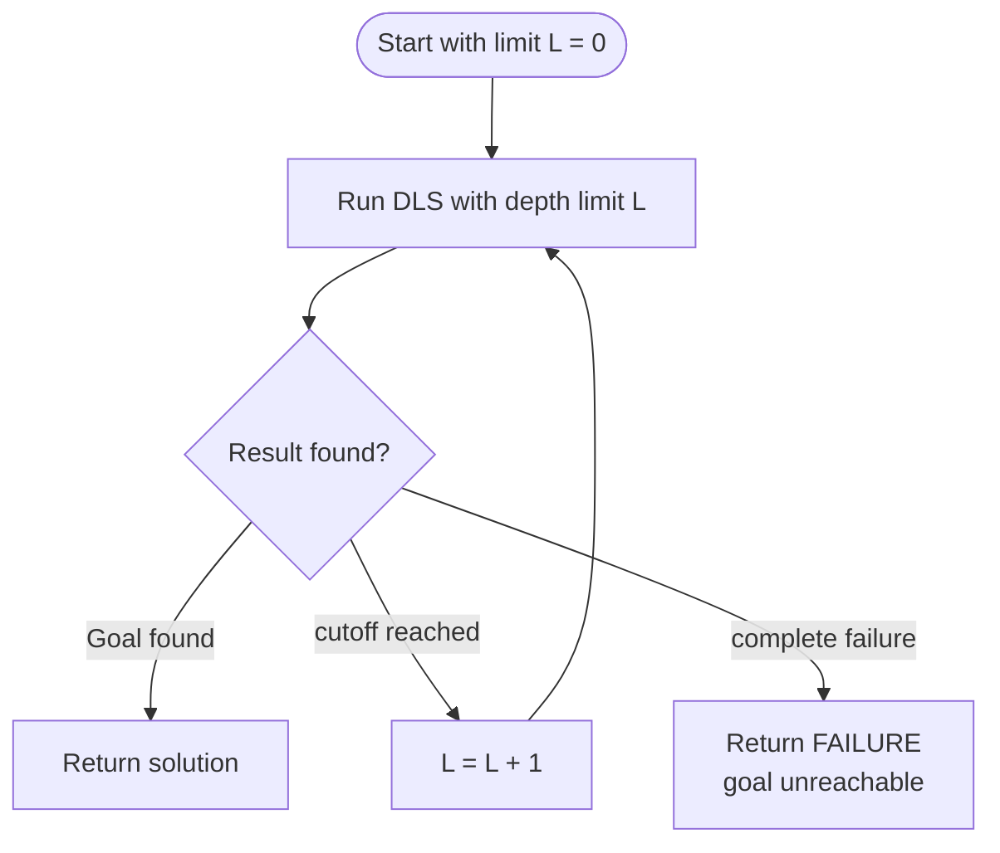

### 2.2.5 Uniform Cost Search (UCS)

- Expands the node with the **lowest path cost** `g(n)` first (priority queue). Generalizes BFS to weighted graphs.
- **Complete:** Yes (if step costs ≥ ε > 0).
- **Optimal:** Yes (guaranteed when step costs are non-negative).
- **Time/Space:** $O(b^{C^*/ε})$ where $C^*$ is the optimal cost.

### 2.2.6 Comparison Table: BFS vs DFS vs DLS vs IDDFS vs UCS

| Criterion | BFS | DFS | DLS | IDDFS | UCS |
|---|---|---|---|---|---|
| Strategy | FIFO (shallowest) | LIFO (deepest) | DFS + limit L | DLS with increasing L | Lowest cost g(n) |
| Complete | Yes | No (finite: yes) | No | Yes | Yes |
| Optimal | Yes (equal cost) | No | No | Yes (equal cost) | Yes |
| Time | $O(b^d)$ | $O(b^m)$ | $O(b^L)$ | $O(b^d)$ | $O(b^{C^*/\varepsilon})$ |
| Space | $O(b^d)$ | $O(bm)$ | $O(bL)$ | $O(bd)$ | $O(b^{C^*/\varepsilon})$ |
| Use case | Shallow graphs | Deep, memory-tight | Known depth bound | Large/unbounded graphs | Weighted costs |

---

## 2.3 Informed (Heuristic) Search

### 2.3.1 Heuristic Function

- A **heuristic** $h(n)$ = estimated cost of the cheapest path from node $n$ to the goal.
- **Admissible heuristic:** Never overestimates the true cost: $h(n) \le h^*(n)$, where $h^*(n)$ is the true minimal cost to goal. → guarantees optimality (for tree search with A*).
- **Consistent (monotonic) heuristic:** $h(n) \le c(n, a, n') + h(n')$ for every transition — triangle inequality. Consistency implies admissibility.
- **Example heuristics:** Straight-line distance (Euclidean) for route finding; number of misplaced tiles (8-puzzle); Manhattan distance (sum of tile distances) for 8-puzzle.

### 2.3.2 Greedy Best-First Search

- Expands the node that looks **closest to the goal** according to $h(n)$ only.
- **Complete:** No (can get stuck in dead ends/cycles).
- **Optimal:** No (ignores past cost).
- **Time/Space:** $O(b^m)$.

### 2.3.3 A* Search

- Combines cost-so-far and estimated remaining cost:

$$f(n) = g(n) + h(n)$$

where $g(n)$ = actual cost from start to $n$, $h(n)$ = admissible heuristic estimate to goal.

- **Complete:** Yes. **Optimal:** Yes if $h$ is admissible (tree search) or consistent (graph search).
- **Time/Space:** $O(b^d)$ in practice (exponential in worst case).

```mermaid
graph TD
    Start([Start]) --> O[Open = {Start}<br/>f = g + h]
    O --> E{Open empty?}
    E -->|Yes| Fail[Return FAILURE]
    E -->|No| N[Pick node n with<br/>smallest f(n)]
    N --> G{Is n the goal?}
    G -->|Yes| Succ[Return path to n]
    G -->|No| Ex[Expand n → children m]
    Ex --> C["For each child m:<br/>g(m) = g(n) + cost(n,m)<br/>f(m) = g(m) + h(m)"]
    C --> Up[Insert / update m in Open<br/>keeping the best f]
    Up --> E
```

#### Worked Example: A* Numeric Trace

Graph (node: h value; edge: cost):

```
Start(S): h=7        Node A: h=6        Goal(G): h=0
S --2--> A           A --2--> G
S --3--> B           B --2--> A        B --4--> G   (B: h=2)
```

**Step 1:** Open = {S}. Pop S. Expand: S→A (g=2), S→B (g=3).

| Node | g | h | f = g + h |
|---|---|---|---|
| A | 2 | 6 | **8** |
| B | 3 | 2 | **5** ← min |

**Step 2:** Pop B (f=5, smallest). Expand B: B→A (g=3+2=5, h=6 ⇒ f=11 — *worse than current A path, ignore*), B→G (g=3+4=7, h=0 ⇒ f=7).

| Node | g | h | f |
|---|---|---|---|
| A | 2 | 6 | **8** |
| G | 7 | 0 | 7 |

**Step 3:** Pop A (f=8). Expand A: A→G (g=2+2=4, h=0 ⇒ f=4 — better than existing G path).

**Step 4:** Open = {G with f=4}. Goal reached. **Solution path: S → A → G**, total cost = **4**. ✔ (Optimal: S→B→G would cost 7.)

### 2.3.4 AO* Search (AND–OR Graphs)

- Used when the problem decomposes into **subproblems that all must be solved** (AND nodes) or **alternatives** (OR nodes).
- Solution is an **AND–OR tree** (subproblems combined).
- **AND node:** all children must be solved (cost = sum of children costs).
- **OR node:** cheapest child wins (cost = min of children costs).
- **Algorithm:**
  1. Start with the initial node.
  2. Decompose via AND/OR links.
  3. Compute the cost of the best solution tree at each node.
  4. Expand the most promising (lowest-cost) *unsolved* node.
  5. Propagate updated costs back up (re-evaluate) until the root's cost stabilizes.
  6. Mark nodes SOLVED when all their subproblems are solved.
- **Difference from A*:** A* works on OR graphs (single path); AO* works on AND–OR graphs (solution *trees*).

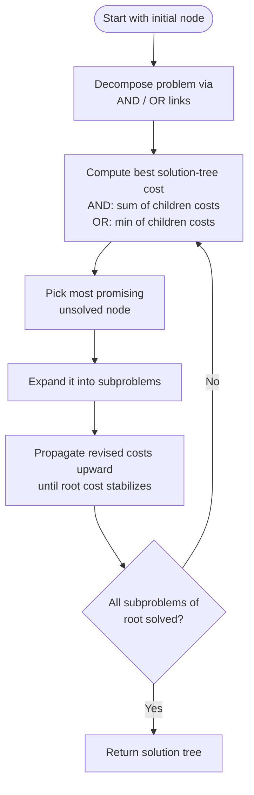

---

## 2.4 Adversarial Search (Game Playing)

### 2.4.1 Game Tree & Two-Player Zero-Sum Games

- **Perfect information, deterministic, turn-taking games** (Chess, Tic-Tac-Toe).
- **MAX** player tries to maximize its score; **MIN** player minimizes MAX's score.
- **Terminal states** return utility values (win = +1, loss = −1, draw = 0).

### 2.4.2 Minimax Algorithm

- Compute utility of each node from the leaves upward:
  - **MAX nodes** take the **maximum** of children utilities.
  - **MIN nodes** take the **minimum** of children utilities.
- Optimal play = the move from the root leading to the highest utility.

```
function MINIMAX(node):
    if TERMINAL(node): return UTILITY(node)
    if node is MAX node:  return max(MINIMAX(child) for child in children)
    if node is MIN node:  return min(MINIMAX(child) for child in children)
```

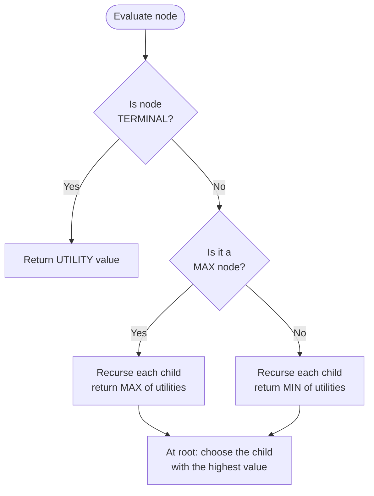

#### Minimax Step-by-Step Tree Evaluation

```
              MAX          MAX chooses MAX of its children
               |
        +------+------+      values: 3, 5, 2  → MAX gets 5
        |             |
      MIN(3,5)      MIN(2,9)    each MIN takes MIN of leaves
       /  \          /  \
      3    5       2    9        leaves: terminal utilities
```

- Root action → choose the branch that leads to value **5**.
- **Time:** $O(b^m)$; **Space:** $O(bm)$.

### 2.4.3 Alpha-Beta Pruning

- Prunes branches that **cannot influence** the final decision, using two bounds:
  - **α** = best (max) value MAX can guarantee so far (initialized −∞).
  - **β** = best (min) value MIN can guarantee so far (initialized +∞).
- **Cutoff condition:** a node is pruned when $\alpha \ge \beta$ (for the current branch).
- **Effect:** same result as Minimax, but on average time improves to $O(b^{m/2})$ — i.e., can search ~2× deeper with the same effort.

#### Pruning Example

```
        MAX (root)
         |
    +----+----+         Suppose left MIN subtree returns 3 → α = 3.
    |         |         When evaluating right MIN subtree, first leaf = 2,
  MIN      MIN          MIN already ≤ 3, so MAX would never choose it
   |         |          → remaining children of right MIN are PRUNED (β ≤ α).
   3      [2, X]        (X never evaluated)
```

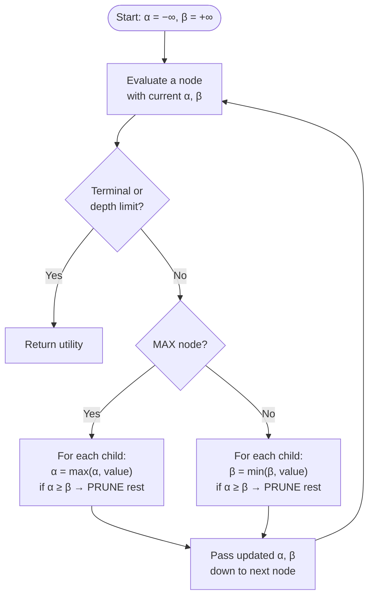

---

## 2.5 Constraint Satisfaction Problems (CSP)

- **Variables:** $X = \{X_1, X_2, \dots, X_n\}$
- **Domains:** $D = \{D_1, \dots, D_n\}$ (possible values)
- **Constraints:** restrict combinations of values (unary, binary, higher-order).
- **Goal:** assignment of values to all variables satisfying all constraints.
- **Examples:** Map coloring, N-Queens, Sudoku, course scheduling.

### 2.5.1 Constraint Graph

- Nodes = variables; edges = binary constraints between variables.

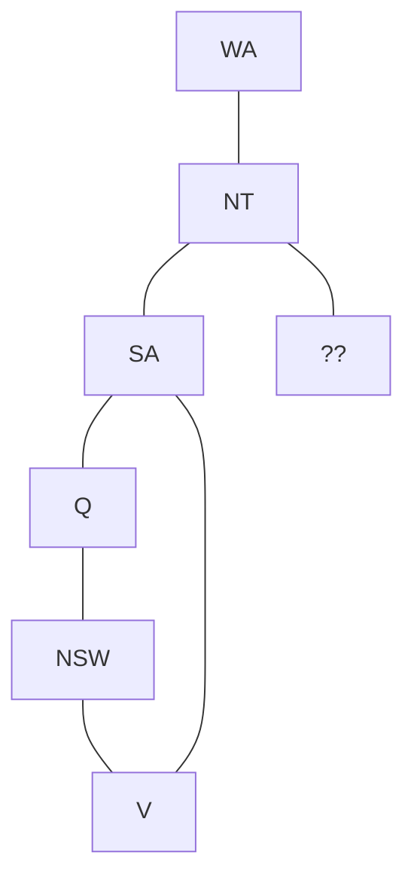

### 2.5.2 Backtracking Search

- **DFS + constraint checking:** assign variables one by one; if a constraint is violated, *backtrack* to the previous variable and try the next value.
- **Improvement heuristics:**
  - **MRV (Minimum Remaining Values):** pick the variable with fewest legal values.
  - **LCV (Least Constraining Value):** pick the value that rules out fewest choices for others.
  - **Forward checking:** after assignment, delete inconsistent values from neighbors' domains.
  - **AC-3 / Arc Consistency:** remove values with no support in neighbor domains.

```mermaid
graph TD
    S([Start: no variables assigned]) --> A{All variables<br/>assigned?}
    A -->|Yes| Sol[Return complete<br/>consistent assignment]
    A -->|No| V[Pick next variable<br/>MRV heuristic]
    V --> D{Has untried<br/>value?}
    D -->|Yes| As[Assign value<br/>LCV heuristic]
    As --> C{Constraints<br/>satisfied?}
    C -->|Yes| A
    C -->|No| D
    D -->|No| B[BACKTRACK<br/>undo last assignment]
    B --> A
```

### 2.5.3 Arc Consistency (AC-3)

- An **arc** $(X_i, X_j)$ is consistent if for **every** value of $X_i$, there exists at least one value of $X_j$ satisfying the binary constraint.
- AC-3 maintains a queue of arcs; repeatedly removes inconsistent values until the queue is empty (or a domain empties → failure).

```
function AC-3(X, D, C):
    queue = all arcs (Xi, Xj) in C
    while queue not empty:
        (Xi, Xj) = pop(queue)
        if REVISE(Xi, Xj):            // removed values from Di
            if Di empty: return failure
            for each Xk in neighbors(Xi) - {Xj}:
                queue ← (Xk, Xi)
    return success
```

```mermaid
graph TD
    Start([Start]) --> Q[Queue = all arcs Xi,Xj<br/>from the constraints]
    Q --> E{Q queue empty?}
    E -->|Yes| Succ[Return SUCCESS<br/>graph is arc-consistent]
    E -->|No| A[Pop arc Xi,Xj]
    A --> R{REVISE Xi: remove values<br/>with no support in Xj?}
    R -->|No values removed| E
    R -->|Values removed| Em{Is domain of Xi<br/>now empty?}
    Em -->|Yes| Fail[Return FAILURE]
    Em -->|No| NB[Re-enqueue all arcs Xk,Xi<br/>for every neighbor Xk of Xi except Xj]
    NB --> E
```

### 2.6 Search Strategy Selection Guide

```mermaid
graph TD
    Q{Have a heuristic<br/>h(n)?} -->|No| U{Weights on edges?}
    U -->|Yes| UCS[Use UCS]
    U -->|No| D{Space is limited?}
    D -->|Yes| DFS[Use DFS / IDDFS]
    D -->|No| BFS[Use BFS]
    Q -->|Yes| A{Heuristic<br/>admissible?}
    A -->|Yes| AS[Use A*]
    A -->|No| GS[Greedy Best-First<br/>fast but not optimal]
```

| Your situation | Best choice |
|---|---|
| Need guaranteed optimal, unweighted, memory OK | **BFS** |
| Memory very tight | **DFS / IDDFS** |
| Weighted edges, optimal needed | **UCS / A*** |
| Good admissible heuristic available | **A*** |
| Very large / unbounded search space | **IDDFS** (or A* with good h) |

---

# MODULE 3 — Knowledge Representation, Reasoning & Logic

---

## 3.1 Propositional Logic vs First-Order Logic (FOL)

### 3.1.1 Propositional Logic

- **Syntax:** Atomic propositions (A, B, "It is raining") combined with logical connectives: $\neg$ (NOT), $\land$ (AND), $\lor$ (OR), $\Rightarrow$ (implication), $\Leftrightarrow$ (biconditional).
- **Semantics:** Each proposition is **True** or **False**; truth tables define connectives.
- **Limitation:** Cannot express *objects*, *relations*, *quantities*, or *generalizations* (e.g., "All humans are mortal").

### 3.1.2 First-Order Logic (FOL / Predicate Logic)

- **Syntax extends propositional logic with:**
  - **Constants:** objects (e.g., `Ravi`, `2`)
  - **Variables:** x, y, z
  - **Predicates:** relations (e.g., `Human(x)`, `Likes(x, y)`)
  - **Functions:** map objects to objects (e.g., `fatherOf(x)`)
  - **Quantifiers:** $\forall$ (for all), $\exists$ (there exists)
  - **Connectives:** same as propositional logic
- **Term:** constant, variable, or function applied to terms (denotes an object).
- **Atomic sentence:** predicate applied to terms (denotes True/False).
- **Quantified formulas:**
  - $\forall x \; Human(x) \Rightarrow Mortal(x)$ — "All humans are mortal."
  - $\exists x \; Likes(Ravi, x)$ — "Ravi likes something."

### 3.1.3 Comparison Table: Propositional Logic vs FOL

| Feature | Propositional Logic | First-Order Logic |
|---|---|---|
| Units | Whole facts (propositions) | Objects, predicates, relations |
| Variables | No | Yes |
| Quantifiers | No | $\forall$, $\exists$ |
| Expressiveness | Limited | High |
| Inference | Propositional resolution, truth tables | Resolution with unification |
| Example | `Raining ⇒ Wet` | `∀x (Rain(x) ⇒ Wet(x))` |

---

## 3.2 Knowledge Engineering Steps (NL → FOL)

**Definition:** The process of building a knowledge base (KB) from natural-language domain facts.

1. **Identify the task** — decide what questions the KB must answer.
2. **Assemble relevant knowledge** — collect facts/rules from the domain expert.
3. **Decide on vocabulary** — choose predicates, constants, functions (e.g., `Human(x)`, `Married(x, y)`).
4. **Encode general domain knowledge** — background rules, axioms.
5. **Encode the specific problem instance** — add the concrete facts.
6. **Pose queries to the inference engine** — ask questions; run inference.
7. **Debug the KB** — check answers; fix errors in rules/axioms.

```mermaid
graph LR
    S1["1. Identify task<br/>what questions to answer"] --> S2["2. Assemble knowledge<br/>from domain expert"]
    S2 --> S3["3. Decide vocabulary<br/>predicates, constants, functions"]
    S3 --> S4["4. Encode general rules<br/>domain axioms"]
    S4 --> S5["5. Encode specific instance<br/>concrete facts"]
    S5 --> S6["6. Pose queries<br/>to the inference engine"]
    S6 --> S7["7. Debug the KB<br/>fix incorrect answers"]
    S7 -->|error found| S3
```

**Example conversions (NL → FOL):**
- "All students love AI" → $\forall x\; [Student(x) \Rightarrow Loves(x, AI)]$
- "Some students love AI" → $\exists x\; [Student(x) \land Loves(x, AI)]$
- "No student hates AI" → $\neg \exists x\; [Student(x) \land Hates(x, AI)]$ or $\forall x\; [Student(x) \Rightarrow \neg Hates(x, AI)]$
- "Ravi is the father of Sunil" → `Father(Ravi, Sunil)`

---

## 3.3 Inference Engines

```mermaid
graph LR
    KB[Knowledge Base<br/>Facts + Rules] --> IE[Inference Engine<br/>Forward / Backward Chaining]
    Q[Query / Goal] --> IE
    IE --> Inf[Apply inference rules<br/>Modus Ponens, Resolution]
    KB --> Inf
    Inf --> Out[Answer + Justification]
```

### 3.3.1 Modus Ponens

- Rule of inference: from `A` and `A ⇒ B`, conclude `B`.

$$\frac{A,\quad A \Rightarrow B}{B}$$

**Example:** "It is raining" and "If it rains, the ground is wet" → "The ground is wet."

### 3.3.2 Resolution Refutation Method

- To prove a theorem: **negate the goal**, convert everything to **Conjunctive Normal Form (CNF)**, and apply **resolution** until the empty clause (contradiction) is derived.

#### Converting FOL to CNF (Steps)

1. **Eliminate implications:** $A \Rightarrow B \equiv \neg A \lor B$.
2. **Move negations inward** (De Morgan + double negation): $\neg\forall x = \exists x\neg$; $\neg\exists x = \forall x\neg$; $\neg(A\land B) = \neg A \lor \neg B$.
3. **Standardize variables apart** (rename so each quantifier binds a unique variable).
4. **Skolemize:** remove existential quantifiers by replacing with a Skolem constant/function.
5. **Drop universal quantifiers.**
6. **Distribute $\lor$ over $\land$** to get conjunction of clauses (each clause = disjunction of literals).
7. **Separate conjuncts** into individual clauses; standardize variable names apart again.

```mermaid
graph TD
    F[FOL Sentence] --> I["1. Eliminate ⇔ and ⇒<br/>A ⇒ B ≡ ¬A ∨ B"]
    I --> N["2. Move ¬ inward<br/>De Morgan's laws, ¬¬A ≡ A"]
    N --> V["3. Standardize variables apart<br/>rename bound variables"]
    V --> SK["4. Skolemize<br/>∃x replaced by constant/function"]
    SK --> U["5. Drop all ∀ quantifiers"]
    U --> D["6. Distribute ∨ over ∧<br/>get conjunction of clauses"]
    D --> S["7. Separate clauses<br/>one clause per line"]
    S --> CNF[CNF Clauses]
```

#### Resolution Rule

$$\frac{(\ell_1 \lor \dots \lor L),\quad (M_1 \lor \dots \lor \neg L)}{\ell_1 \lor \dots \lor M_1}$$

Two clauses containing complementary literals ($L$ and $\neg L$) resolve into a clause without them. Continue until **empty clause (□)** = contradiction → the negated goal is false → **theorem proved**.

**Unification:** finding a substitution $\theta$ such that two literals become identical (e.g., unify `Father(Ravi, y)` with `Father(Ravi, Sunil)` ⇒ $\theta = \{y/Sunil\}$).

```mermaid
graph TD
    Start([Goal to prove]) --> Ng[Negate the goal]
    Ng --> CNF[Convert KB + negated goal<br/>into CNF clauses]
    CNF --> R[Pick two clauses with<br/>complementary literals L and ¬L]
    R --> Re[Resolve them → new clause<br/>without the literal L]
    Re --> E{Empty clause □<br/>derived?}
    E -->|Yes| P[CONTRADICTION<br/>→ Goal is PROVED]
    E -->|No| R
```

### 3.3.3 Forward Chaining (Data-Driven)

- Start from **known facts**, apply rules to **derive new facts**, until the **goal** is reached (or nothing new can be derived).
- **Approach:** Bottom-up. Used when: many goals, data-driven environments, monitoring/diagnosis (expert systems).

```
Repeat:
    Find a rule whose ALL premises match known facts
    Add its conclusion to the KB
Until goal is derived or no more rules apply
```

**Example:** Facts: `A, B`. Rules: `A ∧ B ⇒ C`, `C ⇒ D`. FC derives `C`, then `D` → goal `D` achieved.

```mermaid
graph TD
    S([Start with known facts in KB]) --> R{Find a rule whose ALL<br/>premises are known facts}
    R -->|None found| F{Goal reached?}
    R -->|Found| A[Add rule conclusion<br/>as a new fact]
    A --> F
    F -->|Yes| Done[STOP: goal proven]
    F -->|No| R
```

### 3.3.4 Backward Chaining (Goal-Driven)

- Start from the **goal**, work **backwards** through rules to see if the goal can be proven from known facts (or by proving subgoals).
- **Approach:** Top-down, depth-first search over rules (used in Prolog).
- Used when: a single query/goal, many rules but few facts.

```
function BACKWARD-CHAIN(goal):
    if goal is in KB: return True
    for each rule whose conclusion matches goal:
        for each premise p of that rule:
            if BACKWARD-CHAIN(p) fails for any p: break
        return True if all premises proven
    return False
```

**Example:** Goal `D`. Rule `C ⇒ D` → subgoal `C`. Rule `A ∧ B ⇒ C` → subgoals `A` and `B` — both in KB → proven.

```mermaid
graph TD
    S([Start with the GOAL]) --> KB{Goal already<br/>in KB?}
    KB -->|Yes| P[Goal PROVEN]
    KB -->|No| Ru[Find rule whose conclusion<br/>matches the goal]
    Ru -->|None found| F[Goal cannot be proven<br/>→ FAIL]
    Ru -->|Rule found| Pre[Set rule premises<br/>as new subgoals]
    Pre --> Sb{All subgoals<br/>proven?}
    Sb -->|Yes| P
    Sb -->|No| Pre
```

### 3.3.5 Comparison Table: Forward vs Backward Chaining

| Criterion | Forward Chaining | Backward Chaining |
|---|---|---|
| Direction | Facts → Goal | Goal → Facts |
| Start point | Known data | Query/goal |
| Search type | Bottom-up (data-driven) | Top-down (goal-driven) |
| Efficiency | Good with few rules/many facts | Good with few goals/many rules |
| Typical tool | Expert systems (e.g., CLIPS) | Logic programming (Prolog) |
| Termination | When no new facts derivable | When goal proved / impossible |

---

## 3.4 Structured Knowledge Representation Schemes

### 3.4.1 Semantic Networks

- **Graph** representation: nodes = objects/concepts; labeled edges = relations.

```mermaid
graph LR
    A[Bird] -->|is a| B[Animal]
    C[Ostrich] -->|is a| A
    C -->|can| D[Run]
    C -->|can not| E[Fly]
    C -->|has| F[Long Neck]
```

- **Property inheritance:** Ostrich inherits "is a Animal" from Bird (unless overridden).
- **Limitation:** No built-in quantifiers; ambiguous "is-a" vs "has-a"; default values can be overridden.

### 3.4.2 Frames

- A frame represents a **stereotyped situation/object** as a structure of **Slots** (attributes) and **Fillers** (values).
- **Concepts:**
  - **Slots:** named attributes (e.g., `legs`, `color`).
  - **Fillers:** values of slots (e.g., `4`, `black`).
  - **Default values:** assumed values used when no explicit filler exists (inheritable).
  - **Inheritance:** a child frame inherits slots/values from its parent (is-a / a-kind-of hierarchy).

**Example — Frame "Bird":**
```
Frame: BIRD
  is-a:       ANIMAL
  legs:       default(2)
  can-fly:    default(TRUE)

Frame: OSTRICH
  is-a:       BIRD
  can-fly:    FALSE        ← overrides default
  height:     "tall"
```

### 3.4.3 Conceptual Dependency (CD) Theory

- **CD theory (Schank):** represents the **meaning** of natural-language sentences using a small set of **primitive actions** independent of surface language.
- **Core primitives (11 primitives, e.g.):**
  - `ATRANS` — transfer of possession (give, take)
  - `PTRANS` — physical transfer of an object (go)
  - `MTRANS` — transfer of mental information (tell, know)
  - `MBUILD` — building new mental information (decide, conclude)
  - `INGEST` — taking in (eat, drink)
  - `PROPEL` — applying physical force (push)
  - `GRASP` — grasping an object
  - `SPEAK` — producing sound
  - `ATTEND` — attending to a sense
  - `EXPEL` — expelling something
  - `MOVE` — moving a body part
- **Structure:** a dependency graph of conceptualizations `(actor, act, object, recipient/state)` — enables **inference and paraphrase** (e.g., "John gave Mary a book" and "Mary got a book from John" share the same CD representation).

---

# MODULE 4 — Fuzzy Logic Systems

---

## 4.1 Classical (Crisp) Sets vs Fuzzy Sets

### 4.1.1 Crisp Sets

- An element **either belongs or does not belong** to a set.
- Membership function: $\mu_A(x) \in \{0, 1\}$.
- **Example:** "Person is Tall" — height ≥ 180 cm ⇒ member (1); below ⇒ not (0). A 179.9 cm person is *not* tall — abrupt boundary.

### 4.1.2 Fuzzy Sets (Zadeh, 1965)

- Membership is a **degree** in the interval $[0, 1]$.
- Membership function: $\mu_A(x) \in [0, 1]$.
- **Example:** "Person is Tall" — 175 cm ⇒ $\mu_{Tall}(175) = 0.6$; 185 cm ⇒ 0.9; 165 cm ⇒ 0.2. Smooth graduation.
- A fuzzy set A on universe U: $A = \{(x, \mu_A(x)) \mid x \in U\}$.

### 4.1.3 Comparison Table: Crisp vs Fuzzy Sets

| Feature | Crisp Set | Fuzzy Set |
|---|---|---|
| Membership | 0 or 1 (binary) | Any value in [0,1] |
| Boundary | Sharp | Gradual (overlapping) |
| Mathematical form | $\mu_A(x) \in \{0,1\}$ | $\mu_A(x) \in [0,1]$ |
| Handles uncertainty? | No | Yes (imprecision, vagueness) |
| Example | Is it raining? (Yes/No) | Temperature "warm" (0.7) |

**Membership curves — "Tall" for crisp vs fuzzy:**

```
Crisp set:   μ(x)                      Fuzzy set:   μ(x)
           1 ████████████╲                         1                ╭─────────
             │          ╲                           │          ╭─────╯
           0 │          ╲______                    0.5┤     ╭───╯
             └──────────────────→ height            │ ╭────╯
             130          180                      0─╯───────────────→ height
                                                    130          180
```

### 4.1.4 Common Fuzzy Membership Functions

- **Triangular:** $\text{tri}(x;a,b,c)$ = peak at b, zero at a and c.
- **Trapezoidal:** $\text{trap}(x;a,b,c,d)$ = plateau between b and c.
- **Gaussian / Bell-shaped.**
- **Sigmoid** (monotonic increase/decrease).

---

## 4.2 Fuzzy Set Operations

Let $A, B$ be fuzzy sets with memberships $\mu_A(x), \mu_B(x)$:

| Operation | Formula | Notes |
|---|---|---|
| **Union** | $\mu_{A \cup B}(x) = \max(\mu_A(x), \mu_B(x))$ | Logical OR |
| **Intersection** | $\mu_{A \cap B}(x) = \min(\mu_A(x), \mu_B(x))$ | Logical AND |
| **Complement** | $\mu_{\bar{A}}(x) = 1 - \mu_A(x)$ | Logical NOT |
| **Algebraic Product** | $\mu_{A \cdot B}(x) = \mu_A(x) \cdot \mu_B(x)$ | Soft AND |
| **Bounded Sum** | $\mu_{A \oplus B}(x) = \min(1,\; \mu_A(x) + \mu_B(x))$ | Capped OR |
| **Algebraic Sum** | $\mu_{A + B}(x) = \mu_A(x) + \mu_B(x) - \mu_A(x)\mu_B(x)$ | Probabilistic OR |

**Example:** $\mu_A(x) = 0.7,\ \mu_B(x) = 0.4$
- Union: 0.7 · max → 0.7
- Intersection: 0.4
- Complement of A: 0.3
- Algebraic product: 0.28
- Bounded sum: 1.0

---

## 4.3 Fuzzy Inference System (FIS) Architecture

```mermaid
graph LR
    X[Crisp Input x] --> FZ[Fuzzification]
    FZ --> IE[Inference Engine<br/>Applies rules]
    RB[Rule Base<br/>IF-THEN rules] --> IE
    DB[Database<br/>MF definitions] --> FZ
    DB --> IE
    IE --> DZ[Defuzzification]
    DZ --> Y[Crisp Output y]
```

### FIS Pipeline (Detailed Decision Flow)

```mermaid
graph TD
    X[Crisp inputs<br/>x1, x2, ...] --> F[Fuzzification<br/>compute μ(x) per MF]
    F --> E[Inference Engine]
    RB[Rule Base<br/>IF-THEN rules] --> E
    DB[Database<br/>MF definitions] --> F
    DB --> E
    E --> A{Multiple rules<br/>fire?}
    A -->|Yes| AG[Aggregate outputs<br/>max of clipped results]
    A -->|No| SN[Single rule output]
    AG --> D[Defuzzification<br/>centroid / MOM / COS]
    SN --> D
    D --> Y[Crisp output y]
```

### Step 1: Fuzzification

- Convert crisp input into **fuzzy values (degrees of membership)** using the membership functions of linguistic variables (e.g., Temperature = {Cold, Warm, Hot}).
- **Example:** Temperature 30°C → $\mu_{Warm}(30)=0.5$, $\mu_{Hot}(30)=0.3$.

### Step 2: Rule Base & Database

- **Rule Base:** linguistic IF–THEN rules linking fuzzy inputs to fuzzy outputs.
  - `IF Temperature is Hot AND Humidity is High THEN Fan Speed is Fast`
- **Database:** definitions of the membership functions for input/output variables.

### Step 3: Inference Engine (Mamdani vs Sugeno)

- **Mamdani method:** both antecedents *and* consequents are fuzzy sets. Steps: fuzzify inputs → apply rule strengths (min for AND, max for OR) → aggregate clipped consequents (max of rule outputs) → defuzzify.
- **Sugeno (Takagi–Sugeno) method:** consequents are **functions** (constant or linear) of the inputs.
  - `IF x is A THEN y = k`  (zero-order) or `y = ax + b` (first-order).
  - No defuzzification needed; output = weighted average of the functions.

#### Comparison Table: Mamdani vs Sugeno

| Feature | Mamdani | Sugeno |
|---|---|---|
| Consequents | Fuzzy sets | Crisp functions/constants |
| Defuzzification | Required (centroid, etc.) | Weighted average |
| Interpretability | High (human-readable) | Low |
| Computational cost | Higher | Lower |
| Use cases | Expert/control systems | Model-based control, optimization |

```mermaid
graph TD
    subgraph Mamdani
        M1[Fuzzify inputs] --> M2[Apply rules<br/>strength = min AND / max OR]
        M2 --> M3[Clip consequent fuzzy sets]
        M3 --> M4[Aggregate by MAX]
        M4 --> M5[Defuzzify → crisp output]
    end
    subgraph Sugeno
        S1[Fuzzify inputs] --> S2[Compute each rule output<br/>y = k or y = ax + b]
        S2 --> S3[Weighted average<br/>→ crisp output directly]
    end
```

### Step 4: Defuzzification

Converts the aggregated fuzzy output back into a **crisp value**.

- **Centroid / Center of Gravity (COG):**

$$y^* = \frac{\sum_x x \cdot \mu(x)}{\sum_x \mu(x)}$$

- **Center of Sums (COS):** weighted by sum of individual output fuzzy areas (before max aggregation).
- **Mean of Maximum (MOM):** average of all x where membership is at its maximum.
- **Weighted average method** (for symmetric MFs).

```mermaid
graph TD
    Agg[Aggregated fuzzy output μ(x)] --> G{Which method?}
    G -->|Centroid / COG| C["y* = Σ x·μ(x) / Σ μ(x)<br/>center of gravity"]
    G -->|Center of Sums| CS[Weighted by sum of<br/>individual output areas]
    G -->|Mean of Maximum| MOM[Average of x where<br/>μ(x) is maximum]
    G -->|Weighted Avg| WA[Only for symmetric MFs]
    C --> Y[Crisp output y*]
    CS --> Y
    MOM --> Y
    WA --> Y
```

### Complete Numerical Example — Fan Speed (Centroid Method)

**Problem:** Crisp temperature $T = 30^\circ C$, humidity $H = 60$. Output = Fan Speed with MF: Slow (0–2), Medium (2–4), Fast (4–6).

**Fuzzification:**
- $\mu_{Warm}(30) = 0.5$, $\mu_{Hot}(30) = 0.3$ (temperature)
- $\mu_{Normal}(60) = 0.4$, $\mu_{High}(60) = 0.6$ (humidity)

**Rules fired:**
- R1: IF Temp Warm AND Hum Normal THEN Speed Medium — strength = min(0.5, 0.4) = **0.4**
- R2: IF Temp Hot AND Hum High THEN Speed Fast — strength = min(0.3, 0.6) = **0.3**

**Inference (Mamdani):** Clip output fuzzy sets:
- Medium: μ = 0.4 over [2,4]
- Fast: μ = 0.3 over [4,6]

Aggregated membership (max): μ(x) = 0.4 for x∈[2,4]; 0.3 for x∈[4,6].

**Defuzzification (Centroid):**

Sample points x = {2, 3, 4, 5, 6} with μ = {0.4, 0.4, 0.4, 0.3, 0.3}:

$$y^* = \frac{2(0.4) + 3(0.4) + 4(0.4) + 5(0.3) + 6(0.3)}{0.4+0.4+0.4+0.3+0.3} = \frac{0.8+1.2+1.6+1.5+1.8}{1.8} = \frac{6.9}{1.8} \approx 3.83$$

**Output:** Fan speed ≈ **3.83** (medium-fast). ✔

---

# MODULE 5 — Classical Planning & Artificial Neural Networks (ANN)

---

## 5.1 Classical Planning

### 5.1.1 Planning Domain

- **Planning:** finding a **sequence of actions** that transforms an **initial state** into a **goal state**, using explicit state descriptions.
- **Components of a planning problem:**
  - **States:** logical descriptions (conjunctions of literals), e.g., `At(Home) ∧ Have(Milk)`.
  - **Actions:** with preconditions and effects.
  - **Goal:** a conjunction of literals.
  - **Plan:** ordered list of actions.
- **Difference from search:** planning uses *logical/relational* state representations and action schemas, so it can solve large problems without expanding a raw state graph.

```mermaid
graph TD
    I[Initial State<br/>conjunction of literals] --> P[Planner<br/>search over action schemas]
    G[Goal State<br/>description] --> P
    P --> A[Apply an action<br/>check preconditions hold]
    A --> AD[Update state<br/>apply add list / delete list]
    AD --> T{Goal satisfied?}
    T -->|No| A
    T -->|Yes| PL[Output ordered Plan]
```

### 5.1.2 STRIPS Representation

Each action is an operator with 3 parts:

| Part | Meaning | Example: `ACTION(DriveHome)` |
|---|---|---|
| **Preconditions** | Facts that must hold before the action | `At(Office) ∧ Have(Car)` |
| **Add List** | Facts made true by the action | `At(Home)` |
| **Delete List** | Facts made false by the action | `At(Office)` |

**STRIPS plan semantics:** start in initial state; apply actions whose preconditions are satisfied; goal is reached when all goal literals hold in the final state.

### 5.1.3 Goal Stack Planning (Step-by-Step)

A simple method using a **stack** of goals and actions.

**Problem:** Initial: `At(Home)`. Goal: `Have(Milk) ∧ At(Store)`. Action `Buy(Milk)` requires `At(Store)`.

```mermaid
graph TD
    S([Start]) --> P1[Push goal stack<br/>Have(Milk), At(Store)]
    P1 --> P2[Pop top item from stack]
    P2 --> F{Item already TRUE<br/>in current state?}
    F -->|Yes| P2
    F -->|No| O{Item is a goal matching<br/>an action's add-list?}
    O -->|Yes| A[Push the operator, then<br/>its preconditions on top]
    A --> P2
    O -->|No| B[Apply operator<br/>update current state]
    B --> P2
```

1. Push the goal stack: `[Have(Milk), At(Store)]`
2. Pop top goal `Have(Milk)`. Find operator `Buy(Milk)` whose add-list contains it.
   - Push operator onto stack: `[Buy(Milk), At(Store)]`
   - Push its preconditions: `[At(Store), Buy(Milk), At(Store)]`
3. Pop `At(Store)`. It is not true → find operator `GoTo(Store)` (precondition `At(Home)`).
   - Push `GoTo(Store)`: `[GoTo(Store), Buy(Milk), At(Store)]`
   - Push precondition `At(Home)`: `[At(Home), GoTo(Store), Buy(Milk), At(Store)]`
4. Pop `At(Home)` — already true → apply it (no-op).
5. Pop `GoTo(Store)` — preconditions satisfied → apply → state becomes `At(Store)`.
6. Pop `Buy(Milk)` — satisfied → apply → `At(Store) ∧ Have(Milk)`.
7. Pop `At(Store)` — satisfied (still at store). All goals done.

**Plan:** `GoTo(Store) → Buy(Milk)`. ✔

---

## 5.2 Artificial Neural Networks (ANN)

### 5.2.1 Biological Neuron vs Artificial Perceptron

| Feature | Biological Neuron | Artificial Neuron (Perceptron) |
|---|---|---|
| Inputs | Dendrites | Inputs $x_1 \dots x_n$ |
| Weights | Synapses (strength) | Weights $w_1 \dots w_n$ |
| Body | Soma (cell body) | Summation + activation |
| Output | Axon / synapse | Output $\hat{y}$ |
| Threshold | Fires when threshold crossed | Bias $b$ / threshold |
| Activation | All-or-nothing (approx.) | Activation function $f$ |

```mermaid
graph LR
    X1[x1] --> W1[×w1]
    X2[x2] --> W2[×w2]
    X3[x3] --> W3[×w3]
    W1 --> S[Σ + b]
    W2 --> S
    W3 --> S
    S --> A[Activation f]
    A --> Y[ŷ = f Σ wᵢxᵢ + b]
```

### 5.2.2 Mathematical Model of the Perceptron

$$\hat{y} = f\left(\sum_{i=1}^{n} w_i x_i + b\right)$$

- $x_i$ = inputs, $w_i$ = weights, $b$ = bias, $f$ = activation function.
- **Weighted sum (net input):** $z = \sum_i w_i x_i + b = \mathbf{w}^\top \mathbf{x} + b$
- **Prediction:** $\hat{y} = f(z)$
- **Learning:** adjust $w_i$ and $b$ to minimize error.

### 5.2.3 Activation Functions

| Function | Equation | Range | Key Properties |
|---|---|---|---|
| **Step** | $f(z) = 1$ if $z \ge 0$ else $0$ | {0,1} | Classic perceptron; not differentiable |
| **Sigmoid** | $f(z) = \dfrac{1}{1 + e^{-z}}$ | (0,1) | Smooth, probabilistic output; vanishing-gradient problem |
| **Tanh** | $f(z) = \dfrac{e^z - e^{-z}}{e^z + e^{-z}}$ | (−1,1) | Zero-centered; still vanishing gradient |
| **ReLU** | $f(z) = \max(0, z)$ | [0,∞) | Fast, no vanishing gradient; "dying ReLU" issue |
| **Softmax** | $f(z_i) = \dfrac{e^{z_i}}{\sum_j e^{z_j}}$ | (0,1), sums to 1 | Converts logits to class probabilities (output layer) |

```mermaid
graph LR
    subgraph Graphs
        S[Sigmoid: S-curve 0→1]
        T[Tanh: S-curve −1→1]
        R[ReLU: flat 0, then linear]
        SM[Softmax: probability vector]
    end
```

### 5.2.4 Multi-Layer Perceptron (MLP) Architecture

```mermaid
graph TD
    i1[Input x1] --> h1[Neuron 1]
    i1 --> h2[Neuron 2]
    i2[Input x2] --> h1
    i2 --> h2
    i3[Input x3] --> h1
    i3 --> h2
    h1 --> o1[Output ŷ]
    h2 --> o1
    subgraph Layers
        L1[Input Layer]
        L2[Hidden Layer]
        L3[Output Layer]
    end
```

- **Input layer** (features) → one or more **hidden layers** (learn features) → **output layer** (prediction).
- **Fully connected (dense):** every neuron connects to every neuron in the next layer.
- **Universal approximation:** an MLP with enough hidden neurons can approximate any continuous function.
- Weights/beights learned via **backpropagation**.

### 5.2.5 Backpropagation Algorithm

**Goal:** minimize the loss $E$ (e.g., Mean Squared Error: $E = \frac12 \sum_i (y_i - \hat{y}_i)^2$) by adjusting weights via **Gradient Descent**.

**Update rule:**

$$\Delta w = -\eta \frac{\partial E}{\partial w}, \qquad w_{new} = w_{old} + \Delta w = w_{old} - \eta \frac{\partial E}{\partial w}$$

($\eta$ = learning rate; negative sign moves opposite to the gradient, downhill.)

```mermaid
graph TD
    S([Random initial weights]) --> C[Compute loss E<br/>at current weights]
    C --> GR[Compute gradient ∂E/∂w<br/>via backpropagation]
    GR --> U[Update weights<br/>w = w − η·∂E/∂w]
    U --> M{Converged?<br/>loss stops decreasing}
    M -->|No| C
    M -->|Yes| D[Optimal weights found]
```

#### Steps of Backpropagation

```mermaid
graph LR
    FP[1. Forward Pass<br/>compute outputs ŷ layer by layer] --> L[2. Compute Loss E]
    L --> BO[3. Backward Pass<br/>compute ∂E/∂w for output layer]
    BO --> BI[4. Backpropagate error<br/>to hidden layers via Chain Rule]
    BI --> U[5. Update all weights<br/>w = w − η·∂E/∂w]
    U --> FP
```

1. **Forward pass:** compute $z^{(l)} = W^{(l)} a^{(l-1)} + b^{(l)}$, $a^{(l)} = f(z^{(l)})$, and final $\hat{y}$.
2. **Compute loss:** $E = \frac{1}{2}\sum (y - \hat{y})^2$ (or cross-entropy).
3. **Output layer gradient:** $\delta^{(out)} = (y - \hat{y}) \cdot f'(z^{(out)})$.
4. **Hidden layer gradients (chain rule):** $\delta^{(l)} = (W^{(l+1)\top} \delta^{(l+1)}) \odot f'(z^{(l)})$.
5. **Weight updates:** $w_{ij}^{(l)} \leftarrow w_{ij}^{(l)} - \eta\, a_j^{(l-1)} \delta_i^{(l)}$, and $b_i^{(l)} \leftarrow b_i^{(l)} - \eta \delta_i^{(l)}$.

#### Mini Numerical Trace (1 neuron)

Given $x = 1.0$, $w = 0.5$, $b = 0$, $\eta = 0.1$, sigmoid, target $y = 1$.
- $z = 0.5(1) + 0 = 0.5$; $\hat{y} = \sigma(0.5) = 0.6225$.
- $E = \frac12 (1 - 0.6225)^2 = \frac12 (0.1425) = 0.0712$.
- $\frac{\partial E}{\partial w} = (\hat{y} - y) \cdot \hat{y}(1 - \hat{y}) \cdot x = (0.6225 - 1)(0.6225)(0.3775)(1) = (-0.3775)(0.235) = -0.0887$.
- $\Delta w = -\eta(-0.0887) = +0.00887$ → $w_{new} = 0.5089$. ✔

#### Full ANN Training Loop

```mermaid
graph TD
    D[Training Data<br/>features X, labels y] --> E[Forward Pass<br/>compute ŷ layer by layer]
    E --> L[Compute Loss E = loss(ŷ, y)]
    L --> B[Backward Pass<br/>∂E/∂w for every layer]
    B --> W[Update weights<br/>w = w − η·∂E/∂w]
    W --> T{Epoch<br/>complete?}
    T -->|No| E
    T -->|Yes| C{Converged or<br/>max epochs?}
    C -->|No| E
    C -->|Yes| M[Model ready:<br/>predicts new inputs]
```

---

# MODULE 6 — Genetic Algorithms (GA)

---

## 6.1 Core Principles

- **Biological inspiration:** Darwinian **natural selection** — "survival of the fittest".
- **Idea:** evolve a population of candidate solutions over generations; fitter individuals survive and reproduce, carrying their good "genes" to the next generation.
- **Key analogy terms:**

| GA Term | Biological Analogy |
|---|---|
| Chromosome | A candidate solution (encoded string) |
| Gene | A unit/position of the solution |
| Allele | Value of a gene |
| Population | Set of candidate solutions |
| Fitness | How good a solution is |
| Selection | Survival of the fittest |
| Crossover | Reproduction (mixing genes) |
| Mutation | Random genetic change |

---

## 6.2 GA Lifecycle (Algorithm)

```mermaid
graph TD
    I[Initialize Population<br/>random chromosomes] --> F[Evaluate Fitness<br/>fitness function]
    F --> T{Termination<br/>condition met?}
    T -->|Yes| O[Output best solution]
    T -->|No| S[Selection<br/>choose parents]
    S --> C[Crossover<br/>produce offspring]
    C --> M[Mutation<br/>random alterations]
    M --> P[New Population]
    P --> F
```

```
1. Encode the problem as chromosomes
2. Generate initial population (random)
3. Evaluate fitness of every chromosome
4. Repeat until termination:
   a. Selection (choose fitter parents)
   b. Crossover (recombine to make offspring)
   c. Mutation (perturb offspring)
   d. Evaluate fitness of new population
   e. Replace old population
5. Return the fittest chromosome as the solution
```

---

## 6.3 GA Operators — Detailed

### 6.3.1 Chromosome Encoding

| Encoding | Description | Example |
|---|---|---|
| **Binary** | String of 0/1 genes | `10101010` |
| **Permutation** | Ordering of items (TSP routes) | `[A, C, B, D, E]` |
| **Value** | Real/integer numbers directly | `[3.2, 1.8, 5.6]` |

### 6.3.2 Initial Population

- Generate $N$ random chromosomes covering a wide area of the search space.
- Population size trade-off: too small → premature convergence; too large → slow.

### 6.3.3 Fitness Function

- Scores each chromosome: $fitness(chromosome) \rightarrow \mathbb{R}^+$.
- Drives selection — higher fitness ⇒ higher chance to reproduce.
- Example: maximize $f(x) = x^2$; or minimize cost → invert/normalize.

### 6.3.4 Selection Methods

| Method | How it works | Properties |
|---|---|---|
| **Roulette Wheel** | Each individual gets a slice proportional to its fitness; spin the wheel to pick a parent | Fitter → more likely; scales poorly with big fitness gaps |
| **Tournament** | Pick k individuals at random; the fittest of the k wins | Simple, robust, controls selection pressure |
| **Rank Selection** | Sort by fitness, assign selection probability by rank (not raw fitness) | Avoids dominance of a few super-fit individuals |

**Roulette wheel formula:** $P_i = \dfrac{fitness_i}{\sum_{j=1}^{N} fitness_j}$

```mermaid
graph TD
    S[Population with fitness scores] --> R{Selection method?}
    R -->|Roulette Wheel| RW[Slice size ∝ fitness<br/>spin the wheel to pick a parent]
    R -->|Tournament| T[Pick k individuals at random<br/>fittest of the k wins]
    R -->|Rank Selection| RK[Sort by fitness<br/>pick by rank probability]
    RW --> P[Selected parents]
    T --> P
    RK --> P
    P --> X[Proceed to crossover]
```

### 6.3.5 Crossover Operators

| Operator | Description | Example (parents `1010` & `0101`) |
|---|---|---|
| **Single-point** | Split both parents at one point, swap tails | `10|10` + `01|01` → `1001`, `0110` |
| **Two-point** | Split at two points, swap middle segment | `1|01|0` + `0|10|1` → `1101`, `0010` |
| **Uniform** | For each gene, choose randomly from either parent | `1010` × `0101` → `1101`, `0010`, … |

```mermaid
graph TD
    P["Parent1 = 1010<br/>Parent2 = 0101"] --> C{Crossover type?}
    C -->|Single-point| S1["Split at one point: 10|10<br/>swap tails → 1001, 0110"]
    C -->|Two-point| S2["Split at two points: 1|01|0<br/>swap middle → 1101, 0010"]
    C -->|Uniform| S3[Per-gene random choice<br/>e.g. → 1101, 0010]
    S1 --> O[Offspring]
    S2 --> O
    S3 --> O
```

### 6.3.6 Mutation Operators

| Operator | Description | Example |
|---|---|---|
| **Bit-flip** | Flip a randomly chosen bit (0↔1) | `1010` → `1110` |
| **Swap** | Swap two random positions (permutation encoding) | `[A,C,B,D]` → `[A,B,C,D]` |

- Mutation rate kept low (e.g., 1–5%) to avoid destroying good solutions, but enough to maintain diversity.

### 6.3.7 Termination Criteria

- Maximum number of generations reached.
- Fitness threshold achieved (satisfactory solution found).
- Convergence: population fitness stops improving for several generations.
- Time/budget exhausted.

```mermaid
graph TD
    G[Generation N population] --> E{Termination condition?}
    E -->|Max generations reached| S1[STOP: return best solution]
    E -->|Fitness threshold hit| S2[STOP: good enough solution]
    E -->|Converged — no improvement| S3[STOP: return best so far]
    E -->|Time budget over| S4[STOP: return best so far]
    E -->|None| C[Next generation<br/>selection → crossover → mutation]
    C --> G
```

---

## 6.4 Worked Mini Example — Maximize $f(x) = x^2$, $x \in \{0..15\}$ (4-bit binary)

- **Chromosome:** 4-bit binary of x.

**Initial population:** 1001 (9), 0111 (7), 1011 (11), 1100 (12)

| Chromosome | x | Fitness $x^2$ | Roulette prob. |
|---|---|---|---|
| 1001 | 9 | 81 | 0.14 |
| 0111 | 7 | 49 | 0.08 |
| 1011 | 11 | 121 | 0.21 |
| 1100 | 12 | 144 | **0.25** |

**Selection (roulette):** likely picks 1100 and 1011.
**Crossover (single-point at position 2):** `11|00` + `10|11` → children `1111` (15), `1000` (8).
**Mutation (bit-flip, low rate):** e.g., `1111` → `1110` (14).
**Next population:** 1111 (15) → fitness **225** — improvement over 144. ✔

After several generations, the population converges near x = 15 (max $x^2$ in range).

---

# QUICK-REVISION SUMMARY

- **AI hierarchy:** AI ⊃ ML ⊃ DL; NLP is AI applied to language.
- **Agent loop:** Environment → Sensors → Agent function → Actuators → Environment.
- **PEAS:** Performance measure, Environment, Actuators, Sensors.
- **Search:** BFS (complete+optimal, high space), DFS (low space, not optimal), IDDFS (best of both), UCS (weighted), A* ($f = g + h$, optimal with admissible h).
- **Games:** Minimax + α–β pruning (cutoff when $\alpha \ge \beta$).
- **CSP:** Backtracking + MRV/LCV + Forward checking + AC-3.
- **Logic:** FOL = propositional + predicates + quantifiers; resolution refutation via CNF; forward (facts→goal) vs backward (goal→facts).
- **KR:** Semantic networks, Frames (slots/fillers/defaults/inheritance), CD primitives.
- **Fuzzy:** $\mu_A(x) \in [0,1]$; min/max/1−μ; Mamdani (fuzzy out + defuzzify) vs Sugeno (function out); centroid $y^* = \sum x\mu / \sum \mu$.
- **Planning:** STRIPS (preconditions, add list, delete list); goal stack planning.
- **ANN:** $\hat{y} = f(\sum w_i x_i + b)$; activations (Sigmoid/Tanh/ReLU/Softmax); MLP + backprop $w \leftarrow w - \eta \frac{\partial E}{\partial w}$.
- **GA:** encode → population → fitness → selection → crossover → mutation → repeat.

---

*Notes compiled for the "Complete AI Artificial Intelligence in One Shot" course by 5 Minutes Engineering. Use alongside the video for full context and handwritten-diagram walkthroughs.*
