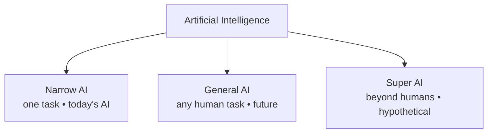
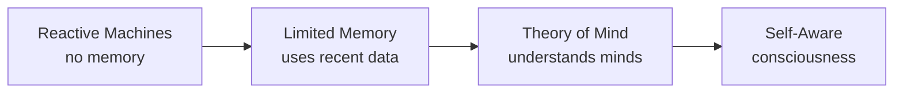
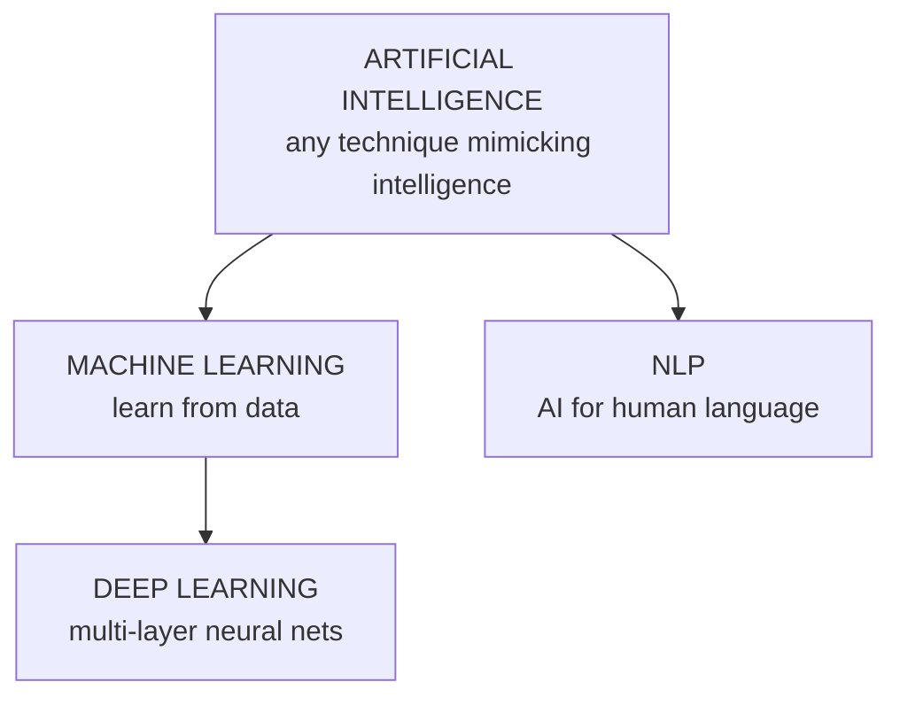
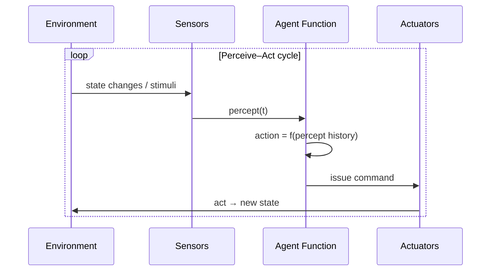
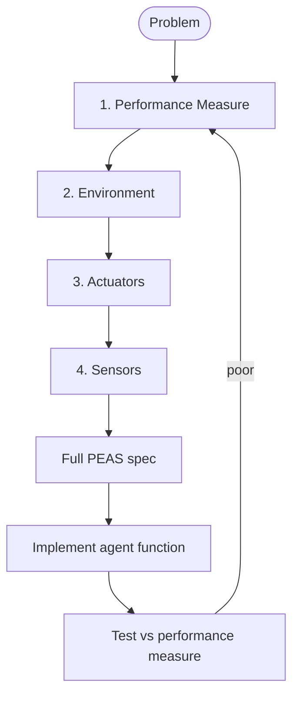
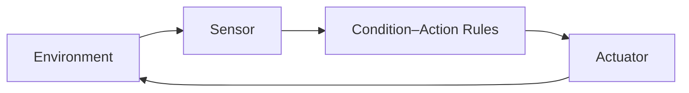
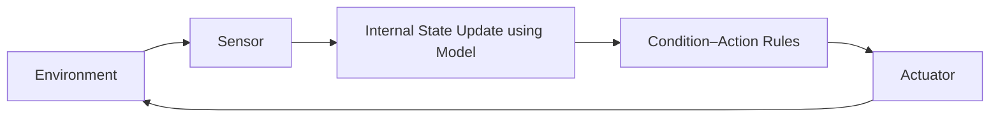
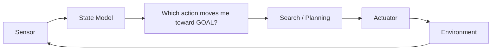
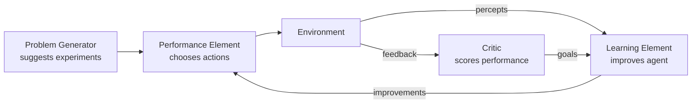
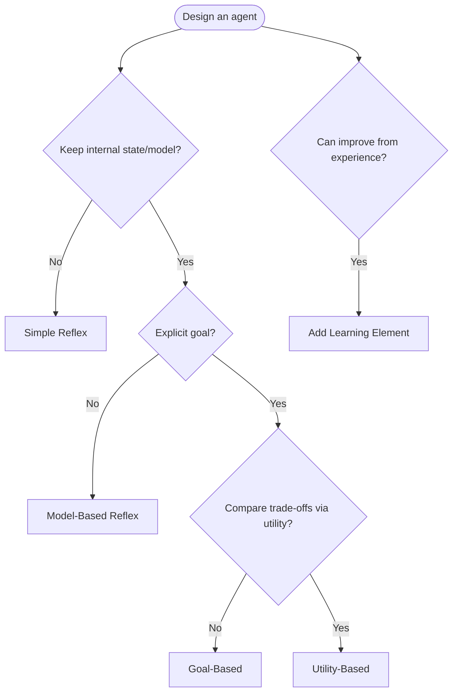

# MODULE 1 — DETAILED SUB-NOTES
# AI Foundations, Agent Architecture & PEAS

> **Companion to:** `AI_MASTER_NOTES.md` → Module 1
> **Video:** https://www.youtube.com/watch?v=y39OlGrVFD8 (sections: *Introduction*, *Intelligent Agents*)

---

## TABLE OF CONTENTS

1.1 What is Artificial Intelligence?
1.2 Goals of AI & What AI Can Do
1.3 History & Major Milestones of AI
1.4 Types of AI (Capability-Based)
1.5 Types of AI (Functionality-Based)
1.6 AI vs Human (Natural) Intelligence
1.7 AI vs ML vs DL vs NLP — Detailed
1.8 Applications of AI
1.9 Intelligence and Components of Intelligence
1.10 Intelligent Agents — Core Definitions
1.11 The Agent Function & Percept Sequence
1.12 Rationality & The Omniscience Trap
1.13 The Agent–Environment Loop
1.14 PEAS Framework — Detailed
1.15 PEAS Examples (Car, Medical, Vacuum, Robot, Other)
1.16 Properties of Task Environments
1.17 The Five Agent Types — Detailed
1.18 Choosing an Agent Architecture
1.19 Summary & Quick Revision
1.20 Practice Questions

---

## 1.1 What is Artificial Intelligence?

### 1.1.1 Core Definition

**Artificial Intelligence** is the branch of computer science concerned with **building intelligent machines** — machines that can perform tasks which, if performed by a human, would be considered to require intelligence.

The field asks and answers four kinds of questions (Russell & Norvig):

| Question | What it produces |
|---|---|
| "How do we make machines that **think like humans**?" | Cognitive science approach |
| "How do we make machines that **act like humans**?" | Turing-test approach |
| "How do we make machines that **think rationally**?" | Logicist approach |
| "How do we make machines that **act rationally**?" | Rational agent approach (modern AI) |

### 1.1.2 Famous Textbook Definitions

- **John McCarthy** (1956, coined the term): *"The science and engineering of making intelligent machines, especially intelligent computer programs."*
- **Elaine Rich**: *"AI is the study of how to make computers do things which, at present, people do better."*
- **Russell & Norvig**: *"AI is concerned with the study and design of intelligent agents, where an intelligent agent is a system that perceives its environment and takes actions that maximize its chances of success."*
- **Andrew Ng**: *"AI is the new electricity."* (metaphor for its transformative impact)

### 1.1.3 Key Capabilities AI Systems Exhibit

- **Learning:** improving from experience/data.
- **Reasoning:** deriving conclusions from premises.
- **Perception:** interpreting sensory input (images, audio, sensor data).
- **Problem solving:** searching for solutions.
- **Knowledge representation:** storing and structuring information.
- **Planning:** deciding a sequence of actions.
- **Natural language understanding / generation.**
- **Movement & manipulation** (robotics).

---

## 1.2 Goals of AI & What AI Can Do

### 1.2.1 The Two Grand Goals

1. **Scientific goal:** understand intelligence itself (as a side effect, we build models of how intelligence works).
2. **Engineering goal:** build useful intelligent systems that solve real problems (automation, prediction, assistance).

### 1.2.2 What AI Can Do Today (vs Not Yet)

| Area | Can Do (Narrow AI) | Cannot Yet (AGI) |
|---|---|---|
| Games | Beat world champions (Chess, Go, Poker) | Transfer skills across games |
| Vision | Object/face recognition | Understand full scene context like a human |
| Language | Translate, summarize, chat | True understanding with common sense |
| Driving | Assistive & some autonomous | Full autonomy in all weather/cities |
| Creativity | Generate images/music from patterns | Genuine original intent |
| Reasoning | Rule-based reasoning in fixed domains | General abstract reasoning |

---

## 1.3 History & Major Milestones of AI

| Period | Milestone | Significance |
|---|---|---|
| 1943 | McCulloch & Pitts — first artificial neuron model | Birth of neural-network idea |
| 1950 | **Alan Turing** — "Computing Machinery and Intelligence" | Proposed the **Turing Test** |
| 1956 | **Dartmouth Conference** (McCarthy, Minsky, Shannon, Rochester) | Coined term "Artificial Intelligence" |
| 1957 | **Perceptron** by Frank Rosenblatt | First learning machine |
| 1966 | **ELIZA** chatbot (Weizenbaum) | Early NLP |
| 1969 | **Shakey** robot + STRIPS planning | Planning & robotics |
| 1974–80 | **First AI Winter** | Funding cut, unfulfilled promises |
| 1980s | **Expert Systems** boom (MYCIN, XCON) | Commercial AI |
| 1987–93 | **Second AI Winter** | Expert-system bubble burst |
| 1997 | **Deep Blue** beats Kasparov at chess | Search + brute force milestone |
| 2011 | **Watson** wins Jeopardy!; **Siri** launched | NLP + QA |
| 2012 | **AlexNet** wins ImageNet (deep learning) | Deep Learning revolution |
| 2016 | **AlphaGo** beats Lee Sedol at Go | RL + neural nets |
| 2020s | **GPT / ChatGPT** — large language models | Generative AI explosion |

**Takeaway:** AI cycles between hype ("summers") and disappointment ("winters"). Today's success is powered by **data + compute + deep learning**.

---

## 1.4 Types of AI (Capability-Based)

### 1.4.1 Narrow AI (Weak AI / ANI — Artificial Narrow Intelligence)

- Designed to perform **a single specific task** exceptionally well.
- Operates under a **predefined range or context**; cannot generalize beyond its training.
- **Examples:** spam filters, virtual assistants (Siri, Alexa), chess engines, Netflix recommendations, ChatGPT-style models (still narrow in scope of behavior), facial recognition.
- **Status:** *ALL AI deployed today is Narrow AI.*

### 1.4.2 General AI (Strong AI / AGI — Artificial General Intelligence)

- A machine with the ability to perform **any intellectual task that a human being can**.
- Must combine: learning, reasoning, planning, perception, language, and common sense, and **transfer skills across domains**.
- **Status:** *Not yet achieved* — research area.

### 1.4.3 Super AI (ASI — Artificial Superintelligence)

- AI that **surpasses human intelligence in every aspect** — creativity, problem solving, social skills, wisdom.
- **Status:** *Hypothetical / philosophical* (debated as existential risk or ultimate tool).



---

## 1.5 Types of AI (Functionality-Based)

### 1.5.1 Reactive Machines

- **No memory.** React purely to current input using pre-programmed rules.
- Cannot learn from past; cannot use past experiences.
- **Example:** **IBM Deep Blue** (1997) — evaluated chess positions with search, no learning during the match.

### 1.5.2 Limited Memory

- Can **temporarily store** past data/observations and use them for decisions.
- **Examples:** **Self-driving cars** (track other vehicles' recent positions), recommendation systems (use browsing history).

### 1.5.3 Theory of Mind

- AI that understands that others have **beliefs, emotions, desires, and intentions** that differ from its own.
- Required for social robots, negotiation, collaboration.
- **Status:** *Research stage* — not yet realized.

### 1.5.4 Self-Aware

- AI with **consciousness** and a sense of **self**.
- **Status:** *Fictional / speculative stage.*

**Progression:**



---

## 1.6 AI vs Human (Natural) Intelligence

| Aspect | Human Intelligence | Artificial Intelligence |
|---|---|---|
| Origin | Biological brain | Programs + hardware |
| Learning speed | Slow, needs repetition | Fast on data, instant replay |
| Generalization | Excellent across domains | Poor (task-specific) |
| Creativity | High, novel | Limited to training patterns |
| Adaptability | Instant to new situations | Requires retraining |
| Consistency | Tires, gets bored, biased | Consistent & tireless |
| Storage | Associative, fuzzy recall | Exact, addressable, vast |
| Parallelism | Massive (100B+ neurons) | Limited by silicon |
| Energy | ~20 W brain | Kilowatts for datacenters |
| Emotion/Intuition | Present | Absent |
| Self-awareness | Present | Absent |
| Life span | 70–90 yrs (degrading) | Indefinite (upgradeable) |

**Video takeaway:** AI is engineered for **speed, scale, and repeatability**, not for replacing human consciousness.

---

## 1.7 AI vs ML vs DL vs NLP — Detailed

### 1.7.1 The Nesting



### 1.7.2 Artificial Intelligence (AI)
The broad field. Includes **rule-based systems, expert systems, search, logic, planning, fuzzy logic, genetic algorithms, ML, computer vision, NLP, robotics**. Anything that makes machines seem intelligent.

### 1.7.3 Machine Learning (ML)
**Subset of AI.** Algorithms improve automatically through experience (data).

| Type | Data | Learning goal | Example |
|---|---|---|---|
| **Supervised** | Labeled (X, y) | Map input→output | Spam detection, price prediction |
| **Unsupervised** | Unlabeled | Discover structure | Clustering customers, PCA |
| **Reinforcement** | Rewards from environment | Maximize cumulative reward | AlphaGo, robot control |

### 1.7.4 Deep Learning (DL)
**Subset of ML** using neural networks with many hidden layers that **automatically learn hierarchical features**:

- Layer 1: edges → Layer 2: shapes → Layer 3: parts → Layer 4: objects (vision example).
- Enabled by: big data, GPUs, ReLU activation, dropout, backpropagation.

### 1.7.5 Natural Language Processing (NLP)
AI applied to **language**: text & speech.

- **Levels of language processing:**
  - *Morphology* — word structure (run, runs, running)
  - *Syntax* — grammar/sentence structure
  - *Semantics* — meaning of words & sentences
  - *Pragmatics* — meaning in context
  - *Discourse* — meaning across multiple sentences
- **Applications:** machine translation, chatbots, sentiment analysis, speech-to-text, text-to-speech, summarization, question answering.

### 1.7.6 Comparison Table

| Feature | AI | ML | DL | NLP |
|---|---|---|---|---|
| Scope | Broadest | Subset of AI | Subset of ML | Application of AI |
| Core idea | Mimic intelligence | Learn from data | Deep neural nets | Understand language |
| Needs manual rules? | Sometimes | No | No | Hybrid (rules + DL) |
| Feature engineering | Sometimes | Manual | Automatic | Manual + embeddings |
| Typical tools | Logic, search, expert systems | scikit-learn, stats | TensorFlow, PyTorch | spaCy, transformers |
| Example | Chess engine, expert system | Linear regression, SVM | CNNs, GPT | Google Translate |

---

## 1.8 Applications of AI

| Domain | Example applications |
|---|---|
| Healthcare | Disease diagnosis, drug discovery, medical imaging analysis |
| Finance | Fraud detection, algorithmic trading, credit scoring |
| Transportation | Self-driving cars, traffic prediction, logistics |
| Retail | Recommendation engines, demand forecasting, chatbots |
| Education | Adaptive learning platforms, auto-grading |
| Entertainment | Game NPCs, content recommendation, AI music |
| Security | Face recognition, surveillance, threat detection |
| Manufacturing | Predictive maintenance, quality control, robotics |
| Agriculture | Crop disease detection, yield prediction |
| Government | Smart cities, citizen services, law-enforcement analytics |

---

## 1.9 Intelligence and Components of Intelligence

**Intelligence** = the ability to acquire and apply knowledge and skills.

### 1.9.1 Components (for AI systems)

1. **Learning** — from data or feedback
2. **Reasoning** — deduction/induction
3. **Knowledge** — representation & storage
4. **Planning** — sequencing actions
5. **Perception** — understanding senses
6. **Language** — understanding/generation
7. **Manipulation & Mobility** — acting physically

---

## 1.10 Intelligent Agents — Core Definitions

### 1.10.1 Definitions

| Term | Definition |
|---|---|
| **Agent** | Anything that perceives its **environment** via **sensors** and acts upon it via **actuators**. |
| **Percept** | A single observation at time t: `percept(t)` |
| **Percept sequence** | Complete history of all percepts received: `[p₁, p₂, …, pₜ]` |
| **Agent function** | Maps any percept sequence → action: `f : P* → A` |
| **Agent program** | The actual implementation (code) of the agent function |
| **Environment** | Everything outside the agent that it can perceive/affect |
| **Sensor** | Input device (camera, microphone, LIDAR, odometer) |
| **Actuator** | Output device (wheels, arm, speaker, display) |

### 1.10.2 Example: A Robot Agent

```
ROBOT: Sensors = {Camera, Bumper, Wheel encoders}
       Actuators = {Wheel motors, Arm, Gripper}
       Environment = warehouse floor with obstacles
       Agent function = maps image + bumper + position → motor commands
```

### 1.10.3 Agent vs Program vs Algorithm

- **Algorithm:** fixed steps to solve a problem.
- **Program:** implementation of the agent function in code.
- **Agent:** program *embedded in* an environment it perceives and acts on.

An agent = **architecture** (hardware/software it runs on) **+ program** (agent function).

---

## 1.11 The Agent Function & Percept Sequence

### 1.11.1 Formal Definition

$$f : P^* \rightarrow A$$

- `P*` = the set of all possible percept sequences
- `A` = the set of all possible actions
- The agent function **can be tabulated**: for every possible percept sequence, one action.

### 1.11.2 Why Percept *Sequence*, not just current percept?

Because many environments are **non-Markovian** — the best action depends on history, not just the current observation.

**Example (Vacuum cleaner):** The robot vacuums in room A. Current percept "clean" could mean (a) it already cleaned A, or (b) A is newly dirty. Only history disambiguates.

### 1.11.3 Example Agent Function Table (Reflex Vacuum)

| Percept Sequence | Action |
|---|---|
| [A, Dirty] | Suck |
| [A, Clean] | Move Right |
| [B, Dirty] | Suck |
| [B, Clean] | Move Left |

---

## 1.12 Rationality & The Omniscience Trap

### 1.12.1 What Makes an Agent Rational?

For each possible percept sequence, a **rational agent** selects the action that is **expected to maximize its performance measure**, given:

1. the percept sequence it has received,
2. whatever built-in knowledge it has,
3. the actions available,
4. the performance measure.

### 1.12.2 Rational ≠ Omniscient

- **Omniscience:** knowing the actual outcome of actions → irrational to demand.
- **Rationality** only uses *what is known* and *expected utility*.

**Example:** A taxi turning at an intersection (legally, based on green light) that then gets hit by a runaway truck is **rational but unlucky** — it made the best decision given its information.

### 1.12.3 Rational ≠ Perfect

An agent can be rational yet fail (randomness, incomplete info). Success requires rationality + luck.

### 1.12.4 Performance Measure — Design Pitfall

> *"You get what you measure."*

- A robot that is scored only on "amount cleaned" may keep re-vacuuming the same spot (gaming the metric).
- Fix: score on **net benefit** = dirt removed − cost of action − time.

---

## 1.13 The Agent–Environment Loop



**Text form:** *Sense → Perceive → Think → Act → Observe new state → Repeat.*

- The loop is **closed**: actions change the environment, which changes future percepts.
- **Open-loop** systems (no sensing) cannot be called agents in the strict sense.

---

## 1.14 PEAS Framework — Detailed

**PEAS** = the four things you must specify to *design* an agent.

| Letter | Term | Question it answers |
|---|---|---|
| **P** | **Performance Measure** | How do we judge success? |
| **E** | **Environment** | Where does the agent act? |
| **A** | **Actuators** | How does it affect the world? |
| **S** | **Sensors** | How does it perceive the world? |

### 1.14.1 Performance Measure — Detailed

- Quantifies **success**, not just goal-achievement.
- Should be **objective** and **measurable**.
- Often multiple criteria combined (safety + speed + comfort).

### 1.14.2 Environment — Detailed

Describes the world: objects, agents, state, dynamics, rules. Classified by the **task-environment properties** (section 1.16).

### 1.14.3 Actuators — Detailed

Every way the agent can alter the environment. In robotics: motors, joints, grippers. In software agents: API calls, display, network actions, text output.

### 1.14.4 Sensors — Detailed

Every way the agent can observe. Complete vs partial sensing, noisy vs clean.

### 1.14.5 Design Order (P → E → A → S)



---

## 1.15 PEAS Examples (Detailed)

### 1.15.1 Automated (Self-Driving) Taxi

| Component | Specification |
|---|---|
| **Performance Measure** | Safety (no accidents), legality, trip time, passenger comfort, fuel/energy efficiency, adherence to traffic rules |
| **Environment** | Roads, traffic lights, pedestrians, bicycles, other cars, weather, roadworks, GPS signals |
| **Actuators** | Steering, throttle, brake, indicator lights, horn, internal display/voice, doors |
| **Sensors** | Video cameras, LIDAR, RADAR, GPS, speedometer, odometer, inertial sensors, ultrasonic park sensors, microphone |

### 1.15.2 Medical Diagnosis Agent

| Component | Specification |
|---|---|
| **Performance Measure** | Correct diagnosis rate, low false negatives, low cost/harm, speed, minimal unnecessary tests |
| **Environment** | Patient, symptoms, medical history, lab results, hospital DB, doctors |
| **Actuators** | Screen display, printout, alerts, referral letters, medication suggestions |
| **Sensors** | Keyboard input of symptoms, test result files, patient record DB queries |

### 1.15.3 Vacuum-Cleaning Robot

| Component | Specification |
|---|---|
| **Performance Measure** | Amount of dirt cleaned, area covered, time, energy used, no wall damage |
| **Environment** | Room, furniture, dirt piles, walls, cables, pets |
| **Actuators** | Wheel motors, suction motor, brush |
| **Sensors** | Dirt sensor, bumper (contact), IR/wall sensor, position encoder, camera |

### 1.15.4 Part-Picking Robot (Factory)

| Component | Specification |
|---|---|
| **Performance Measure** | Parts correctly picked per hour, placement accuracy, collisions avoided |
| **Environment** | Conveyor belt, bins of parts, obstacles, lighting |
| **Actuators** | Arm joints, gripper fingers, wrist rotation |
| **Sensors** | Camera (2D/3D), force/torque sensor, joint encoders, proximity sensor |

### 1.15.5 Other Quick PEAS Examples

| Agent | P | E | A | S |
|---|---|---|---|---|
| Chess AI | Win games, rating | Chessboard & rules | Move pieces | Board position |
| Chatbot | User satisfaction, task success | User messages, context | Reply text | Text input |
| Spam filter | Precision, recall, low false positives | Incoming emails | Label (spam/ham) | Email headers+body |
| Trading agent | Profit, risk-adjusted return | Market data, orders | Buy/sell/hold | Price feeds, news |

---

## 1.16 Properties of Task Environments

Six (sometimes seven) dimensions used to classify environments:

| Property | Two extremes | Meaning |
|---|---|---|
| **Observability** | Fully vs Partially observable | Does the agent see the complete state? |
| **Agents** | Single-agent vs Multi-agent | Are there other agents? |
| **Determinism** | Deterministic vs Stochastic/Non-deterministic | Does each action have a single guaranteed outcome? |
| **Episodicity** | Episodic vs Sequential | Does each action affect future decisions? |
| **Dynamism** | Static vs Dynamic | Does the environment change while the agent thinks? |
| **Discreteness** | Discrete vs Continuous | Finite vs infinite states/actions |
| (Extra) **Knowledge** | Known vs Unknown | Does the agent know the rules of the environment? |

### 1.16.1 Example Classifications

| Environment | Observable | Deterministic | Episodic | Static | Discrete |
|---|---|---|---|---|---|
| Chess (with clock) | Fully | Deterministic | Sequential | Semi-dynamic | Discrete |
| Self-driving car | Partially | Stochastic | Sequential | Dynamic | Continuous |
| Crossword puzzle | Fully | Deterministic | Sequential | Static | Discrete |
| Medical diagnosis | Partially | Stochastic | Sequential | Dynamic | Continuous |
| Poker | Partially | Stochastic | Sequential | Static | Discrete |

**Why it matters:** these properties decide which agent architecture is feasible.
- Fully observable + deterministic → simple reflex or search works.
- Partially observable + stochastic + dynamic → needs model, utility, learning, probabilistic reasoning.

---

## 1.17 The Five Agent Types — Detailed

### 1.17.1 Simple Reflex Agent



- Maps **current percept** → action via `IF condition THEN action` rules.
- **No memory, no state, no goals.**
- **Works only** in fully observable, deterministic environments.
- **Fatal flaw:** infinite loops in certain environments (e.g., vacuum oscillating between two dirty rooms: sense dirty A → move B → sense dirty B → move A…).

**Fix for loops:** add a *random* action occasionally, or keep a visited-state list (→ model-based).

### 1.17.2 Model-Based Reflex Agent



- Keeps **internal state** summarizing the unobserved parts of the world.
- Has a **model** of *how the world evolves* and *how its actions affect it*.
- Update: `state ← update(state, action, percept)` using the model.
- **Handles partial observability** better than simple reflex.
- Still **no goals** — just follows rules on the internal state.

**Example:** Robot remembering which rooms it already cleaned.

### 1.17.3 Goal-Based Agent



- Has an **explicit goal** (set of desirable states).
- When current state ≠ goal, uses **search/planning** to find an action sequence.
- More **flexible** than reflex: new goals need no new rules, just new planning.
- **Limitation:** knows *what* to achieve, not *how good* one goal is vs another.

**Example:** GPS route finder — goal is destination; search finds path.

### 1.17.4 Utility-Based Agent

- Replaces binary goal with a **utility function** $U(s)$ (how "good" a state is).
- Chooses the action maximizing **expected utility**:

$$Action^* = \arg\max_a \sum_{s'} P(s' \mid a, s) \cdot U(s')$$

- **Handles trade-offs:** "get to hospital fast" vs "avoid traffic" vs "low fuel use" — all resolved into one number.
- **Handles uncertainty:** if two paths both reach the goal, picks the higher-utility one; if goals conflict, weighs them.

**Example:** Taxi choosing between fastest, cheapest, or most comfortable route; robot balancing speed vs battery.

### 1.17.5 Learning Agent



Four components:

| Component | Role |
|---|---|
| **Learning Element** | Modifies the agent function to improve performance |
| **Performance Element** | Selects actions (the "actor") |
| **Critic** | Gives feedback on how well the agent did vs performance standard |
| **Problem Generator** | Suggests exploratory/novel actions to gather experience |

**Why a Problem Generator matters:** without exploration, a learning agent never discovers better strategies (exploration–exploitation trade-off).

**Examples:** Spam filter improving with user feedback; AlphaGo improving via self-play.

### 1.17.6 Comparison Table

| Agent Type | Percept History | Internal State | Goal | Utility | Learns | Best For |
|---|---|---|---|---|---|---|
| Simple Reflex | No | No | No | No | No | Fully observable, simple tasks |
| Model-Based Reflex | Yes | Yes | No | No | No | Partially observable, fixed rules |
| Goal-Based | Yes | Yes | Yes | No | No | Single clear goal, search needed |
| Utility-Based | Yes | Yes | Yes | Yes | No | Conflicting goals, uncertainty |
| Learning | Yes | Yes | Yes | Optional | Yes | Unknown environments, adaptation |

---

## 1.18 Choosing an Agent Architecture



**Practical guidance:**

- Fully observable + deterministic + simple rules → **Simple Reflex**
- Partially observable but known dynamics → **Model-Based**
- Known goal, unknown best path → **Goal-Based (search)**
- Competing objectives or risk → **Utility-Based**
- Unknown environment / want adaptation → **Learning Agent**

---

## 1.19 Summary & Quick Revision

- **AI** = building machines that mimic intelligent behavior. Modern definition: **rational agents**.
- **ANI → AGI → ASI** (capability); **Reactive → Limited Memory → Theory of Mind → Self-Aware** (functionality).
- **AI ⊇ ML ⊇ DL**; NLP = AI for language.
- **Agent** = sensor → agent function → actuator, embedded in an environment.
- **Percept sequence**, not single percept, determines the action for rationality.
- **Rational** = maximize expected performance measure given knowledge; **≠ omniscient, ≠ perfect**.
- **PEAS**: Performance, Environment, Actuators, Sensors — specify in that order.
- **Environment properties**: observable, single/multi-agent, deterministic, episodic, static, discrete — dictate architecture choice.
- **Five agent types** in increasing complexity: Simple Reflex → Model-Based Reflex → Goal-Based → Utility-Based → Learning.

---

## 1.20 Practice Questions

1. Define AI. Why is "acting rationally" the preferred modern definition?
2. Differentiate Narrow, General, and Super AI with examples.
3. Explain the AI–ML–DL–NLP relationship with a diagram.
4. What is a percept sequence? Why is an agent function defined over percept *sequences*?
5. What is a rational agent? Give an example of a rational-but-unsuccessful agent.
6. Give the full PEAS table for an automated taxi and a medical diagnosis agent.
7. Classify the "crossword puzzle" and "self-driving car" environments on all six properties.
8. Explain each of the five agent types. Under what environment does each work best?
9. What are the four components of a learning agent? Why is the problem generator needed?
10. How does the choice of environment properties affect agent architecture selection?
