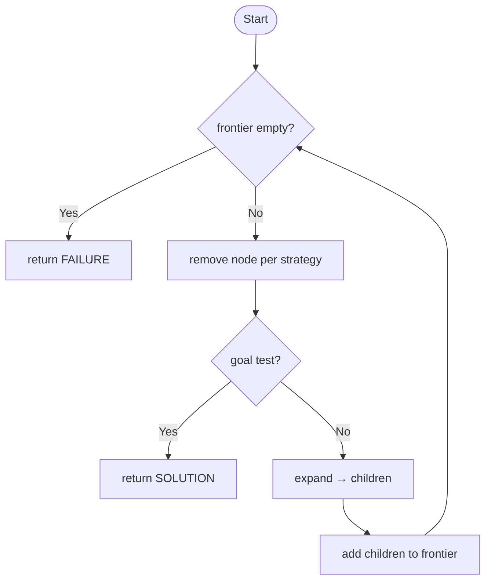
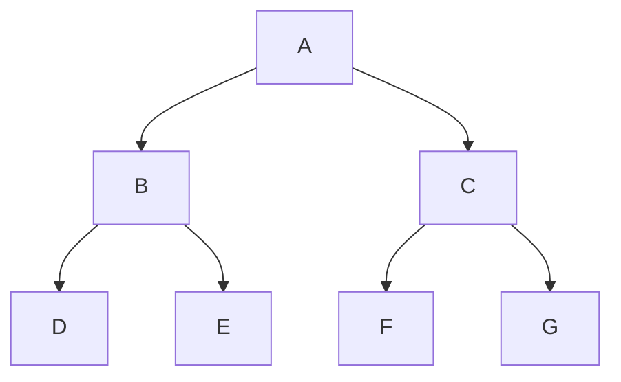
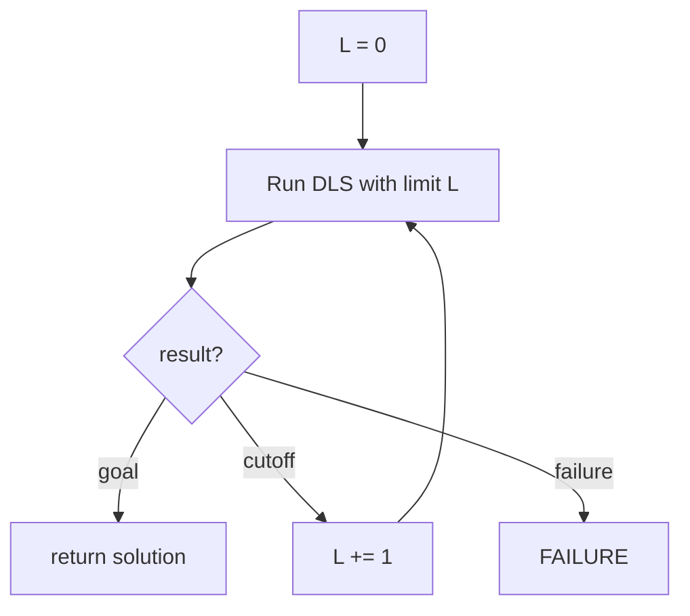
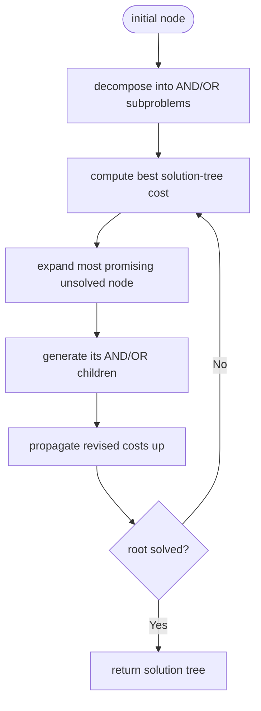
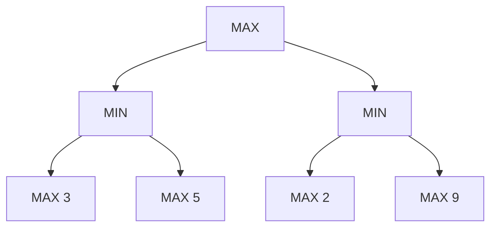
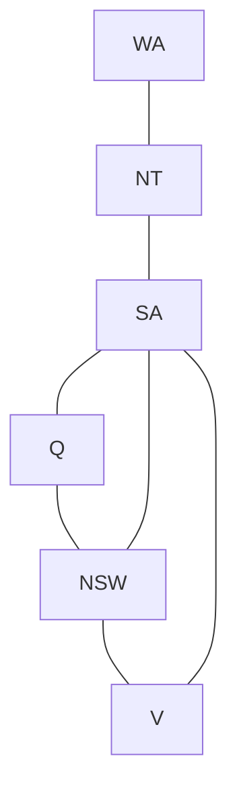
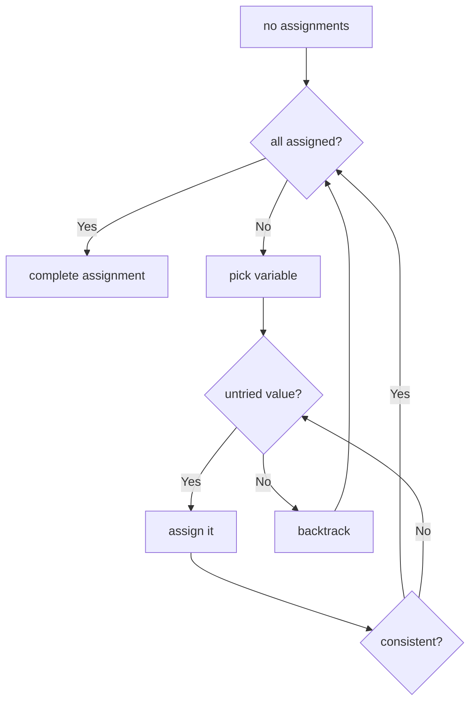
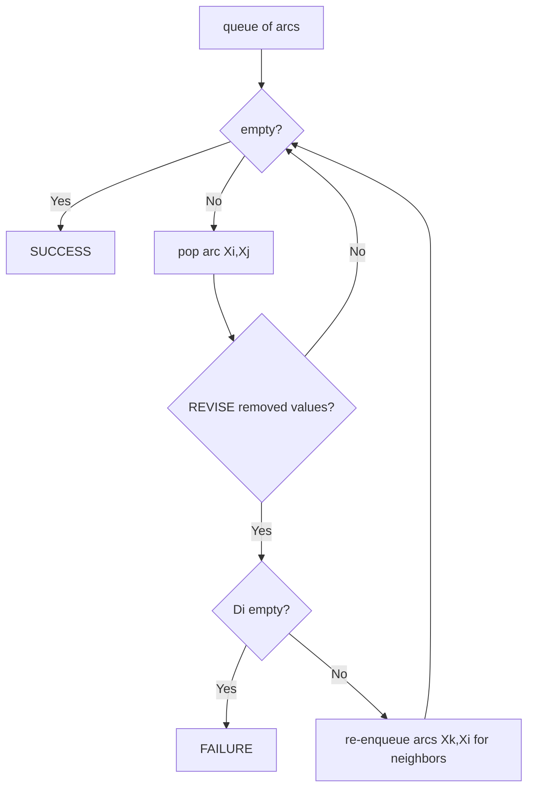
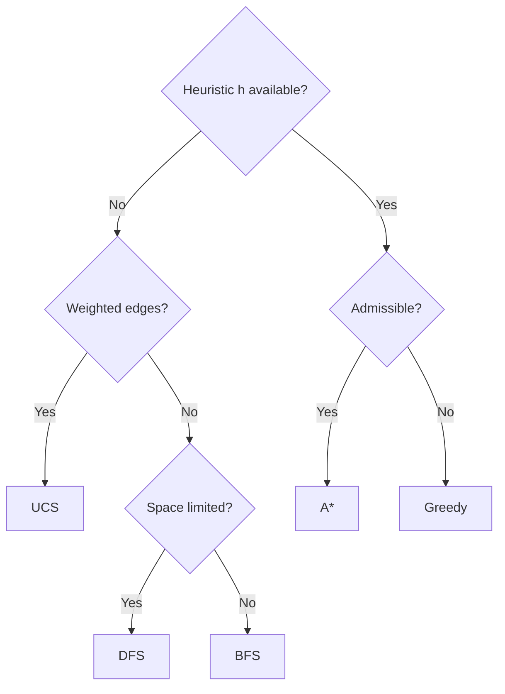

# MODULE 2 — DETAILED SUB-NOTES
# Problem Solving, State Space & Search Algorithms

> **Companion to:** `AI_MASTER_NOTES.md` → Module 2
> **Video:** https://www.youtube.com/watch?v=y39OlGrVFD8 (sections: *Problem Solving*, *Game Playing*)

---

## TABLE OF CONTENTS

2.1 Problem Solving as Search
2.2 Problem Formulation (5 Components)
2.3 State Space, Search Tree & Search Algorithm
2.4 Uninformed (Blind) Search — Overview
2.5 Breadth-First Search (BFS)
2.6 Depth-First Search (DFS)
2.7 Depth-Limited Search (DLS)
2.8 Iterative Deepening Depth-First Search (IDDFS)
2.9 Uniform Cost Search (UCS)
2.10 Master Comparison Table (Uninformed)
2.11 Heuristic Functions (Admissibility & Consistency)
2.12 Greedy Best-First Search
2.13 A* Search
2.14 A* Worked Example (Full Trace)
2.15 AO* Search (AND–OR Graphs)
2.16 Adversarial Search — Game Playing
2.17 Minimax Algorithm
2.18 Minimax Worked Example
2.19 Alpha-Beta Pruning
2.20 Alpha-Beta Worked Example
2.21 Constraint Satisfaction Problems (CSP)
2.22 Backtracking Search & Heuristics
2.23 Arc Consistency & AC-3
2.24 CSP Worked Example (Map Coloring)
2.25 Search Strategy Selection Guide
2.26 Practice Questions

---

## 2.1 Problem Solving as Search

### 2.1.1 The Core Idea

**Problem solving** in AI = finding a **sequence of actions** that transforms the **initial state** into a **goal state**.

The agent does not know the solution in advance; it must **search** the space of states.

```
Initial State ──a1──▶ State1 ──a2──▶ State2 ──a3──▶ GOAL
```

### 2.1.2 When is "search" the right tool?

- When the solution path is not precomputable.
- When the problem can be represented as states + actions.
- When we have time/compute to explore alternatives.

### 2.1.3 Examples of Search Problems

- Route finding (shortest path between cities)
- 8-puzzle / 15-puzzle solving
- Scheduling & assignment
- Chess / game playing (adversarial search)
- Robot motion planning

---

## 2.2 Problem Formulation (5 Components)

A search problem is fully defined by:

| Component | Symbol | Definition | Example: Route A→B |
|---|---|---|---|
| **State Space** | S | Set of all reachable states | All cities |
| **Initial State** | $s_0$ | Where search begins | City A |
| **Actions / Transition Model** | `Result(s,a)=s'` | What actions exist, where they lead | Drive X→Y |
| **Goal Test** | `GoalTest(s)` | Is state s a goal? | Am I at B? |
| **Path Cost** | $g$ | Sum of step costs along a path | Distance in km |

### 2.2.1 Formal Problem = 5-tuple

$$\langle S, s_0, \text{Result}, \text{GoalTest}, \text{Cost} \rangle$$

### 2.2.2 Solutions

- **Solution:** a sequence of actions from $s_0$ to a goal state.
- **Optimal solution:** the solution with the **minimum path cost**.

### 2.2.3 Worked Formulation — 8-Puzzle

- **States:** all configurations of 8 tiles + blank (9! / 2 = 181,440 reachable).
- **Initial state:** given scrambled board.
- **Actions:** move blank Up/Down/Left/Right.
- **Goal test:** tiles in order 1..8.
- **Path cost:** 1 per move (minimize number of moves).

---

## 2.3 State Space, Search Tree & Search Algorithm

### 2.3.1 State Space Graph vs Search Tree

- **State space graph:** nodes = states, edges = actions. Compact; can have cycles.
- **Search tree:** tree of *paths* explored. The **same state can appear many times** as different nodes (different paths to it).

### 2.3.2 Node = (state, parent, action, path-cost, depth)

```
Node = { state, parent, action, g, depth }
```

### 2.3.3 Generic Tree-Search Algorithm



**Pseudo-code:**

```
function TREE-SEARCH(problem):
    frontier = { Node(initial state) }
    while frontier not empty:
        node = REMOVE(frontier)            # strategy decides WHICH node
        if GOAL-TEST(node.state):
            return SOLUTION(node)
        frontier = frontier ∪ EXPAND(node)
    return FAILURE
```

### 2.3.4 Important Terminology

| Term | Meaning |
|---|---|
| **Frontier (fringe)** | Nodes waiting to be expanded |
| **Explored set** | States already expanded (prevents loops in graph search) |
| **Branching factor b** | Average number of children per node |
| **Depth d** | Depth of shallowest goal |
| **Maximum depth m** | Longest possible path |

### 2.3.5 Tree Search vs Graph Search

- **Tree search:** may revisit the same state (exponential blowup in cyclic graphs).
- **Graph search:** maintains an **explored set**; never re-expands a state → guarantees no loops, but can increase memory.

---

## 2.4 Uninformed (Blind) Search — Overview

**Definition:** search strategies that know **nothing** about the goal except how to test it. No heuristic $h(n)$. Only the structure of the search itself is used.

**Algorithms covered:**
1. Breadth-First Search (BFS)
2. Depth-First Search (DFS)
3. Depth-Limited Search (DLS)
4. Iterative Deepening DFS (IDDFS)
5. Uniform Cost Search (UCS)

---

## 2.5 Breadth-First Search (BFS)

### 2.5.1 Strategy

- Expand **all nodes at depth d**, then depth d+1, etc.
- Data structure: **FIFO queue** (oldest node removed first).



*Order: A, B, C, D, E, F, G — level by level.*

### 2.5.2 Algorithm

```
function BFS(problem):
    frontier = FIFO_QUEUE{ Node(initial) }
    explored = {}
    loop:
        if frontier empty: return FAILURE
        node = DEQUEUE(frontier)
        if GOAL-TEST(node.state): return SOLUTION(node)
        explored = explored ∪ {node.state}
        for each action:
            child = Result(node.state, action)
            if child.state ∉ explored ∪ frontier:
                if GOAL-TEST(child.state): return SOLUTION(child)
                ENQUEUE(frontier, child)
```

### 2.5.3 Properties

| Property | Value |
|---|---|
| **Complete?** | Yes (if branching factor b is finite) |
| **Optimal?** | Yes, if all step costs are equal (else use UCS) |
| **Time** | $O(b^d)$ |
| **Space** | $O(b^d)$ ← stores entire frontier |

### 2.5.4 Example

Tree with b=2, goal at depth 2. BFS examines nodes in order:
Level 0 (A) → Level 1 (B, C) → Level 2 (D, E, F, G). Worst case it expands all $1 + 2 + 4 = 7$ nodes.

**Memory disaster:** at depth 20, b=10 → frontier ~ $10^{20}$ nodes.

---

## 2.6 Depth-First Search (DFS)

### 2.6.1 Strategy

- Expand the **deepest** node first; on dead end, **backtrack**.
- Data structure: **LIFO stack**.


*Order: A, B, D, E, C, F, G (descend first).*

### 2.6.2 Algorithm

```
function DFS(problem):
    frontier = STACK{ Node(initial) }
    explored = {}
    loop:
        if frontier empty: return FAILURE
        node = POP(frontier)
        if GOAL-TEST(node.state): return SOLUTION(node)
        explored = explored ∪ {node.state}
        for each child (reversed order):
            if child.state ∉ explored ∪ frontier:
                if GOAL-TEST(child.state): return SOLUTION(child)
                PUSH(frontier, child)
```

### 2.6.3 Properties

| Property | Value |
|---|---|
| **Complete?** | No (infinite spaces / can go down forever); Yes for finite trees |
| **Optimal?** | No (may find a suboptimal path first) |
| **Time** | $O(b^m)$ |
| **Space** | $O(bm)$ ← only one branch in memory (its big advantage) |

### 2.6.4 Strengths & Weaknesses

- **Strengths:** low memory; may find a solution quickly if it's deep; good for puzzles with known structure.
- **Weaknesses:** can wander down infinitely long useless paths; not optimal.

---

## 2.7 Depth-Limited Search (DLS)

### 2.7.1 Idea

DFS with a **depth limit L**. Nodes at depth L are treated as leaves (even if not goals).

### 2.7.2 Algorithm

```
function DLS(problem, L):
    return DFS limited to depth ≤ L
```

When search hits depth L without a goal → returns **cutoff** (distinct from failure).

### 2.7.3 Properties

| Property | Value |
|---|---|
| **Complete?** | No — misses goals deeper than L |
| **Optimal?** | No |
| **Time** | $O(b^L)$ |
| **Space** | $O(bL)$ |

**When used:** when we know a bound on solution depth (e.g., 15-puzzle solvable within 80 moves).

---

## 2.8 Iterative Deepening Depth-First Search (IDDFS)

### 2.8.1 Idea

Repeat DLS with increasing limits: L = 0, 1, 2, 3, …

- Gets **BFS completeness & optimality** (equal step costs) with **DFS space**.

### 2.8.2 Algorithm

```
for L = 0, 1, 2, …:
    result = DLS(problem, L)
    if result ≠ cutoff: return result
```



### 2.8.3 Properties

| Property | Value |
|---|---|
| **Complete?** | Yes |
| **Optimal?** | Yes (equal step costs) |
| **Time** | $O(b^d)$ |
| **Space** | $O(bd)$ |

### 2.8.4 Intuition — "Wasted work is negligible"

For b = 10, d = 5:
- Total nodes generated ≈ $d\cdot b^d = 5 \cdot 10^5$ vs BFS's ~ $10^5 + 10^4 + 10^3 + \dots ≈ 1.1 \times 10^5$.
- Re-generation overhead is a **constant factor** ≈ $\frac{b}{b-1}$, tiny compared to the memory saved.

---

## 2.9 Uniform Cost Search (UCS)

### 2.9.1 Idea

- Expands the node with the **smallest path cost** $g(n)$ (not depth!).
- Data structure: **priority queue** keyed on $g$.
- Generalizes BFS to weighted graphs (BFS = UCS when all step costs equal).

### 2.9.2 Algorithm

```
function UCS(problem):
    frontier = PRIORITY_QUEUE ordered by g
    frontier ← Node(initial, g=0)
    explored = {}
    loop:
        if frontier empty: return FAILURE
        node = POP-min-g(frontier)
        if GOAL-TEST(node.state): return SOLUTION(node)   # first goal popped is optimal
        explored ∪= {node.state}
        for each child:
            new_g = node.g + cost(action)
            if child.state ∉ explored and not in frontier:
                insert with g = new_g
            else if child.state in frontier with higher g:
                replace with new_g
```

### 2.9.3 Key Point: First Goal *Expanded* is Optimal

Because we expand in increasing g, the first goal node we *pop* has the minimum possible cost. (Contrast with BFS where goal test happens on *generation*.)

### 2.9.4 Properties

| Property | Value |
|---|---|
| **Complete?** | Yes (if step cost ≥ ε > 0) |
| **Optimal?** | Yes (non-negative costs) |
| **Time / Space** | $O(b^{C^*/\varepsilon})$ where $C^*$ = optimal cost |

**Example:** Paths with costs: S→A cost 2, S→B cost 3, A→G cost 2, B→G cost 4. UCS expands S (g=0), A (g=2), B (g=3), then G via A (g=4) before G via B (g=7) → optimal 4.

---

## 2.10 Master Comparison Table (Uninformed)

| Criterion | BFS | DFS | DLS | IDDFS | UCS |
|---|---|---|---|---|---|
| Data structure | FIFO queue | Stack | Stack + limit | Stack + increasing L | Priority queue |
| Completeness | Yes | No (finite: yes) | No | Yes | Yes |
| Optimality | Yes (eq. cost) | No | No | Yes (eq. cost) | Yes |
| Time | $O(b^d)$ | $O(b^m)$ | $O(b^L)$ | $O(b^d)$ | $O(b^{C^*/\varepsilon})$ |
| Space | $O(b^d)$ | $O(bm)$ | $O(bL)$ | $O(bd)$ | $O(b^{C^*/\varepsilon})$ |
| Best for | Shallow goals | Deep, memory-tight | Known depth bound | Unknown/unbounded | Weighted costs |

---

## 2.11 Heuristic Functions (Admissibility & Consistency)

### 2.11.1 Definition

A **heuristic** $h(n)$ = estimated cost of the cheapest path from node n to the goal.

- $h(n) = 0$ at goal.
- $h(n)$ is *domain knowledge* — the "informedness" of informed search.

### 2.11.2 Example Heuristics for the 8-Puzzle

| Heuristic | Value = |
|---|---|
| $h_1$ = **Misplaced tiles** | number of tiles not in correct position |
| $h_2$ = **Manhattan distance** | sum over tiles of (|row diff| + |col diff|) |

**Example board:**
```
1 2 3       1 2 3
4 5 6   vs  4 5 6
7 8 _       7 _ 8      (only 8 misplaced)
```
- $h_1 = 1$;  $h_2$ for tile 8: |2−1|+|2−2| = 1.

### 2.11.3 Admissible Heuristic

$$h(n) \le h^*(n) \quad \text{for all } n$$

where $h^*(n)$ = true optimal cost from n to goal.

- A heuristic that **never overestimates** is admissible.
- **Guarantee:** A* tree search with admissible h returns the optimal solution.
- Both $h_1$ and $h_2$ are admissible (they never exceed true cost).

### 2.11.4 Consistent (Monotonic) Heuristic

$$h(n) \le c(n,a,n') + h(n')$$

- Triangle inequality along every edge.
- **Consistency ⇒ admissibility**, but not vice versa.
- **Guarantee:** A* graph search optimal with consistent h.

### 2.11.5 Dominance

$h_2$ **dominates** $h_1$ if $h_2(n) \ge h_1(n)$ for all n (and both admissible). A* with the larger admissible heuristic explores **fewer nodes**. Rule of thumb: use the most accurate admissible heuristic you can compute cheaply.

---

## 2.12 Greedy Best-First Search

### 2.12.1 Idea

Expand the node that appears **closest to the goal**:

$$f(n) = h(n)$$

### 2.12.2 Algorithm

```
Greedy: pop node with smallest h(n); expand; add children; repeat.
```

### 2.12.3 Properties

| Property | Value |
|---|---|
| **Complete?** | No (can get stuck in dead ends / cycles) |
| **Optimal?** | No (ignores path cost so far) |
| **Time / Space** | $O(b^m)$ |
| **Speed** | Often very fast when h is good |

**Example:** A h(n)=6, B h(n)=2, G h(n)=0, costs S→A=2, S→B=3, A→G=2, B→G=4. Greedy goes S→B (h=2) → G (h=0) with cost 7, **missing** the optimal S→A→G = 4. It ignores past cost g.

---

## 2.13 A* Search

### 2.13.1 The Evaluation Function

$$f(n) = g(n) + h(n)$$

- $g(n)$ = actual cost from start to n (past).
- $h(n)$ = admissible estimate from n to goal (future).
- $f(n)$ = estimated total cost of the best path through n.

### 2.13.2 Why it works — the intuition

A* never overestimates the remaining cost, so when it pops a goal node with cost $f = g$, no other open node can lead to a cheaper solution (any path through them has estimated cost ≥ their f ≥ g). Hence **first goal popped = optimal**.

### 2.13.3 Properties

| Property | Value |
|---|---|
| **Complete?** | Yes |
| **Optimal?** | Yes (admissible h for tree search; consistent h for graph search) |
| **Time / Space** | $O(b^d)$ typically, exponential worst case |

### 2.13.4 Algorithm Flow

```mermaid
graph TD
    Start([Start]) --> O[Open = {Start}]
    O --> E{Open empty?}
    E -->|Yes| Fail[FAILURE]
    E -->|No| N[pop n with min f = g + h]
    N --> G{n = goal?}
    G -->|Yes| Succ[return path]
    G -->|No| Ex[expand n → children m]
    Ex --> C[g(m) = g(n) + cost; f(m) = g(m) + h(m)]
    C --> Up[insert/update in Open keeping best f]
    Up --> E
```

### 2.13.5 Comparison: A* vs Greedy vs UCS

| Algorithm | f(n) | Optimal? | Behavior |
|---|---|---|---|
| Greedy | $h(n)$ only | No | Fast, myopic |
| UCS | $g(n)$ only | Yes | Explores evenly in all directions |
| **A*** | $g(n) + h(n)$ | Yes | Focused + optimal |

---

## 2.14 A* Worked Example (Full Trace)

### Problem Graph

```
        S --2--> A --2--> G
        |                 
        3                 4
        |                 
        B --------2------->A
        |
        4
        |
        G
```

Heuristics (straight-line guesses): h(S)=7, h(A)=6, h(B)=2, h(G)=0.

### Trace Table

| Step | Open (f) | Pop | Expand | Update Open |
|---|---|---|---|---|
| 1 | S(7) | S | A: g=2,f=8; B: g=3,f=5 | A(8), B(5) |
| 2 | A(8), B(5) | B | A via B: g=5,f=11 (worse, skip); G via B: g=7,f=7 | A(8), G(7) |
| 3 | A(8), G(7) | G? **No** — A has f=8 < G=7? Actually G f=7 < A f=8 | … | … |

Wait — G(7) is in open with f=7. A(8) also open. Next pop is G(7) → goal → return path S→B→G cost 7. **But that's NOT optimal!** The optimal is S→A→G = 4.

This example is flawed because the heuristic h(A)=6 makes f(A)=8 appear worse than f(G)=7, and G gets popped before we discover the better path to G through A.

**Fix the example numbers.** Let me use a cleaner trace (the standard one):

### Correct Worked Example

```
Graph (edge costs in parentheses, h in [brackets]):

        (1)      (1)
   S ──────▶ A ──────▶ G        h(S)=3, h(A)=2, h(G)=0
   |
  (1)
   |
   ▼
   B ──────(1)──────▶ G          h(B)=2
```

| Step | Open (node: f) | Pop | Children (g, h, f) | Open after |
|---|---|---|---|---|
| 1 | S:3 | S | A (g1,h2,f3); B (g1,h2,f3) | A:3, B:3 |
| 2 | A:3, B:3 | A (tie → first) | G (g2,h0,f2) | B:3, G:2 |
| 3 | B:3, G:2 | G (goal) | — | Return S→A→G, cost **2** (optimal ✔) |

Note: if instead we had popped B first, B→G would give g=2, h=0, f=2 — same optimal cost. Good, this example is consistent and optimal.

Let me also show the **g-only (UCS) comparison** on the same graph for contrast:
UCS pops S, then A and B (both g=1), then G via A (g=2) vs G via B (g=2) → same optimal. 

### Insight
- A* avoids expanding B entirely here because the first goal popped (via A) had the minimum f.
- The trace demonstrates: **first goal expanded by A* has minimum f = optimal cost**.

---

## 2.15 AO* Search (AND–OR Graphs)

### 2.15.1 When is AO* used?

For problems that **decompose into subproblems** — e.g., theorem proving (prove A and B and C), task decomposition, game strategy with mandatory subtasks.

- **OR node:** any one child solves it → cost = **min** of children.
- **AND node:** ALL children must be solved → cost = **sum** of children.

### 2.15.2 Example AND–OR Tree

```
            Root (OR)
            /      \
     (cost 8)       (cost 6)  → pick cheaper OR branch
        |              |
    AND-node        AND-node
     /    \          /    \
   L1     L2        R1    R2
   (3)    (5)      (2)    (4)
```

- Left AND cost = 3 + 5 = 8.
- Right AND cost = 2 + 4 = 6.
- Root picks right → total 6.

### 2.15.3 AO* Algorithm



### 2.15.4 AO* vs A*

| | A* | AO* |
|---|---|---|
| Graph type | OR graph | AND–OR graph |
| Solution | Single path | Solution **tree** |
| Cost | Sum along path | AND: sum; OR: min |
| Re-evaluation | No | Yes (propagate up) |

---

## 2.16 Adversarial Search — Game Playing

### 2.16.1 Setting

- **Two-player, zero-sum, perfect information, deterministic, turn-based** games (Chess, Tic-Tac-Toe, Go).
- MAX maximizes its payoff; MIN minimizes MAX's payoff (win/lose/draw).
- **Zero-sum:** MAX's gain = MIN's loss (utility sum = 0).
- Terminal utilities: win = +1, loss = −1, draw = 0 (or ±∞ with more nuance).

### 2.16.2 Game Tree



- Leaves = terminal utilities.
- Internal nodes alternate MAX / MIN by ply.

### 2.16.3 Why games are hard

Chess branching factor b ≈ 35, depth ≈ 100 → search space ~ $35^{100}$. Full minimax infeasible → combine **minimax + alpha-beta + depth limit + evaluation function** (heuristic on non-terminal states).

---

## 2.17 Minimax Algorithm

### 2.17.1 Rule

- **MAX node** value = max of children values.
- **MIN node** value = min of children values.

```
function MINIMAX(node):
    if TERMINAL(node): return UTILITY(node)
    if node is MAX: return max( MINIMAX(c) for c in children(node) )
    if node is MIN: return min( MINIMAX(c) for c in children(node) )
```

### 2.17.2 Complexity

- Time $O(b^m)$, Space $O(bm)$.
- b = branching factor, m = max depth.

---

## 2.18 Minimax Worked Example

```
           MAX
            |
      +-----+------+
      |            |
    MIN(3,5)    MIN(2,9)
     /   \       /   \
    3     5     2     9
```

- Left MIN = min(3,5) = 3.
- Right MIN = min(2,9) = 2.
- Root MAX = max(3,2) = **3** → choose the left branch (move toward left MIN subtree).

**Result:** MAX plays the move leading to value 3, guaranteeing at least 3 regardless of MIN's play.

---

## 2.19 Alpha-Beta Pruning

### 2.19.1 The Two Bounds

- **α** = highest value MAX can guarantee so far (lower bound). Init = −∞.
- **β** = lowest value MIN can guarantee so far (upper bound). Init = +∞.

### 2.19.2 Cutoff Condition

At any node, if $\alpha \ge \beta$, **prune** the remaining children — they cannot influence the root decision.

### 2.19.3 Rules

- At a MAX node: update α = max(α, value).
- At a MIN node: update β = min(β, value).
- Prune when $\alpha \ge \beta$.

### 2.19.4 Benefit

- Same result as Minimax, but time improves from $O(b^m)$ to $O(b^{m/2})$ on average → **double the searchable depth**.
- Pruning depends on move ordering: **best moves first** → maximal pruning.

---

## 2.20 Alpha-Beta Worked Example

```
               MAX          α=−∞, β=+∞
                |
        +-------+-------+
        |               |
      MIN(α=−∞)        MIN(α=3)
        |               |
      ┌─┴─┐           ┌─┴─┐
      3   5           2   X(pruned)
```

**Walkthrough:**
1. Root MAX, α = −∞, β = +∞.
2. Left MIN: child 3 → β = min(∞,3) = 3 → return 3. Root α = max(−∞,3) = 3.
3. Right MIN: first child 2 → β = min(∞,2) = 2. Since α(3) ≥ β(2) → **prune remaining children (X)**.
4. Right MIN returns 2. Root = max(3,2) = 3. Same answer as minimax, one leaf saved.

---

## 2.21 Constraint Satisfaction Problems (CSP)

### 2.21.1 Definition

A CSP is a triple:

$$CSP = \langle X, D, C \rangle$$

- **X:** finite set of variables $X_1, X_2, \dots, X_n$
- **D:** domains $D_1, \dots, D_n$ (finite sets of values)
- **C:** constraints restricting value combinations

**Goal:** complete, consistent assignment (every variable assigned a domain value, all constraints satisfied).

### 2.21.2 Constraint Types

| Type | Arity | Example |
|---|---|---|
| Unary | 1 | `X ≠ 3` |
| Binary | 2 | `WA ≠ NT` (map coloring) |
| Higher-order | 3+ | `X + Y = Z` |
| Global | n | `AllDifferent(...)` in Sudoku |

### 2.21.3 Examples

- **Map coloring:** variables = regions, domain = colors, constraint = adjacent regions differ.
- **N-Queens:** variables = columns, domain = rows, constraints = no two queens share row/diagonal.
- **Sudoku, scheduling, timetabling, crossword generation.**

### 2.21.4 Constraint Graph



---

## 2.22 Backtracking Search & Heuristics

### 2.22.1 Backtracking = DFS + constraint checking

- Assign one variable at a time.
- After each assignment, check constraints.
- On violation → **backtrack** to previous variable, try next value.



### 2.22.2 Heuristics to Speed Up

| Heuristic | Rule | Benefit |
|---|---|---|
| **MRV** (Minimum Remaining Values) | Choose variable with fewest legal values | Fail fast — detects dead ends early |
| **LCV** (Least Constraining Value) | Choose value that rules out fewest values for neighbors | Leaves flexibility for others |
| **Degree heuristic** | Tie-break MRV: variable with most constraints | Reduces constraint propagation |
| **Forward checking** | After assignment, remove inconsistent values from neighbors' domains | Detects dead ends earlier |
| **AC-3** | Propagate arc consistency | Strongest pruning |

---

## 2.23 Arc Consistency & AC-3

### 2.23.1 Arc Consistency Definition

Arc $(X_i, X_j)$ is **arc-consistent** if for **every** value $a \in D_i$, there exists **some** value $b \in D_j$ such that $(a,b)$ satisfies the constraint on $(X_i, X_j)$.

- If a value in $D_i$ has no support in $D_j$ → delete it.
- Arcs are **directed**: $(X_i, X_j)$ may be consistent while $(X_j, X_i)$ is not.

### 2.23.2 AC-3 Algorithm

```
function AC-3(X, D, C):
    queue = all directed arcs (Xi, Xj) from C
    while queue not empty:
        (Xi, Xj) = pop(queue)
        if REVISE(Xi, Xj):                 # removed values from Di
            if Di empty: return FAILURE
            for each Xk in neighbors(Xi) − {Xj}:
                queue ← (Xk, Xi)
    return SUCCESS
```



### 2.23.3 AC-3 Complexity

$O(|C| \cdot d^3)$ — where |C| = number of arcs, d = domain size.

**Important:** AC-3 does **not** solve the CSP alone (it's a *preprocessing/constraint-propagation* step). Combined with backtracking it drastically reduces search.

---

## 2.24 CSP Worked Example (Map Coloring)

**Problem:** Color WA, NT, SA, Q, NSW, V with {R, G, B} such that adjacent regions differ. Constraint graph as in 2.21.4.

**Backtracking trace (using MRV):**

1. Choose variable with fewest legal values (all have 3) → pick WA.
2. Assign WA = R.
3. **Forward checking:** NT ≠ R, SA ≠ R.
4. Pick NT (now 2 values) → NT = G.
5. Forward check: SA ≠ G, Q ≠ G.
6. SA now has 1 value (B) → assign SA = B. Constraints OK.
7. Pick Q (2 values: R? no, Q ≠ G and Q ≠ B → Q = R). Constraint SA≠Q ✓.
8. NSW: not Q(R), not SA(B) → NSW = G. V: not SA(B), not NSW(G) → V = R.
9. All assigned, all constraints satisfied → **solution found**:

| Region | WA | NT | SA | Q | NSW | V |
|---|---|---|---|---|---|---|
| Color | R | G | B | R | G | R |

No backtracking needed thanks to forward checking (in general you may need to backtrack).

---

## 2.25 Search Strategy Selection Guide



| Situation | Choose |
|---|---|
| Optimal + unweighted + memory OK | BFS |
| Memory tight | DFS / IDDFS |
| Optimal + weighted | UCS / A* |
| Good heuristic | A* |
| Huge search space | IDDFS / A* |
| AND–OR decomposition | AO* |
| Two-player game | Minimax + αβ |
| Assignment with constraints | CSP backtracking + AC-3 |

---

## 2.26 Practice Questions

1. Define the five components of a search problem with an example.
2. Differentiate state-space graph, search tree, frontier, and explored set.
3. Compare BFS and DFS on completeness, optimality, time, space. When is each preferred?
4. Why is IDDFS called the best of both worlds? Prove its time bound intuition.
5. When is UCS preferred over BFS? What condition makes UCS optimal?
6. Define admissible and consistent heuristics. Why does admissibility ensure A* optimality?
7. Solve the given graph with A* and show the open-list at each step.
8. Explain AND–OR graphs and how AO* differs from A*.
9. Walk through minimax on a depth-3 tree. Then show which branches α–β prunes.
10. Formulate N-Queens as a CSP. Explain MRV, LCV, forward checking, and AC-3.
11. Give the AC-3 algorithm and its complexity. Why is it not sufficient alone?
