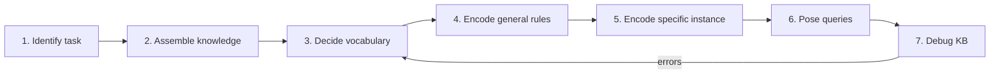
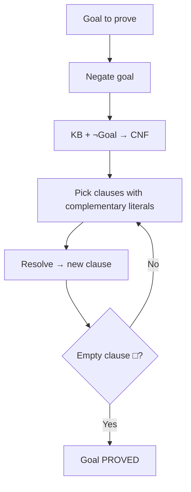
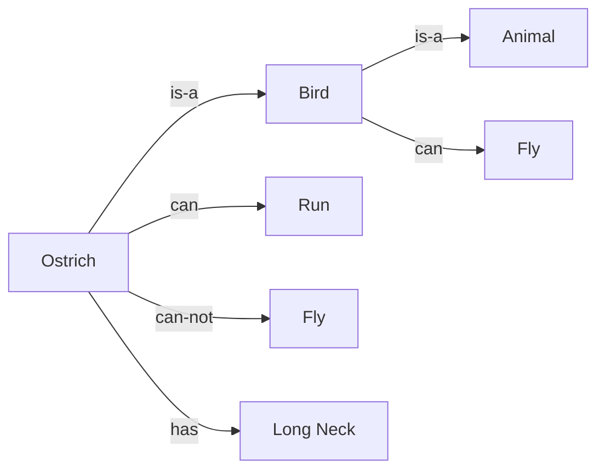
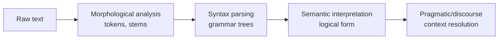

# MODULE 3 — DETAILED SUB-NOTES
# Knowledge Representation, Reasoning & Logic

> **Companion to:** `AI_MASTER_NOTES.md` → Module 3
> **Video:** https://www.youtube.com/watch?v=y39OlGrVFD8 (sections: *Knowledge Representation*, *NLP*)

---

## TABLE OF CONTENTS

3.1 Why Knowledge Representation?
3.2 Knowledge Base (KB) Architecture
3.3 Propositional Logic — Complete
3.4 First-Order Logic (FOL) — Complete
3.5 Converting Natural Language to FOL
3.6 Knowledge Engineering Steps
3.7 Inference Rules (Modus Ponens, Modus Tollens, and more)
3.8 Resolution & Refutation Method
3.9 Converting FOL to CNF (Detailed)
3.10 Unification
3.11 Forward Chaining — Detailed
3.12 Backward Chaining — Detailed
3.13 Forward vs Backward Chaining
3.14 Semantic Networks — Detailed
3.15 Frames — Detailed
3.16 Conceptual Dependency (CD) Theory — Detailed
3.17 NLP in Knowledge Representation
3.18 Summary
3.19 Practice Questions

---

## 3.1 Why Knowledge Representation?

An intelligent agent must store what it knows about the world and use it to answer questions, reason, and act.

**Requirements of a good KR scheme (Fikes & Nilsson / Davis et al.):**

1. **Representational adequacy** — able to represent all needed knowledge.
2. **Inferential adequacy** — able to derive new knowledge (inference).
3. **Inferential efficiency** — inference is fast.
4. **Acquisitional efficiency** — easy to add new knowledge.

### KR Approaches Hierarchy

```
Knowledge Representation
 ├── Logical Representation        (Propositional logic, FOL)
 ├── Rule-Based Systems           (Production rules / inference engines)
 ├── Semantic Networks            (graph-based)
 ├── Frames                       (structured objects)
 ├── Conceptual Dependency        (action primitives)
 ├── Scripts                      (stereotypical event sequences)
 └── Logic-based + Probabilistic  (Bayesian networks — advanced)
```

---

## 3.2 Knowledge Base (KB) Architecture

```mermaid
graph LR
    KB[Knowledge Base<br/>Sentences (facts + rules)] --> IE[Inference Engine<br/>derives new sentences]
    Q[Query] --> IE
    IE --> Answer[Answer Yes/No or What/Why]
```

- **Knowledge-Based Agent loop:**
  1. Receive percept.
  2. **TELL** the KB what is observed (`TELL(KB, sentence)`).
  3. **ASK** the KB what to do (`ASK(KB, query)`).
  4. Perform action.

- **Logical entailment:** KB ⊨ α means "in every world where KB is true, α is also true" — the inference engine uses this to answer queries.

---

## 3.3 Propositional Logic — Complete

### 3.3.1 Syntax

Atoms (propositions) + connectives:

| Symbol | Name | Meaning |
|---|---|---|
| $\neg$ | NOT | negation |
| $\land$ | AND | conjunction |
| $\lor$ | OR | disjunction |
| $\Rightarrow$ | implication | if…then |
| $\Leftrightarrow$ | biconditional | if and only if |

**Well-formed formulas (WFF):**
- Atoms: `P, Q, R` (or `Rain`, `Wet`).
- Compound: `P ∧ Q`, `P ∨ Q`, `¬P`, `P ⇒ Q`, `P ⇔ Q`.

### 3.3.2 Semantics — Truth Tables

| P | Q | ¬P | P∧Q | P∨Q | P⇒Q | P⇔Q |
|---|---|---|---|---|---|---|
| T | T | F | T | T | T | T |
| T | F | F | F | T | F | F |
| F | T | T | F | T | T | F |
| F | F | T | F | F | T | T |

**Key reading:**
- `P ⇒ Q` is false **only** when P is true and Q is false.
- `P ⇔ Q` is true when both same.

### 3.3.3 Logical Equivalences (Identities)

| Law | Formula |
|---|---|
| Double negation | $\neg\neg P \equiv P$ |
| De Morgan | $\neg(P \land Q) \equiv \neg P \lor \neg Q$; $\neg(P \lor Q) \equiv \neg P \land \neg Q$ |
| Implication | $P \Rightarrow Q \equiv \neg P \lor Q$ |
| Contrapositive | $P \Rightarrow Q \equiv \neg Q \Rightarrow \neg P$ |
| Biconditional | $P \Leftrightarrow Q \equiv (P \Rightarrow Q) \land (Q \Rightarrow P)$ |
| Distributive | $P \land (Q \lor R) \equiv (P\land Q) \lor (P\land R)$ |
| Commutative | $P\land Q \equiv Q \land P$; $P\lor Q \equiv Q \lor P$ |
| Associative | $(P\land Q)\land R \equiv P\land(Q\land R)$ |
| Absorption | $P \lor (P \land Q) \equiv P$ |
| Tautology | $P \lor \neg P \equiv T$ |
| Contradiction | $P \land \neg P \equiv F$ |

### 3.3.4 Limitation (Why we need FOL)

Cannot express:
- Objects & their properties: "Ravi is tall"
- Relations between objects: "Ravi is the father of Sunil"
- Quantities: "All students", "Some dogs"
- Generalizations: "All humans are mortal"

---

## 3.4 First-Order Logic (FOL) — Complete

### 3.4.1 Syntax — Building Blocks

| Element | Description | Example |
|---|---|---|
| **Constant** | Names a specific object | `Ravi`, `AI`, `2` |
| **Variable** | Ranges over objects | `x, y, z` |
| **Function** | Maps objects → objects | `fatherOf(Ravi)`, `Age(x)` |
| **Predicate** | Relation, returns True/False | `Human(x)`, `Likes(Ravi, AI)` |
| **Quantifier** | ∀ (all), ∃ (exists) | `∀x`, `∃y` |
| **Connectives** | ¬ ∧ ∨ ⇒ ⇔ | same as propositional |

### 3.4.2 Terms and Atomic Sentences

- **Term** = constant OR variable OR function applied to terms. Denotes an **object**.
  - `fatherOf(Ravi)` is a term (the object "Ravi's father").
- **Atomic sentence** = predicate applied to terms. Denotes **True/False**.
  - `Human(fatherOf(Ravi))`.

### 3.4.3 Quantifiers

| Quantifier | Reads as | Formal example | Meaning |
|---|---|---|---|
| $\forall x$ | "for all x" | $\forall x\; Human(x) \Rightarrow Mortal(x)$ | Every human is mortal |
| $\exists x$ | "there exists x" | $\exists x\; Dog(x) \land Black(x)$ | Some dog is black |

**Scope & binding:** the variable in the quantifier is *bound*; other occurrences are *free* (avoid free variables in KB).

**Important subtlety — ∃ with ⇒ is usually wrong:**
- "Some dogs bark" must be $\exists x (Dog(x) \land Bark(x))$.
- $\exists x (Dog(x) \Rightarrow Bark(x))$ is trivially true whenever there's any non-dog object (bad!).

**∀ with ∧ is usually wrong:**
- "All dogs bark" must be $\forall x (Dog(x) \Rightarrow Bark(x))$.
- $\forall x (Dog(x) \land Bark(x))$ claims *everything* is a barking dog (bad!).

### 3.4.4 Model / Interpretation

A model for an FOL sentence specifies:
- A domain (set of objects),
- An assignment: constants → objects, predicates → relations, functions → functions.
- A sentence is **true** in a model if it holds under that interpretation.

### 3.4.5 Inference in FOL

- Ground terms + universal instantiation (UI) & existential instantiation (EI).
- **Unification** to match literals (see 3.10).
- **Resolution** (see 3.8) — complete for FOL.

---

## 3.5 Converting Natural Language to FOL

### 3.5.1 Step-by-Step Recipe

1. Identify the **verbs** → predicates.
2. Identify the **nouns** → constants or variables.
3. Identify **quantifier words**: all/every/any/no → ∀; some/a/an → ∃.
4. Apply the golden rules:
   - "All X …" → $\forall x (X(x) \Rightarrow \dots)$
   - "Some X …" → $\exists x (X(x) \land \dots)$
   - "No X …" → $\neg\exists x (X(x) \land \dots)$ or $\forall x (X(x) \Rightarrow \neg\dots)$

### 3.5.2 Examples

| English | FOL |
|---|---|
| All students love AI | $\forall x [Student(x) \Rightarrow Loves(x, AI)]$ |
| Some students love AI | $\exists x [Student(x) \land Loves(x, AI)]$ |
| No student hates AI | $\forall x [Student(x) \Rightarrow \neg Hates(x, AI)]$ |
| Every city has a mayor | $\forall c [City(c) \Rightarrow \exists m \; MayorOf(m, c)]$ |
| Ravi is the father of Sunil | $Father(Ravi, Sunil)$ |
| Some dog is sleeping | $\exists d [Dog(d) \land Sleeping(d)]$ |
| All dogs bark | $\forall d [Dog(d) \Rightarrow Barks(d)]$ |
| There is exactly one king | $\exists k [King(k) \land \forall x (King(x) \Rightarrow x = k)]$ |
| John likes Mary or Susan | $Likes(John, Mary) \lor Likes(John, Susan)$ |
| If it rains, the ground is wet | $Rains \Rightarrow Wet(Ground)$ |

---

## 3.6 Knowledge Engineering Steps

**Definition:** process of building a KB from domain knowledge (used in expert systems).



### Worked Mini-Example — "Build a KB for a family domain"

1. **Task:** answer "is X an ancestor of Y?"
2. **Knowledge:** parents, siblings, grandparents relationships.
3. **Vocabulary:** predicates `Parent(x,y)`, `Ancestor(x,y)`, constants `Ravi`, `Sunil`.
4. **General rules:**
   - $\forall x \forall y [Parent(x,y) \Rightarrow Ancestor(x,y)]$
   - $\forall x \forall y \forall z [Ancestor(x,y) \land Ancestor(y,z) \Rightarrow Ancestor(x,z)]$
5. **Instance facts:** `Parent(Ravi, Sunil)`, `Parent(Sunil, Amit)`.
6. **Query:** `ASK Ancestor(Ravi, Amit)` → inference derives TRUE.
7. **Debug:** if wrong, check rules/axioms.

---

## 3.7 Inference Rules

### 3.7.1 Modus Ponens (forward)

$$\frac{A,\quad A \Rightarrow B}{B}$$

"If it rains and rain ⇒ wet, then wet."

### 3.7.2 Modus Tollens (backward)

$$\frac{\neg B,\quad A \Rightarrow B}{\neg A}$$

"If not wet and rain ⇒ wet, then it did not rain."

### 3.7.3 Other Useful Rules

| Rule | Form |
|---|---|
| And-Elimination | $\frac{A \land B}{A}$ |
| And-Introduction | $\frac{A,\; B}{A \land B}$ |
| Or-Introduction | $\frac{A}{A \lor B}$ |
| Hypothetical syllogism | $\frac{A \Rightarrow B,\; B \Rightarrow C}{A \Rightarrow C}$ |
| Disjunctive syllogism | $\frac{A \lor B,\; \neg A}{B}$ |
| Universal instantiation | $\frac{\forall x\; P(x)}{P(c)}$ (c any constant) |
| Existential instantiation | $\frac{\exists x\; P(x)}{P(c)}$ (c new constant) |

---

## 3.8 Resolution & Refutation Method

### 3.8.1 Idea

To prove **KB ⊨ Goal**:

1. **Negate the goal** (assume it's false).
2. Convert KB + ¬Goal into **CNF** clauses.
3. Apply **resolution** repeatedly.
4. If you derive the **empty clause (□)**, a contradiction exists → the negation is false → **Goal is proved**.

### 3.8.2 Resolution Rule (Propositional)

$$\frac{(A \lor P),\quad (B \lor \neg P)}{A \lor B}$$

Complementary literals $P$ and $\neg P$ cancel.

### 3.8.3 Resolution Example (Propositional)

KB:
- $A \lor B$  (clause 1)
- $\neg A \lor C$  (clause 2)
- $\neg B$  (clause 3)

Prove C:
- Resolve (1) & (3): A and ¬A? No — (1) has A, (3) has ¬B. Resolve (1) & (3): $A \lor B$ and $\neg B$ → **A** (clause 4).
- Resolve (4) & (2): A and ¬A cancel → **C** (clause 5).
- Negate goal (¬C) and resolve with C → **empty clause □**. C is proved. ✔

### 3.8.4 Resolution Refutation Flow



---

## 3.9 Converting FOL to CNF (Detailed)

**Purpose:** resolution requires clauses (disjunctions of literals).

**7 Steps:**

### Step 1 — Eliminate implications
$A \Rightarrow B \equiv \neg A \lor B$;  $A \Leftrightarrow B \equiv (\neg A \lor B) \land (\neg B \lor A)$

### Step 2 — Move negation inward (De Morgan & double negation)
- $\neg\forall x P \equiv \exists x \neg P$
- $\neg\exists x P \equiv \forall x \neg P$
- $\neg(P \land Q) \equiv \neg P \lor \neg Q$
- $\neg(P \lor Q) \equiv \neg P \land \neg Q$
- $\neg\neg P \equiv P$

### Step 3 — Standardize variables apart
Rename so each quantifier binds a unique variable:
- $\forall x P(x) \lor \forall x Q(x)$ → $\forall x P(x) \lor \forall y Q(y)$

### Step 4 — Skolemize (remove ∃)
- If ∃ not inside ∀: replace with a **Skolem constant**: $\exists x Dog(x)$ → $Dog(Fido)$.
- If ∃ inside ∀: replace with a **Skolem function**: $\forall x \exists y Likes(x, y)$ → $\forall x Likes(x, f(x))$.

### Step 5 — Drop universal quantifiers
All remaining variables are implicitly universally quantified.

### Step 6 — Distribute ∨ over ∧
Convert to conjunction of clauses: $P \lor (Q \land R)$ → $(P \lor Q) \land (P \lor R)$.

### Step 7 — Separate clauses; standardize apart
Each conjunct is one clause (disjunction of literals).

### Worked Example

Sentence: $\forall x [\forall y Human(y) \Rightarrow Likes(x, y)]$

1. Eliminate ⇒: $\forall x [\neg \forall y Human(y) \lor Likes(x, y)]$
2. Move ¬ in: $\forall x [\exists y \neg Human(y) \lor Likes(x, y)]$
3. Standardize apart: $\forall x [\exists y \neg Human(y) \lor Likes(x, y)]$ (already apart)
4. Skolemize (∃y inside ∀x): $\forall x [\neg Human(s(x)) \lor Likes(x, s(x))]$
5. Drop ∀: $\neg Human(s(x)) \lor Likes(x, s(x))$
6. Already a clause. 7. Done.

**CNF result:** one clause: $\{\neg Human(s(x)),\; Likes(x, s(x))\}$

---

## 3.10 Unification

**Definition:** find a substitution $\theta$ that makes two literals identical.

### Example
- Literal 1: `Father(Ravi, y)`
- Literal 2: `Father(Ravi, Sunil)`
- Unifier: $\theta = \{ y / Sunil \}$

### UNIFY Algorithm (standard)
```
UNIFY(x, y, θ):
    if x == y: return θ
    if VARIABLE(x): return UNIFY-VAR(x, y, θ)
    if VARIABLE(y): return UNIFY-VAR(y, x, θ)
    if COMPOUND(x) and COMPOUND(y):
        if same predicate/function:
            return UNIFY(rest(x), rest(y), UNIFY(args(x), args(y), θ))
    return FAILURE
```

**Occurs check:** prevent unifying a variable with a term containing it (e.g., $x = f(x)$).

---

## 3.11 Forward Chaining — Detailed

### 3.11.1 Concept
**Data-driven reasoning:** start from known facts, fire rules whose premises are satisfied, add conclusions, repeat.

### 3.11.2 Algorithm

```
function FORWARD-CHAIN(KB, rules, goal):
    repeat:
        changed = false
        for each rule with ALL premises ∈ KB:
            KB = KB ∪ { conclusion }
            changed = true
            if conclusion == goal: return TRUE
    until not changed
    return goal ∈ KB
```

### 3.11.3 Example Walkthrough

**Facts:** `A, B, D`
**Rules:**
- R1: `A ∧ B ⇒ C`
- R2: `C ⇒ E`
- R3: `E ⇒ F`
- R4: `D ⇒ G`

**Goal:** `F`

| Iteration | Rule fires | New facts |
|---|---|---|
| 1 | R1 (A,B known) | C |
| 2 | R2 (C known) | E |
| 3 | R3 (E known) | **F** ✓ |

Derived in order: C → E → F. Goal reached in 3 steps.

### 3.11.4 Properties
- **Sound & complete** for definite clauses (with appropriate strategies).
- **Approach:** bottom-up.
- **Good for:** many goals, few rules, data-driven tasks (monitoring, diagnosis).

---

## 3.12 Backward Chaining — Detailed

### 3.12.1 Concept
**Goal-driven reasoning:** start from the goal, work backwards through rules until all subgoals reduce to known facts.

### 3.12.2 Algorithm (depth-first over rules)

```
function BACKWARD-CHAIN(goal, KB):
    if goal ∈ KB: return TRUE
    for each rule R whose conclusion unifies with goal:
        subst = UNIFY(conclusion(R), goal)
        if subst == FAILURE: continue
        all_premises_proved = TRUE
        for each premise p in premises(R):
            if not BACKWARD-CHAIN(SUBST(subst, p), KB):
                all_premises_proved = FALSE
                break
        if all_premises_proved: return TRUE
    return FALSE
```

### 3.12.3 Example Walkthrough

**Facts:** `A, B`
**Rules:**
- R1: `A ∧ B ⇒ C`
- R2: `C ⇒ D`

**Goal:** `D`

1. Is `D` in KB? No.
2. Rule R2 conclusion `D` matches. Subgoals: premise `C`.
3. Is `C` in KB? No.
4. Rule R1 conclusion `C` matches. Subgoals: `A`, `B`.
5. `A` in KB ✓. `B` in KB ✓.
6. So `C` proven, hence `D` proven. **TRUE.** ✔

**Search order note:** backward chaining explores subgoals depth-first; with variables it also *unifies* and instantiates (as in Prolog).

### 3.12.4 Properties
- Sound & complete for definite clauses.
- **Approach:** top-down, depth-first.
- **Good for:** single goal, many rules, few facts (question-answering).

---

## 3.13 Forward vs Backward Chaining

| Criterion | Forward Chaining | Backward Chaining |
|---|---|---|
| Direction | Facts → Goal | Goal → Facts |
| Start | Known data | Query |
| Search | Bottom-up (data-driven) | Top-down (goal-driven) |
| Efficiency | Good: many goals, few rules | Good: few goals, many rules |
| Implementation | CLIPS, OPS5 | Prolog |
| Memory | May derive irrelevant facts | Only explores relevant subgoals |
| Termination | No new facts derivable | Goal proved / impossible |

---

## 3.14 Semantic Networks — Detailed

### 3.14.1 Definition
Graph-based KR: **nodes** = concepts/objects; **labeled edges** = relations.

### 3.14.2 Example



### 3.14.3 Key Relations

| Relation | Meaning | Example |
|---|---|---|
| **is-a** | Subclass / instantiation | Ostrich is-a Bird |
| **has-property** | Attribute | Bird has-beak |
| **has-part** | Part-whole | Bird has-part Wing |

### 3.14.4 Property Inheritance

- Child nodes **inherit** properties of parents (unless **overridden**).
- Ostrich inherits `is-a Animal` from Bird; overrides `can Fly` with `can-not Fly`.

### 3.14.5 Inference — Spreading Activation / Link Traversal

- Answer "Can Ostrich breathe?" — traverse: Ostrich → is-a → Bird → is-a → Animal → has → Lungs. Yes.

### 3.14.6 Limitations

- No formal semantics (edge meaning ambiguous).
- No quantifiers, no negation as first-class.
- Ambiguity: "is-a" vs "instance-of" vs "has-part" can be confused.
- Default values can cause exceptions.

---

## 3.15 Frames — Detailed

### 3.15.1 Definition
A **frame** = structured object describing a stereotyped situation/entity with **slots** and **fillers**.

```
Frame: <name>
  Slot1: filler
  Slot2: default(value)
```

### 3.15.2 Concepts

| Concept | Meaning |
|---|---|
| **Slot** | Attribute name |
| **Filler** | Value of a slot |
| **Default value** | Assumed filler if none given |
| **Facets** | Extra info (constraints, procedures) |
| **Inheritance** | Child frame inherits parent's slots |

### 3.15.3 Example

```
Frame: ANIMAL
  is-a:          THING
  breathes:      yes
  moves:         default(yes)

Frame: BIRD
  is-a:          ANIMAL
  legs:          default(2)
  can-fly:       default(TRUE)
  sound:         chirp

Frame: OSTRICH
  is-a:          BIRD
  can-fly:       FALSE          ← override default
  height:        "tall"
  legs:          2
```

**Inheritance trace:** Ostrich.breathes → yes (from ANIMAL); Ostrich.can-fly → FALSE (override, not the Bird default).

### 3.15.4 Why frames?
- Natural for **object-oriented** style modeling.
- Efficient default reasoning (fill in missing info).
- Basis for frame-based expert systems and OOP.

### 3.15.5 Frame vs Semantic Network
- Semantic networks: nodes + edges (graph).
- Frames: same idea, but *structured records* with slots, defaults, procedures — more machine-friendly.

---

## 3.16 Conceptual Dependency (CD) Theory — Detailed

### 3.16.1 Motivation (Roger Schank)
Capture the **underlying meaning** of sentences so that the same meaning expressed in different words maps to the **same representation** → enables inference, paraphrase, and translation.

### 3.16.2 The 11 Primitives

| Primitive | Meaning | Example verbs |
|---|---|---|
| **ATRANS** | transfer of possession | give, take, buy, sell |
| **PTRANS** | physical transfer of object | go, move |
| **MTRANS** | transfer of mental information | tell, say, know |
| **MBUILD** | build mental info | decide, conclude |
| **INGEST** | take in | eat, drink |
| **PROPEL** | apply force | push, pull |
| **GRASP** | grasp | hold, grab |
| **SPEAK** | produce sound | say, shout |
| **ATTEND** | attend to sense | hear, see, smell |
| **EXPEL** | expel | spit, throw out |
| **MOVE** | move body part | raise arm |

### 3.16.3 Structure — Conceptualizations

A conceptualization (the basic meaning unit) consists of:

```
ACTOR (does) ACT (to) OBJECT (from/to) RECIPIENT / STATE
```

Example — "John gave Mary a book":
```
John  ---ATRANS--->  Book  ---to--->  Mary
        (actor)      (object)         (recipient)
```

"Mary got a book from John":
```
John  ---ATRANS--->  Book  ---to--->  Mary
```
**Same CD structure** → paraphrase detection.

### 3.16.4 Diagram Notation

```
                 ATRANS
John <────────────┬────────────> Book
                  │
                  ▼
                Mary
```

### 3.16.5 Inference with CD

From "John gave Mary a book" we can infer:
- Mary has a book (result of ATRANS).
- John no longer owns it (by default).
- Mary knows she has it (MTRANS implied) etc.

### 3.16.6 CD + Scripts

- **Script** = stereotypical sequence of CD conceptualizations (e.g., RESTAURANT script: enter → order → eat → pay → leave).
- Enables story understanding: fill in unstated events.

---

## 3.17 NLP in Knowledge Representation

### 3.17.1 NLP Pipeline



### 3.17.2 Levels of Language

| Level | Concern | Example |
|---|---|---|
| Morphology | word forms | "ran" = "run"+past |
| Syntax | sentence structure | "Ravi eats" grammatical |
| Semantics | meaning | "Ravi eats" = Ravi consumes food |
| Pragmatics | meaning in context | "Can you pass salt?" = request, not question |
| Discourse | multi-sentence meaning | pronoun resolution ("he") |

### 3.17.3 Converting NL → Logical Form (link to 3.5)

- Parse sentence → build syntax tree → map to FOL predicates.
- "Ravi gives Sunil a book" → `∃b (Book(b) ∧ Give(Ravi, Sunil, b))`.

---

## 3.18 Summary

- **KB + inference engine** is the backbone of logic-based agents.
- **Propositional logic:** atoms + connectives; truth tables; limits (no objects/quantifiers).
- **FOL:** adds constants, variables, functions, predicates, ∀/∃ → far more expressive.
- **Quantifier rules:** All → ∀⇒; Some → ∃∧; No → ¬∃∧ (or ∀⇒¬).
- **Knowledge engineering:** 7 steps ending in debug.
- **Inference:** Modus Ponens/Tollens, resolution refutation, forward/backward chaining.
- **CNF conversion:** eliminate ⇒ → move ¬ in → standardize → Skolemize → drop ∀ → distribute ∨ over ∧ → separate.
- **Unification** makes FOL resolution possible.
- **Structured KR:** semantic networks (inheritance), frames (slots/defaults), CD primitives (ATRANS, PTRANS, MTRANS, …) + scripts.
- **NLP** feeds knowledge systems through morphological → syntactic → semantic → pragmatic analysis.

---

## 3.19 Practice Questions

1. Why is propositional logic insufficient for representing "All humans are mortal"?
2. Convert to FOL: (a) Every man loves some woman. (b) No cat likes water. (c) Some birds cannot fly. (d) All doctors are either surgeons or physicians.
3. What is the difference between $\forall x (P(x) \land Q(x))$ and $\forall x (P(x) \Rightarrow Q(x))$? Which is correct for "all dogs bark"?
4. Explain the 7-step CNF conversion with an example sentence.
5. What is Skolemization? When do we use a Skolem constant vs a Skolem function?
6. Prove "C" using resolution refutation given clauses {A∨B}, {¬A∨C}, {¬B}, and negated goal {¬C}.
7. Compare forward and backward chaining with an example and state which is used in Prolog.
8. Show how semantic networks implement property inheritance. What is its limitation?
9. Design frames for "College", "Student", "Teacher" showing slots, fillers, defaults, and inheritance.
10. Represent "Ram sold a car to Shyam" using CD primitives. What can be inferred?
