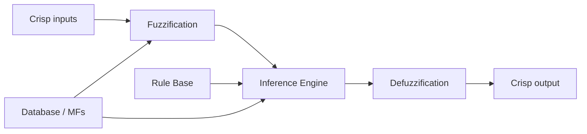
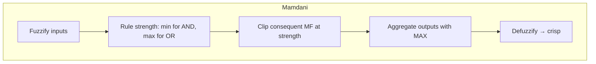
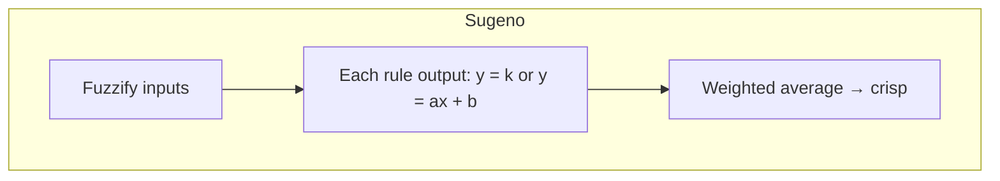
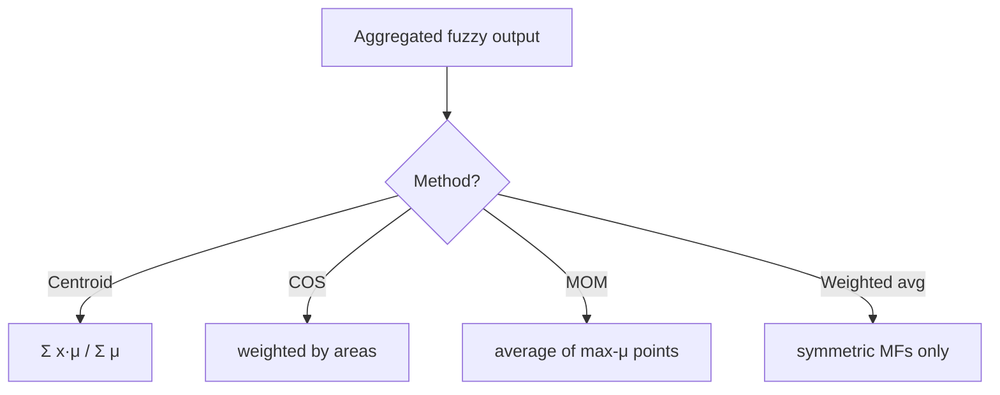

# MODULE 4 — DETAILED SUB-NOTES
# Fuzzy Logic Systems

> **Companion to:** `AI_MASTER_NOTES.md` → Module 4
> **Video:** https://www.youtube.com/watch?v=y39OlGrVFD8 (section: *Fuzzy Logic*)

---

## TABLE OF CONTENTS

4.1 Introduction: Why Fuzzy?
4.2 Classical (Crisp) Sets vs Fuzzy Sets
4.3 Membership Functions — Detailed
4.4 Properties of Fuzzy Sets
4.5 Fuzzy Set Operations — Complete
4.6 Fuzzy Relations
4.7 Linguistic Variables & Hedges
4.8 Fuzzy Inference System (FIS) Architecture
4.9 Step 1: Fuzzification
4.10 Step 2: Rule Base & Database
4.11 Step 3: Inference Engine — Mamdani vs Sugeno
4.12 Step 4: Defuzzification Methods
4.13 Complete Worked Example (Centroid Method)
4.14 Worked Example (Mamdani with aggregation)
4.15 Applications of Fuzzy Logic
4.16 Advantages & Disadvantages
4.17 Summary
4.18 Practice Questions

---

## 4.1 Introduction: Why Fuzzy?

**Problem with classical logic:** it forces a *sharp* yes/no decision where reality is *graded*.

- "Is 179.9 cm tall?" → classical says NO; "180 cm" → YES. Absurd.
- Human language uses **imprecise** terms: *hot, fast, old, expensive*.

**Fuzzy logic (Lofti Zadeh, 1965)** replaces binary membership with **degrees of membership** in [0,1], modeling vagueness mathematically.

**Key philosophy:** *"Precision is not truth; vagueness is not always a bad thing."*

### When is fuzzy logic used?
- Systems with no crisp mathematical model (control systems, appliances).
- When experts express knowledge as rules ("if temp is high, speed up fan").
- When inputs are noisy/imprecise (sensors).

---

## 4.2 Classical (Crisp) Sets vs Fuzzy Sets

### 4.2.1 Crisp Sets

- Membership: $\mu_A(x) \in \{0, 1\}$
- Sharp boundary between "in" and "out".
- Set "Tall": $\mu_{Tall}(h) = 1$ if $h \ge 180$, else 0.

```
μ(x)
 1 ████████████╲
   │          ╲
 0 │          ╲______
   └──────────────────→ height
   130          180
```

### 4.2.2 Fuzzy Sets

- Membership: $\mu_A(x) \in [0, 1]$ (degree).
- Set "Tall": $\mu_{Tall}(175) = 0.6$, $\mu_{Tall}(185) = 0.9$, $\mu_{Tall}(165) = 0.2$.

```
μ(x)
 1               ╭──────────
   │          ╭──╯
 0.5┤      ╭──╯
   │   ╭───╯
 0 ├───╯────────────────────→ height
   130           180
```

**Notation:** A fuzzy set on universe U: $A = \{ (x, \mu_A(x)) \;|\; x \in U \}$

### 4.2.3 Comparison Table

| Feature | Crisp Set | Fuzzy Set |
|---|---|---|
| Membership | 0 or 1 | any value in [0,1] |
| Boundary | Sharp | Gradual, overlapping |
| Models | binary decision | vagueness/uncertainty |
| Complement | $1-x$ | $1-\mu_A(x)$ |
| Union/Intersection | Boolean | max/min (or other t-norms) |

---

## 4.3 Membership Functions — Detailed

### 4.3.1 Common Shapes

| MF | Formula | Shape |
|---|---|---|
| **Triangular** | $\text{tri}(x; a,b,c) = \begin{cases}0 & x\le a\\ \frac{x-a}{b-a} & a<x\le b\\ \frac{c-x}{c-b} & b<x<c\\ 0 & x\ge c\end{cases}$ | /\ |
| **Trapezoidal** | $\text{trap}(x; a,b,c,d)$ | plateau between b,c |
| **Gaussian** | $\mu(x) = \exp\left(-\frac{(x-m)^2}{2\sigma^2}\right)$ | bell |
| **Sigmoid** | $\mu(x) = \frac{1}{1 + e^{-a(x-c)}}$ | S-curve |

### 4.3.2 Triangular Example

$\text{tri}(x; 0, 20, 40)$ — "Warm temperature":
- $\text{tri}(0) = 0$
- $\text{tri}(10) = 10/20 = 0.5$
- $\text{tri}(20) = 1.0$
- $\text{tri}(30) = (40-30)/(40-20) = 0.5$
- $\text{tri}(40) = 0$

### 4.3.3 Properties of Membership Functions

1. $\mu(x) \in [0,1]$
2. **Normal** if $\max_x \mu(x) = 1$
3. **Convex** if membership increases then decreases (no valley)
4. **Overlap** between neighboring MFs is usually ~0.3–0.5 (for smooth transitions)

### 4.3.4 Partitioning the Universe (Linguistic Terms)

Temperature universe [0,100] partitioned:

```
      Cold       Warm        Hot
        /\        /\         /\
       /  \      /  \       /  \
      /    \    /    \     /    \
  ───/──────\──/──────\───/──────\───
   0        25        50       75  100
```

Each point belongs to ≥1 fuzzy set with some degree (e.g., 30°C → Cold 0.2, Warm 0.6, Hot 0.1).

---

## 4.4 Properties of Fuzzy Sets

For fuzzy sets A, B with membership $\mu_A, \mu_B$:

| Property | Condition |
|---|---|
| **Equality** | $A = B$ iff $\mu_A(x) = \mu_B(x)\ \forall x$ |
| **Subset** | $A \subseteq B$ iff $\mu_A(x) \le \mu_B(x)\ \forall x$ |
| **Support** | $supp(A) = \{x \mid \mu_A(x) > 0\}$ |
| **Core** | $core(A) = \{x \mid \mu_A(x) = 1\}$ |
| **Height** | $hgt(A) = \max_x \mu_A(x)$ |
| **Cardinality** | $|A| = \sum_x \mu_A(x)$ (or integral) |

**Note:** unlike crisp sets, $A \cup \bar{A} \neq U$ always; fuzzy logic does **not** obey the law of excluded middle (a point can be 0.5 in A and 0.5 in ¬A).

---

## 4.5 Fuzzy Set Operations — Complete

Let $\mu_A(x), \mu_B(x)$ be membership values.

### 4.5.1 Core Operations (Zadeh)

| Operation | Formula | Symbol |
|---|---|---|
| **Union** | $\mu_{A \cup B}(x) = \max(\mu_A(x), \mu_B(x))$ | OR |
| **Intersection** | $\mu_{A \cap B}(x) = \min(\mu_A(x), \mu_B(x))$ | AND |
| **Complement** | $\mu_{\bar{A}}(x) = 1 - \mu_A(x)$ | NOT |

### 4.5.2 Algebraic Operations

| Operation | Formula | Notes |
|---|---|---|
| **Algebraic product** | $\mu_{A \cdot B} = \mu_A \cdot \mu_B$ | soft AND |
| **Algebraic sum** | $\mu_{A+B} = \mu_A + \mu_B - \mu_A\mu_B$ | probabilistic OR |
| **Bounded sum** | $\mu_{A \oplus B} = \min(1, \mu_A + \mu_B)$ | capped OR |
| **Bounded difference** | $\mu_{A \ominus B} = \max(0, \mu_A - \mu_B)$ | |
| **Concentration** | $\mu_{CON(A)} = \mu_A^2$ | "very A" |
| **Dilation** | $\mu_{DIL(A)} = \mu_A^{0.5}$ | "somewhat A" |
| **Intensification** | $\mu = \begin{cases}2\mu^2 & \mu \le 0.5 \\ 1-2(1-\mu)^2 & \mu>0.5\end{cases}$ | sharpens contrast |

### 4.5.3 Worked Example

$\mu_A(x) = 0.7$, $\mu_B(x) = 0.4$:

| Operation | Result |
|---|---|
| Union (max) | 0.7 |
| Intersection (min) | 0.4 |
| Complement of A | 0.3 |
| Algebraic product | 0.28 |
| Algebraic sum | 0.7+0.4−0.28 = 0.82 |
| Bounded sum | min(1, 1.1) = 1.0 |
| Bounded difference | max(0, 0.3) = 0.3 |
| Concentration A² | 0.49 |

---

## 4.6 Fuzzy Relations

- A **fuzzy relation** R between universes X, Y: $\mu_R(x, y) \in [0,1]$ — degree to which x and y are related.
- Example: "x is much taller than y".
- **Composition** (max-min): $R \circ S$ where $\mu_{R \circ S}(x,z) = \max_y [\min(\mu_R(x,y), \mu_S(y,z))]$.
- Used in fuzzy inference for rule combination.

---

## 4.7 Linguistic Variables & Hedges

### 4.7.1 Linguistic Variable
A variable whose values are **words**, not numbers:

- Temperature ∈ {Cold, Warm, Hot}
- Speed ∈ {Slow, Medium, Fast}
- Age ∈ {Young, Middle, Old}

Each linguistic value is a **fuzzy set** on the variable's universe.

### 4.7.2 Hedges (Modifiers)

| Hedge | Operation | Example |
|---|---|---|
| **very** | $\mu^2$ | very tall |
| **somewhat / fairly** | $\mu^{0.5}$ | somewhat tall |
| **extremely** | $\mu^3$ | extremely tall |
| **not** | $1-\mu$ | not tall |
| **more or less** | $\mu^{0.5}$ | more or less fast |

**Example:** $\mu_{Tall}(180) = 0.7$ → $\mu_{VeryTall}(180) = 0.49$, $\mu_{SomewhatTall}(180) = \sqrt{0.7} \approx 0.84$.

---

## 4.8 Fuzzy Inference System (FIS) Architecture



**4 main components:**

| Block | Role |
|---|---|
| **Fuzzifier** | crisp → fuzzy degrees |
| **Rule Base** | IF–THEN linguistic rules |
| **Database** | membership functions |
| **Inference Engine** | applies rules → fuzzy output |
| **Defuzzifier** | fuzzy output → crisp value |

---

## 4.9 Step 1: Fuzzification

**Purpose:** map crisp input $x_0$ to membership degrees.

For each linguistic term A of the input variable, compute $\mu_A(x_0)$.

**Example:** Temperature = 30°C with terms Cold/Warm/Hot:
- $\mu_{Cold}(30) = 0.0$
- $\mu_{Warm}(30) = 0.5$
- $\mu_{Hot}(30) = 0.3$

These values feed the antecedent evaluation.

---

## 4.10 Step 2: Rule Base & Database

### 4.10.1 Rule Format

```
IF antecedent(s) THEN consequent
```

Antecedent: combination of fuzzy propositions using AND/OR.
Consequent: fuzzy output term (Mamdani) or function (Sugeno).

**Examples:**
- `IF temperature is Hot AND humidity is High THEN fan_speed is Fast`
- `IF temperature is Cold THEN heater_power is High`

### 4.10.2 Database
Contains all **membership functions** for input/output linguistic variables (the "dictionary" the rules refer to).

### 4.10.3 Multiple Rules → Decision Table

| | Humidity Normal | Humidity High |
|---|---|---|
| Temp Warm | Speed Medium | Speed High |
| Temp Hot | Speed High | Speed Very High |

---

## 4.11 Step 3: Inference Engine — Mamdani vs Sugeno

### 4.11.1 Mamdani (fuzzy → fuzzy → defuzzify)



- Consequents are fuzzy sets.
- Interpretable (human-friendly rules).
- More computation (needs defuzzification).

### 4.11.2 Sugeno / Takagi–Sugeno (fuzzy → function → weighted avg)



- Consequents are **crisp functions** of inputs.
- No defuzzification; output = $\frac{\sum w_i y_i}{\sum w_i}$ where $w_i$ = rule strength.
- More efficient; good for control/optimization.

### 4.11.3 Comparison

| Feature | Mamdani | Sugeno |
|---|---|---|
| Consequents | Fuzzy sets | Functions/constants |
| Defuzzification | Required | Not needed |
| Interpretability | High | Low |
| Computation | Heavier | Light |
| Best for | Expert/knowledge systems | Control systems, models |

### 4.11.4 Rule Strength Computation

- **AND** in antecedent → $\mu = \min(\mu_{A1}, \mu_{A2})$
- **OR** in antecedent → $\mu = \max(\mu_{A1}, \mu_{A2})$

---

## 4.12 Step 4: Defuzzification Methods

| Method | Formula | Notes |
|---|---|---|
| **Centroid (COG)** | $y^* = \dfrac{\sum x \mu(x)}{\sum \mu(x)}$ | most common |
| **Center of Sums (COS)** | $\dfrac{\sum \int x\mu_i(x)dx}{\sum \int \mu_i(x)dx}$ | uses individual areas |
| **Mean of Maximum (MOM)** | average of x with max $\mu$ | ignores shape |
| **Weighted average** | for symmetric MFs | fast approximation |



---

## 4.13 Complete Worked Example — Fan Speed (Centroid Method)

**Setup:** Control fan speed based on Temperature (T) and Humidity (H).

- Universe: Speed ∈ [0, 6], terms: Slow (0–2), Medium (2–4), Fast (4–6).
- Inputs: T = 30°C, H = 60%.

**Step 1 — Fuzzify:**
- Temperature: $\mu_{Warm}(30) = 0.5$, $\mu_{Hot}(30) = 0.3$
- Humidity: $\mu_{Normal}(60) = 0.4$, $\mu_{High}(60) = 0.6$

**Step 2 — Rules:**
- R1: IF Temp **Warm** AND Humidity **Normal** THEN Speed **Medium**
- R2: IF Temp **Hot** AND Humidity **High** THEN Speed **Fast**

**Step 3 — Inference (strengths):**
- R1 strength = min(0.5, 0.4) = **0.4** → clip "Medium" at 0.4
- R2 strength = min(0.3, 0.6) = **0.3** → clip "Fast" at 0.3

**Aggregated membership:**
- $\mu(x) = 0.4$ for x ∈ [2, 4]
- $\mu(x) = 0.3$ for x ∈ [4, 6]

**Step 4 — Centroid defuzzification:**

Sample x = {2, 3, 4, 5, 6}, μ = {0.4, 0.4, 0.4, 0.3, 0.3}:

$$y^* = \frac{2(0.4)+3(0.4)+4(0.4)+5(0.3)+6(0.3)}{0.4+0.4+0.4+0.3+0.3} = \frac{0.8+1.2+1.6+1.5+1.8}{1.8} = \frac{6.9}{1.8} \approx 3.83$$

**Output:** Fan speed ≈ **3.83** (medium-fast). ✔

---

## 4.14 Worked Example — Full Mamdani Aggregation (Temperature Control)

**Problem:** Control AC power (0–100%) from Temperature (T ∈ [0,50]).

**MFs:**
- Temp: Cool (tri 0,0,25), Moderate (tri 0,25,50), Hot (tri 25,50,50)
- Power: Low (tri 0,0,50), Medium (tri 0,50,100), High (tri 50,100,100)

**Input:** T = 30

**Fuzzify:**
- $\mu_{Cool}(30) = 0$
- $\mu_{Moderate}(30)$: right slope of Moderate: $\frac{50-30}{50-0} = 0.4$
- $\mu_{Hot}(30)$: left slope of Hot: $\frac{30-25}{50-25} = 0.2$

**Rules:**
- R1: IF Cool THEN Low → strength 0 (Low clipped at 0)
- R2: IF Moderate THEN Medium → strength 0.4
- R3: IF Hot THEN High → strength 0.2

**Aggregate:** μ(x) = 0.4 on [0,50] (Medium), 0.2 on [50,100] (High).

**Centroid (sample x = 0,25,50,75,100; μ = 0.4,0.4,0.4,0.2,0.2):**

$$y^* = \frac{0(0.4)+25(0.4)+50(0.4)+75(0.2)+100(0.2)}{0.4+0.4+0.4+0.2+0.2} = \frac{0+10+20+15+20}{1.6} = \frac{65}{1.6} = 40.6$$

**Output:** AC power ≈ **40.6%**. ✔

---

## 4.15 Applications of Fuzzy Logic

| Domain | Application |
|---|---|
| Consumer | Washing machines (auto load/dirt sensing), rice cookers, cameras (autofocus) |
| Automotive | Automatic transmission, ABS, air-conditioning control |
| Control | Temperature control, cruise control, robot arm control |
| Finance | Credit scoring, risk assessment |
| Medical | Diagnosis support, anesthesia control |
| Industry | Cement kiln control, water treatment |
| AI research | Neuro-fuzzy systems (ANFIS), fuzzy clustering (FCM) |

### Real example — Washing machine
Rules like:
- IF dirtiness is High AND load is Heavy THEN wash_time is Long
- Fuzzify sensor inputs → infer → defuzzify → set wash time automatically.

---

## 4.16 Advantages & Disadvantages

**Advantages**
- Handles imprecision & vagueness naturally.
- Easy, human-readable rules.
- Robust to noise in inputs.
- No precise mathematical model needed.
- Smooth interpolation between rules.

**Disadvantages**
- No universal method to design membership functions (heuristic/tuning).
- Overlapping rules can grow large ("rule explosion").
- Results depend heavily on MF design.
- Not always verifiable formally; can be hard to analyze stability.

---

## 4.17 Summary

- Fuzzy sets generalize crisp sets: $\mu_A(x) \in [0,1]$.
- Operations: union=max, intersection=min, complement=1−μ; algebraic & bounded variants.
- **Linguistic variables + hedges** (very = μ², somewhat = μ^0.5) model human language.
- **FIS:** Fuzzify → Rules → Infer → Defuzzify.
- **Mamdani:** fuzzy consequents, defuzzify. **Sugeno:** function consequents, weighted average.
- **Defuzzification:** centroid most common.
- Applications: control systems, appliances, decision support.

---

## 4.18 Practice Questions

1. Differentiate crisp and fuzzy sets with examples and formulas.
2. Given $\mu_A(x)=0.8$, $\mu_B(x)=0.5$, compute union, intersection, complement, algebraic product, bounded sum.
3. What is a linguistic variable? How do hedges like "very" and "somewhat" modify a fuzzy set?
4. Draw the FIS architecture and explain each block.
5. Explain Mamdani and Sugeno inference with a comparison.
6. Compute the centroid defuzzification for aggregated output μ(x)=0.5 on [10,30], μ(x)=0.2 on [30,60].
7. A room AC uses rules: IF temp Hot THEN cool High; IF temp Moderate THEN cool Low. For T=35 with μHot=0.8, μModerate=0.2, find the fuzzy output and defuzzify.
8. List 5 applications of fuzzy logic and describe one in detail.
9. What are the advantages and limitations of fuzzy systems?
10. Why doesn't fuzzy set theory obey the law of excluded middle?
