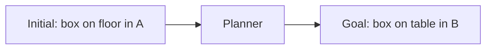
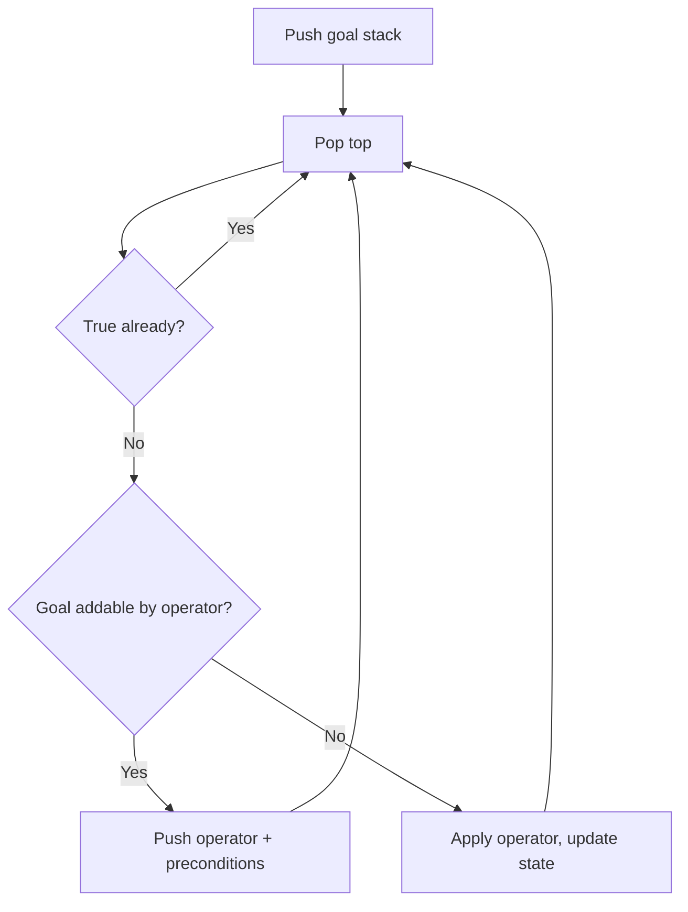
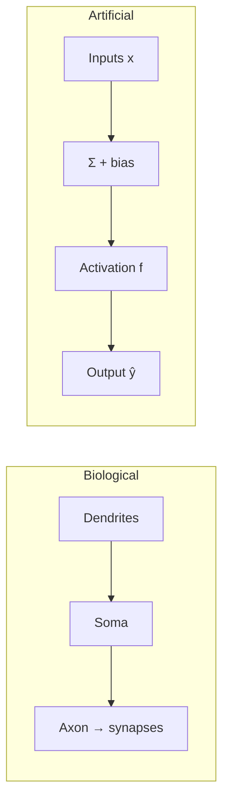
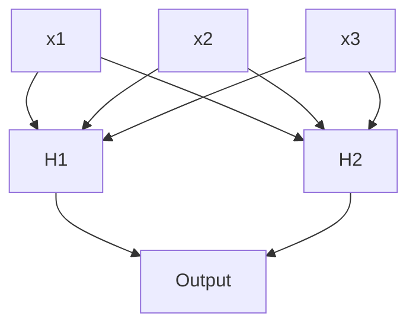
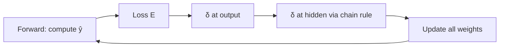
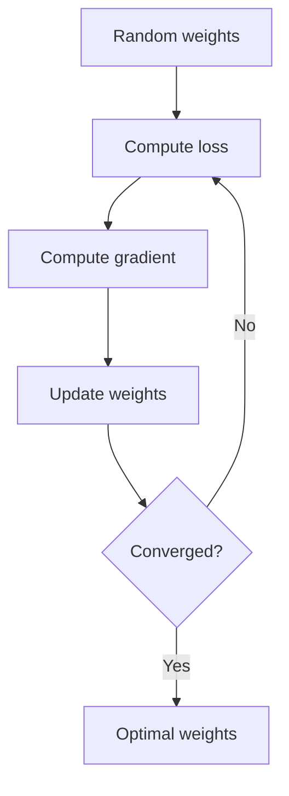
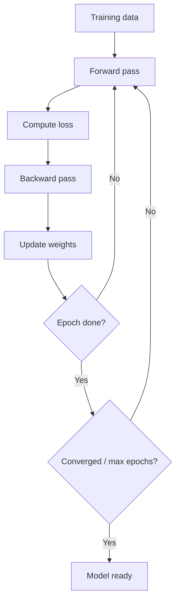

# MODULE 5 — DETAILED SUB-NOTES
# Classical Planning & Artificial Neural Networks (ANN)

> **Companion to:** `AI_MASTER_NOTES.md` → Module 5
> **Video:** https://www.youtube.com/watch?v=y39OlGrVFD8 (sections: *Planning*, *Neural Network*)

---

## TABLE OF CONTENTS

**PART A — CLASSICAL PLANNING**
5.1 Introduction to Planning
5.2 Planning Problem Components
5.3 STRIPS Representation
5.4 STRIPS Example — Detailed
5.5 Goal Stack Planning
5.6 Goal Stack Worked Example (Milk & Bananas)
5.7 Partial-Order Planning (Brief)
5.8 Planning vs Search

**PART B — ARTIFICIAL NEURAL NETWORKS**
5.9 Biological Neuron vs Artificial Neuron
5.10 Perceptron Model — Mathematics
5.11 Activation Functions — Complete
5.12 Perceptron Learning (Delta Rule)
5.13 The XOR Problem & Need for Hidden Layers
5.14 Multi-Layer Perceptron (MLP) Architecture
5.15 Forward Propagation — Worked Example
5.16 Backpropagation — Full Derivation
5.17 Gradient Descent Variants & Learning Rate
5.18 Backpropagation — Mini Numerical Example
5.19 Full Training Loop
5.20 Summary
5.21 Practice Questions

---

# PART A — CLASSICAL PLANNING

## 5.1 Introduction to Planning

**Planning** = finding a **sequence of actions** that takes an agent from an initial state to a goal state, using an explicit **logical representation** of states and actions.

**Key idea:** Unlike blind search, planning reasons *about* actions and states symbolically — it can combine operators, avoid exploring raw state graphs, and even handle partially specified states.

**Example:** Robot must `Move(roomA, roomB)`, `Pick(box)`, `Stack(box, table)` to achieve `On(box, table)`.



---

## 5.2 Planning Problem Components

| Component | Description | Example |
|---|---|---|
| **States** | Logical descriptions (conjunctions of literals) | `At(Robot, RoomA) ∧ BoxOn(Floor)` |
| **Initial state** | Start description | `At(Robot, RoomA) ∧ BoxOn(Floor)` |
| **Goal state** | Partial description to achieve | `At(Robot, RoomB) ∧ BoxOn(Table)` |
| **Actions/Operators** | Preconditions + effects | `Move(a,b)`, `Pick(b)`, `Stack(b)` |
| **Plan** | Ordered list of actions | `Move → Pick → Move → Stack` |

**Important:** Goal is often a **partial** description — we don't care about irrelevant properties.

### State Representation Convention
- **Closed-world assumption:** literals not mentioned are false.
- **STRIPS style:** states = set of true ground literals.

---

## 5.3 STRIPS Representation

**STRIPS** (Stanford Research Institute Problem Solver) — 1971, used on the **Shakey** robot.

Each operator has 3 components:

| Part | Meaning | Example `ACTION(Move(x,y))` |
|---|---|---|
| **Preconditions** | Facts that must be TRUE before the action | `At(Robot, x)` |
| **Add List (effects+)** | Facts that become TRUE | `At(Robot, y)` |
| **Delete List (effects−)** | Facts that become FALSE | `At(Robot, x)` |

### Formal semantics

Applying action a in state s (if preconditions ⊆ s):
$$s' = (s \setminus DeleteList(a)) \cup AddList(a)$$

### 5.3.1 Example Operator Set

```
ACTION: Move(x, y)
  PRECOND: At(Robot, x)
  ADD:     At(Robot, y)
  DELETE:  At(Robot, x)

ACTION: Pickup(box)
  PRECOND: At(Robot, x) ∧ BoxAt(box, x)
  ADD:     Holding(box)
  DELETE:  BoxAt(box, x)

ACTION: Putdown(box)
  PRECOND: Holding(box)
  ADD:     BoxAt(box, x)
  DELETE:  Holding(box)
```

---

## 5.4 STRIPS Example — Detailed

**Problem:**
- Initial: `At(Robot, A)`, `BoxAt(Box, A)`
- Goal: `BoxAt(Box, B)`

**Plan search:**

1. Goal `BoxAt(Box,B)` is not in state. Which operator adds it? `Putdown(Box)` — but requires `Holding(Box)`.
2. Subgoal: `Holding(Box)` ← added by `Pickup(Box)`, requires `At(Robot, A) ∧ BoxAt(Box, A)` — both TRUE.
3. Execute:
   - `Pickup(Box)` → state: `At(Robot,A), Holding(Box)`
   - `Move(A, B)` → state: `At(Robot,B), Holding(Box)` (precond `At(Robot,A)` holds)
   - `Putdown(Box)` → state: `At(Robot,B), BoxAt(Box,B)` ✓ Goal achieved.

**Plan:** `Pickup(Box) → Move(A,B) → Putdown(Box)` ✔

---

## 5.5 Goal Stack Planning

**Method:** maintain a **stack** of goals and operators; pop and process:

- If popped item is **true** in current state → continue.
- If it's a **goal** → find an operator whose Add-list contains it; push operator + its preconditions.
- If it's an **operator** whose preconditions are satisfied → apply it (update state).



---

## 5.6 Goal Stack Worked Example (Milk & Bananas)

**Setup:**
- Initial state: `At(Home)`, `Sells(Store, Milk)`, `Sells(Store, Bananas)`
- Goal: `Have(Milk) ∧ Have(Bananas) ∧ At(Store)`

**Operators:**
```
Buy(x):   PRECOND At(Store) ∧ Sells(Store,x)
          ADD Have(x)
          DELETE (none relevant)

GoTo(y):  PRECOND At(x)
          ADD At(y)
          DELETE At(x)
```

**Trace:**

**1.** Push goals: `[Have(Milk), Have(Bananas), At(Store)]`

**2.** Pop `Have(Milk)`. Operator `Buy(Milk)` adds it.
- Push operator, then its preconditions:
  Stack: `[Have(Bananas), At(Store), Buy(Milk), At(Store) ∧ Sells(Store,Milk)]`

**3.** Pop `At(Store) ∧ Sells(Store,Milk)` → both subgoals: `At(Store)` needs `GoTo(Store)`.
- Push `GoTo(Store)`, then `At(Home)` precondition.
  Stack: `[Have(Bananas), At(Store), Buy(Milk), At(Store), Sells(Store,Milk), GoTo(Store), At(Home)]`

**4.** Pop `At(Home)` — TRUE → done.
**5.** Pop `GoTo(Store)` — preconditions satisfied → apply. State: `At(Store)`.
**6.** Pop `Sells(Store,Milk)` — TRUE → done.
**7.** Pop `At(Store)` — TRUE → done.
**8.** Pop `Buy(Milk)` — satisfied → apply. State adds `Have(Milk)`.
**9.** Pop `At(Store)` — TRUE.
**10.** Pop `Have(Bananas)`. Operator `Buy(Bananas)`:
- Push `Buy(Bananas)`, precond `At(Store) ∧ Sells(Store,Bananas)`.
- `At(Store)` TRUE, `Sells(Store,Bananas)` TRUE → apply `Buy(Bananas)`. State adds `Have(Bananas)`.

**11.** All goals done. **Plan:**
`GoTo(Store) → Buy(Milk) → Buy(Bananas)` ✔ (goal `At(Store)` also true).

---

## 5.7 Partial-Order Planning (Brief)

- **Total-order planning** (STRIPS/goal stack): builds a linear plan.
- **Partial-order planning (POP):** builds a plan as a set of actions + ordering constraints, without committing to a full linear order. Interleave subplans; resolve threats (steps that can clobber preconditions). More flexible, handles the "which order?" problem.

**Example:** To have Milk and Bananas, buy order doesn't matter — POP represents this with no ordering constraint between the two Buy actions.

---

## 5.8 Planning vs Search

| Aspect | Search | Planning |
|---|---|---|
| State representation | Atomic (opaque) | Structured (logic literals) |
| Actions | Transition function | Operators with preconds/effects |
| Domain knowledge | Little | Goals + operators |
| Scale | Small/medium | Large (can use heuristics, abstraction) |
| Example | 8-puzzle, route finding | Robot task, logistics |

---

# PART B — ARTIFICIAL NEURAL NETWORKS

## 5.9 Biological Neuron vs Artificial Neuron



| Feature | Biological Neuron | Artificial Neuron |
|---|---|---|
| Inputs | Dendrites | $x_1, \dots, x_n$ |
| Connection strength | Synapses | Weights $w_i$ |
| Cell body | Soma | Summation node |
| Threshold | Fires if depolarized | Bias $b$ |
| Output | Axon → next synapses | $\hat{y}$ |
| Response | All-or-nothing approx. | Activation function |

---

## 5.10 Perceptron Model — Mathematics

### 5.10.1 Weighted Sum (Net Input)

$$z = \sum_{i=1}^{n} w_i x_i + b = \mathbf{w}^\top \mathbf{x} + b$$

### 5.10.2 Output

$$\hat{y} = f(z)$$

### 5.10.3 Binary (Step) Perceptron — Decision Rule

$$\hat{y} = \begin{cases} 1 & \text{if } z \ge 0 \\ 0 & \text{otherwise} \end{cases}$$

This draws a **linear decision boundary**: $\mathbf{w}^\top\mathbf{x} + b = 0$.

### 5.10.4 What the weights mean

- Large $|w_i|$ → input $x_i$ is influential.
- Sign of $w_i$ → positive or negative influence.
- $b$ shifts the boundary.

---

## 5.11 Activation Functions — Complete

| Function | Equation | Range | Derivative | Notes |
|---|---|---|---|---|
| **Step** | $f(z)=1$ if $z\ge0$ else 0 | {0,1} | 0 (undefined at 0) | classic perceptron |
| **Sigmoid** | $\sigma(z)=\dfrac{1}{1+e^{-z}}$ | (0,1) | $\sigma(z)(1-\sigma(z))$ | smooth; vanishing gradient |
| **Tanh** | $\dfrac{e^z-e^{-z}}{e^z+e^{-z}}$ | (−1,1) | $1-\tanh^2(z)$ | zero-centered |
| **ReLU** | $\max(0,z)$ | [0,∞) | 1 if z>0 else 0 | fast; dying ReLU |
| **Leaky ReLU** | $\max(0.01z, z)$ | ℝ | piecewise | fixes dying ReLU |
| **Softmax** | $\dfrac{e^{z_i}}{\sum_j e^{z_j}}$ | (0,1) each | Jacobian | output probabilities |

### 5.11.1 Why Softmax for classification?

- Converts logits to a **probability distribution** (sums to 1, all ≥ 0).
- Exponent amplifies differences — confident predictions.

### 5.11.2 Sigmoid derivative proof

$$\sigma'(z) = \sigma(z)(1-\sigma(z))$$
(Used heavily in backprop.)

### 5.11.3 Choosing an activation

- Hidden layers: **ReLU** (default), Tanh/Sigmoid for older networks.
- Output layer: **Sigmoid** (binary), **Softmax** (multi-class), **linear** (regression).

---

## 5.12 Perceptron Learning (Delta Rule)

### 5.12.1 Error

For one training sample: error $e = y - \hat{y}$.

### 5.12.2 Update Rule (perceptron)

$$w_i \leftarrow w_i + \eta \cdot e \cdot x_i, \qquad b \leftarrow b + \eta \cdot e$$

($\eta$ = learning rate)

### 5.12.3 Example

$x = (1, 0, 1)$, $y = 1$, $\hat{y} = 0$, $\eta = 0.1$, $w = (0.5, 0.2, 0.1)$, $b=0$.

- $e = 1 - 0 = 1$
- $w_1 = 0.5 + 0.1(1)(1) = 0.6$
- $w_2 = 0.2 + 0.1(1)(0) = 0.2$
- $w_3 = 0.1 + 0.1(1)(1) = 0.2$
- $b = 0 + 0.1(1) = 0.1$

### 5.12.4 Limitation

The simple perceptron learns **only linearly separable** functions (AND, OR) — fails on XOR.

---

## 5.13 The XOR Problem & Need for Hidden Layers

| x1 | x2 | AND | XOR |
|---|---|---|---|
| 0 | 0 | 0 | 0 |
| 0 | 1 | 0 | **1** |
| 1 | 0 | 0 | **1** |
| 1 | 1 | 1 | 0 |

- XOR outputs cannot be separated by one line → **no single perceptron** can learn XOR.
- Solution: **hidden layer** → MLP (2-layer network solves XOR).
- This insight (Minsky & Papert, 1969) contributed to the first AI winter; revived by **backpropagation** (Rumelhart, 1986).

---

## 5.14 Multi-Layer Perceptron (MLP) Architecture



**Terms:**
- **Input layer:** features (no computation).
- **Hidden layer(s):** compute intermediate features.
- **Output layer:** prediction.
- **Dense/Fully-connected:** every neuron connects to every neuron in the next layer.

**Universal approximation theorem:** a single hidden layer with enough neurons can approximate any continuous function.

---

## 5.15 Forward Propagation — Worked Example

**Network:** 2 inputs, 1 hidden (2 neurons, sigmoid), 1 output (sigmoid).

```
x1 = 0.05, x2 = 0.10
w11 = 0.15, w12 = 0.20   (input→H1)
w21 = 0.25, w22 = 0.30   (input→H2)
w1o = 0.40, w2o = 0.50   (H→Output)
biases all 0
```

**Hidden layer:**
- $z_1 = 0.15(0.05) + 0.25(0.10) = 0.0075 + 0.025 = 0.0325$
- $h_1 = \sigma(0.0325) = 0.5081$
- $z_2 = 0.20(0.05) + 0.30(0.10) = 0.01 + 0.03 = 0.04$
- $h_2 = \sigma(0.04) = 0.5100$

**Output layer:**
- $z_o = 0.40(0.5081) + 0.50(0.5100) = 0.2032 + 0.2550 = 0.4582$
- $\hat{y} = \sigma(0.4582) = 0.6126$

Target y = 1. Loss (MSE) = $\frac12 (1 - 0.6126)^2 = \frac12 (0.1501) = 0.075$.

---

## 5.16 Backpropagation — Full Derivation

**Goal:** compute $\frac{\partial E}{\partial w}$ for every weight, then update.

### 5.16.1 Loss (Mean Squared Error)

$$E = \frac{1}{2} \sum_i (y_i - \hat{y}_i)^2$$

### 5.16.2 Gradient Descent Update

$$\Delta w = -\eta \frac{\partial E}{\partial w}$$

### 5.16.3 Chain Rule for the Output Weight

$$\frac{\partial E}{\partial w_{ho}} = \underbrace{\frac{\partial E}{\partial \hat{y}}}_{\text{loss}} \cdot \underbrace{\frac{\partial \hat{y}}{\partial z_o}}_{\text{activation}} \cdot \underbrace{\frac{\partial z_o}{\partial w_{ho}}}_{\text{linear}}$$

- $\frac{\partial E}{\partial \hat{y}} = (y - \hat{y}) \cdot (-1) = \hat{y} - y$
- $\frac{\partial \hat{y}}{\partial z_o} = \hat{y}(1 - \hat{y})$ (sigmoid)
- $\frac{\partial z_o}{\partial w_{ho}} = h$

**Output delta:** $\delta_o = (\hat{y} - y) \cdot \hat{y}(1-\hat{y})$

$$\Delta w_{ho} = -\eta \cdot \delta_o \cdot h$$

### 5.16.4 Hidden Layer Weight (two more chain links)

$$\frac{\partial E}{\partial w_{ih}} = \frac{\partial E}{\partial \hat{y}} \cdot \frac{\partial \hat{y}}{\partial z_o} \cdot \frac{\partial z_o}{\partial h} \cdot \frac{\partial h}{\partial z_h} \cdot \frac{\partial z_h}{\partial w_{ih}}$$

**Hidden delta:** $\delta_h = \delta_o \cdot w_{ho} \cdot h(1-h)$ (for this topology)

General form for layer l:
$$\delta^{(l)} = (W^{(l+1)\top} \delta^{(l+1)}) \odot f'(z^{(l)})$$

**Weight update for hidden weight:**
$$\Delta w_{ih} = -\eta \cdot \delta_h \cdot x_i$$

### 5.16.5 Backprop Flow



---

## 5.17 Gradient Descent Variants & Learning Rate

| Variant | Update uses | Pros/Cons |
|---|---|---|
| **Batch GD** | whole dataset per step | stable, slow |
| **Stochastic GD (SGD)** | 1 sample per step | fast, noisy |
| **Mini-batch GD** | small batch | balanced (standard) |
| **Adam** | adaptive per-weight lr | fast convergence (standard choice) |

### Learning Rate $\eta$ effects

- Too large → diverges / oscillates.
- Too small → very slow.
- Typical range: 0.001 – 0.1 (tune, decay over time).

### 5.17.1 Gradient Descent Loop



---

## 5.18 Backpropagation — Mini Numerical Example (1 neuron)

**Setup:** $x = 1.0$, $w = 0.5$, $b = 0$, $\eta = 0.1$, sigmoid, target $y = 1$.

1. **Forward:** $z = 0.5(1) + 0 = 0.5$; $\hat{y} = \sigma(0.5) = 0.6225$
2. **Loss:** $E = \frac12 (1 - 0.6225)^2 = 0.0712$
3. **Gradient:**
   $\frac{\partial E}{\partial w} = (\hat{y} - y) \cdot \hat{y}(1-\hat{y}) \cdot x = (0.6225-1)(0.6225)(0.3775)(1) = (-0.3775)(0.235) = -0.0887$
4. **Update:** $\Delta w = -\eta(-0.0887) = +0.00887$ → $w_{new} = 0.5 + 0.00887 = 0.5089$
5. Repeat — after many iterations, $\hat{y} \to 1$, loss → 0. ✔

---

## 5.19 Full Training Loop



**Epoch:** one full pass over the training set.
**Batch/iteration:** one weight update.

---

## 5.20 Summary

- **Planning** = logical search over actions; **STRIPS** = preconditions + add/delete lists.
- **Goal stack planning:** push goals → match operators → apply when preconditions met.
- **Perceptron:** $\hat{y} = f(\sum w_i x_i + b)$; linear boundary; can't do XOR.
- **Activations:** sigmoid (0–1), tanh (−1–1), ReLU (max), softmax (probabilities).
- **MLP:** input → hidden → output; universal approximator.
- **Backprop:** chain rule on loss → $\Delta w = -\eta \frac{\partial E}{\partial w}$; δ propagates backward.
- **Gradient descent:** batch / SGD / mini-batch / Adam; learning rate is critical.

---

## 5.21 Practice Questions

1. Define STRIPS. Write operators (precondition, add, delete) for a robot picking and moving a box.
2. Solve "Get milk and bananas and return home" using goal stack planning (step-by-step).
3. Differentiate planning and search.
4. Explain the perceptron model. Why can't a single perceptron learn XOR?
5. Write equations and ranges for sigmoid, tanh, ReLU, softmax. Give their derivatives.
6. Describe MLP architecture. What does "universal approximation" mean?
7. Derive $\frac{\partial E}{\partial w}$ for an output weight and a hidden weight using the chain rule.
8. A 2-1 network (sigmoid) with inputs (0.1, 0.2), weights 0.3, 0.4, output weight 0.5, target 1, η=0.1. Compute one forward pass and one weight update.
9. Compare batch GD, SGD, and mini-batch GD.
10. What happens if the learning rate is too high? Too low?
