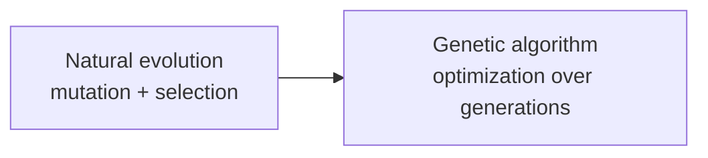
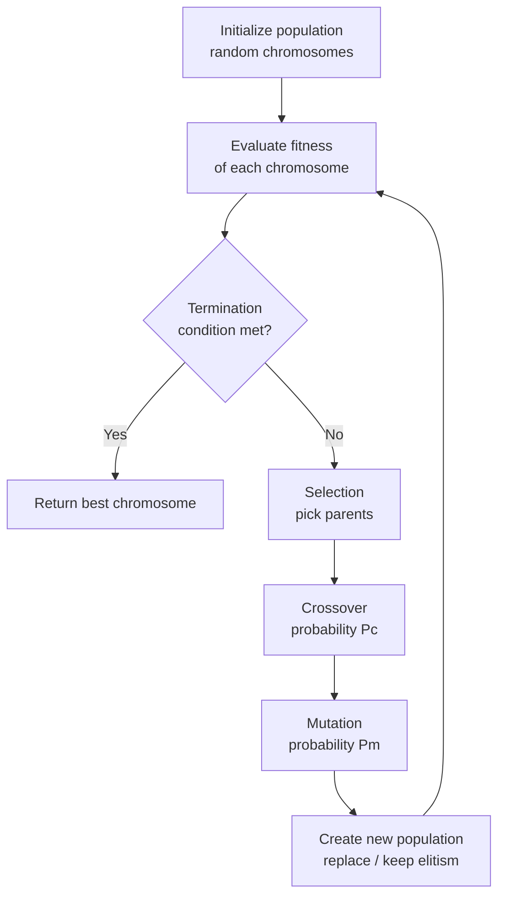
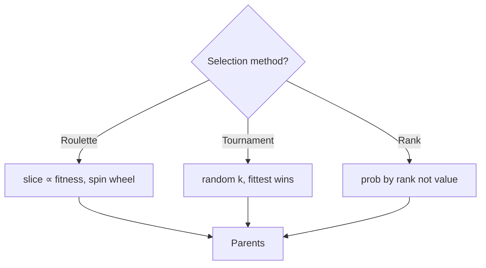

# MODULE 6 — DETAILED SUB-NOTES
# Genetic Algorithms (GA)

> **Companion to:** `AI_MASTER_NOTES.md` → Module 6
> **Video:** https://www.youtube.com/watch?v=y39OlGrVFD8 (section: *Genetic Algorithm*)

---

## TABLE OF CONTENTS

6.1 Introduction & Biological Inspiration
6.2 GA Terminology (Biology ↔ Algorithm)
6.3 When to Use a Genetic Algorithm
6.4 The GA Lifecycle — Complete Algorithm
6.5 Chromosome Encoding — Detailed
6.6 Initial Population Generation
6.7 Fitness Function — Detailed
6.8 Selection Methods — Complete
6.9 Crossover Operators — Complete
6.10 Mutation Operators — Complete
6.11 Elitism & Replacement Strategies
6.12 Termination Criteria
6.13 GA Parameters & Tuning
6.14 Schema Theory (Building Blocks)
6.15 Worked Example 1 — Maximize $x^2$ (Full Generations)
6.16 Worked Example 2 — Knapsack Problem
6.17 Applications of GA
6.18 Advantages & Disadvantages
6.19 Summary
6.20 Practice Questions

---

## 6.1 Introduction & Biological Inspiration

**Genetic Algorithms (John Holland, 1975)** are a class of **evolutionary algorithms** inspired by **Darwinian natural selection** — "survival of the fittest."

**Core idea:** maintain a *population* of candidate solutions; iteratively:
1. evaluate fitness,
2. select the fitter ones,
3. recombine (crossover) and mutate them,
4. replace the population.

Over generations, the population **evolves** toward better solutions — a form of **stochastic global optimization**.

### Biological metaphor



---

## 6.2 GA Terminology (Biology ↔ Algorithm)

| Biological Term | GA Meaning | Example |
|---|---|---|
| **Chromosome** | A candidate solution (encoded) | `10110010` |
| **Gene** | A position / unit of the solution | 3rd bit |
| **Allele** | Value of a gene | 0 or 1 |
| **Genotype** | Encoded representation | binary string |
| **Phenotype** | Decoded solution | x = 178 |
| **Population** | Set of chromosomes | 100 solutions |
| **Fitness** | Quality score | f(x) = x² |
| **Selection** | Choose parents | roulette wheel |
| **Crossover** | Recombine parents | 1-point swap |
| **Mutation** | Random alteration | flip a bit |
| **Generation** | One full evolution cycle | iteration |

---

## 6.3 When to Use a Genetic Algorithm

Use GAs when:

- Search space is **huge / multimodal** (many local optima).
- No gradient information available (can't use calculus).
- Problem is **NP-hard** (TSP, scheduling, knapsack).
- A **good-enough** solution is acceptable (heuristic).
- Fitness can be computed easily for any candidate.

Avoid when:
- A polynomial exact algorithm exists.
- You need the **guaranteed global optimum**.
- Fitness evaluation is extremely expensive.

---

## 6.4 The GA Lifecycle — Complete Algorithm



### Pseudo-code

```
1.  Define encoding + fitness function
2.  population = generate N random chromosomes
3.  for gen = 1 .. max_generations:
4.      for each chromosome: fitness(i)
5.      if termination: break
6.      parents = SELECT(population, fitness)     # e.g. roulette/tournament
7.      offspring = []
8.      for each pair (p1, p2):
9.          if random() < Pc: child = CROSSOVER(p1, p2)
10.         else:             child = p1, p2 (copies)
11.         for each child: if random() < Pm: MUTATE(child)
12.         offspring += children
13.     population = REPLACE(population, offspring)  # with elitism
14. return best chromosome in final population
```

---

## 6.5 Chromosome Encoding — Detailed

| Encoding | Description | Use case | Example |
|---|---|---|---|
| **Binary** | String of 0/1 genes | numeric optimization, feature selection | `10110010` |
| **Permutation** | Ordering of items | TSP, scheduling | `[A, C, B, D]` |
| **Value / Real** | Real numbers directly | engineering parameters | `[3.2, 1.8, 5.6]` |
| **Tree** | Program tree | genetic programming | `(+ (* x 2) 3)` |

### Binary Encoding — Decoding

For n bits representing an integer in [0, 2ⁿ−1]:

$$x = \sum_{i=0}^{n-1} bit_i \cdot 2^i$$

Example: `1011` → $1\cdot8 + 0\cdot4 + 1\cdot2 + 1\cdot1 = 11$

### Value Encoding Example
Chromosome `[2.5, 0.1, -1.3, 4.0]` = 4 real-valued parameters.

---

## 6.6 Initial Population Generation

- Generate **N random chromosomes** covering the search space.
- **Population size N:** typically 20–200.
  - Too small → premature convergence.
  - Too large → slow per generation.
- Randomness seeds **diversity** — essential for exploration.

---

## 6.7 Fitness Function — Detailed

**Fitness** = how good a chromosome is. GAs **maximize** fitness.

$$fitness(chromosome) \rightarrow \mathbb{R}^+$$

### If the problem is a minimization
Convert: $fitness = \dfrac{1}{1 + cost}$ or $fitness = C_{max} - cost$.

### Scaling / normalization
Prevents a super-fit individual from dominating too early (selection pressure control).

**Example:** maximize $f(x) = x^2$, $x \in [0,31]$ (5-bit).
- Chromosome `11111` → x=31 → fitness 961.
- Chromosome `01010` → x=10 → fitness 100.

---

## 6.8 Selection Methods — Complete

### 6.8.1 Roulette Wheel (Fitness-Proportional)

- Each chromosome gets a slice proportional to its fitness.
- Probability of selection:

$$P_i = \frac{fitness_i}{\sum_{j=1}^{N} fitness_j}$$

**Worked example:** fitnesses {81, 49, 121, 144}; total = 395.
- $P_1 = 81/395 = 0.205$, $P_2 = 49/395 = 0.124$, $P_3 = 121/395 = 0.306$, $P_4 = 144/395 = 0.365$.



**Problem:** if one individual is extremely fit, it dominates (loss of diversity).

### 6.8.2 Tournament Selection
- Pick **k** individuals at random (k = 2–7, tournament size).
- The **fittest** of the k becomes a parent.
- Repeat to pick the other parent.
- **Controls selection pressure** via k (larger k → more pressure).

### 6.8.3 Rank Selection
- Sort population by fitness.
- Assign selection probability by **rank** (linear: best gets N, worst gets 1).
- **Removes the dominance problem** of roulette.

### 6.8.4 Comparison

| Method | Pressure control | Diversity | Complexity |
|---|---|---|---|
| Roulette | Poor (raw fitness) | Can collapse | O(N) |
| Tournament | Good (tune k) | Good | O(k) |
| Rank | Good | Good | O(N log N) |

---

## 6.9 Crossover Operators — Complete

Crossover **exploits** good building blocks by combining parent genes.

### 6.9.1 Single-Point Crossover

```
Parent1: 10|10
Parent2: 01|01
             ↓ swap tails
Child1:  1001
Child2:  0110
```

### 6.9.2 Two-Point Crossover

```
Parent1: 1|01|0
Parent2: 0|10|1
             ↓ swap middle
Child1:  1101
Child2:  0010
```

### 6.9.3 Uniform Crossover

- For each position, choose a gene from parent1 or parent2 **randomly** (often with a mask).

```
Mask:    1010  (1 → from P1, 0 → from P2)
P1:      1100
P2:      0011
Child1:  1001
```

### 6.9.4 Crossover for Permutation Encoding (TSP)

- **Order crossover (OX):** copy a segment from P1; fill the rest from P2 in order, skipping duplicates.
- **Partially mapped crossover (PMX):** swap segments, fix duplicates with mapping.

### 6.9.5 Crossover Rate $P_c$

- Typical 0.6–0.9. Higher → more recombination; too high can disrupt good schemata.

---

## 6.10 Mutation Operators — Complete

Mutation **explores** new regions — restores lost diversity.

### 6.10.1 Bit-Flip (binary)

```
1010 → 1110  (flip 2nd bit)
```

### 6.10.2 Swap (permutation)

```
[A, C, B, D] → [A, B, C, D]  (swap positions 2 & 3)
```

### 6.10.3 Others

- **Insert/Inversion** (permutation): move/ reverse a segment.
- **Gaussian perturbation** (real-valued): add small random noise.

### 6.10.4 Mutation Rate $P_m$

- Typical 0.01–0.05 per gene.
- Too high → destroys good solutions (random walk).
- Too low → premature convergence.

---

## 6.11 Elitism & Replacement Strategies

- **Elitism:** always copy the best 1–2 chromosomes unchanged into the next generation. Guarantees the best solution never disappears (monotone improvement).
- **Replacement:**
  - Full generational: offspring replace entire population.
  - Steady-state: replace the worst few each iteration.
  - Overlap (μ+λ): combine parents & offspring, keep best N.

---

## 6.12 Termination Criteria

```mermaid
graph TD
    Pop[Generation N] --> T{Stop?}
    T -->|Max generations| S1[Return best]
    T -->|Fitness threshold| S2[Return best]
    T -->|No improvement (converged)| S3[Return best]
    T -->|Time budget| S4[Return best]
    T -->|None| C[Next generation]
    C --> Pop
```

1. Max generations reached.
2. Fitness ≥ target threshold.
3. Population converged (avg fitness stagnates over many generations).
4. Time / compute budget exhausted.

---

## 6.13 GA Parameters & Tuning

| Parameter | Typical value | Effect if too high/low |
|---|---|---|
| Population size N | 20–200 | small → premature; large → slow |
| Crossover rate $P_c$ | 0.6–0.9 | high → disrupts; low → slow convergence |
| Mutation rate $P_m$ | 0.01–0.05 | high → random; low → premature |
| Tournament size k | 2–7 | high → aggressive |
| Elitism count | 1–2 | too many → premature |

**Rule of thumb:** tune one parameter at a time; start with defaults and observe convergence curves.

---

## 6.14 Schema Theory (Building Blocks)

- A **schema** = a pattern of genes with *don't-care* symbols `*`.
  - Example: `1*0*` matches `1000, 1001, 1100, 1101`.
- **Schema theorem (Holland):** short, low-order, above-average schemata grow exponentially in successive generations:

$$E[m(H,t+1)] \ge m(H,t)\cdot \frac{f(H)}{\bar{f}} \cdot [1 - P_c\frac{\delta(H)}{L-1} - P_m \cdot o(H)]$$

where:
- $m(H,t)$ = # of instances of schema H in gen t
- $f(H)$ = average fitness of schema H
- $\bar{f}$ = population average fitness
- $\delta(H)$ = defining length, $o(H)$ = order, $L$ = chromosome length

**Takeaway:** GAs implicitly process many schemata in parallel ("implicit parallelism") — good short building blocks combine into better solutions.

---

## 6.15 Worked Example 1 — Maximize $f(x) = x^2$, $x \in [0,31]$ (5-bit)

**Encoding:** 5-bit binary.

### Generation 0

| Chr | Binary | x | Fitness x² | P_i (roulette) |
|---|---|---|---|---|
| A | 01101 | 13 | 169 | 0.144 |
| B | 11000 | 24 | 576 | 0.492 |
| C | 01000 | 8 | 64 | 0.055 |
| D | 10011 | 19 | 361 | 0.309 |
| **Sum** | | | **1170** | |

### Selection (roulette)
Expected copies: A: 0.144×4 ≈ 0.58, B: 0.492×4 ≈ 1.97, C: 0.22, D: 1.24.
Assume selection yields: A, B, B, D.

### Crossover (single point, after gene 3)
- Pair (A=011|01, B=110|00) → children `01100`(12, 144), `11001`(25, 625)
- Pair (B=11|000, D=10|011) → children `11011`(27, 729), `10000`(16, 256)

### Mutation (low rate — none flips here)

### Generation 1 population

| Chr | x | Fitness |
|---|---|---|
| 01100 | 12 | 144 |
| 11001 | 25 | 625 |
| 11011 | 27 | 729 |
| 10000 | 16 | 256 |
| **Sum** | | **1754** |

Average fitness rose from 292.5 → 438.5. Best rose 576 → 729.

### Continuing generations
Fitness keeps improving toward x=31 (`11111`, fitness 961). Convergence typically within a few dozen generations. ✔

---

## 6.16 Worked Example 2 — Knapsack Problem

**Problem:** maximize value of items in a knapsack of capacity 8 kg.

| Item | Weight | Value |
|---|---|---|
| A | 2 | 10 |
| B | 3 | 15 |
| C | 4 | 20 |
| D | 5 | 25 |

**Encoding:** 4-bit chromosome, bit=1 means "include".

| Chr | Items | Total W | Total V | Feasible? | Fitness |
|---|---|---|---|---|---|
| 1100 | A,B | 5 | 25 | ✓ | 25 |
| 1011 | A,C,D | 11 | 55 | ✗ (over) | penalize → 0 |
| 0111 | B,C,D | 12 | 60 | ✗ | 0 |
| 1010 | A,C | 6 | 30 | ✓ | 30 |

**Fitness with penalty:** infeasible chromosomes get 0 (or a heavy penalty) so selection avoids them.

Selection → crossover → mutation evolves toward the optimal subset: A,C,D? weight 11 > 8, no. B,C,D no. The optimum: **A, B, D** = weight 10 > 8 (no). Check: A+B+D = 2+3+5=10 >8 ✗. A+B+C=9>8 ✗. B+D=8 ✓ value 40. C+D=9 ✗. So optimal feasible = **B + D** (weight 8, value 40) or A+B+C? no. A+B+D no. A+D=7 value 35. A+C=6 value 30. Best = B+D = 40.

GA should converge to `0101` (B and D) → weight 8, value 40. ✔

---

## 6.17 Applications of GA

| Domain | Application |
|---|---|
| Optimization | TSP, scheduling, vehicle routing, knapsack |
| Engineering | Antenna design, circuit layout, structural design |
| Machine learning | Feature selection, hyperparameter tuning, training neural nets (neuroevolution) |
| Finance | Portfolio optimization |
| Bioinformatics | Protein folding, sequence alignment |
| Games | Evolving strategies/NPC behavior |
| Art/Design | Generative art, automated design |

---

## 6.18 Advantages & Disadvantages

**Advantages**
- Global search — escapes local optima (vs greedy).
- No gradient needed (works on discrete/non-differentiable problems).
- Parallel-friendly (evaluate population independently).
- Flexible encoding + fitness → general-purpose.

**Disadvantages**
- No guarantee of global optimum (heuristic).
- Tuning of N, Pc, Pm, selection is problem-specific.
- Can be slow (many fitness evaluations).
- Premature convergence if diversity lost.

---

## 6.19 Summary

- GA = evolutionary optimization: **encode → population → fitness → select → crossover → mutate → repeat**.
- Encodings: binary, permutation, value, tree.
- Selection: roulette (fitness-proportional), tournament (k), rank.
- Crossover: 1-point, 2-point, uniform (+ permutation-aware variants).
- Mutation: bit-flip, swap, Gaussian.
- **Elitism** preserves the best; **convergence** triggers termination.
- Schema theory explains why good building blocks propagate.
- Worked examples: $x^2$ maximization and knapsack.

---

## 6.20 Practice Questions

1. Explain the GA lifecycle with a flowchart.
2. Compare binary, permutation, and value encodings with examples.
3. Describe roulette wheel, tournament, and rank selection. Give the roulette probability formula.
4. Show single-point, two-point, and uniform crossover on `10101010` and `01010101`.
5. Why is mutation rate kept low? What happens if it is too high?
6. What is elitism and why is it used?
7. State Holland's schema theorem and explain its terms.
8. Run one full generation of a GA maximizing $f(x) = x^2$, $x\in[0,31]$, with population {01101, 11000, 01000, 10011}, showing selection, crossover, and next population.
9. Design a GA for the 8-queens problem: encoding, fitness, operators.
10. What are the main advantages and limitations of genetic algorithms?
