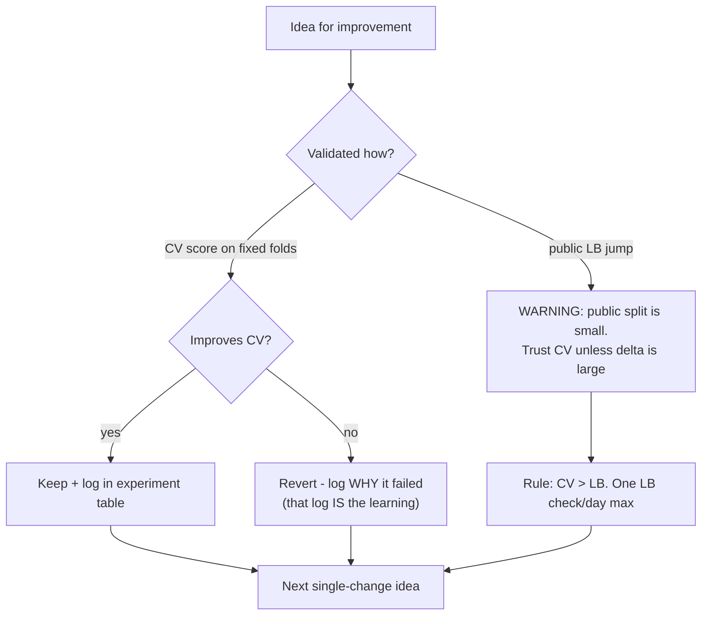
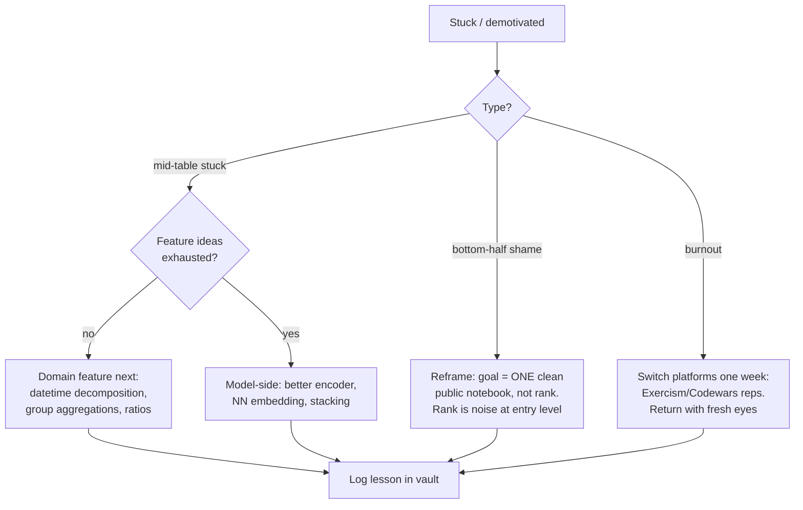

## For future agent
Deep edition of the Kaggle/practice guide. Adds mechanism analysis of why leaderboard practice corrupts judgment (and how to prevent it), failure-mode taxonomy per competition phase, premortem of a wasted competition season, defeat-tackling flowcharts, platform-selection decision logic, and life-integration cadence. Links into [[python-datascience-topics]] datasets and [[roadmap-data-scientist]] Stage 3–4.

# Kaggle & Practice Arena Guide — Deep Edition

## Part 1 — The Three Modes (mechanism-corrected)

| Mode | Goal | Mechanism |
|------|------|-----------|
| **Learn** | Micro-courses + badges ([Kaggle Learn](https://www.kaggle.com/learn/)) | Fast structured input; fine as scaffolding only |
| **Compete** | Pressure-testing vs real leaderboards | Deliberate practice with PUBLIC feedback signal |
| **Contribute** | Public notebooks with clean storytelling | Portfolio artifacts; interviewers read reasoning, not medals |

**The mechanism warning**: leaderboards optimize for a *proxy* (public split score). Proxy-optimization is exactly what ML teaches you to distrust — practicing on Kaggle while falling for proxy-chasing is ironic and common. The guide below builds the anti-proxy habits.

## Part 2 — Competition Playbook With Phase Failure Tables

### Phase A: Setup

| Failure | Root Cause | Early Warning | Counter |
|---------|-----------|---------------|---------|
| Metric misread | Skimming problem statement | Can't state metric's formula from memory | Implement your own scorer FIRST; test against sample submission |
| No EDA budget | Rush to models | First notebook cell = model | Mandate: target distribution, nulls, leak-hunt before any model |

### Phase B: Iteration

| Failure | Mechanism | Early Warning | Counter |
|---------|-----------|---------------|---------|
| Public-LB chasing | Overfitting small visible split | Private-shakeup anxiety growing | Fixed CV scheme decided BEFORE modeling |
| Data leakage shipped | Feature contains outcome ghost | Too-good CV score | Suspicion checklist: post-outcome fields? IDs? full-data aggregates? |
| Multi-change chaos | No controlled experiments | Can't say what helped | One change per experiment; logged table |
| Metric blindness | Optimizing wrong objective | RMSE work in MAE comp | Own-scorer rule from Phase A |

### Phase C: Wrap

| Failure | Cost | Counter |
|---------|------|---------|
| Skipping write-up | The actual portfolio value lost | Write-up notebook mandatory regardless of medal |
| Not reading top solutions | Missed the real lesson | Study top-3 post-mortems after close |

## Part 3 — Full Premortem (wasted season)

*Six months of Kaggle; nothing to show.* Autopsy findings:

1. **Medal-chasing consumed all hours**, zero write-ups → no portfolio artifact
2. **Public-LB overfits** taught wrong lessons that collapsed privately
3. **Notebook copying** without rebuild-from-blank → nothing internalized
4. **Competition hopping** at first sign of mid-table mediocrity → no completed arc
5. **Solo isolation** — never discussed approaches, so reasoning stayed verbal-less for interviews

Counters are embedded above; premortem = monthly self-audit against these five.

## Part 4 — Defeat-Tackling Flowchart

## Part 5 — Platform Selection Logic

| Platform | Use When | Ladder |
|----------|----------|--------|
| [Exercism](https://exercism.org) | Language fluency + mentorship | Track progression; read 2 mentored solutions per exercise |
| [Codewars](https://www.codewars.com) | Daily warm-up habit | One kata inside never-zero floor |
| LeetCode | Interview patterns | [[dsa-interview-playbook]] ladder, not random grind |
| [StrataScratch](https://www.stratascratch.com)/SQLZoo | SQL realism | Company-tagged after basics |
| HackerRank | India placement format | Aptitude + cert practice pre-drive |

**Decision rule**: platform serves CURRENT stage goal ([[roadmap-data-scientist]] position), not novelty.

## Part 6 — Life Integration

- **Cadence**: one competition arc per quarter maximum (parallel comps = shallow everything)
- **Time-box**: ≤6h/week during college terms; competition calendar checked against exam schedule before enrolling
- **Anchor**: feature-experiment hour tied to weekend block; daily touch = monitoring only
- **Synergy**: competition datasets double as roadmap Stage-3 exit-test material — don't treat them as separate tracks
- **Metrics**: write-ups published (the real output) · experiment-table discipline · CV-vs-LB divergence awareness · completed arcs per quarter ≥1

## Example Checkpoint Questions

1. Your private LB dropped 500 places vs public — reconstruct the mechanism step by step.
2. Why can a feature correlated with target be leakage? Give one real-world case.
3. When would YOU choose MAE over RMSE as model-selection metric — what property of errors drives it?

## Cross-Vault Links

[[roadmap-data-scientist]] · [[build-project-playbook]] · [[curated-reading-list]] (Kaggle lessons essay) · [[python-datascience-frameworks]]