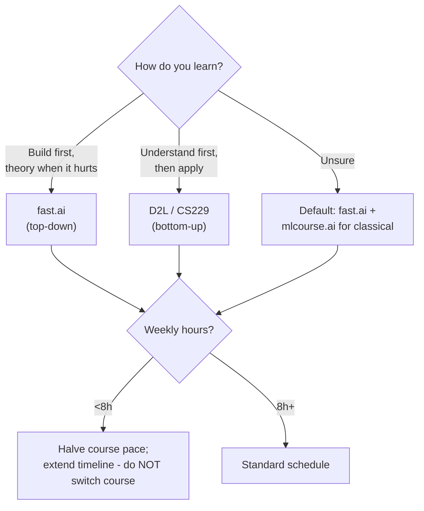
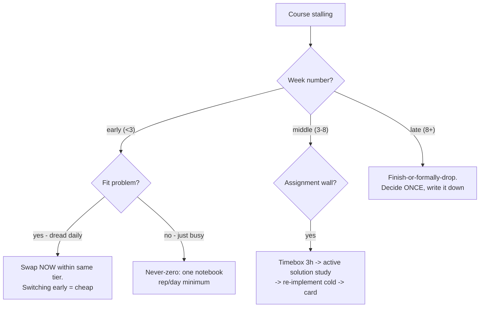

## For future agent
Deep edition of the ML theory + MOOC catalog. Adds: course-selection decision logic (why most people pick wrong), the MOOC-abandonment mechanism and its counters (course completion rates are brutally low — this page engineers against that), concept-explanation quality tiers, a full course-vs-course comparison for THIS vault's goals, and life integration. Course links preserved from source repo; canonical ones verified active as of 2026.

# Machine Learning Theory & Courses — Deep Edition

## Part 1 — The Course-Selection Problem (analyzed)

The #1 failure in ML self-study is not picking a bad course — it's **picking by popularity instead of by fit**, then abandoning at week 3. Selection has three inputs most people ignore:

1. **Your direction** (top-down practitioner vs bottom-up theorist) — mismatched = boredom or drowning
2. **Your math state RIGHT NOW** (not aspirationally)
3. **Your available weekly hours × course's real demand**

## Part 2 — The MOOC-Abandonment Mechanism

MOOC completion rates sit near single digits. Why — and the engineered counters:

| Mechanism | What Happens | Counter Built Into This Page |
|-----------|-------------|------------------------------|
| No social contract | Nobody notices you quit | Public commitment: track progress in vault dailies; weekly visible artifact |
| Assignment friction spike | Week-3 assignment harder than videos taught | Friction IS the curriculum; timebox 3h then seek solution actively |
| Next-course temptation | New shiny promises easier path | ONE primary rule ([[how-to-self-teach]]); switching costs logged |
| Passive watching | Videos feel like progress | Every lecture hour → same-day code rep |
| Certificate illusion | Completion ≠ competence | Exit tests below define done, not video counts |

### Premortem
*Course abandoned mid-way, third time.* Autopsy: chosen for instructor fame (fit ignored), watched 40 videos with zero notebook reps, switched at first hard assignment to a "better" course. All three visible by week 2 as: notebook-hours < video-hours.

## Part 3 — Canonical References (with usage depth)

| Resource | Why It Matters | How Deep |
|----------|---------------|----------|
| [Deep Learning Book](http://www.deeplearningbook.org/) | THE graduate text (Goodfellow/Bengio/Courville) | Reference chapters on demand; never cover-to-cover first pass |
| [Dive into Deep Learning](https://d2l.ai/) | Theory AND runnable code together | Primary-course candidate; interactive notebooks |
| [PRML Code Examples](https://github.com/ctgk/PRML) | Bishop's classic implemented | Lookup when classical algorithms feel hand-wavy |
| [Google ML Glossary](https://developers.google.com/machine-learning/glossary/) | Quick definitions | Daily lookup companion |
| [Most Cited DL Papers](https://github.com/terryum/awesome-deep-learning-papers) → [[repo-awesome-deep-learning-papers]] | Historical canon ranked | Spine-of-12 reading order there |
| [Papers With Code SOTA](https://paperswithcode.com/sota) | SOTA + implementations by task | When entering any subfield |
| [Gradient Descent Overview (Ruder)](http://sebastianruder.com/optimizing-gradient-descent/) | SGD variants explained | Read once before tuning anything seriously |
| [Precision & Recall](https://www.wikiwand.com/en/Precision_and_recall) | Core metrics precisely defined | Memorize-level |

## Part 4 — Course Catalog (tiered, with fit notes)

### Top Tier (pick ONE primary)

| Course | Fit If… | Real Demand | Known Failure Point |
|--------|---------|-------------|--------------------|
| **[fast.ai](http://www.fast.ai/)** | You want models running day one | Consistent effort; own experiments | Whiplash at part-2 internals; push through with second passes |
| **[D2L](https://d2l.ai/)** | You want math+code welded | Heavier; slower early wins | Chapter-4 linear algebra wall → [[math-for-ml-survival-guide]] |
| **[CS231n](http://cs231n.stanford.edu/)** | CV attracts you | Assignments are real work | Backprop assignment; legendary filter |
| **[mlcourse.ai](https://github.com/Yorko/mlcourse.ai)** → [[repo-mlcourse-ai]] | Classical/tabular ML focus | Assignments genuinely hard | It's fine to skip bonus assignments by design |

### Specialized / Supporting (secondary slots only)
CS221 (broad AI) · CS224d (NLP-DL) · CS109 (classic DS) · Coursera DL Specialization (Ng) · TensorFlow in Practice · Google ML Crash Course · Udacity DL · Full Stack Deep Learning (production bridge) · MIT Computational Thinking w/ 3B1B · Machine Learning Mastery (recipe-style).

**Rule**: supporting courses start ONLY after primary is ≥60% done.

## Part 5 — Concept Explanations (quality-tiered)

### Neural Networks & Deep Learning
- **[A Recipe for Training Neural Networks (Karpathy)](http://karpathy.github.io/2019/04/25/recipe/)** — the training discipline bible: overfit one batch first, verify data pipeline, then scale. THE highest-value single essay in this entire module; re-read quarterly.
- Schmidhuber overview survey (paywall) — historical completeness

### CNNs
- ["Best explanation" Medium piece](https://medium.com/technologymadeeasy/the-best-explanation-of-convolutional-neural-networks-on-the-internet-fbb8b1ad5df8) — intuition layer
- [Adeleshpande beginner guide](https://adeshpande3.github.io/adeshpande3.github.io/A-Beginner's-Guide-To-Understanding-Convolutional-Neural-Networks/) — structured progression
- **[CNN Explainer](https://github.com/poloclub/cnn-explainer)** — interactive in-browser; show non-ML friends here

### GANs / Unsupervised / Misc
- deeplearning4j GAN intro · r/datascience mixed-data thread · Marco Altini imbalanced-data essay (**key point: resample inside CV folds only**) · arXiv 1803.00676 meta-learning · Insight "90% of NLP" guide · EFF AI metrics

### Classical
- Logistic regression walkthroughs (TDS Pt 11; Shakir instrumental-variables thinking)
- victorzhou random forests for beginners

## Part 6 — Interview Prep Banks
- [Data Science Interview Questions (grigorev)](https://github.com/alexeygrigorev/data-science-interviews) → expanded [[repo-ds-interviews-grigorev]]
- 160 questions hackernoon list
- Vault drills: [[ml-interview-playbook]], [[example-question-bank]]

## Part 7 — Defeat-Tackling Flowchart (mid-course)

## Part 8 — Life Integration

- Primary course gets the morning anchor slot; supporting content lives in commute gaps
- Notebook-rep ratio tracked weekly: must stay ≥1 vs video-hours
- Exam weeks: never-zero = one Anki review of course concepts
- Quarterly: re-scan this catalog — has a better-fit primary emerged? Only switch on evidence, not mood

**Success metrics**: primary-course % complete (leading) · own-experiment count using course concepts (proof) · exit-test passage per stage gate · abandonment events (target: zero after swap-window closes)

## Example Checkpoint Questions

1. Which mechanism of MOOC abandonment am I currently most vulnerable to?
2. Can I state my primary course's next three assignments without opening it? (If not — disengaged.)
3. What did last week's lectures change about how I'd build something?

## Cross-Vault Links

[[repo-mlcourse-ai]] · [[repo-awesome-deep-learning-papers]] · [[roadmaps-and-study-guides]] · [[python-datascience-frameworks]] · [[math-for-ml-survival-guide]] · [[how-to-self-teach]]