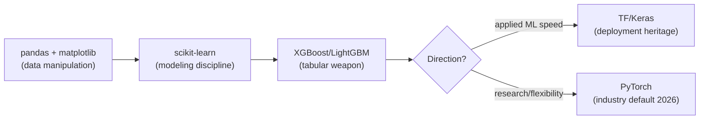
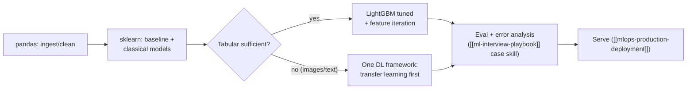

## For future agent
Deep edition of the framework catalog. Beyond curated links, adds: framework-selection decision logic (with the market reasoning), per-framework failure modes (the standard bugs/walls where learners stall), mastery-order recommendation (which to learn first and WHY), integration flowchart, and life-integration practice loops. Topic-side applications in [[python-datascience-topics]]; production layer in [[mlops-production-deployment]].

# Python for Data Science — Frameworks [Deep Edition]

## Part 1 — Mastery Order (decision logic)

Learning frameworks out of order is the standard self-taught disaster. The dependency-correct order:

**Why this order**: pandas failures masquerade as ML failures (garbage frames → garbage models); sklearn teaches the *workflow* (fit/transform/predict, CV discipline) that every later framework assumes; boosting wins most real tabular problems so it pays rent immediately; DL frameworks last because they're the least forgiving of weak foundations.

**Anti-pattern**: starting with PyTorch because researchers use it — you'll fight two battles (DL concepts + framework idioms) simultaneously.

## Part 2 — Foundation Stack

### pandas / scikit-learn / Basics
- **[Python Data Science Handbook (jakevdp)](https://github.com/jakevdp/PythonDataScienceHandbook)** — the free foundation book
- [Missing data/imputation in pandas](https://pandas.pydata.org/pandas-docs/stable/missing_data.html)
- [Cross-validation in sklearn](http://scikit-learn.org/stable/modules/cross_validation.html)
- [auto-sklearn](https://automl.github.io/auto-sklearn/stable/) — automated model/hyperparameter search
- [Vaex out-of-core DataFrames](https://towardsdatascience.com/vaex-out-of-core-dataframes-for-python-and-fast-visualization-12c102db044a) — beyond-RAM data

### Failure modes at this layer

| Failure | Mechanism | Counter |
|---------|-----------|---------|
| Chained-assignment warnings ignored | SettingWithCopyWarning treated as noise | Understand views-vs-copies ONCE properly; `.loc` everywhere |
| Fit-before-split leakage | Pipeline concept not internalized | sklearn `Pipeline` objects mandatory from day one |
| Iterating rows | for-loop habits from general Python | Vectorize-or-die drill: rewrite row loops as column ops |

### Gradient Boosting (the tabular workhorse)

| Library | Edge | Key Link |
|---------|------|----------|
| **XGBoost** | Original; mature ecosystem | [Boosted trees intro](http://xgboost.readthedocs.io/en/latest/model.html) |
| **LightGBM** (Microsoft) | Fast, distributed, histogram-based | [repo](https://github.com/microsoft/LightGBM) |
| **CatBoost** (Yandex) | Native categoricals; ordered boosting reduces target leakage | [repo](https://github.com/catboost/catboost) |

Failure mode: hyperparameter roulette without baselines → single-change-at-a-time experiment table or you learn nothing transferable.

## Part 3 — TensorFlow 2.x & Keras (deep section)

### Learn
[eat TF2 in 30 days](https://github.com/lyhue1991/eat_tensorflow2_in_30_days) · [TF Book (BinRoot)](https://github.com/BinRoot/TensorFlow-Book) · [official curriculum](https://www.tensorflow.org/resources/learn-ml) · [Developer Certificate](https://www.tensorflow.org/certificate) · [Inside TensorFlow (Yelp)](https://engineeringblog.yelp.com/2019/11/inside-tensorflow.html) · [LSTM recipe walkthrough](https://github.com/trekhleb/machine-learning-experiments/blob/master/assets/recipes_generation.en.md)

### Training mechanics
[LR schedules & decay](https://www.pyimagesearch.com/2019/07/22/keras-learning-rate-schedules-and-decay/) · Tuning: [keras-tuner](https://keras-team.github.io/keras-tuner/) / [hyperas](https://github.com/maxpumperla/hyperas) / [AutoKeras](https://autokeras.com/) · TensorBoard: [distributions/histograms](https://stackoverflow.com/questions/42425858/tensorboard-distributions-and-histograms-with-keras-and-fit-generator), [all images](https://stackoverflow.com/questions/45584557/how-to-show-all-my-images-in-tensorboard)

### Migration & performance
[ImageDataGenerator split](https://stackoverflow.com/questions/42443936/keras-split-train-test-set-when-using-imagedatagenerator) · [TF1→2 AutoGraph/eager](https://medium.com/ai%C2%B3-theory-practice-business/tensorflow-1-0-vs-2-0-part-1-computational-graphs-4bb6e31c1a0f) · [Effective TF2](https://www.tensorflow.org/guide/effective_tf2) · [CPU inference via MKL](https://software.intel.com/content/www/us/en/develop/articles/maximize-tensorflow-performance-on-cpu-considerations-and-recommendations-for-inference.html)

### Extensions
[Ludwig (no-code)](https://github.com/uber/ludwig) · [TF-Coder](https://blog.tensorflow.org/2020/08/introducing-tensorflow-coder-tool.html) · **[Einops](https://github.com/arogozhnikov/einops)** (readable tensor ops; industry-standard vocabulary now)

### NLP + detection in TF
[dennybritz CNN text (Kim 2014)](https://github.com/dennybritz/cnn-text-classification-tf) · [word2vec official](https://www.tensorflow.org/tutorials/word2vec) · [wildml text CNN](http://www.wildml.com/2015/12/implementing-a-cnn-for-text-classification-in-tensorflow/#more-452) · [SSD hand detector](https://towardsdatascience.com/how-to-build-a-real-time-hand-detector-using-neural-networks-ssd-on-tensorflow-d6bac0e4b2ce) + [code](https://github.com/victordibia/handtracking)

### Failure modes at this layer

| Failure | Root Cause | Early Warning | Counter |
|---------|-----------|---------------|---------|
| Shape errors as identity crisis | Tensor rank confusion | Reshape trial-and-error loops | Draw shapes on paper; einops notation clarifies intent |
| Loss = NaN mid-training | LR too high / log(0) / exploding gradients | First NaN after loss spike | Halve LR; gradient clipping; check input scaling |
| Overfitting accepted as fate | No regularization vocabulary | Train↑ val↓ divergence early | Dropout/L2/augmentation/early-stopping toolkit drilled |
| Checkpoint mystery | Serialization not understood | Can't resume training | Save/load round-trip exercise until boring |

## Part 4 — Keras Advanced Issues (architectural nuance goldmine)

[Chollet's Deep Learning with Python](https://www.manning.com/books/deep-learning-with-python) + [notebooks](https://github.com/fchollet/deep-learning-with-python-notebooks) · [examples library](https://github.com/keras-team/keras/tree/master/examples) · [sklearn API](https://keras.io/scikit-learn-api/) · Nuance threads: [1D conv filter lengths](https://github.com/keras-team/keras/issues/1023) · [dynamic k-max pooling](https://github.com/keras-team/keras/issues/373) · [non-static CNN (Kim 2014)](https://github.com/keras-team/keras/issues/1515) · [feature weights extraction](https://github.com/keras-team/keras/issues/12) · [1D vs 2D conv for text](https://github.com/keras-team/keras/issues/233) · [word vectors vs Embedding layer](https://github.com/keras-team/keras/issues/853) · [MNIST transfer learning](https://github.com/keras-team/keras/blob/master/examples/mnist_transfer_cnn.py)

## Part 5 — PyTorch
[torch2rt (NVIDIA)](https://github.com/NVIDIA-AI-IOT/torch2rt) inference conversion · [TorchCV](https://github.com/donnyyou/torchcv) CV scaffolding · [BoTorch](https://github.com/pytorch/botorch) Bayesian optimization.

## Part 6 — Integration Flowchart (frameworks inside a project lifecycle)

## Part 7 — Life Integration

- Framework learning follows the roadmap stage, never leads it ([[roadmap-data-scientist]] Stage gates)
- One framework deep > three shallow: depth transfers across APIs; shallow familiarity doesn't
- Practice loop per framework: docs example → modify on own dataset → break-it-on-purpose → fix → card the gotcha
- Weekly artifact rule: something runnable exists from this week's framework work

**Metrics**: own-dataset experiments logged per framework · pipeline-from-scratch time trending down · gotcha-card deck growing · zero tutorial-only weeks.

## Example Checkpoint Questions

1. Why does LightGBM train faster than classic xgboost? (histogram splits — mechanism, not marketing)
2. Your Keras model's val_loss is NaN by epoch 3. Ranked suspects?
3. When is CatBoost clearly the right choice over LightGBM?
4. What does `Pipeline` prevent that manual fit/transform sequencing doesn't?

## Cross-Vault Links

[[python-datascience-topics]] · [[mlops-production-deployment]] · [[ml-theory-and-moocs]] · [[roadmap-ml-engineer]] · [[kaggle-and-practice-guide]]