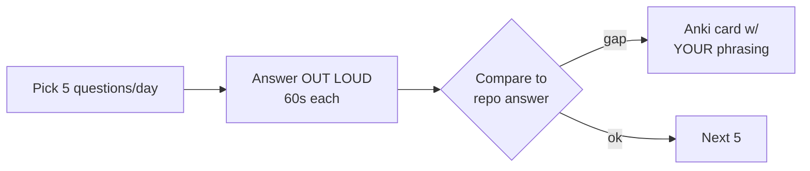
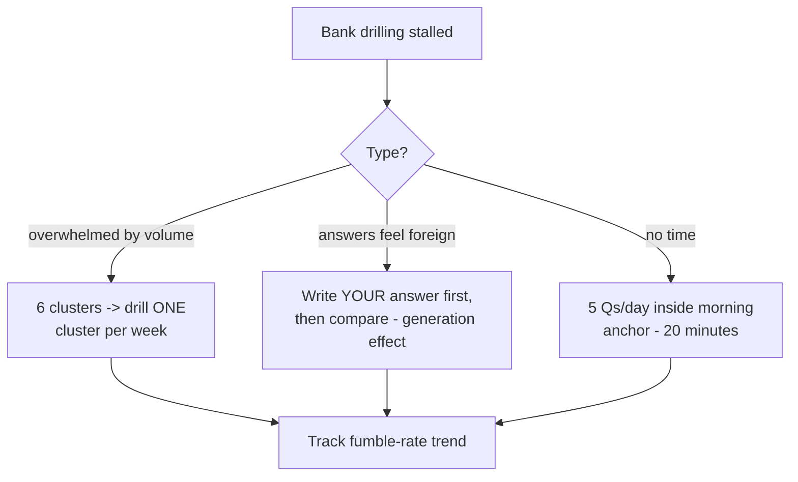

## For future agent
Community-answered DS interview bank, expanded from its README structure (fetched 2026-08-24). Organized as theory.md / technical.md / contrib/probability.md / awesome.md. This page explains each file's coverage and a drilling protocol; sample questions with answer targets included. Deeper treatments: [[ml-interview-playbook]], [[example-question-bank]].

# Data Science Interviews (Grigorev) — Expanded

## What the Repo Contains

| File | Coverage |
|------|----------|
| `theory.md` | Linear models (bias/variance, regularization), trees & ensembles, neural nets, evaluation metrics, unsupervised, general ML concepts |
| `technical.md` | SQL, Python coding, algorithms-in-pandas style problems |
| `contrib/probability.md` | Community probability puzzles |
| `awesome.md` | Curated list of OTHER interview resources |

Answers are community PRs — quality varies; treat answers as *starting points*, verify anything surprising.

## The Theory File's Core Question Clusters (drill these cold)

1. **Bias-variance**: definitions, decomposition, how each shows in learning curves
2. **Regularization**: L1 vs L2 geometry + sparsity consequences; when ElasticNet
3. **Trees/ensembles**: why forests reduce variance but boosting reduces bias primarily; randomness sources in RF
4. **Neural nets**: activation necessity, vanishing gradients, dropout as regularization
5. **Metrics**: precision/recall tradeoff curves, ROC vs PR-AUC under imbalance
6. **Unsupervised**: k-means assumptions/failure modes, elbow method criticism

## Drilling Protocol

## Sample Questions With Target Answers (from its clusters)

1. *What's the bias-variance tradeoff?* → error decomposition + which side simple/complex models err on + detection via curves.
2. *How does random forest reduce variance?* → bootstrap + feature subsampling decorrelate trees; averaging cuts variance without raising bias much.
3. *Why can ROC-AUC mislead on imbalanced data?* → FPR dominated by huge negative class; PR-AUC reflects positive-class reality.
4. *(SQL)* Second-highest salary per department → window `DENSE_RANK` filter.

## Failure Points

| Failure | Counter |
|---------|---------|
| Reading answers passively | Out-loud rule; reading feels like knowing ([[how-to-self-teach]]) |
| Memorizing without categories | Cluster-first: every new question files into one of the 6 clusters above |

## Deep Edition Addendum

**Failure modes of question-bank users**:

| Failure | Mechanism | Counter |
|---------|-----------|---------|
| Silent reading | Recognition confused with production ability | Out-loud rule; record answers |
| Answer-worship | Community answers treated as gospel | Verify surprising claims; answers vary in quality |
| Random access | Questions in arbitrary order, no clustering | Cluster-first: file every miss into the 6 theory clusters |
| One-pass illusion | "I went through the whole repo" | Spaced re-drill: day-3/day-14 on misses |

**Premortem**: *Read all questions + answers twice; still bombed the ML screen.* Findings: zero out-loud practice; answers memorized as strings not connected webs; SQL section skipped as "easy" (it wasn't). The drilling protocol above exists because reading banks is necessary-but-insufficient.

**Rescue flowchart**:

**Life integration**: daily 20-min slot ([[example-question-bank]] rotation); metrics = fumble-rate falling, clusters at green, mock scores.

## Cross-Vault Links

- [[ml-interview-playbook]] · [[example-question-bank]]
- [[roadmap-data-scientist]] Stage 5