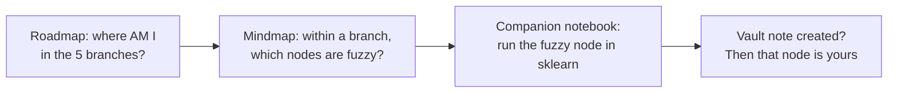
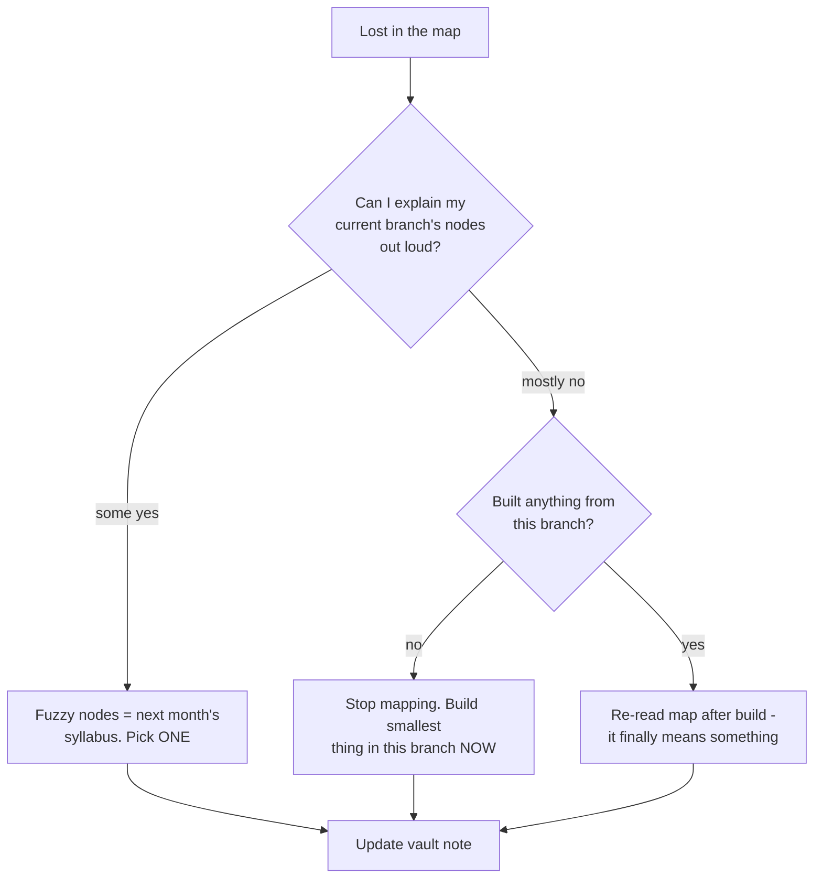

## For future agent
The two visual ML maps expanded together (the second inspired the first, per the roadmap's own credits): mrdbourke's 5-branch roadmap and dformoso's mindmap/PDF series with companion notebooks. Use for orientation and gap-checking — NOT as a course. Real curricula: [[ml-theory-and-moocs]].

# ML Roadmaps & Mindmaps — Expanded

## Repo A: mrdbourke/machine-learning-roadmap

A single giant visual connecting everything ML. Its five branches (verbatim from README):

1. **ML Problems** — what does an ML problem even look like? (classification/regression/transcription…)
2. **ML Process** — steps from problem to deployed solution
3. **ML Tools** — pandas/sklearn/TF/PyTorch landscape
4. **ML Mathematics** — what's under the hood (linear algebra, calc, stats)
5. **ML Resources** — how to learn all of it

Extras: full interactive version (dbourke.link/mlmap) + a feature-length video walkthrough. Author states it stays ~90% valid years later — concepts stable, tools drift.

**Best use**: once a quarter — scan all five branches and mark which areas you can't explain yet. That's your next month's syllabus.

## Repo B: dformoso/machine-learning-mindmap (+ companions)

One-page PDF mindmap of the entire field, organized by its own sections:

1. **Process** — DS as designed pipeline, not set-and-forget
2. **Data Processing** — find/collect/clean + the other ~5 steps
3. **Mathematics** — the common components
4. **Concepts** — types, categories, approaches, libraries
5. **Models** — the popular model zoo with families grouped

Companions:
- **Deep Learning mindmap** (separate PDF, same author)
- **sklearn-classification notebook** — runnable walkthrough of most DS steps in the map

Sources he cites: Stanford/Oxford lectures (CS20SI, CS224d), Goodfellow DL book, Bishop PRML, Hastie ESL — i.e., the canon compressed into one page.

## Combined Orientation Flow

## Failure Points

| Failure | Counter |
|---------|---------|
| Collecting maps instead of studying | One orientation pass per quarter max |
| Treating mindmap breadth as knowledge | A node counts only when you can teach it ([[how-to-self-teach]] retrieval rule) |

## Example Self-Diagnostic (using their branches)

1. Explain an ML problem you've personally framed (branch 1) — not from a tutorial.
2. Draw the process branch from memory; where does feature engineering sit relative to CV?
3. Which math node appears in BOTH maps' math sections? Why is it non-negotiable?

## Deep Edition Addendum

**Failure modes of map-followers**:

| Failure | Mechanism | Counter |
|---------|-----------|---------|
| Map-as-achievement | Studying the map instead of the territory | One orientation pass/quarter max |
| Node anxiety | Every unmapped branch = guilt node | Fuzzy nodes are the SYLLABUS, not the shame list |
| Tool-node obsession | Chasing every library leaf | Concepts stable, tools drift — learn concepts |

**Premortem**: *"Studied ML" for a year = studied MAPS of ML.* Findings: three mindmaps downloaded, zero models trained outside tutorials; roadmap re-read monthly as procrastination ritual. Maps orient; only building moves you.

**Rescue flowchart**:

**Life integration**: quarterly orientation (30 min) tied to season changes so it's memorable; metrics = fuzzy-nodes-closed count per quarter, companion-notebook experiments run.

## Cross-Vault Links

- [[ml-theory-and-moocs]] · [[roadmaps-and-study-guides]]
- [[math-for-ml-survival-guide]] — for the math branch