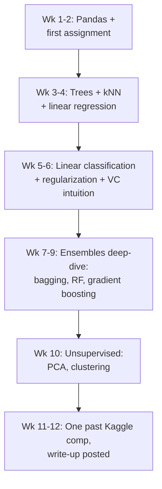
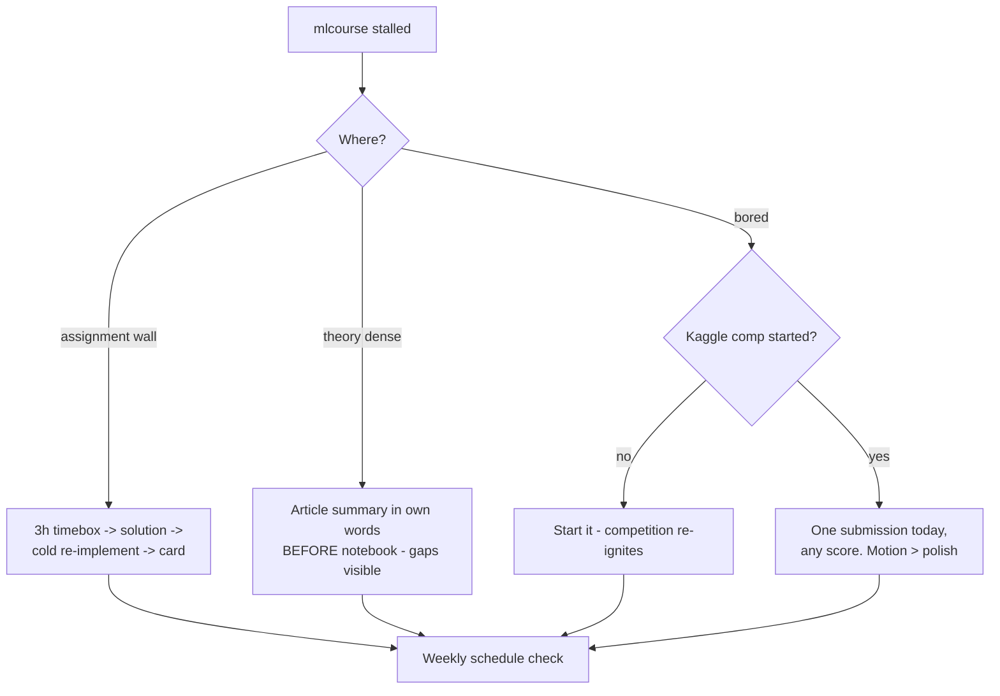

## For future agent
mlcourse.ai — the rigorous classical-ML open course (explicitly NO deep learning). Real structure fetched 2026-08-24: articles, lectures, assignments, bonus assignments, Kaggle in-class competitions, self-paced mode, Jupyter Book format. This page turns it into a schedule. Course positioning vs alternatives: [[ml-theory-and-moocs]].

# mlcourse.ai — Expanded

## Identity & Scope

- **Focus**: classical applied ML — trees, ensembles/boosting (deep), unsupervised, feature engineering, Vowpal Wabbit-style linear learning at scale
- **Explicitly NOT** deep learning — that's its strength as complement to fast.ai/CS231n, not duplicate
- **Medium**: English; Russian lectures also available
- **Format now**: self-paced Jupyter Book with articles + assignments + past Kaggle competitions

## Its Components (from actual README headings)

| Component | What It Is |
|-----------|-----------|
| Articles | Long-form theory-with-code pieces per topic |
| Lectures | Video companions |
| Assignments | Notebook-based, auto-checkable demos + personal assignments |
| **Bonus assignments** | Harder optional ones (e.g., implementing beaming search, VC theory notes) |
| Kaggle competitions | The famous in-class comps: Alice user-identification, Catch-me-if-you-can intrusion detection, Medium article popularity |
| Self-paced passing | Its own recommended order & timeline |

## Execution Schedule (12 weeks part-time)

## Why This Course Specifically Pays Off

- Gradient boosting depth here transfers directly to XGBoost/LightGBM work ([[python-datascience-frameworks]]) — the tabular-industry workhorse
- Its Kaggle comps are *designed for learners* — smaller than live comps, with published top solutions to study after
- Assignment style = fill-in-notebook → immediate feedback loop

## Failure Points

| Failure | Counter |
|---------|---------|
| Assignment walls (they're hard) | Bonus ones are OPTIONAL by design; core path skips them |
| Skipping competitions | The comp is where articles become skill; do at least one |
| English+math density fatigue | Pair weeks: one mlcourse week / one lighter application week |

## Example Checkpoint Questions

1. Why does boosting fit shallow trees sequentially while RF fits deep-ish trees in parallel?
2. What does the learning rate control in gradient boosting's functional descent view?
3. In the Alice comp, what made time-based validation splits essential?

## Deep Edition Addendum

**Failure modes of mlcourse.ai students**:

| Failure | Mechanism | Counter |
|---------|-----------|---------|
| Assignment walls → quit | Assignments are genuinely hard (by design) | Timebox 3h → active solution study → re-implement cold; bonus ones are OPTIONAL |
| Article skimming | Long-form density defeats passive reading | One article = one notebook rep same day |
| Competition skipping | Kaggle comps feel intimidating | They're learner-designed; the comp is where articles become skill |
| English/math fatigue | Densest text in this whole module | Pair weeks: one mlcourse / one applied-light |

**Premortem**: *mlcourse abandoned at assignment 3, twice.* Findings: bonus assignments attempted from pride (explicitly optional), no logging of stuck points, second attempt repeated identical path. The 12-week schedule exists to prevent freeform drift.

**Rescue flowchart**:

**Life integration**: pairs with [[roadmap-data-scientist]] Stage 3 as its primary course option; metrics = assignments submitted (not understood-feelings), competition submissions count.

## Cross-Vault Links

- [[ml-theory-and-moocs]] · [[roadmap-data-scientist]] Stage 3 alternative primary
- [[kaggle-and-practice-guide]]