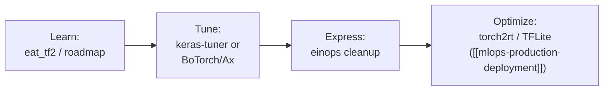
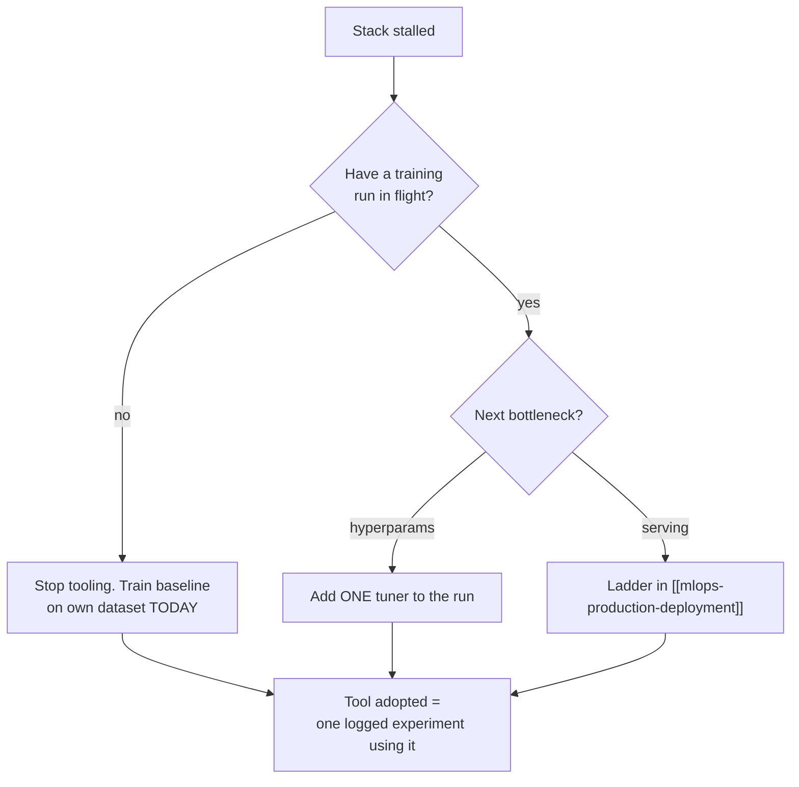

## For future agent
The knowledge-repo's smaller framework-learning repos grouped into one page by function (learn / tune / extend / optimize). Individual quirks noted per repo. The main framework page remains [[python-datascience-frameworks]]; this is the supporting-cast map.

# TF/PyTorch Learning Stack — Expanded

## Learn

| Repo | What It Is | Best For |
|------|-----------|----------|
| **eat_tensorflow2_in_30_days** | Chinese-origin, community-translated tf2 book; 30-day chapter plan incl. low-level mechanics | Fast practical tf2 with depth when ready |
| **TensorFlow-Roadmap (instillai)** | Curated resource map for DL-with-TF | Finding the right tutorial per subtopic |
| **TensorFlow-Book (BinRoot)** | Code-companion book repo | Classic exercises alongside reading |

## Tune (hyperparameter optimization)

| Repo | Approach | One-Line Verdict |
|------|----------|------------------|
| **keras-tuner** | First-party Keras tuner (random/search spaces/Bayesian/Hyperband) | Default choice today |
| **hyperas** | Keras+Hyperopt via decorator magic | Historical; charming but stale `(TBC)` |
| **AutoKeras** | Full AutoML on Keras architecture search | When you want zero model design |

## Extend / Express

| Repo | What It Does |
|------|-------------|
| **einops** | Readable tensor reordering (`rearrange("b h w c -> b (h w) c")`) across numpy/torch/tf — now industry-standard vocabulary |
| **ludwig (Uber)** | Train DL models from YAML/declarative configs, no code |
| **TF-Coder** | Input/output examples → TF expression synthesis (research tool) |

## Optimize / Deploy (PyTorch side)

| Repo | Purpose |
|------|---------|
| **torch2rt (NVIDIA)** | PyTorch → TensorRT conversion; inference speedups on NVIDIA HW |
| **TorchCV** | CV framework scaffolding on PyTorch |
| **BoTorch** | Bayesian optimization library (powers Ax tuning); research-grade HPO |

## How the Stack Fits a Project Lifecycle

## Failure Points

| Failure | Counter |
|---------|---------|
| Tool-shopping instead of training | One tuner, one book — ship a model first ([[build-project-playbook]]) |
| einops confusion early | Learn plain reshape/transpose first; einops is a reward, not an entry drug |

## Example Checkpoint Questions

1. Hyperband vs Bayesian tuning — what does each spend its budget on?
2. Rewrite `x.transpose(0,2,3,1).reshape(b, -1, c)` as one einops call.
3. When would declarative Ludwig beat writing Keras by hand? When never?

## Deep Edition Addendum

**Failure modes of learning-stack collectors**:

| Failure | Mechanism | Counter |
|---------|-----------|---------|
| Tool-shopping as progress | New tuner tried instead of model trained | ONE tuner, ONE book — until shipped ([[build-project-playbook]]) |
| Einops premature | DSL confusion layered on tensor confusion | Plain reshape/transpose fluency first; einops is a reward |
| Hyperopt archaeology | Dead tools studied for completeness | 2026 defaults: keras-tuner or BoTorch/Ax `(TBC: check current)` |

**Premortem**: *"Learned TF ecosystem"* = installed six tools, trained nothing. Findings: environment churn (each tool new env), zero experiment logs, tutorial repos never modified. The lifecycle flowchart exists so tools attach to a LIVE project stage, not to a collection hobby.

**Rescue flowchart**:

**Life integration**: tools enter only at their lifecycle stage; metrics = experiments logged with each tool, dead-tool count pruned quarterly.

## Cross-Vault Links

- [[python-datascience-frameworks]] · [[mlops-production-deployment]] · [[roadmap-ml-engineer]] Stage 2