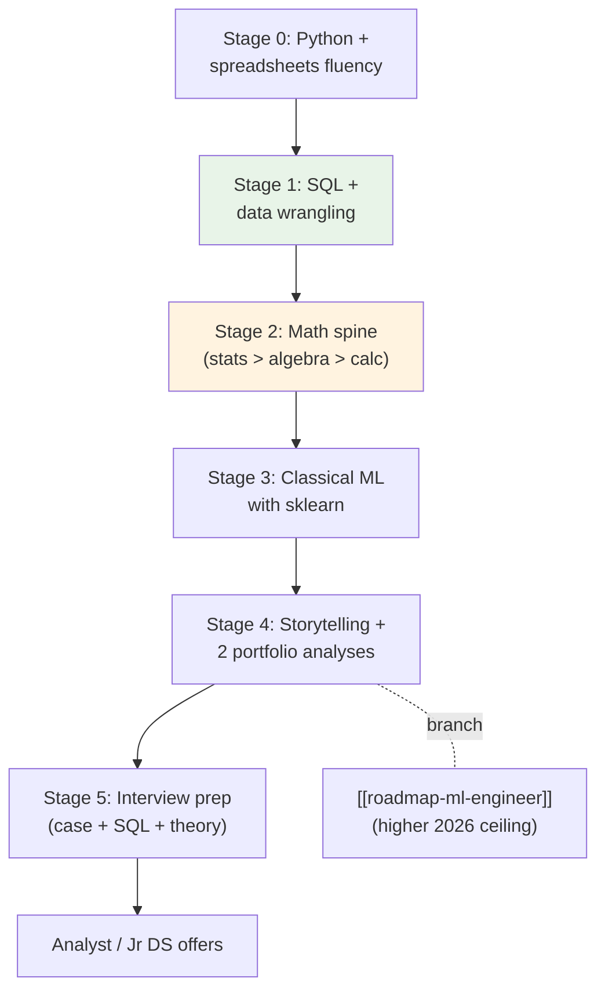
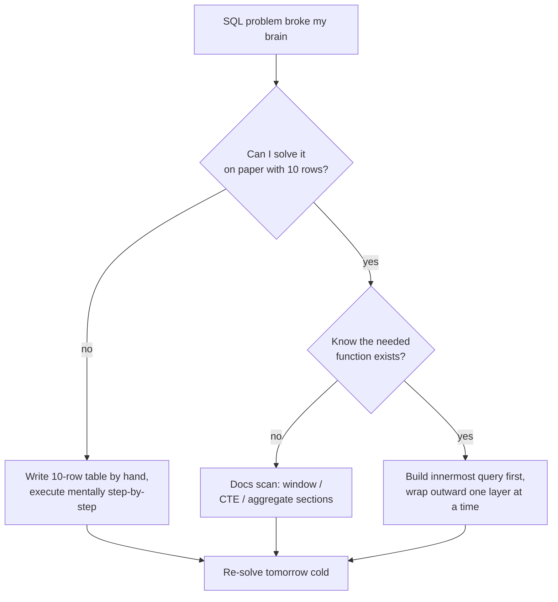
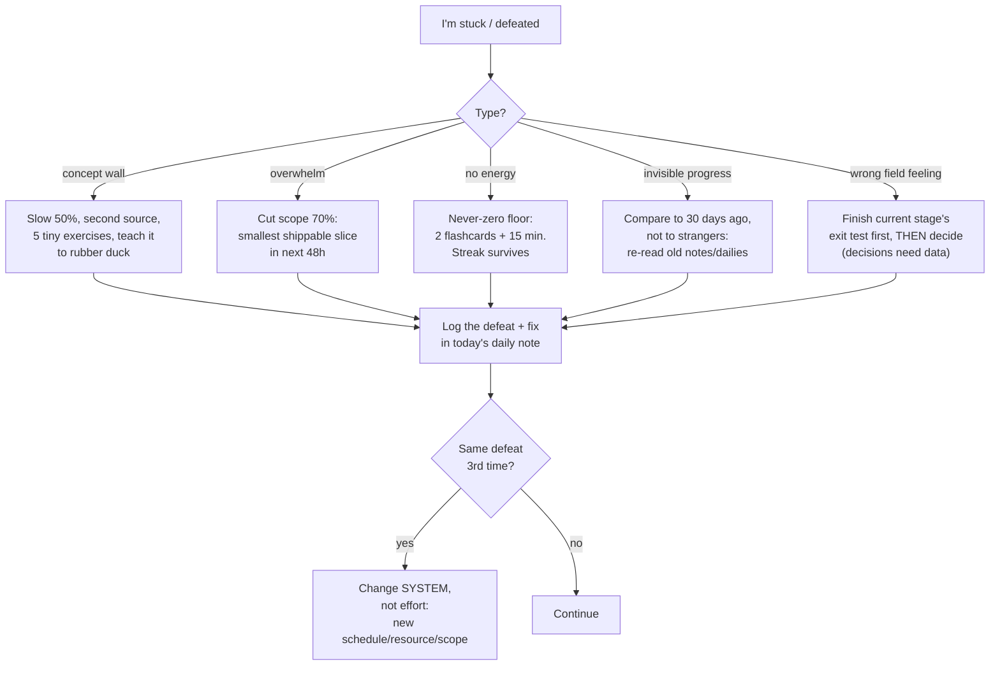

## For future agent
Deep edition of the DS roadmap: stage-based path (mirroring OSSU's curriculum order), each stage with exit tests, root-cause failure analysis, premortems, defeat-tackling protocols, and life-integration scheduling. Read with [[how-to-self-teach]]; math depth in [[math-for-ml-survival-guide]]; market context in [[01-Areas/Business/careers/market-analysis-tech-2026]].

# Data Scientist Roadmap — Deep Edition

## The Full Map

**Why this order and not another**: SQL before ML because every DS screen tests it; stats before algebra because it pays off immediately in your own analyses (motivation fuel); ML before deep learning because tabular work is where freshers actually get hired; portfolio before interviews because interviews interrogate projects, not certificates.

## Stage-by-Stage Deep Dives

### Stage 0 — Python for Data (3–5 weeks)

**Core**: pandas + matplotlib + jupyter via the free [Python Data Science Handbook](https://github.com/jakevdp/PythonDataScienceHandbook).

- **Exit test**: raw messy CSV → cleaned, grouped, pivoted, 3 plotted insights in under one hour from memory.
- **Root cause of failures here**: pandas indexing (`loc` vs `iloc` vs chained assignment). It's not you — pandas has two overlapping indexing APIs born from history.
- **Counter**: do the "Seven clean reshape steps" essay ([[curated-reading-list]]) twice slowly; then rebuild its operations on YOUR dataset without looking.
- **Premortem**: *It's week 6 and you've watched three pandas courses but freeze on a real CSV.* Diagnosis: input without output hours. Fix: 1:1 build rule enforced retroactively — next 7 days are build-only, zero video.

### Stage 1 — SQL Until It's Boring (3–4 weeks)

The #1 screened skill for DS/analyst roles in India. Progression: SELECT→JOIN→GROUP BY→subqueries→window functions→query-cost intuition.

- **Exit test**: 10 interview-grade questions straight ([StrataScratch](https://www.stratascratch.com)/LeetCode DB), including an unprompted window function when the question smells like "latest record per user."
- **Failure modes table**:

| Failure Mode | Early Warning Signal | Countermeasure |
|--------------|---------------------|----------------|
| JOIN confusion (which row multiplies?) | Results with unexpected duplicate counts | Draw Venn + trace one row through the join by hand |
| Window function terror | Avoiding `OVER()`; rewriting as nested subqueries | One week: ONLY window problems (15 of them), nothing else |
| Silent NULL logic bugs | Aggregates that don't sum | Card `NULL <> NULL`; test every query against NULL rows deliberately |

- **Defeat protocol**:

### Stage 2 — The Math Spine (8–12 weeks, interleaved)

Full plan lives in [[math-for-ml-survival-guide]]. Order: **probability/statistics first**, then linear algebra, then just-enough calculus.

| Topic | Depth | Exit Test |
|-------|-------|-----------|
| Descriptive stats + distributions | Deep | Explain median-vs-mean with skewed salary data to a non-coder |
| Hypothesis testing, CIs | Deep | Design an A/B test: metric, sample-size intuition, correct p-value language |
| Linear algebra | Working | 3×3 matmul by hand; eigenvectors via picture |
| Calculus | Light | Derive why GD moves opposite the gradient; fluent chain rule |

- **Premortem**: *Month 3, you quit during MIT 18.05 because proofs feel pointless.* Root cause: wrong resource depth for your goal. Fix: swap to StatQuest-intuition-first track; proofs only if research-bound later.
- **Life integration**: math is the FIRST thing dropped when college spikes. Anchor it to an existing habit: 25 min of stats immediately after your fixed morning slot, before phone. Never-zero floor = 2 Anki cards.

### Stage 3 — Classical ML (6–10 weeks)

sklearn end-to-end: regression → regularization → logistic → trees → ensembles → clustering → metrics → proper CV.

- **Exit test**: fresh Kaggle tabular set → EDA → baseline → model → CV → error analysis, single sitting, articulating WHY each metric.
- **Failure analysis by frequency** (from fresher code reviews):

| Rank | Failure | Root Cause | Fix |
|------|---------|------------|-----|
| 1 | Accuracy on imbalanced data | Metric taught as universal | PR-AUC habit; card "when accuracy lies" |
| 2 | Leakage (scaler fit pre-split) | Pipeline not understood as object | sklearn `Pipeline` mandatory from day 1 |
| 3 | CV scheme mismatched to data | Group/time structure ignored | Ask "what is a random split lying about here?" every time |
| 4 | Hyperparameter roulette | No baseline discipline | Baseline → beat-it loop, logged |

### Stage 4 — Analysis & Storytelling Portfolio (parallel)

Two public analyses per [[build-project-playbook]]: real business question → data → 3 recommendations, published.

- **Anti-patterns ranked by interview damage**: Titanic/Iris (zero signal) > perfect-but-boring clean dataset (no war story) < messy real data with a decision at the end (hireable).
- **India-specific picks**: retail price patterns, local transit, cricket analytics, UPI/fintech public data — domain proximity makes storytelling natural.

### Stage 5 — Interviews

Format: SQL round → live pandas → stats/A-B case → ML theory → business case. Drills: [[ml-interview-playbook]], [[repo-ds-interviews-grigorev]], [[example-question-bank]].

- **Market reality** `(as of 2026)`: entry DS postings <6% of AI-skill demand — analyst titles are the door; DS comes after 1–2 years. See [[market-analysis-tech-2026]].

## The Master Premortem (whole-path level)

*Assume it's 12 months from now and this roadmap failed.* Post-mortem findings, ranked by likelihood:

1. **Tutorial consumption ≫ building** (most common death). Signal: watch-time high, repo commits low.
2. **Math stage became permanent residence.** Signal: month 4 still "preparing" calculus.
3. **No public artifact.** Signal: GitHub green but empty READMEs.
4. **College exam cycles erased momentum**, never restarted. Signal: gap >14 days in daily log.
5. **Comparison paralysis** against IIT peers online. Signal: scrolling instead of shipping.

Each has a counter earlier on this page — the premortem exists so you recognize the failure WHILE it's cheap to fix.

## Defeat-Tackling Master Flowchart

## Life Integration System

**Weekly template (college-compatible)**:

| Slot | Mon–Fri | Sat | Sun |
|------|---------|-----|-----|
| Morning anchor (45m) | Current stage core work | Stage work (90m) | OFF or review |
| College gaps (2×25m) | Flashcards / SQL reps | — | Weekly review (30m): exit-test progress, premortem signals, plan next week |
| Evening (optional) | Project hours when energy allows | Publish/write-up | — |

**Anchoring rules**:
1. Tie the morning anchor to an existing stable habit (after gym/breakfast) — implementation intention, not willpower.
2. Exam weeks: drop to never-zero only; the streak matters more than the volume.
3. Sunday review IS part of the roadmap — skipping it is how drift becomes invisible.

**Success metrics reviewed weekly**: exit-tests passed (leading), problems solved solo (volume), public artifacts shipped (proof), days-streak (consistency), hours-built vs hours-consumed ratio ≥1 (the master metric).

## Example Checkpoint Questions (answer honestly monthly)

1. Which premortem finding am I currently living? What's the earliest warning sign?
2. Can I show someone a thing I BUILT this month — not studied?
3. If college doubled its workload tomorrow, what exactly survives in my plan? (Design that answer now.)

## Cross-Vault Links

[[roadmap-ml-engineer]] · [[how-to-self-teach]] · [[math-for-ml-survival-guide]] · [[build-project-playbook]] · [[kaggle-and-practice-guide]] · [[01-Areas/Business/careers/market-analysis-tech-2026]] · [[01-Areas/Self-Dev/productivity/how-to-self-teach]] sibling method page