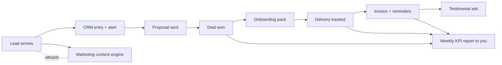

# Company Operations Automation

> Blueprint for running a business where the busywork runs itself. Every section = one n8n workflow. Build in this order; each unlocks the next.

## Master Map

## 1. Lead Capture & Instant Response

**Trigger:** website form / typeform / WhatsApp / DM (webhook)
**Flow:** webhook → normalize fields → append Google Sheet/CRM row → Telegram alert "New lead: {{name}}, {{need}}" → auto-reply email with booking link.
**Build time:** 1–2 h. **Impact:** leads answered <1 min convert ~5–10× better than hours later.

## 2. Proposal & Follow-up Machine

**Flow:** you mark deal "proposal sent" in Sheet → cron checks daily → if 3 days no reply: gentle follow-up email; day 7: case-study email; day 10: breakup email → status column auto-updates.
**Nodes:** Schedule + Google Sheets + Gmail + IF.

## 3. Client Onboarding (the professional-feel win)

**Trigger:** payment confirmed (Stripe webhook)
**Flow:**
1. Create client folder from template (Google Drive)
2. Send welcome email: what happens next, questionnaire link, calendar link
3. Create kickoff event (Calendar API)
4. Add row to "Active Clients" dashboard
5. Draft contract via e-sign tool webhook
**Impact:** zero forgotten steps; clients feel enterprise-grade.

## 4. Delivery Tracker

**Flow:** daily 9am → read project sheet rows where `status != done` → post Slack/Telegram digest of today's due items → overdue items flagged red.
Optional: auto-post progress comment to client channel weekly.

## 5. Invoicing & Payment Reminders

**Flow:** on delivery-done → generate invoice (Stripe API or invoice template → PDF) → send.
Then schedule chain: due-3d reminder → due-day reminder → overdue+7 polite escalation → overdue+14 "pausing work" notice.
All logged to finance sheet. **Impact:** kills the #1 freelance stress.

## 6. Support Inbox Triage

**Flow:** new email (IMAP/Gmail trigger) containing keywords ("bug","help","down") → classify with AI node (urgent/question/request) → urgent: Telegram ping + create task; else: auto-acknowledge with ETA + log ticket row.

## 7. Content Marketing Engine

**Flow:** weekly → pull 1 item from "content ideas" sheet → AI drafts: LinkedIn post, X thread, short-video script → save as drafts for your approval (human-in-loop) → approved versions scheduled via Buffer/API nodes.
**Cadence target:** 3 posts/week at ~20 min of your time.

## 8. Hiring Funnel (when you grow)

Form application → resume parsed → AI score against criteria → top scores to Telegram with CV link → auto-reject others politely after N days.

## 9. Weekly CEO Report (your cockpit)

**Flow:** Friday 5pm → aggregate: leads in, proposals out, MRR, expenses, support tickets, delivery statuses (all already in sheets) → AI writes 5-bullet summary + anomalies → email/Telegram to you.
**This single workflow replaces Sunday-night panic.**

## 10. Backup & Housekeeping

Nightly cron: export all Sheets → timestamped folder; n8n workflows exported JSON weekly; DB dump if self-hosted; delete execution logs >30 days (keeps instance fast).

---

## Tooling Notes

| Need | Cheapest path |
|---|---|
| CRM | Google Sheet first; upgrade to Airtable/HubSpot free |
| Payments | Stripe links |
| E-sign | Dropbox Sign free tier / DocuSign API |
| Docs storage | Drive folder-per-client template |
| Alerts | Your personal Telegram — everything pings one place |

## Build Order Recommendation

Week 1: #1, #5 (money in, money chased)
Week 2: #3, #4 (professional delivery)
Week 3: #2, #9 (sales pipeline visibility)
Week 4+: #6, #7, then hiring/reporting as needed

Each build: import closest workflow from the source library → adapt → test with fake data → activate → add error-alert branch → log in catalog "My Builds".
