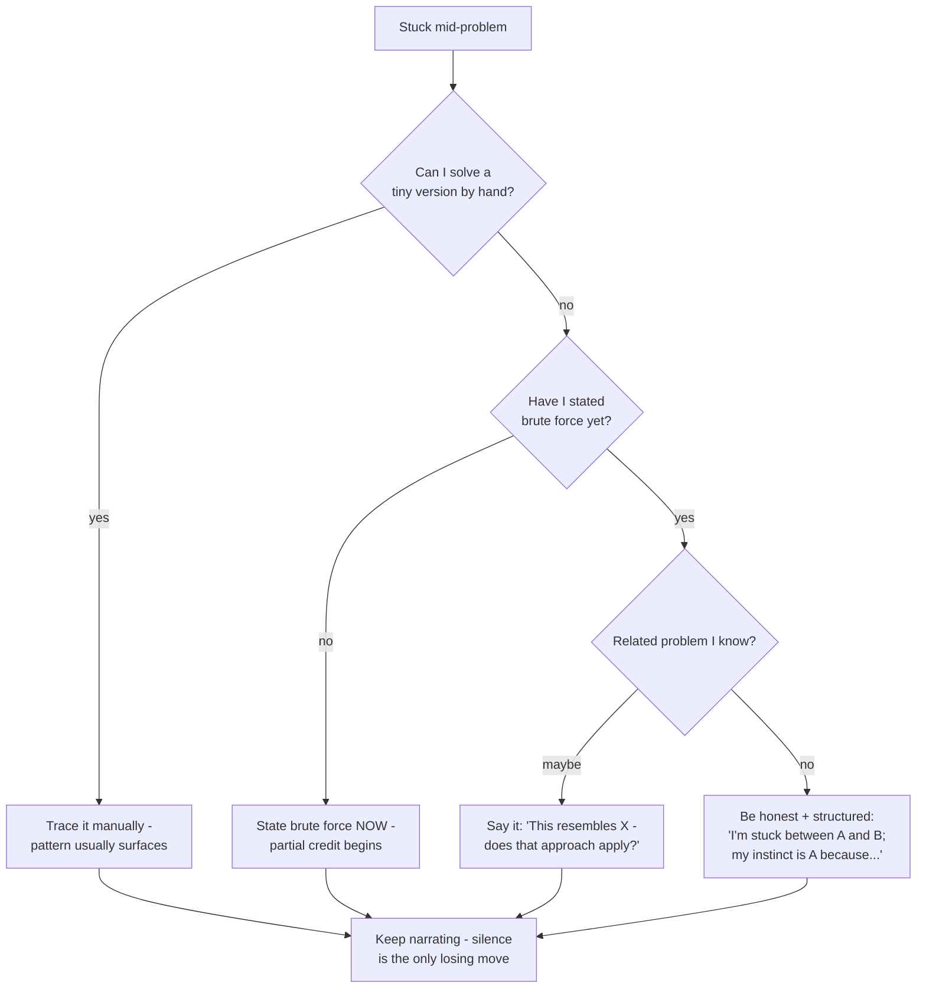

## For future agent
Deep edition of the interview meta-guide. Adds: mechanism-level analysis of what interviewers actually score and why rounds exist, failure-mode taxonomy with early warnings, premortem for the whole hiring funnel, defeat-tackling flowcharts (blank-mind, rejection spiral, grilled-past-knowledge), life integration (the 6-week pre-interview operating system), and post-offer/negotiation depth. Round-specific playbooks: [[01-Areas/Programming/dsa-interview-playbook]], [[01-Areas/Programming/systems-design/system-design-interview]], [[ml-interview-playbook]].

# Interview Counter-Guide — Deep Edition

## Part 1 — Why Interviews Exist (mechanism, not ceremony)

Every round is a *proxy* for an expensive-to-measure trait:

| Round | Actually Measuring | Why It's a Proxy | Exploit the Proxy |
|-------|--------------------|------------------|-------------------|
| Resume screen | "Will this person waste our time?" | 6 seconds/Resume | Front-load proof-of-work links; quantified bullets |
| Aptitude/MCQ | Trainability + baseline speed under pressure | Cheap filter at scale | Purely trainable in 2 weeks; never skip prep |
| Coding rounds | Can they convert ambiguity → working code without hand-holding? | Simulates daily work compressed | Narrate process; process scores even when answer wobbles |
| Technical deep-dive | Depth of OWNED knowledge vs borrowed | Resume claims are cheap | Every line must survive 3 whys — audit before they do |
| Hiring manager | "Do I want this person near my problems?" | Judgment + reliability | Curiosity questions; concrete ownership stories |
| HR | Retention risk + coachability | Flight-risk filter | Honest reasons; zero arrogance; real questions |

**Key insight**: interviewers are pattern-matching for *future colleague behavior*. Everything you do should read as "easy to work with under pressure," not "genius performing."

## Part 2 — The Full Funnel & Where Deaths Occur


*(Directional fresher-market funnels `(TBC)` — the point isn't precision, it's seeing that resume + coding are the two mass graves. Allocate prep accordingly: proof-of-work and pattern drills.)*

## Part 3 — Failure-Mode Taxonomy

| # | Failure Mode | Root Cause | Early Warning | Counter |
|---|--------------|-----------|---------------|---------|
| F1 | **Blank mind on Q1** | Anxiety spike → working memory hijacked | Heart-rate jump, re-reading prompt | Write examples by hand first; solve tiny case manually; narration restarts cognition |
| F2 | **Silent coding** | Belief: talking wastes time | Interviewer stops engaging | Scripted narration skeleton (below) rehearsed until automatic |
| F3 | **Know it, can't say it** | Retrieval practiced only by reading | Fluent reading, stammered answers | Out-loud reps; record yourself; 4+ mocks |
| F4 | **Grilled past knowledge, bluff detected** | Ego protection instinct | Invented specifics under follow-up | Pre-committed phrase: *"I don't know — here's how I'd find out"* (scored as honesty+method) |
| F5 | **Rejection spiral** | Interpreting single data point as identity verdict | Post-rejection week of zero output | Batch rule: applications in groups of 10; expected base rates from [[market-analysis-tech-2026]]; 24h rule then next batch |
| F6 | **Over-prepared script, under-prepared person** | Memorizing answers to predicted questions | Answers sound recited; probes collapse them | Prepare STORY BANK + frameworks, not sentences |

### Premortem (whole season)
*It's placement season's end; zero offers.* Most likely autopsy findings: applied to 200 jobs blind (F5 setup), mocks <2 so F3 dominated live rounds, resume had zero deployed-project links (screen death), behavioral stories improvised per interview (inconsistent). All four are preventable NOW, before the season starts.

## Part 4 — The Universal Counter-Scripts

### Live-coding skeleton (memorize as reflex)
```
1. Restate problem. Confirm I/O with 2 examples.
2. Brute force aloud + complexity.
3. Bottleneck? Propose better approach BEFORE code.
4. Get interviewer nod -> code while narrating decisions.
5. Dry-run examples + one edge case by hand.
6. State final time/space complexity unprompted.
7. Offer: "Happy to optimize further or handle X edge case."
```

### Defeat-tackling flowchart (mid-interview)



### STAR story system (behavioral)

Write SIX stories covering: conflict · failure · leadership/initiative · deadline pressure · learning fast · disagreement-then-commit. Each:

> **S**ituation (1 line) → **T**ask (your responsibility) → **A**ction (what YOU did, 3 beats) → **R**esult (number if possible + lesson)

Vault mines: your dailies already hold raw material (guitar repair persistence, second-brain build, stock-agent bug hunts, ₹250 gig refusal). Written stories beat improvised ones; rehearsed-written beats written.

**Trap-answer table**:
| Question | Trap | Strong move |
|----------|------|-------------|
| Weakness? | "Perfectionist" cliché | Real non-disqualifying flaw + active mitigation |
| Conflict story? | Blaming the other person | Your contribution to the mess + resolution |
| Why hire you over better pedigrees? | Entering comparison debate | Specific proof-of-work specificity |
| 5-year plan? | Generic ambition | Concrete skill trajectory tied to THEIR stack |

## Part 5 — Negotiation (fresher-depth but real)

1. Never accept on the call: *"Thank you — may I confirm by [48h]?"* is always acceptable.
2. Competing offers: share competing TIMELINES, never bluff numbers.
3. Services offer in hand + product process pending? Tell product HR your joining deadline — honest urgency works.
4. Ask every offer: joining bonus / relocation / stack choice — three askable items beyond base `(India fresher norms vary — verify per company (TBC))`.
5. College placement-cell rules may constrain timelines — check yours first.

## Part 6 — Life Integration: The 6-Week Pre-Season OS

| Weeks | Focus | Daily Load |
|-------|-------|-----------|
| −6 to −5 | Story bank written + resume rebuilt around proof-of-work | 45 min/day |
| −5 to −3 | Pattern drills ([[dsa-interview-playbook]]) + field playbook | 60–90 min/day |
| −3 to −1 | Mocks ×2/week (record, review, fix ONE thing each) + question bank daily | 90 min/day |
| −1 | Light: scripts review, sleep discipline fixed, logistics rehearsed | 30 min/day |
| Season | Applications in batches of 10 targeted + referral-first; interview days = light review only | maintenance |

**Energy rules**: interview day = no other heavy cognitive work after; post-interview 10-min debrief note into vault while fresh (questions asked → becomes next mock material).

**Weekly success metrics**: mocks passed streak, story-bank fluency (can deliver any story in 90s), application→screen rate (leading indicator), sleep consistency.

## Example Questions This Guide Answers

1. "I blank out even on easy problems" — which failure mode, and which counter starts tonight?
2. "They asked something I half-know" — what's the exact honest-and-structured sentence?
3. "How many mocks until ready?" — what metric says ready, rather than a count?

## Cross-Vault Links

[[dsa-interview-playbook]] · [[system-design-interview]] · [[ml-interview-playbook]] · [[example-question-bank]] · [[market-analysis-tech-2026]] · [[build-project-playbook]]