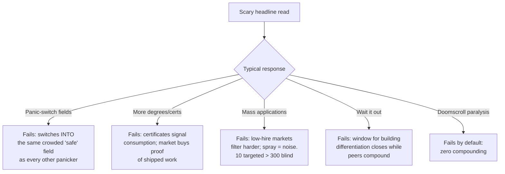
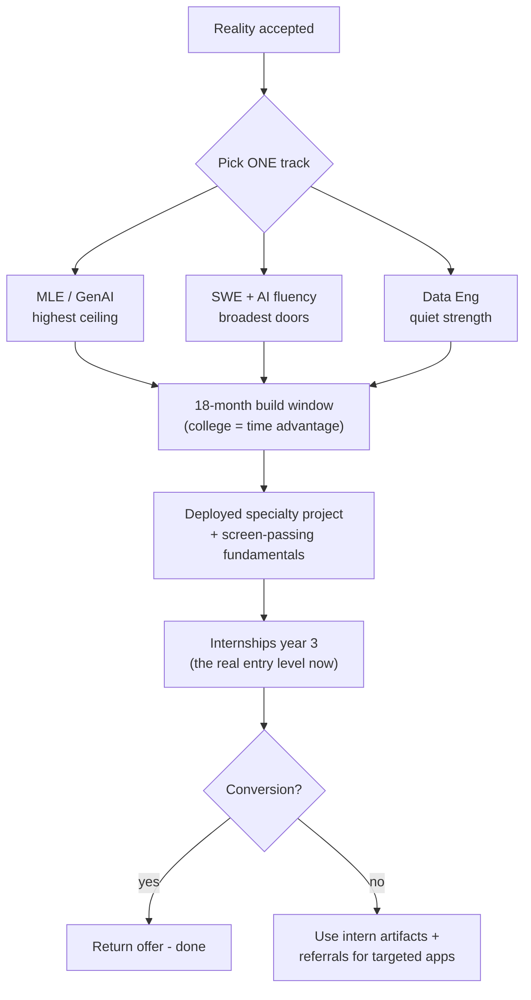

## For future agent
Deep edition of the 2026 market analysis: sourced snapshot + mechanism-level analysis of WHY the market split happened, second-order effects most people miss, failure modes of common career responses, decision flowcharts, and a life-integration cadence for re-reading this page. Sources: Pragmatic Engineer (May 2026), devinterview.ai (Aug 2026), herohunt/Ravio/SignalFire/Stanford compilations, Robert Half 2026, India salary guides (Aug 2026).

# Tech Market Analysis 2026 — Deep Edition

## Part 1 — The Sourced Snapshot

| Segment | Status | Evidence |
|---------|--------|----------|
| AI/ML engineering | Explosive demand | +163% YoY postings (Robert Half); 12% pay premium (Ravio); Apple/Google/TikTok lead openings |
| Security, data eng, cloud/SRE | Strong steady | 66.8k security postings +124% YoY |
| Full-stack/backend/mobile | Competitive | Roles exist; deep applicant pools |
| Entry-level generalist | Toughest in modern era | See below |

**Entry-level numbers**: P1/P2 hiring −73% (Ravio); junior postings −40% vs pre-2022; big-tech new-grad recruiting −55% (SignalFire); devs aged 22–25 lost ~20% of jobs post-ChatGPT (Stanford); <6% of AI-skill postings target entry level. CS grad unemployment (US) ~6–7.5%.

**Counter-signals**: IBM tripling US entry hiring in 2026 ("build AI-augmented juniors now"); 53% of companies raising hiring budgets.

**India bands** `(Aug 2026)`:

| Level | Services | Product/GCC | AI-first/FAANG GCC |
|-------|----------|-------------|--------------------|
| Fresher ML/AI | ₹5–10 LPA | ₹10–18 LPA | ₹15–25 LPA |
| Mid (3–5y) | ₹12–20 | ₹25–45 | ₹35–70 |
| Senior (7y+) | ₹20–30 | ₹45–80 | ₹65–1Cr+ |

GenAI/LLM specialists carry the largest premium at every level. Pure-analytics DS pays 20–35% below MLE at equal seniority.

## Part 2 — Mechanisms: WHY the Market Split

Understanding causes lets you predict instead of react:

1. **Task-level automation ≠ job-level automation.** AI absorbed *junior-shaped tasks* (boilerplate, first-draft code, basic analysis), which were the training ground juniors needed. The ladder lost its bottom rung — that's the entry crisis.
2. **The bar moved from "can write code" to "can own outcomes."** When code is cheap, judgment/specification/verification are the scarce goods — mid-senior skills.
3. **Capital rotation into AI infrastructure** created concentrated demand (GPU platforms, observability, security) rather than broad demand.
4. **Low-hire-low-fire equilibrium**: layoffs slowed but so did risk-taking on unproven candidates → referrals and proof-of-work dominate over cold applications.
5. **India-specific**: GCC expansion keeps absorbing talent, but services firms' fresher pipelines (mass hiring) shrank in AI-exposed roles — the "safe mass offer" floor weakened.

**Second-order effects worth tracking**:
- Internship→conversion becomes THE entry pipeline (companies hire proven interns over unknown freshers)
- Portfolio/proof-of-work outweighs degree tier at product companies
- Interview formats shift toward assessing AI-tool collaboration (iMocha 2026)
- Medium-term senior shortage predicted as the junior pipeline thins — meaning today's squeezed juniors who survive may hit a seller's market at mid-level (~2029–2031)

## Part 3 — Failure Modes of Common Responses

Every instinctive reaction to scary headlines has a standard failure mode:

Each failure shares a root: **responding to macro news with micro-effort or no effort**, when the correct response is a structural change in what you're building.

## Part 4 — The Strategic Response (deep)

**Leverage-ranked moves**:
1. **Treat internships as entry level** — the open pipeline while junior roles freeze
2. **One deployed, monitored, documented specialty project** ([[01-Areas/Business/careers/build-project-playbook]]) — not ten notebooks
3. **DSA sharp enough for screens** — it did NOT go away
4. **GenAI tooling depth regardless of track** (RAG, evals, agents — see [[roadmap-ml-engineer]] branch A)
5. **Learn in public** — portfolio-linked candidates get materially more callbacks
6. **Referral-first application strategy**: warm intros convert 10×+ cold applies in low-hire markets `(directional)`

## Part 5 — Scenario Planning (preparing for failure of the plan itself)

| Scenario | Probability signal | Pre-committed response |
|----------|-------------------|------------------------|
| Track skills commoditized further | Your specialty's postings flatten YoY | Pivot one layer up the stack (builder→evaluator/orchestrator); fundamentals transfer |
| Placement season weak | Low service-company intake from your college | Activate internship/referral path early; don't wait for campus |
| Market recovers sharply | Postings up 2 quarters straight | You're over-prepared relative to crowd — negotiate harder |
| Personal burnout | 2+ weeks never-zero only | Scheduled deload week; system survives because streak rules allow it |

The point of pre-committing: **decisions made in calm states outperform decisions made in panic** — same principle as investing.

## Life Integration Cadence

- **Quarterly (30 min)**: re-read this page's source links; update figures if materially moved; adjust track choice only on DATA, not vibes
- **Monthly (10 min)**: check your own leading indicators — artifact shipped? referral list growing? interview-rep count?
- **Never daily**: doomscrolling job-market content is noise consumption dressed as research

## Example Questions This Page Arms You Against

1. "AI will take all coding jobs" — which tasks actually got automated, and what does that imply about YOUR preparation?
2. "Should I do MS abroad instead?" — does the entry-level squeeze differ by geography, and what does your evidence say?
3. "Services company safe hai" — safe against what, given the ₹ gap and the weakening mass-hiring floor?

## Cross-Vault Links

[[roadmap-software-engineer]] · [[roadmap-data-scientist]] · [[roadmap-ml-engineer]] · [[01-Areas/Business/careers/interview-counter-guide]] · [[01-Areas/Business/careers/build-project-playbook]] · [[North Star]]