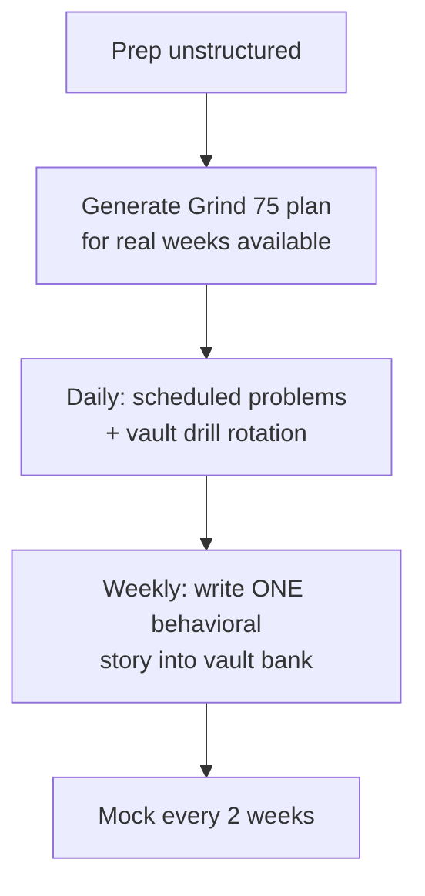

## For future agent
Tech Interview Handbook (yangshun, ex-Meta/Facebook): structured interview-prep content covering the full funnel — resume, algorithms study plans (with Grind 75), system design pointers, behavioral bank, negotiation. This page maps its components onto this vault's playbooks and adds failure-mode counters. Fetched 2026-08-24.

# Tech Interview Handbook — Expanded

## What It Contains (from its real section structure)

| Component | What It Gives |
|-----------|--------------|
| **What/Why/Who** | Funnel framing — matches [[interview-counter-guide]] |
| **Resume preparation** | One-page rules, action verbs, quantification |
| **Algorithms study plan** | **Grind 75** — auto-generating 75-week problem planner by weeks available |
| **System design** | Pointers + fundamentals (deeper via [[repo-system-design-primer]]) |
| **Behavioral questions** | Bank of common Qs + answer guidance |
| **Negotiation** | Compensation research + scripts |
| **Landing-the-job extras** | STAR, self-introductions, questions-to-ask |

## Its Killer Feature: Grind 75

An interactive planner: input weeks-available → outputs prioritized LeetCode list with spaced difficulty ramp. Solves the "which problems?" paralysis that kills most prep.

**Vault integration**: use Grind 75 as the SCHEDULER inside [[dsa-interview-playbook]]'s ladder system — patterns from the playbook, sequence from Grind 75.

## Failure Modes

| Failure | Mechanism | Counter |
|---------|-----------|---------|
| Resource-perfecting | Comparing TIH vs NeetCode vs CIU instead of drilling | Pick one scheduler (Grind 75), start today |
| Behavioral skim | Reading sample answers, never writing YOUR stories | Vault story-bank rule ([[interview-counter-guide]]) |
| Negotiation-page skip | Leaving money on table from awkwardness | Re-read negotiation section before ANY offer call |

**Premortem**: *TIH bookmarked for months; prep still ad-hoc.* Findings: Grind 75 never generated (planning avoided), behavioral answers improvised per interview. The handbook is a kit — kits require assembly dates.

**Rescue flowchart**:

**Life integration**: TIH = pre-season kit assembly checklist; metrics = Grind completion %, stories banked, mocks done. Cross-links: [[example-question-bank]] · [[system-design-interview]] · [[market-analysis-tech-2026]]