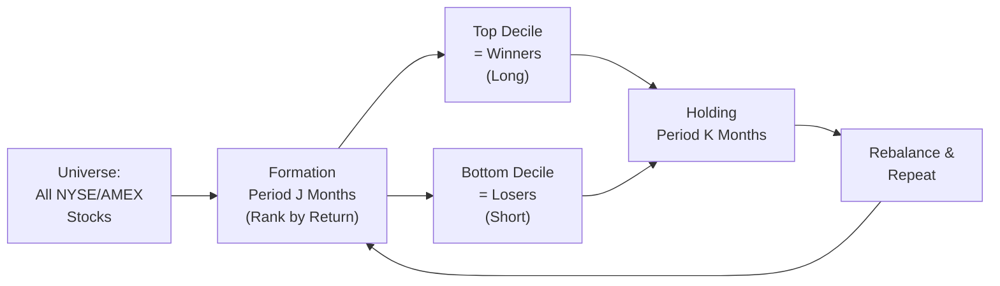
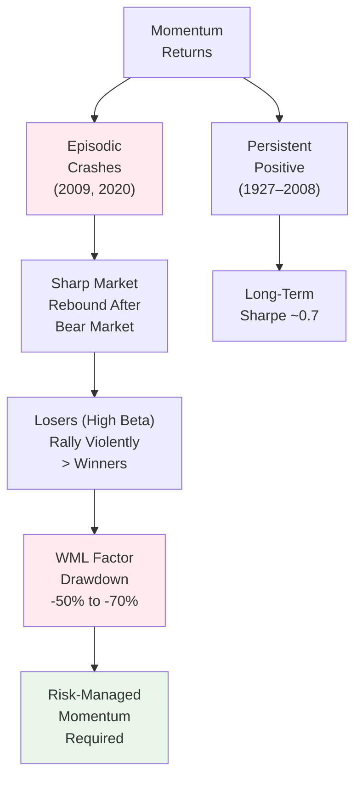
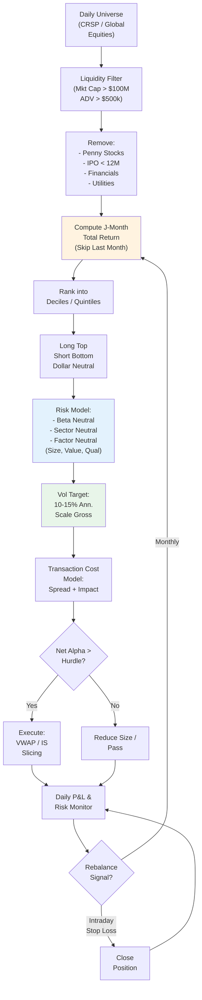
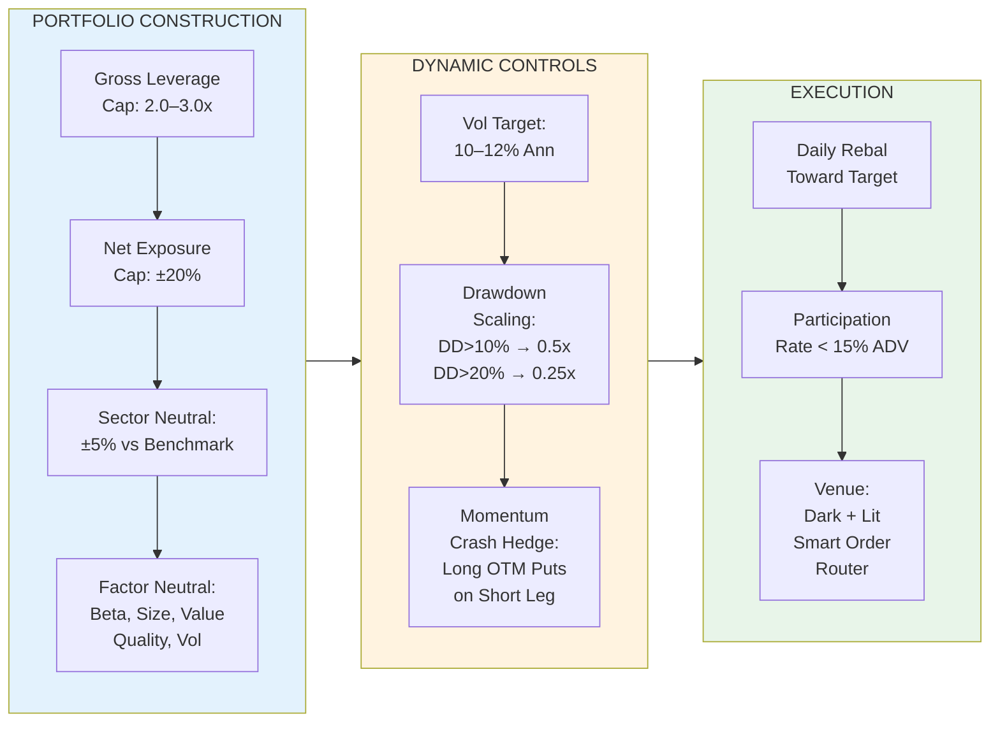
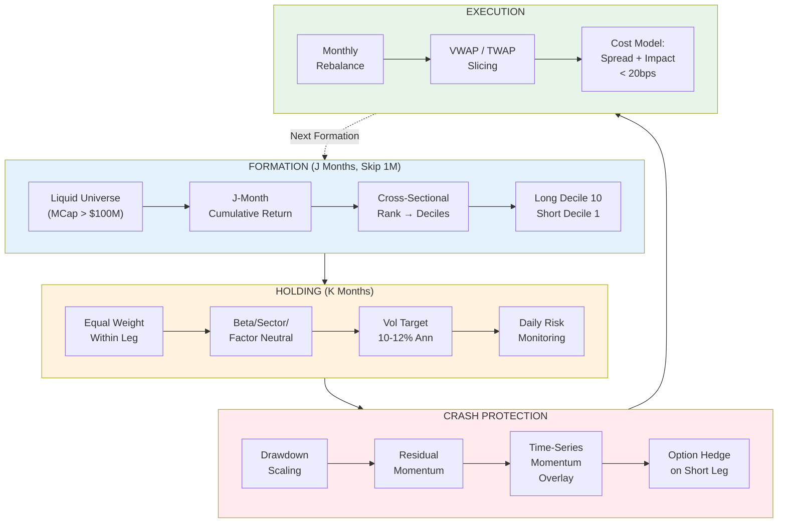

# Momentum Strategies — Jegadeesh & Titman (1993/1995)

> The **founding paper of cross-sectional momentum**. "Buying past winners and selling past losers" generates significant abnormal returns. The 12-month formation / 1-month holding (J=12, K=1) strategy is the canonical momentum factor.

---

## 1. Core Idea

**Cross-sectional momentum**: Rank stocks by past J-month return. Go long top decile (winners), short bottom decile (losers). Hold for K months. Repeat.



---

## 2. The Canonical Strategy Parameters

| Parameter | Standard Value | Range Tested |
|-----------|----------------|--------------|
| **Formation (J)** | 12 months | 3, 6, 9, 12 |
| **Holding (K)** | 1 month (original) / 3–12 months | 1, 3, 6, 9, 12 |
| **Skip Period** | 1 month (gap between formation & holding) | 0, 1, 2 months |
| **Universe** | NYSE/AMEX (crsp) | +NASDAQ, International |
| **Weighting** | Equal-weight | Value-weight, Vol-target |

> **J=12, K=1, Skip=1** = "WML" (Winner Minus Loser) factor — the **Momentum Factor**

---

## 3. Key Results (1965–1989 / Extended to 2020+)

### Original (1993): J=12, K=1, Skip=1, EW
| Metric | Value |
|--------|-------|
| **Monthly Excess Return** | ~1.3–1.5% (16–18% annualized) |
| **t-stat** | >5.0 |
| **Sharpe Ratio** | ~1.0–1.2 |
| **Max Drawdown** | ~-50% (2009 momentum crash) |

### J-K Matrix (Average Monthly Returns, %)
| J\K | 3 | 6 | 9 | 12 |
|-----|---|---|---|---|
| **3** | 0.92 | 0.78 | 0.65 | 0.55 |
| **6** | 1.10 | 0.98 | 0.85 | 0.72 |
| **9** | 1.25 | 1.12 | 0.98 | 0.85 |
| **12** | **1.49** | **1.31** | **1.15** | **0.98** |

*Peak at J=12 (1-year momentum). Longer formation → stronger but more crowded.*

### By Market Cap (Decile Spread)
| Size Quintile | Monthly Return | t-stat |
|---------------|----------------|--------|
| Small (Q1) | ~1.8% | >6 |
| Q2 | ~1.4% | >5 |
| Q3 | ~1.2% | >4 |
| Q4 | ~1.0% | >3 |
| Large (Q5) | ~0.7% | >2 |

*Strongest in small caps (liquidity premium + limits to arbitrage)*

---

## 4. The Momentum "Crash" & Time Variation



### Momentum Crash Anatomy (2009)
- **Mar 2009**: Market bottoms, VIX peaks
- **Mar–May 2009**: Market rallies +70%
- **Losers (high beta, distressed)**: +150–200%
- **Winners (low beta, quality)**: +30–50%
- **WML**: -50% to -70% in 2 months

### Mitigation Strategies
| Strategy | Mechanism |
|----------|-----------|
| **Time-series momentum / Trend-following** | Absolute momentum (vs cash) avoids shorting in rebounds |
| **Dynamic weight scaling** | Reduce leverage when vol spikes / drawdown > threshold |
| **Residual momentum** | Regress out market/factor exposure first |
| **Option overlay** | Buy put spreads on short leg |
| **Skip recent losers** | Exclude bottom 10% by prior 1-month return |

---

## 5. Theoretical Explanations

### Behavioral (Dominant View)
| Theory | Mechanism | Prediction |
|--------|-----------|------------|
| **Underreaction** (Hong & Stein 1999) | Info diffuses slowly; analysts/holders slow to update | Momentum stronger for low-analyst-coverage, small caps |
| **Overconfidence** (Daniel et al. 1998) | Traders overreact to private signals, underreact to public | Momentum + long-term reversal |
| **Disposition Effect** (Grinblatt & Han 2005) | Sell winners too early, hold losers too long | Creates selling pressure on winners, buying on losers |

### Risk-Based (Contested)
| Theory | Mechanism | Evidence |
|--------|-----------|----------|
| **Time-varying risk** | Winners have higher conditional beta / crash risk | Momentum crashes align with market rebounds |
| **Liquidity risk** | Losers are less liquid; require premium | Partially explains small-cap momentum |

---

## 6. Implementation Flowchart (Production)



---

## 7. Python: Momentum Factor Construction

```python
import pandas as pd
import numpy as np
from scipy import stats

class JTMomentum:
    def __init__(self, J=12, K=1, skip=1, n_quantiles=10, 
                 min_price=5, min_mcap=1e8, min_adv=5e5):
        self.J = J
        self.K = K
        self.skip = skip
        self.n_quantiles = n_quantiles
        self.min_price = min_price
        self.min_mcap = min_mcap
        self.min_adv = min_adv
    
    def prepare_universe(self, prices: pd.DataFrame, 
                         mcap: pd.DataFrame, 
                         adv: pd.DataFrame) -> pd.DataFrame:
        """Filter universe at each formation date"""
        # Prices: (dates x assets), monthly
        # Market cap & ADV: same shape
        
        valid = (
            (prices >= self.min_price) & 
            (mcap >= self.min_mcap) & 
            (adv >= self.min_adv)
        )
        # Also exclude financials (SIC 6000-6999), utilities (4900-4999)
        # ... sector filter here
        
        return valid
    
    def compute_momentum(self, prices: pd.DataFrame, valid: pd.DataFrame) -> pd.DataFrame:
        """J-month cumulative return, skipping most recent month"""
        # Shift by skip+1 to avoid lookahead
        shifted = prices.shift(self.skip + 1)
        mom = shifted.pct_change(self.J)  # J-month return
        mom[~valid] = np.nan
        return mom
    
    def assign_quantiles(self, momentum: pd.DataFrame) -> pd.DataFrame:
        """Rank into quantiles cross-sectionally each month"""
        ranks = momentum.rank(axis=1, pct=True)
        # Quantile labels: 1=losers, 10=winners
        quantiles = pd.qcut(ranks.stack(), self.n_quantiles, labels=False).unstack() + 1
        quantiles[momentum.isna()] = np.nan
        return quantiles
    
    def construct_portfolio(self, quantiles: pd.DataFrame, 
                            next_returns: pd.DataFrame) -> pd.Series:
        """Long top, short bottom, equal weight within quantile"""
        long_mask = (quantiles == self.n_quantiles)
        short_mask = (quantiles == 1)
        
        n_long = long_mask.sum(axis=1)
        n_short = short_mask.sum(axis=1)
        
        long_ret = (long_mask * next_returns).sum(axis=1) / n_long.replace(0, np.nan)
        short_ret = (short_mask * next_returns).sum(axis=1) / n_short.replace(0, np.nan)
        
        wml = long_ret - short_ret
        return wml.dropna()
    
    def risk_adjust(self, wml: pd.Series, factors: pd.DataFrame) -> pd.Series:
        """Regress WML on MKT, SMB, HML, RMW, CMA (FF5)"""
        X = factors.loc[wml.index]
        X = sm.add_constant(X)
        model = sm.OLS(wml, X).fit()
        alpha = model.params['const'] * 12  # annualized
        t_alpha = model.tvalues['const']
        return alpha, t_alpha, model.resid
```

---

## 8. Enhanced Variants

| Variant | Key Modification | Benefit |
|---------|------------------|---------|
| **Residual Momentum** | Regress returns on factors first; rank residuals | Removes factor crowding, reduces crash risk |
| **Time-Series Momentum** | Absolute trend (price > SMA) per asset | Avoids shorting in bear rebounds |
| **Seasonal Momentum** | Skip Jan / use Nov–Apr (Halloween effect) | Avoids Jan reversal |
| **Idiosyncratic Momentum** | Rank by residual from FF3/FF5 | Pure stock-specific momentum |
| **Momentum + Value** | Double sort: momentum within value quintiles | Negative correlation → diversification |
| **ETF Momentum** | Apply to sector/country/style ETFs | Lower cost, better liquidity |
| **Cross-Asset Momentum** | Equities, bonds, FX, commodities together | 50+ futures contracts (Moskowitz et al. 2012) |

---

## 9. Risk Management for Momentum



---

## 10. Connection to Other Modules

- **[[predictive-return-models]]** — momentum as a cross-sectional predictor
- **[[model-selection-and-model-risk]]** — overfitting in J/K optimization, data snooping
- **[[risk-management-value-at-risk]]** — momentum crash tail risk, stress testing
- **[[market-microstructure]]** — execution costs critical for high-turnover momentum
- **[[portfolio-optimization-practice]]** — integrating momentum into mean-variance / risk parity

---

## 11. Summary: Jegadeesh-Titman Momentum in One Diagram



---

**Bottom Line**: Jegadeesh & Titman (1993) discovered the **most persistent cross-sectional anomaly** in finance. 12-month formation / 1-month holding (skip 1) yields ~1.5%/month pre-costs. **Three production imperatives**: (1) risk-neutralize (beta/sector/factor), (2) vol-target + drawdown scaling, (3) crash protection (residual momentum, time-series overlay, or options). The factor is **real but fragile**—crowding and crashes demand dynamic risk management.