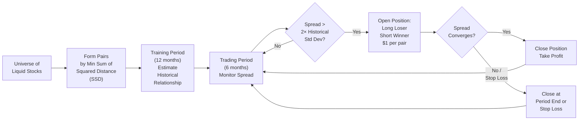
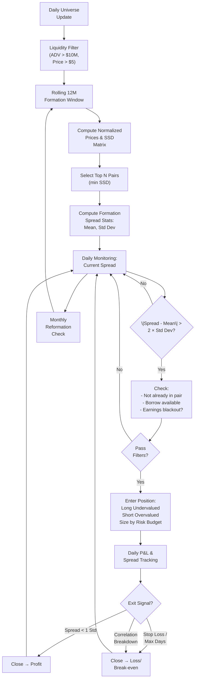
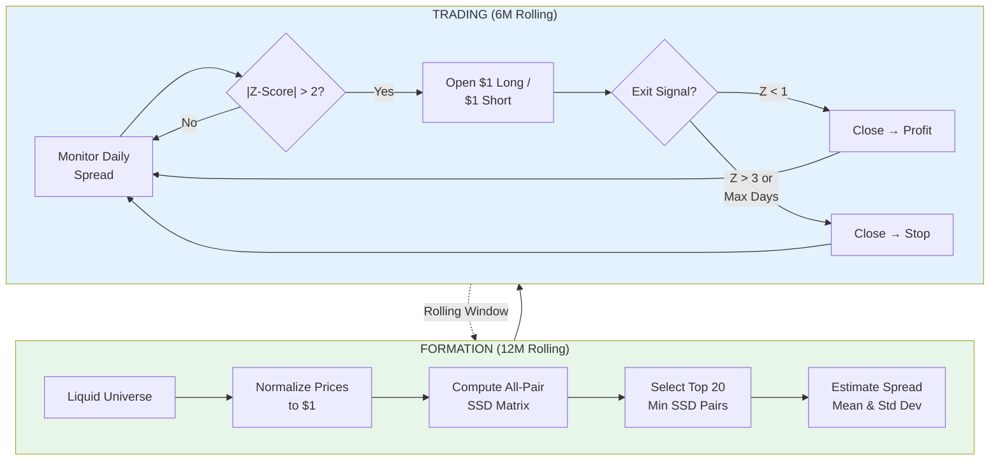

# Pairs Trading — Gatev, Goetzmann & Rouwenhorst (2006)

> The seminal academic paper that formalized pairs trading as a systematic statistical arbitrage strategy.
> Tested on CRSP data 1962–2002. Found significant excess returns after transaction costs.

---

## 1. Core Idea

**Pairs trading** exploits temporary divergences between two historically co-moving securities. When the spread widens beyond a threshold, go long the underperformer and short the outperformer, betting on mean reversion.



---

## 2. Methodology

### Pair Formation (Formation Period = 12 months)
- **Distance metric**: Sum of Squared Differences (SSD) between normalized price series
  - Normalize each stock: $P_{i,t} = \frac{Price_{i,t}}{Price_{i,0}}$ (start at $1)
  - $SSD_{ij} = \sum_{t=1}^{T} (P_{i,t} - P_{j,t})^2$
- **Select top 20 pairs** with minimum SSD (most similar historical paths)

### Trading Period (6 months)
- **Spread**: $S_t = P_{i,t} - P_{j,t}$
- **Entry signal**: $|S_t - \bar{S}| > 2 \times \sigma_S$ (2 std deviations from formation-period mean)
- **Position**: $1 long loser, $1 short winner (market-neutral, dollar-neutral)
- **Exit**: 
  - Spread reverts to within 1 std dev → take profit
  - End of 6-month period → forced close
  - Stop loss: spread widens further (implementation varies)

### Rolling Window
- After 6 months, reform pairs using next 12-month formation window
- Overlapping windows → continuous trading

---

## 3. Key Results (1962–2002)

| Metric | Value |
|--------|-------|
| **Annualized Excess Return** | ~11–12% (before costs) |
| **After Transaction Costs** | ~6–8% (depending on cost assumptions) |
| **Sharpe Ratio** | ~1.5–2.0 |
| **Max Drawdown** | ~15–20% |
| **% Profitable Months** | ~60–65% |
| **Average Holding Period** | ~1–2 months |

### Robustness Checks
- Works across size deciles (stronger in small caps)
- Survives different entry thresholds (1.5–2.5 std)
- Survives different formation/trading period lengths
- **Fails in 1998–2002** (returns degrade significantly) → regime change / increased arb capital

---

## 4. Critical Mechanics

### Why It Works (Theoretical)
1. **Common factor exposure**: Pairs share industry/sector/factor loadings → spread isolates idiosyncratic noise
2. **Mean reversion of idiosyncratic components**: Temporary liquidity shocks, behavioral overreaction
3. **Market-neutral**: Cancels systematic risk (beta ≈ 0)

### Risk Factors
| Risk | Mitigation |
|------|------------|
| **Fundamental divergence** (one stock permanently impaired) | Stop loss; fundamental filters; max holding period |
| **Short squeeze / borrow cost** | Only trade liquid, easy-to-borrow names |
| **Correlation breakdown** (regime change) | Rolling reformation; regime detection |
| **Transaction costs** | Minimum spread threshold; optimize execution |

---

## 5. Implementation Flowchart (Production System)



---

## 6. Python Implementation Skeleton

```python
import numpy as np
import pandas as pd
from scipy import stats

class PairsTradingGGR:
    def __init__(self, formation_days=252, trading_days=126, 
                 entry_z=2.0, exit_z=1.0, stop_z=3.0, max_pairs=20):
        self.formation_days = formation_days
        self.trading_days = trading_days
        self.entry_z = entry_z
        self.exit_z = exit_z
        self.stop_z = stop_z
        self.max_pairs = max_pairs
        self.active_positions = {}
        self.pair_stats = {}
    
    def normalize_prices(self, prices: pd.DataFrame) -> pd.DataFrame:
        """Normalize each stock to start at $1"""
        return prices / prices.iloc[0]
    
    def compute_ssd_matrix(self, norm_prices: pd.DataFrame) -> pd.DataFrame:
        """Sum of squared differences between all pairs"""
        n = len(norm_prices.columns)
        ssd = pd.DataFrame(index=norm_prices.columns, columns=norm_prices.columns, dtype=float)
        for i in range(n):
            for j in range(i+1, n):
                diff = norm_prices.iloc[:, i] - norm_prices.iloc[:, j]
                ssd.iloc[i, j] = ssd.iloc[j, i] = (diff**2).sum()
        return ssd
    
    def select_pairs(self, ssd_matrix: pd.DataFrame) -> list:
        """Select top pairs by minimum SSD"""
        pairs = []
        for i in range(len(ssd_matrix)):
            for j in range(i+1, len(ssd_matrix)):
                pairs.append((ssd_matrix.index[i], ssd_matrix.columns[j], ssd_matrix.iloc[i, j]))
        pairs.sort(key=lambda x: x[2])
        return pairs[:self.max_pairs]
    
    def compute_spread_stats(self, prices: pd.DataFrame, pairs: list) -> dict:
        """Compute mean/std of spread during formation"""
        stats = {}
        for s1, s2, _ in pairs:
            spread = prices[s1] - prices[s2]
            stats[(s1, s2)] = {'mean': spread.mean(), 'std': spread.std()}
        return stats
    
    def generate_signals(self, current_prices: pd.Series, pair_stats: dict) -> list:
        """Generate entry/exit signals"""
        signals = []
        for (s1, s2), stat in pair_stats.items():
            spread = current_prices[s1] - current_prices[s2]
            z = (spread - stat['mean']) / stat['std']
            
            if (s1, s2) not in self.active_positions:
                if z > self.entry_z:
                    signals.append(('ENTER', s1, s2, 'SHORT s1, LONG s2', z))
                elif z < -self.entry_z:
                    signals.append(('ENTER', s1, s2, 'LONG s1, SHORT s2', z))
            else:
                pos = self.active_positions[(s1, s2)]
                if (pos['direction'] == 'SHORT s1' and z < self.exit_z) or \
                   (pos['direction'] == 'LONG s1' and z > -self.exit_z):
                    signals.append(('EXIT', s1, s2, 'TAKE PROFIT', z))
                elif abs(z) > self.stop_z:
                    signals.append(('EXIT', s1, s2, 'STOP LOSS', z))
        return signals
```

---

## 7. Modern Extensions & Variants

| Variant | Key Change | Reference |
|---------|------------|-----------|
| **Cointegration-based** | Use Engle-Granger / Johansen test instead of SSD | Vidyamurthy (2004), Caldeira & Moura (2013) |
| **Copula pairs** | Model joint distribution tail dependence | Liew & Wu (2013) |
| **ML pair selection** | Graph neural nets, clustering on embeddings | Krauss et al. (2017) |
| **Multi-leg / Basket** | Statistical arbitrage with >2 legs | Avellaneda & Lee (2010) |
| **ETF / Sector pairs** | Lower borrow cost, better liquidity | — |
| **Crypto pairs** | 24/7, high vol, different microstructure | — |

---

## 8. Practical Considerations Checklist

- [ ] **Data quality**: Survivorship-bias-free, split/dividend adjusted, same exchange
- [ ] **Liquidity filter**: Min $10M ADV, min $5 price, options listings (borrow proxy)
- [ ] **Corporate actions**: Handle spinoffs, M&A, delistings gracefully
- [ ] **Borrow cost integration**: Mark-to-market short rebate rates daily
- [ ] **Execution**: VWAP/TWAP slicing, participation rate caps, venue selection
- [ ] **Risk management**: Gross/net exposure limits, sector caps, factor neutralization
- [ ] **Performance attribution**: Decompose into factor vs. idiosyncratic
- [ ] **Regime detection**: Volatility regime, correlation regime, factor crowding

---

## 9. Connection to Other Modules

- **[[market-microstructure]]** — execution costs, borrow mechanics, short selling
- **[[risk-management-value-at-risk]]** — position sizing, VaR for market-neutral books
- **[[model-selection-and-model-risk]]** — overfitting in pair selection, walk-forward validation
- **[[predictive-return-models]]** — pairs trading as a special case of cross-sectional prediction

---

## 10. Summary: The GGR Pairs Trading Algorithm in One Picture



---

**Bottom Line**: GGR (2006) proved pairs trading works as a systematic strategy with Sharpe ~1.5–2.0 pre-costs. The core insight—**distance-based pair formation + z-score mean reversion**—remains the foundation of modern statistical arbitrage. Production systems add: cointegration filters, borrow cost models, regime detection, and ML-enhanced pair selection.