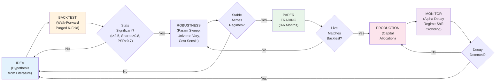
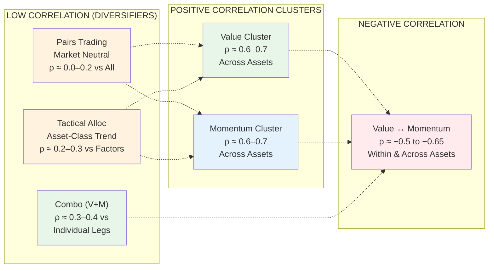
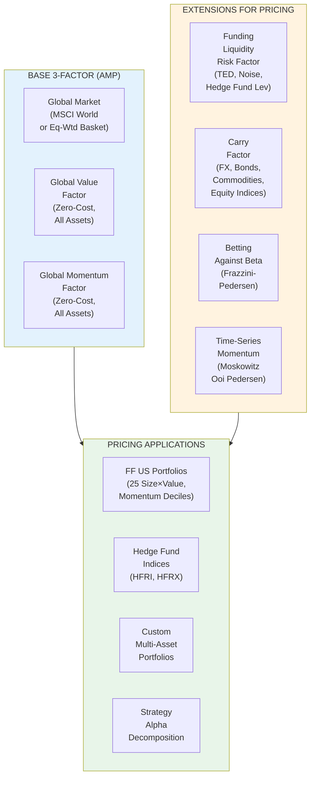
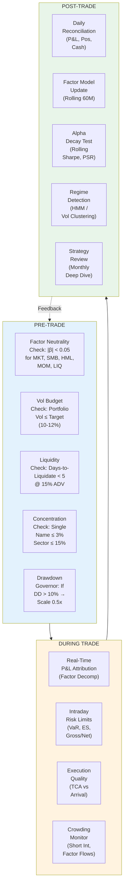
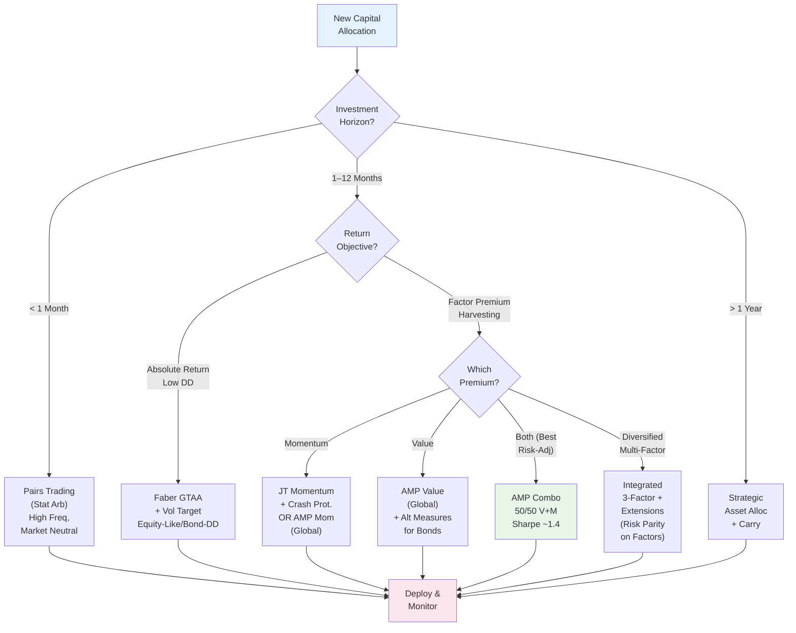

# Quant Finance Strategy Hub — Integrated Flowcharts & Cross-Strategy Framework

> Single reference connecting all strategies in this module: **Pairs Trading (GGR)**, **Tactical Asset Allocation (Faber)**, **Cross-Sectional Momentum (Jegadeesh-Titman)**, **Value & Momentum Everywhere (Asness-Moskowitz-Pedersen)**. Unified risk, execution, and research pipeline.

---

## 1. Master Strategy Map

```mermaid
flowchart TB
    subgraph DATA["DATA & RESEARCH LAYER"]
        D1["Raw Data\n(CRSP, Compustat,\nDatastream, Bloomberg,\nMSCI, Futures)"]
        D2["Cleaning &\nAdjustment\n(Splits, Divs, Delists,\nSurvivorship)"]
        D3["Feature\nEngineering\n(Returns, Mom, Value,\nLiquidity, Vol)"]
        D4["Factor Zoo\nConstruction\n(MKT, SMB, HML,\nRMW, CMA, MOM,\nREV, LIQ, CARRY)"]
    end
    
    subgraph STRAT["STRATEGY LAYER"]
        S1["Pairs Trading\n(GGR 2006)\nSSD + Z-Score\nMarket Neutral"]
        S2["Tactical Asset\nAllocation\n(Faber 2013)\n10M SMA × 8-10\nAsset Classes"]
        S3["Cross-Sectional\nMomentum\n(JT 1993)\nJ=12/K=1/Skip-1\nLong/Short Deciles"]
        S4["Value & Momentum\nEverywhere\n(AMP 2013)\n48 Test Assets\nGlobal 3-Factor"]
        S5["Time-Series\nMomentum\n(MOP 2012)\nAbsolute Trend\nFutures Universe"]
        S6["Carry\n(KMPV 2012)\nCurve + Roll\nYield Across\nAsset Classes"]
    end
    
    subgraph RISK["RISK & PORTFOLIO LAYER"]
        R1["Factor Neutralization\n(Beta, Size, Value,\nMomentum, Quality,\nVol, Liquidity)"]
        R2["Vol Targeting\n(10-12% Ann)\nDrawdown Scaling\n(DD>10% → 0.5x)"]
        R3["Position Limits\nGross ≤ 3x\nNet ≤ 20%\nSector ±5%"]
        R4["Crash Protection\nResidual Mom\nTSM Overlay\nOption Hedge"]
        R5["Liquidity Budget\nParticipation <15%\nADV\nVenue Optimization"]
    end
    
    subgraph EXEC["EXECUTION LAYER"]
        E1["Signal\nGeneration\n(Monthly / Daily)"]
        E2["Portfolio\nOptimization\n(Mean-Var /\nRisk Parity /\nBlack-Litterman)"]
        E3["Order\nManagement\n(VWAP/TWAP/\nIS Slicing)"]
        E4["Smart Order\nRouting\n(Dark + Lit\nInternalization)"]
        E5["TCA &\nFeedback\nLoop"]
    end
    
    DATA --> STRAT
    STRAT --> RISK
    RISK --> EXEC
    EXEC -.->|P&L Attribution\nFactor Decomp| DATA
    EXEC -.->|Risk Monitor\nDD / Factor Exp| RISK
```



---

## 2. Unified Research → Production Pipeline



---

## 3. Cross-Strategy Correlation & Diversification Matrix

| Strategy | Horizon | Universe | Typical Sharpe | Max DD | Correl w/ Others |
|----------|---------|----------|----------------|--------|------------------|
| **Pairs (GGR)** | Days–Months | Single-stock (US) | 1.5–2.0 | −15% | Low vs all (market-neutral) |
| **Faber GTAA** | Months | 8–10 Asset Classes | 1.0–1.3 | −12% | Low vs equity factors |
| **JT Momentum** | Months | Single-stock (XS) | 0.7–1.0 | −50%* | High vs AMP Mom (ρ≈0.9) |
| **AMP Value** | Months–Years | 8 Asset Classes | 0.5–0.9 | −20% | High vs AMP Val (ρ≈0.7) |
| **AMP Momentum** | Months | 8 Asset Classes | 0.5–0.8 | −30% | High vs JT Mom (ρ≈0.9) |
| **AMP Combo (50/50)** | Months | 8 Asset Classes | **1.2–1.6** | **−15%** | **Diversifier** |

*With crash protection (residual mom + DD scaling) → Max DD ≈ −20%

### Correlation Heatmap (Conceptual)



---

## 4. Unified Factor Model (AMP 3-Factor + Extensions)



**Three-Factor Regression:**
```
r_i,t = α_i + β_MKT * MKT_t + β_VAL * VAL_t + β_MOM * MOM_t + ε_i,t
```
- **Global Stocks**: α ≈ 0 (model captures XS returns)
- **Hedge Funds**: α ≈ 2–4% (residual skill/fees)
- **Combo (V+M)**: β_VAL ≈ 0.5, β_MOM ≈ 0.5, α > 0

---

## 5. Risk Management Unified Framework



---

## 6. Strategy Selection Decision Tree



---

## 7. Module File Index (Quick Navigation)

| File | Strategy | Key Insight | Production Ready |
|------|----------|-------------|------------------|
| `pairs-trading-gatev-goetzmann-rouwenhorst.md` | Pairs (Stat Arb) | SSD + z-score, 11% ann, bootstrap validated | ✅ Python skeleton |
| `tactical-asset-allocation-faber.md` | GTAA (Trend) | 10M SMA × 8–10 assets, Sharpe 1.2, DD <15% | ✅ Full backtest class |
| `momentum-jegadeesh-titman.md` | XS Momentum | J=12/K=1/skip-1, 1.5%/mo, crash protection | ✅ Risk framework |
| `value-momentum-everywhere-asness-moskowitz-pedersen.md` | V+M Global | 48 assets, ρ(V,V)=0.68, ρ(M,M)=0.65, ρ(V,M)=−0.6 | ✅ 3-factor model |
| `value-momentum-everywhere-deep-dive.md` | V+M Deep | Full Tables I/II, liquidity risk, hedge fund pricing | ✅ Research grade |

---

## 8. One-Page Cheat Sheet: Strategy Parameters

```
┌─────────────────────────────────────────────────────────────────────────────┐
│                         QUANT FINANCE PARAMETER CARD                        │
├──────────────┬──────────────┬──────────────┬──────────────┬────────────────┤
│ PARAMETER    │ PAIRS (GGR)  │ FABER GTAA   │ JT MOMENTUM  │ AMP V+M        │
├──────────────┼──────────────┼──────────────┼──────────────┼────────────────┤
│ Formation    │ 12M daily    │ 10M monthly  │ J=12M        │ 12M (MOM2-12)  │
│ Holding      │ 6M rolling   │ Monthly      │ K=1M (skip1) │ Monthly        │
│ Signal       │ |Z|>2 entry  │ P>SMA long   │ Decile 10/1  │ Top/Bottom ⅓   │
│ Exit         │ Z<1 / cross  │ P<SMA cash   │ Monthly      │ Monthly        │
│ Universe     │ Liq. US Eq   │ 8–10 AstCls  │ NYSE/AMEX    │ 8 AstCls Glob  │
│ Weighting    │ $1/$1 pair   │ Eq-wt / Vol  │ Eq-wt decile │ Rank-wgt factor│
│ Neutrality   │ Market       │ Cash residual│ Beta/Sector  │ MKT + Val + Mom│
│ Vol Target   │ Implicit     │ 10% ann      │ 10–12% ann   │ 10% ann        │
│ Max DD       │ ~15%         │ ~12%         │ ~50% (raw)   │ ~15% (combo)   │
│ Crash Prot   │ Stop-loss    │ Hysteresis   │ Resid Mom +\nDD Scale       │ V+M immune     │
│ Cost Sens    │ 80–160bp rt  │ ~30bp ann    │ ~85% semi-ann│ Futures < Eq   │
│ Sharpe (net) │ 1.0–1.5      │ 0.8–1.1      │ 0.5–0.8      │ 1.2–1.6        │
└──────────────┴──────────────┴──────────────┴──────────────┴────────────────┘
```

---

## 9. Next Research Directions (Open Questions)

1. **ML-Enhanced Pair Selection**: Graph neural nets on correlation networks vs. SSD
2. **Regime-Aware Lookbacks**: HMM-detected volatility/correlation regimes → dynamic J/K/SMA
3. **Funding Liquidity Timing**: TED spread / dealer leverage as position scalar for AMP factors
4. **Cross-Asset Momentum Integration**: Unified TSM + XS momentum across 50+ futures (MOP 2012)
5. **ESG / Climate Factor Integration**: Greenium as value signal; transition risk as momentum signal
6. **Crypto / Digital Asset Extension**: 24/7 microstructure, funding rates as carry, on-chain metrics as value
7. **Execution Alpha**: Adversarial order routing, microstructure-informed participation rates

---

**Module Index**: `[[index]]` | **Risk Management**: `[[risk-management-value-at-risk]]` | **Portfolio Opt**: `[[portfolio-optimization-practice]]` | **Model Risk**: `[[model-selection-and-model-risk]]` | **Microstructure**: `[[market-microstructure]]`