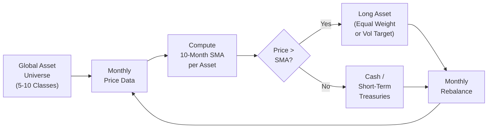
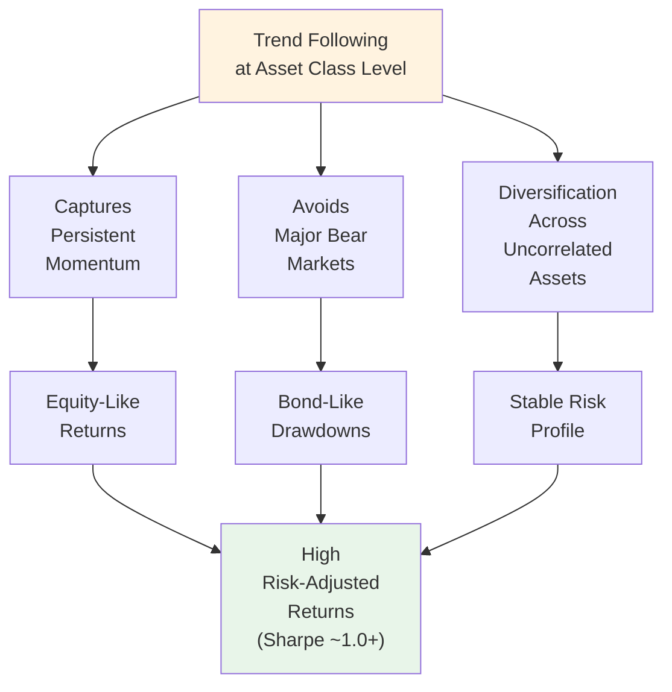
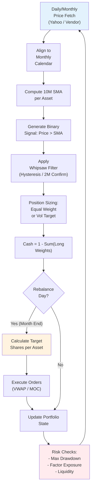
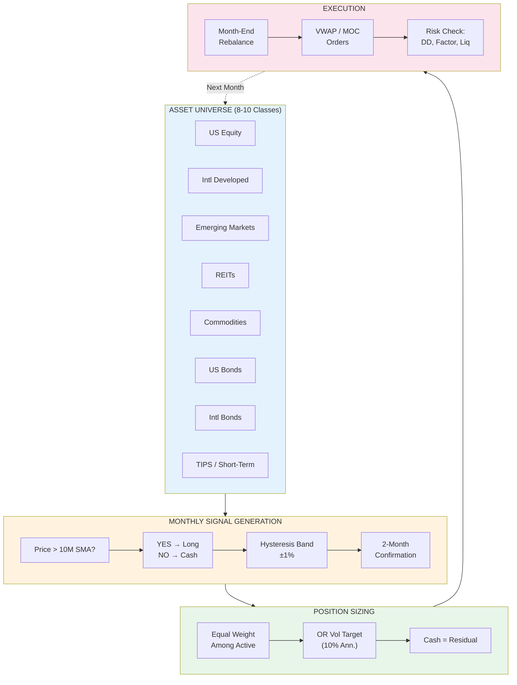

# Tactical Asset Allocation — Faber (2013 Update)

> The "Ivy Portfolio" / "Global Tactical Asset Allocation" (GTAA) paper. Simple trend-following across global asset classes using 10-month SMA. Demonstrates equity-like returns with bond-like drawdowns.

---

## 1. Core Idea

**Trend-following at the asset-class level**: Buy assets when above their 10-month simple moving average (SMA), move to cash when below. Applied to a diversified global universe.



---

## 2. The Faber GTAA Universe

| Asset Class | Proxy (Original) | Modern ETF Equivalent |
|-------------|------------------|----------------------|
| **US Equities** | S&P 500 | SPY, VOO, IVV |
| **Foreign Developed** | MSCI EAFE | VEA, IEFA |
| **Emerging Markets** | MSCI EM | VWO, EEM |
| **REITs** | NAREIT / FTSE NAREIT | VNQ, SCHH |
| **Commodities** | GSCI / DJ-UBS | DBC, GSG, PDBC |
| **US Bonds** | 10Y Treasury / Aggregate | TLT, IEF, AGG, BND |
| **International Bonds** | Citigroup Non-USD | BWX, IGOV |
| **Cash** | 90-Day T-Bill | SHV, BIL, SGOV |

> **Original (2006)**: 5 assets (S&P 500, EAFE, GSCI, NAREIT, 10Y Tsy)
> **Updated (2013)**: 10+ assets including EM, Intl Bonds, TIPs

---

## 3. Signal & Position Sizing

### Basic Signal (Binary)
```
Signal_t = 1 if Price_t > SMA_10(Price)_t else 0
Position_t = Signal_t * (1 / N_assets)  # Equal weight among "on" assets
```

### Risk-Parity / Volatility Targeting (Enhanced)
```
Target_Vol = 10% (annualized)
Asset_Vol_t = Realized_Vol_20d(Asset)
Weight_t = Signal_t * (Target_Vol / Asset_Vol_t) / Sum(Target_Vol / Asset_Vol_t)
```
*Caps weights at 20–25% per asset for diversification.*

### Cash Allocation
- Assets with `Signal = 0` → weight allocated to **SHV/BIL** (0–3 month Treasuries)
- **No leverage** in original; some implementations allow 1.2–1.5x when few assets "on"

---

## 4. Key Results (1973–2012 / 2013 Update)

| Metric | Buy & Hold (60/40) | Faber GTAA (Equal Weight) | Faber GTAA (Vol Target) |
|--------|-------------------|---------------------------|-------------------------|
| **CAGR** | ~9.5% | ~10.5–11.5% | ~11–12% |
| **Volatility** | ~10–11% | ~7–8% | ~8–9% |
| **Sharpe** | ~0.65 | ~1.0–1.2 | ~1.1–1.3 |
| **Max Drawdown** | ~-35% (2008) | ~-15% to -20% | ~-12% to -15% |
| **Correlation to S&P** | ~0.9 | ~0.5–0.6 | ~0.4–0.5 |
| **% Months in Cash** | 0% | ~20–30% | ~20–30% |

### Crisis Performance
| Period | S&P 500 | 60/40 | GTAA |
|--------|---------|-------|------|
| 2000–2002 (Dot-com) | -43% | -15% | **+5% to +10%** |
| 2008 (GFC) | -51% | -30% | **-10% to -15%** |
| 2020 (Covid) | -34% | -20% | **-5% to -10%** |

---

## 5. Why It Works — The Mechanics



### Behavioral / Structural Drivers
1. **Slow information diffusion** across asset classes → trends persist
2. **Institutional rebalancing flows** create momentum (quarterly/annual)
3. **Risk-off flights** to bonds/cash are slow-moving → trend capture
4. **Cross-asset diversification** smooths equity-only trend whipsaws

---

## 6. Critical Implementation Details

### Monthly Rebalancing (End-of-Month)
```python
def faber_gtaa_signal(prices: pd.DataFrame, lookback=10) -> pd.DataFrame:
    """
    prices: DataFrame of monthly close prices (assets x dates)
    Returns: DataFrame of weights (assets x dates)
    """
    sma = prices.rolling(window=lookback).mean()
    signal = (prices > sma).astype(float)
    
    # Equal weight among active assets, rest to cash
    n_active = signal.sum(axis=0)
    weights = signal.div(n_active, axis=1).fillna(0)
    
    # Cash column
    weights.loc['CASH'] = 1 - weights.sum(axis=0)
    return weights
```

### Whipsaw Protection (Key Enhancement)
| Technique | Description |
|-----------|-------------|
| **Hysteresis / Band** | Enter if > SMA + 1%; Exit if < SMA - 1% |
| **Confirmation** | Require 2 consecutive months above/below SMA |
| **Volatility filter** | Reduce position when VIX > 30 / realized vol high |
| **Minimum hold** | Minimum 3-month holding period |

### Transaction Costs
- **Monthly turnover**: ~10–20% (low)
- **Cost impact**: ~0.3–0.5% annually (with 10bps round-trip)
- **ETF choice matters**: Use low-spread, high-volume ETFs

---

## 7. Complete System Flowchart



---

## 8. Variants & Extensions

| Variant | Description | Key Reference |
|---------|-------------|---------------|
| **Dual Momentum** | Relative momentum (asset vs asset) + Absolute momentum (vs cash) | Antonacci (2013) |
| **Risk Parity GTAA** | Vol-target each asset; leverage to target portfolio vol | Bruder et al. (2011) |
| **Factor-Timing GTAA** | Apply trend to factor portfolios (Value, Momentum, Quality, Low Vol) | — |
| **Machine Learning** | Regime detection (HMM) to switch lookback / universe | — |
| **Crypto / Digital Assets** | Add BTC, ETH as separate asset class | — |
| **ESG / Thematic** | Apply to thematic ETFs (Clean Energy, AI, etc.) | — |

---

## 9. Python: Full Backtest Skeleton

```python
import pandas as pd
import numpy as np
import yfinance as yf

class FaberGTAA:
    def __init__(self, tickers: dict, lookback=10, vol_target=0.10, 
                 rebalance_freq='M', whipsaw_pct=0.01):
        self.tickers = tickers  # {'US_EQ': 'SPY', 'INTL_EQ': 'VEA', ...}
        self.lookback = lookback
        self.vol_target = vol_target
        self.rebalance_freq = rebalance_freq
        self.whipsaw_pct = whipsaw_pct
        self.prices = None
        self.weights = None
    
    def fetch_data(self, start='1990-01-01'):
        data = {}
        for name, ticker in self.tickers.items():
            df = yf.download(ticker, start=start, progress=False)['Adj Close']
            data[name] = df.resample('M').last()
        self.prices = pd.DataFrame(data).dropna()
        return self.prices
    
    def compute_signals(self):
        sma = self.prices.rolling(self.lookback).mean()
        
        # Hysteresis: enter above SMA*(1+w), exit below SMA*(1-w)
        upper = sma * (1 + self.whipsaw_pct)
        lower = sma * (1 - self.whipsaw_pct)
        
        signal = pd.DataFrame(0, index=self.prices.index, columns=self.prices.columns)
        signal[(self.prices > upper)] = 1
        signal[(self.prices < lower)] = 0
        # Forward fill to hold between signals
        signal = signal.replace(0, np.nan).ffill().fillna(0)
        
        return signal
    
    def compute_weights(self, signal):
        # Vol targeting
        returns = self.prices.pct_change()
        vol = returns.rolling(60).std() * np.sqrt(12)
        
        inv_vol = (self.vol_target / vol).clip(upper=5)  # cap leverage
        raw_weight = signal * inv_vol
        weight = raw_weight.div(raw_weight.sum(axis=1), axis=0).fillna(0)
        
        # Cash
        weight['CASH'] = 1 - weight.sum(axis=1)
        self.weights = weight.clip(lower=0)
        return self.weights
    
    def backtest(self):
        signal = self.compute_signals()
        weights = self.compute_weights(signal)
        
        # Portfolio returns
        asset_returns = self.prices.pct_change().shift(-1)  # next month return
        port_return = (weights.shift(1) * asset_returns).sum(axis=1)
        
        # Metrics
        cagr = (1 + port_return).prod() ** (12 / len(port_return)) - 1
        vol = port_return.std() * np.sqrt(12)
        sharpe = cagr / vol
        max_dd = (1 + port_return).cumprod().div((1 + port_return).cumprod().cummax()).sub(1).min()
        
        return {
            'cagr': cagr, 'vol': vol, 'sharpe': sharpe, 
            'max_dd': max_dd, 'weights': weights, 'returns': port_return
        }
```

---

## 10. Connection to Other Modules

- **[[portfolio-optimization-practice]]** — risk parity, vol targeting, rebalancing
- **[[forecasting-and-market-efficiency]]** — momentum/anomalies, trend persistence
- **[[risk-management-value-at-risk]]** — drawdown control, tail risk
- **[[quant-toolkit-and-skills]]** — backtesting framework, performance analytics

---

## 11. Summary: Faber GTAA in One Diagram



---

**Bottom Line**: Faber (2013) shows a **dead-simple 10-month SMA trend filter** across 8–10 global asset classes delivers **equity-like returns (~10–12% CAGR) with half the drawdown (~15% max)**. The magic isn't the lookback—it's **diversification across uncorrelated trend streams**. Production systems add: vol targeting, whipsaw filters, factor overlays, and regime-aware lookbacks.