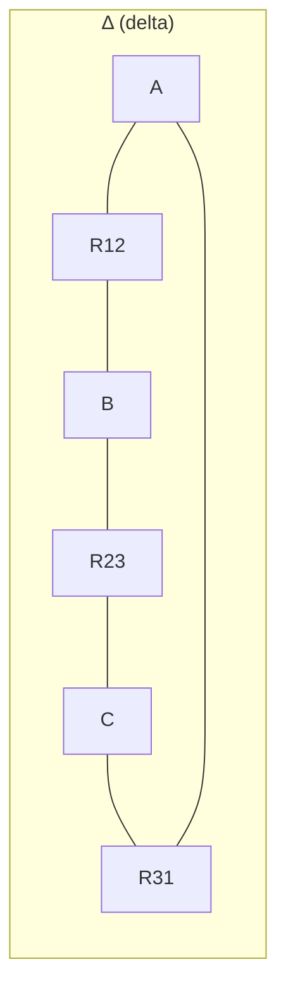

## For future agent
Module 1 of BEE (MU pattern): DC circuit analysis from Ohm's law through network theorems. This is the numerical backbone of the paper — Thevenin/Norton and star-delta problems appear every year. All formulas duplicated in [[formula-sheet-bee]].

# DC Circuits & Network Theorems

## 1. Fundamentals

- **Charge** $Q$: $Q = I \cdot t$ — coulombs; $I$ in amperes, $t$ in seconds
- **Voltage** $V$: work per unit charge, $V = W/Q$ — volts
- **Power**: $P = VI = I^2R = \dfrac{V^2}{R}$ — watts
- **Energy**: $W = P \cdot t$ — joules; practical unit **kWh** ("1 unit"): $W_{kWh} = \dfrac{P_{W} \cdot t_{h}}{1000}$

### Ohm's Law (at constant temperature)
$$V = IR$$
Limitation: not valid for non-linear elements (diodes, arc lamps) and non-constant-temperature conductors.

### Resistance of a conductor
$$R = \rho \frac{l}{a} \quad \Omega$$
$\rho$ = resistivity (Ω·m). Temperature effect: $R_2 = R_1[1 + \alpha_1(T_2 - T_1)]$ where $\alpha$ = temperature coefficient. For two materials, use the combined relation $\alpha_2 = \dfrac{\alpha_1}{1 + \alpha_1(T_2 - T_1)}$.

## 2. Series & Parallel

| | Series | Parallel |
|--|--------|----------|
| Current | Same through all | Divides: $I_1 = I\cdot\dfrac{R_2}{R_1+R_2}$ (two-branch) |
| Voltage | Divides: $V_1 = V\cdot\dfrac{R_1}{R_1+R_2}$ | Same across all |
| Equivalent | $R_{eq} = R_1 + R_2 + \dots$ | $\dfrac{1}{R_{eq}} = \dfrac{1}{R_1} + \dfrac{1}{R_2} + \dots$ |
| Use | Voltage dividers, ammeter shunt design is parallel | Current dividers, voltmeter multipliers are series |

**Exam shortcut (two in parallel)**: $R_{eq} = \dfrac{R_1 R_2}{R_1 + R_2}$ (product-over-sum).

## 3. Star–Delta Transformation

**Delta → Star** (divide product of two adjacent sides by sum of all three):
$$R_A = \frac{R_{12}\,R_{31}}{R_{12}+R_{23}+R_{31}}, \quad R_B = \frac{R_{12}\,R_{23}}{\Sigma R}, \quad R_C = \frac{R_{23}\,R_{31}}{\Sigma R}$$

**Star → Delta** (sum of pairwise products over opposite star arm):
$$R_{12} = R_A + R_B + \frac{R_A R_B}{R_C}, \quad \text{(cyclic for } R_{23}, R_{31}\text{)}$$

**Balanced shortcut**: $R_\Delta = 3R_Y$ and $R_Y = R_\Delta/3$.

## 4. Kirchhoff's Laws

- **KCL**: $\sum I_{in} = \sum I_{out}$ at every node (charge conservation)
- **KVL**: $\sum V = 0$ around every loop (energy conservation)

**Sign convention**: rise (− to +) = $+EMF$; drop in resistor in the direction of assumed current = $-IR$. Stick to one assumption per loop; negative answer just means current flows opposite to assumption.

## 5. Mesh & Nodal Analysis

**Mesh (loop current) method** — best when many components in loops:
1. Assign clockwise mesh currents $I_1, I_2, \dots$
2. KVL per mesh: shared resistors carry the DIFFERENCE of mesh currents
3. Solve simultaneous equations (Cramer's rule / matrix — see [[modules/../01-Areas/Engineering/engineering-math/module-1-matrices|eng-math M1]])

**Nodal method** — best when many branches meet at few nodes:
1. Ground one node; label unknown node voltages
2. KCL at each node: $\sum \dfrac{V_{node} - V_{other}}{R} = 0$ (or = injected current)
3. Solve for node voltages; branch currents follow from Ohm's law

**Choice rule**: fewer equations wins. 3 meshes / 2 essential nodes → nodal.

## 6. Network Theorems

### Superposition
In a linear circuit with multiple sources, the current/voltage in any element = algebraic sum of contributions from each source acting ALONE (kill others: voltage source → **short**, current source → **open**).
- Used when: circuit has 2+ sources of different types
- Never use to compute POWER directly (power is quadratic — superposition invalid)

### Thevenin's Theorem
Any linear two-terminal network ≡ one voltage source $V_{th}$ in series with $R_{th}$.
1. Remove the load
2. $V_{th}$ = open-circuit voltage across load terminals
3. $R_{th}$ = resistance looking back with all sources killed (V→short, I→open)
4. Reconnect load: $I_L = \dfrac{V_{th}}{R_{th}+R_L}$

### Norton's Theorem
Same network ≡ current source $I_N$ in PARALLEL with $R_{th}$.
- $I_N$ = short-circuit current across the terminals
- $R_{th}$ identical to Thevenin's
- Conversion: $I_N = \dfrac{V_{th}}{R_{th}}$ (source transformation)

### Maximum Power Transfer
Load receives maximum power when $R_L = R_{th}$, giving
$$P_{max} = \frac{V_{th}^2}{4R_{th}}$$
Efficiency at max transfer = **50%** (half lost in $R_{th}$) — why power grids never match, but signal circuits always do.

## 7. Worked Example (exam pattern)

*Circuit*: 10 V source in series with 2 Ω, feeding a node where 6 Ω and a 3 Ω + load branch split. Find load current via Thevenin.

1. Remove load (3 Ω branch): 2 Ω in series with 6 Ω across 10 V → $V_{th} = 10 \cdot \dfrac{6}{2+6} = 7.5$ V
2. Kill source: $R_{th} = 2 \parallel 6 = 1.5$ Ω
3. $I_L = \dfrac{7.5}{1.5 + 3} = 1.67$ A

**Verification habit**: re-solve by mesh analysis — both must agree.

## 8. Failure Modes (exam)

| Trap | Fix |
|------|-----|
| Sign errors in KVL | Write loop direction + polarity BEFORE substituting |
| Killing sources wrong in $R_{th}$ | V-source → short (keep internal resistance out if given), I-source → open |
| Star-delta direction confusion | Δ→Y: divide by Σ; Y→Δ: add + product/opposite — memorize the shape, not letters |
| Power via superposition | Never; compute total current first, then power |

## Related

[[module-2-ac-circuits]] — same theorems extend to impedance · [[formula-sheet-bee]] · [[modules/../01-Areas/Engineering/physics/overview|physics]] · [[modules/../01-Areas/Engineering/engineering-math/module-1-matrices|matrix solving]]