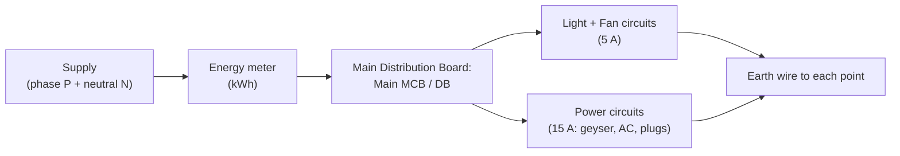

## For future agent
Module 5 of BEE (MU pattern): domestic wiring, protective devices, earthing, safety, batteries and energy sources. Theory-memory module — cheapest marks in the paper. Diagrams (wiring layouts, earthing types) are half the marks; practice drawing them once.

# Electrical Installations, Safety & Energy

## 1. Domestic Wiring

### Layout

**Standard practice (MU pattern)**:
- Supply: single-phase 230 V, 50 Hz (phase = red/yellow/blue or brown; neutral = black/blue; earth = **green**)
- Circuits in **parallel** (each load gets full 230 V; one fault doesn't kill the house)
- Light/fan circuits: 5 A rating, 1.5 mm² wire; power circuits: 15 A, 2.5–4 mm²
- Switch always in the **phase** wire (never neutral — a "switched-off" neutral circuit stays live)
- All switches/plugs on phase side; fuse/MCB on phase + neutral as applicable

### Wiring systems compared
| System | Pros | Cons |
|--------|------|------|
| Cleat | Cheap, temporary | Ugly, dust |
| Casing-capping | Cheap, repairable | Fire risk, short life |
| **Concealed conduit** | Safe, standard for modern homes | Costly, hard to modify |
| Surface conduit | Visible, easy inspection | Aesthetics |

## 2. Protective Devices

| Device | Principle | Speed | Notes |
|--------|-----------|-------|-------|
| **Fuse** | Thin wire melts on overcurrent | Slower | Cheap; one-time; rewireable (kit-kat) or cartridge |
| **MCB** (Miniature Circuit Breaker) | Thermal (overload) + magnetic (short-circuit) trip | Instantaneous on short | Resettable; ratings 2–63 A; B/C/D curves by trip character |
| **ELCB / RCCB** | Detects imbalance between phase & neutral current (residual > 30 mA → trips) | ~30 ms | **The shock-protection device** — trips when current leaks through a human to earth. 30 mA sensitivity for human protection; 100/300 mA for fire protection |

**Why RCCB saves lives**: a 30 mA current through the human heart can be lethal; the RCCB trips below that. MCBs alone do NOT protect people — only cables.

## 3. Earthing (Grounding)

**Purpose**: connect metallic bodies of appliances to earth so a fault puts a LOW-RESISTANCE path for fault current → large current flows → protective device trips instantly → body potential held near zero.

| Type | Description | Notes |
|------|-------------|-------|
| Plate earthing | Copper/GI plate buried ≥3 m with charcoal+salt layers | Most common in India |
| Pipe earthing | GI pipe with perforations, buried | Cheap, standard |
| Strip/wire earthing | Strip in a trench | Rocky soil |

**Earth wire**: green insulation; resistance of earth pit should be < 1–5 Ω. **Never use neutral as earth.**

## 4. Electrical Safety (theory-memory list)

1. Treat every conductor as LIVE until proven dead (tester first)
2. Never touch with wet hands / bare feet
3. Switch OFF + isolate before any repair; tag the switch
4. Use insulated tools; rubber-soled footwear
5. RCCB 30 mA on every personal circuit
6. Fuses/MCBs of correct rating — never a thicker fuse wire
7. Shock response: switch off first; if not possible, use an insulated object — never bare hands; then CPR/medical help

## 5. Batteries

| Type | Cell voltage | Notes |
|------|-------------|-------|
| Lead-acid | 2.0 V/cell | Cars/UPS; heavy; sulfation if left discharged |
| NiMH | 1.2 V | Older AA packs |
| **Li-ion** | 3.6–3.7 V/cell | High energy density; needs BMS (protection against over-charge/deep-discharge/thermal runaway); powers phones, EVs |
| LiFePO₄ | 3.2 V | Safer chemistry, cycle life; solar/EV growth |

Charging terms: C-rating (1C = full capacity in 1 h), depth of discharge (DoD) vs cycle life. Series adds voltage; parallel adds Ah — packs do both (e.g., 3s2p).

## 6. Energy Sources & Efficiency

- **Conventional**: coal thermal (~35–40% efficient — the rest is heat), hydro (~85–90% turbine efficiency), nuclear
- **Non-conventional/renewable**: solar PV (15–22% panel efficiency, DC → inverter → AC), wind (kinetic energy of air, Betz limit 59.3%), biomass
- **Energy conservation / audit**: measure → identify losses → fix. Household levers: LED lighting (80% less than incandescent), BEE star-rated appliances, PF correction, avoiding standby loads
- **Electricity billing**: energy in kWh = kW × hours; load factor = average demand / peak demand — higher load factor = cheaper per unit

## 7. Failure Modes (exam)

| Trap | Fix |
|------|-----|
| Switch drawn in neutral wire | Always phase — examiner checks this first |
| MCB vs ELCB confusion | MCB = cable protection (overcurrent); ELCB/RCCB = human protection (leakage) |
| Earthing purpose vague | Low-resistance fault path → big fault current → device trips fast; body held at ~0 V |
| Battery capacity units | Ah (charge) × voltage = Wh (energy) — don't mix |

## Related

[[module-1-dc-circuits]] · [[module-4-dc-machines-and-induction-motors]] · [[formula-sheet-bee]] · [[modules/../01-Areas/Engineering/physics/overview|physics electrodynamics]]