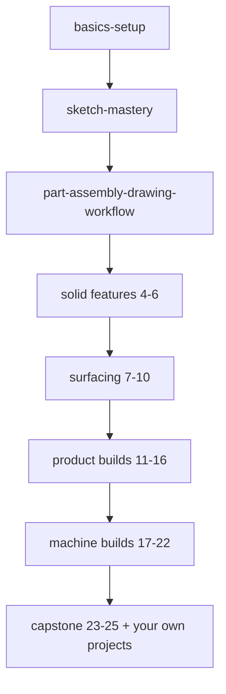

# SolidWorks Module Hub

## For future agent
Entry point to the SolidWorks self-study track: 154 YouTube videos (PL1 Surfacing 102 + PL2 Advanced Exercises 52, ~33 unique machine builds after dupes) distilled into ~26 pages. Raw material in `raw-sources/solidworks/` (catalog.csv + transcripts, immutable). Bulk subtitle fetching hit YouTube HTTP 429 on 2026-09-12 — catalog.csv `status` column tracks per-video state; retry pending videos in a later session before deepening build pages. Beginner-first contract: why-before-how, menu paths, real-world manufacturing context, TBC flags on unverified claims.

> **What this is:** a zero-to-capable SolidWorks track for a beginner — from "what is a plane" to modeling a mouse, a helmet, a gearbox, and your own drone parts. Built from two playlists, organized so you never need the videos open unless you want them.

---

## Reading order (follow top to bottom)

### Foundation — start here
1. [[solidworks-basics-setup]] — interface, CommandManager, standard views, design intent, your first week setup
2. [[sketch-mastery]] — relations, fully-defined sketches, the skill every feature depends on
3. [[part-assembly-drawing-workflow]] — the master pipeline: sketch → feature → part → assembly → drawing

### Solid features
4. [[extrude-revolve-sweep]] — the three workhorses: prismatic, axisymmetric, and path-driven solids
5. [[lofted-boss-boundary]] — transitioning between profiles (handles, nozzles, ergonomic grips)
6. [[dressup-productivity]] — fillets, chamfers, patterns, mirror, split lines: the speed combo kit

### Surfacing (the heart of PL1)
7. [[surfacing-methodology]] — solid-vs-surface decision tree, the knit → thicken master flowchart
8. [[lofted-boundary-surfaces]] — the two most-used surface features, deep
9. [[filled-knit-trim-thicken]] — closing, joining, cutting, solidifying
10. [[surfacing-utilities-troubleshooting]] — offset, freeform, delete-hole, swept/revolved/extruded surfaces + failure repair

### PL1 product builds (follow-along sheets)
11. [[beginner-exercises]] — Ex 92/117/146/154/157/167/207/230 + early drills
12. [[bottles-containers]] — bottles, jugs, vases, perfume flasks, caps and assemblies
13. [[consumer-electronics]] — mice, earphones, AirPods, flashlight, massager, hair dryer, shower head
14. [[household-tools]] — spoons, skimmers, forks, hooks, rings, everyday tools
15. [[complex-showcase]] — helmet (3 parts), propeller, SpaceX Dragon, washbasin, taps, nozzles
16. [[artistic-organic]] — panton chair, art vase, jewelry, glass-with-liquid, mesh, decorative work

### PL2 machine builds (DesignWithAjay)
17. [[gearbox-fundamentals]] — how gearboxes work + how to model them (anatomy, ratios, housings)
18. [[helical-spur-gearboxes]] — single/multi-stage parallel-shaft boxes
19. [[bevel-planetary-gearboxes]] — right-angle and coaxial power (incl. herringbone)
20. [[shredders-recycling-machines]] — plastic/paper/agri shredders, chippers
21. [[conveyors-material-handling]] — belt, roller, hopper conveyors
22. [[presses-forming-drone]] — hydraulic press, press brake, sheet machines, screw turbine, drone frame

### Capstone
23. [[flowcharts-master]] — every decision tree in one place
24. [[solidworks-cheatsheet]] — one-page command reference
25. [[solidworks-project-ideas]] — six 1–2k-word build briefs with testing + simulation ladders

---

## Sources

| Playlist | Videos | Channel style | Raw catalog |
|---|---|---|---|
| PL1 SolidWorks Surfacing | 102 | CAD CAM Tutorial — click-by-click surfacing demos | `[[raw-sources/solidworks/pl1-surfacing.txt]]` |
| PL2 Advanced SolidWorks Exercises | 52 (~33 unique) | DesignWithAjay — full machine builds; #34–52 are link/timelapse/trailer repeats | `[[raw-sources/solidworks/pl2-exercises.txt]]` |
| Transcripts | 15 fetched | Auto-captions via yt-dlp; 7 primers + bulk pending (429) | `raw-sources/solidworks/transcripts/` + `subs/` |
| Status tracker | 154 rows | Per-video: transcript-ok / skip-dupe / retry-bulk-fetch | `[[raw-sources/solidworks/catalog.csv]]` |

## Staleness & verify notes (read before trusting details)

- Content vintage 2021–2026; menu paths verified against this era's UI. SolidWorks updates yearly — if a button moved, search its name with `S` (search commands).
- Follow-along transcripts are **command sequences, not theory** — dimensions quoted are the YouTuber's choices, not engineering requirements.
- Nothing here replaces opening SolidWorks: every page ends with a "verify in-app" checklist.
- Related vault pages: [[../overview]] (drawing basics) · [[../development-of-surfaces]] (projection of solids theory — the math behind loft/boundary) · [[../autocad-lab-and-exam-prep]] (lab discipline) · [[../cad-design-interview-prep]] (drone-team round).
