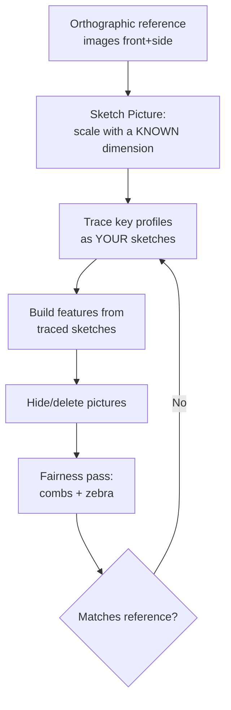

# Artistic & Organic Modeling

## For future agent
PL1 closer page: chair (#3 panton), art vase (#100 sketch-picture), bracelet (#98), ornament (#97), glass with liquid (#96), wire mesh (#102 half-moon), gradient holes (#101), turtleball (#46), dice/ring/racket/birdcage (#59–65 zone), harvester/agri decorative (#70/#75), mushroom part (#77), petal plate (#83), boomerang (#87), pea shooter (#76), rubber/plastic smalls. Reverse-engineering + freeform emphasis (TBC per-video). Connects surfacing craft to portfolio/showcase thinking.

> **Why this page matters for a beginner:** organic work removes the crutch of dimensions — no drawing tells you a panton chair's curve. You learn to *see* curvature (zebra stripes as eyes), to steal shapes from images honestly, and to finish models to presentation quality. These are portfolio muscles.

---

## 1. Reverse-engineering workflow (art vase #100 pattern)

**Honesty rules:** two known dimensions minimum for scale (one lies — perspective); never trust a perspective photo for proportions; traced splines get rebuilt with fewer points + tangency (traces are noisy, fairness is designed).

## 2. Playlist build map

| Build | Core lesson (TBC per-video) |
|---|---|
| #3 Panton chair | Single-curve cantilever: one flowing ribbon (sweep/loft along an S-path) + base transition — design icon as curvature study |
| #100 Art vase (import sketch picture) | The reverse-engineering demo itself |
| #98 Metal bracelet, #97 Metal ornament | Closed-loop sweeps (bangle bands), patterned relief, polish-ready finishes |
| #96 Glass with liquid | **Multi-body transparency:** glass vessel (thin revolve, glass appearance) + liquid body (fill to level, meniscus ignored at this level — TBC) — appearances + separate bodies storytelling |
| #102 Half-moon wire mesh | Pattern-on-curve: wires as swept thin bodies in two directions (rebuild cost warning — keep counts modest) |
| #101 Gradient hole cover (linear pattern vary) | **Instances to Vary** showcase: hole size stepping along the row — parametric decoration |
| #46 TurtleBall, #77 Mushroom part, #83 Petal plate, #87 Boomerang | Playful organic forms: radial symmetry + freeform tweaks; boomerang = airfoil-ish arms (TBC: toy, not aerodynamics) |
| #59 Birdcage, #63 Dice, #64 Triangle ring | Cage/pipped geometry: repeated thin elements; dice = box + patterned dimples + numerals (TBC) |

## 3. Presentation finish (renders that get noticed)

- **Appearances + scenes:** brushed metal, glossy plastic, glass — assign per body; simple studio scene + soft shadows beat complex environments for beginners.
- **Decals/logos:** split-line zones + decal mapping (TBC exact workflow per version) for branding on curved faces.
- **Exploded + turntable:** exploded views for assemblies; screen-recorded rotations for portfolio clips (your drone-team and project pages will thank you).
- **Before/after fairness shots:** zebra-stripe screenshots prove craft, not just outcome — include one in every portfolio post.

## 4. Portfolio thinking (beginner → visible)

1. One hero render + one wireframe/zebra proof + one sentence on technique per build.
2. Group by family (vessels / casings / tools / machines) — curators and interviewers read structure as competence.
3. Every post links the skill, not the video ("lofted shell + mutual trim + thicken," never "followed tutorial #X").

## 5. Failure clinic

| Symptom | Cause → Fix |
|---|---|
| Traced model looks "off" vs image | Single-dimension scaling or perspective reference → rescale with two known dims, orthographic images only |
| Wire mesh rebuild takes forever | Hundreds of sweep instances → reduce counts, use cosmetic pattern or simplified representation (TBC per version) |
| Freeform tweaks look lumpy | Too many points moved too far → undo, move fewer points smaller amounts, zebra after each |
| Glass render looks wrong | Appearance on solid body instead of thin shell + no environment → thin-feature vessel + studio scene |

---

## 6. Worked example: panton chair ribbon + glass-with-liquid (two organic disciplines)

**Panton chair (#3, single-ribbon construction):**
1. Side silhouette: Right Plane spline — floor contact → seat rise → backrest crest → top (the famous S; TBC: trace a real side photo per §1 with two known dims — seat height + overall height).
2. Ribbon: swept surface along the S-path, width 600 (TBC illustrative — real ≈ 500–600 mm; confirm with furniture references) with straight cross-section → thicken 12 (molded plywood/fiberglass feel — TBC per construction).
3. Base transition: the floor-contact curve needs a flattened tangent zone (rocking stability reads here — TBC: real Panton stacks and sits via exact base geometry; note as design-critical).
4. Edge treatment: full-perimeter edge roll or thickened rim (comfort + stiffness) → zebra the S (one continuous fairness read — the whole chair is ONE surface story).
5. Structural honesty note: a uniform 12 mm plastic S will flex/creep in reality (cantilevered seating loads are brutal — TBC: confirm with furniture/structures references); the CAD lesson is the ribbon workflow, not a manufacturable chair. Say so in your portfolio — honesty reads as competence.

**Glass with liquid (#96, multi-body storytelling):**
1. Glass: thin-revolve vessel (wall 2, TBC illustrative) with heavy base (-whiskey-tumbler mass reads as quality — thick base, thin walls).
2. Liquid: separate solid body — revolve INSIDE the glass to the fill line (flat top + tiny meniscus fillet if you're showing off — TBC), amber appearance with transparency + attenuation feel (TBC exact appearance settings per version).
3. Bodies folder discipline: `Glass` + `Liquid` as separate solid bodies (different materials/densities — mass properties per body tells the story) → appearances per body → studio scene with backlight feel.
4. Condensation/ice (portfolio stretch — TBC): split-line zones + bump appearance; keep it cosmetic, never modeled geometry.

**Bracelet appendix (#98):** closed-loop sweep (circle path Ø65, TBC illustrative) with shaped profile (comfort-fit interior flat — TBC per jewelry practice) → patterned relief cuts (circular pattern of a single motif seed) → clasp gap + hinge envelopes → metal appearances. The loop must be EXACTLY closed (path start = end, tangent-continuous) or the sweep twists at the seam — path-first verification again.

**Verify in-app:** reverse-engineer any simple object on your desk (a mug): photo front+side with a ruler in frame, sketch-picture, trace, build, fairness-check. Desk-to-CAD in one sitting.

**Next:** PL2 machines — [[gearbox-fundamentals]].

---

## 7. Dice + mesh + gradient-pattern appendix (precision decoration)

**Dice (#63-class):** box + face dimples (patterned spherical cuts, 1–6 pips in standard opposite-sums-to-7 layout — TBC: confirm dice convention; gaming correctness is the detail that delights) → pip depth uniform (TBC illustrative 1 mm) → numerals via split-line + contrasting appearance (TBC) → edge treatment: sharp dice roll true (precision backgammon dice are razor-edged — TBC: confirm with gaming references), rounded dice tumble casually. The SAME model teaches opposite specs per use — context decides geometry.

**Wire mesh (#102-class) without the rebuild death:** full sweep-per-wire at production counts kills any workstation. Tiered approach: (1) hero zone — real swept wires where the camera/portfolio looks; (2) mid zones — cosmetic wire appearance/bump (TBC per version); (3) far zones — plain surface with mesh texture. State the tiers in your notes — production artists do exactly this (LOD thinking), and naming it marks you as production-aware, not tutorial-bound.

**Gradient holes (#101-class) generalized:** Instances-to-Vary along any driver (size/position/rotation varying down a row) — speaker grilles that fade, vents that grow toward heat sources (TBC: confirm functional patterns per device), decorative fades. The feature is a design LANGUAGE (variation-with-order), not a trick — look for fade/scale/rhythm opportunities in every patterned detail you model from now on.

## CROSS-REFERENCES
- [[INDEX]] · [[complex-showcase]] · [[gearbox-fundamentals]] · [[surfacing-utilities-troubleshooting]] · [[solidworks-project-ideas]]
