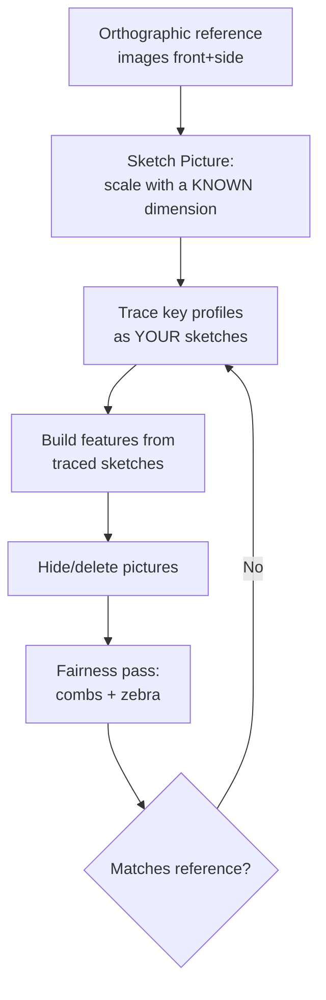

# Artistic & Organic Modeling

## For future agent
PL1 closer page: chair (#3 panton), art vase (#100 sketch-picture), bracelet (#98), ornament (#97), glass with liquid (#96), wire mesh (#102 half-moon), gradient holes (#101), turtleball (#46), dice/ring/racket/birdcage (#59–65 zone), harvester/agri decorative (#70/#75), mushroom part (#77), petal plate (#83), boomerang (#87), pea shooter (#76), rubber/plastic smalls. Reverse-engineering + freeform emphasis (TBC per-video). Connects surfacing craft to portfolio/showcase thinking.

> **Why this page matters for a beginner:** organic work removes the crutch of dimensions — no drawing tells you a panton chair's curve. You learn to *see* curvature (zebra stripes as eyes), to steal shapes from images honestly, and to finish models to presentation quality. These are portfolio muscles.

---

## 1. Reverse-engineering workflow (art vase #100 pattern)

**Honesty rules:** two known dimensions minimum for scale (one lies — perspective); never trust a perspective photo for proportions; traced splines get rebuilt with fewer points + tangency (traces are noisy, fairness is designed).

## 2. Playlist build map

| Build | Core lesson (TBC per-video) |
|---|---|
| #3 Panton chair | Single-curve cantilever: one flowing ribbon (sweep/loft along an S-path) + base transition — design icon as curvature study |
| #100 Art vase (import sketch picture) | The reverse-engineering demo itself |
| #98 Metal bracelet, #97 Metal ornament | Closed-loop sweeps (bangle bands), patterned relief, polish-ready finishes |
| #96 Glass with liquid | **Multi-body transparency:** glass vessel (thin revolve, glass appearance) + liquid body (fill to level, meniscus ignored at this level — TBC) — appearances + separate bodies storytelling |
| #102 Half-moon wire mesh | Pattern-on-curve: wires as swept thin bodies in two directions (rebuild cost warning — keep counts modest) |
| #101 Gradient hole cover (linear pattern vary) | **Instances to Vary** showcase: hole size stepping along the row — parametric decoration |
| #46 TurtleBall, #77 Mushroom part, #83 Petal plate, #87 Boomerang | Playful organic forms: radial symmetry + freeform tweaks; boomerang = airfoil-ish arms (TBC: toy, not aerodynamics) |
| #59 Birdcage, #63 Dice, #64 Triangle ring | Cage/pipped geometry: repeated thin elements; dice = box + patterned dimples + numerals (TBC) |

## 3. Presentation finish (renders that get noticed)

- **Appearances + scenes:** brushed metal, glossy plastic, glass — assign per body; simple studio scene + soft shadows beat complex environments for beginners.
- **Decals/logos:** split-line zones + decal mapping (TBC exact workflow per version) for branding on curved faces.
- **Exploded + turntable:** exploded views for assemblies; screen-recorded rotations for portfolio clips (your drone-team and project pages will thank you).
- **Before/after fairness shots:** zebra-stripe screenshots prove craft, not just outcome — include one in every portfolio post.

## 4. Portfolio thinking (beginner → visible)

1. One hero render + one wireframe/zebra proof + one sentence on technique per build.
2. Group by family (vessels / casings / tools / machines) — curators and interviewers read structure as competence.
3. Every post links the skill, not the video ("lofted shell + mutual trim + thicken," never "followed tutorial #X").

## 5. Failure clinic

| Symptom | Cause → Fix |
|---|---|
| Traced model looks "off" vs image | Single-dimension scaling or perspective reference → rescale with two known dims, orthographic images only |
| Wire mesh rebuild takes forever | Hundreds of sweep instances → reduce counts, use cosmetic pattern or simplified representation (TBC per version) |
| Freeform tweaks look lumpy | Too many points moved too far → undo, move fewer points smaller amounts, zebra after each |
| Glass render looks wrong | Appearance on solid body instead of thin shell + no environment → thin-feature vessel + studio scene |

---

## 6. Worked example: panton chair ribbon + glass-with-liquid (two organic disciplines)

**Panton chair (#3, single-ribbon construction):**
1. Side silhouette: Right Plane spline — floor contact → seat rise → backrest crest → top (the famous S; TBC: trace a real side photo per §1 with two known dims — seat height + overall height).
2. Ribbon: swept surface along the S-path, width 600 (TBC illustrative — real ≈ 500–600 mm; confirm with furniture references) with straight cross-section → thicken 12 (molded plywood/fiberglass feel — TBC per construction).
3. Base transition: the floor-contact curve needs a flattened tangent zone (rocking stability reads here — TBC: real Panton stacks and sits via exact base geometry; note as design-critical).
4. Edge treatment: full-perimeter edge roll or thickened rim (comfort + stiffness) → zebra the S (one continuous fairness read — the whole chair is ONE surface story).
5. Structural honesty note: a uniform 12 mm plastic S will flex/creep in reality (cantilevered seating loads are brutal — TBC: confirm with furniture/structures references); the CAD lesson is the ribbon workflow, not a manufacturable chair. Say so in your portfolio — honesty reads as competence.

**Glass with liquid (#96, multi-body storytelling):**
1. Glass: thin-revolve vessel (wall 2, TBC illustrative) with heavy base (-whiskey-tumbler mass reads as quality — thick base, thin walls).
2. Liquid: separate solid body — revolve INSIDE the glass to the fill line (flat top + tiny meniscus fillet if you're showing off — TBC), amber appearance with transparency + attenuation feel (TBC exact appearance settings per version).
3. Bodies folder discipline: `Glass` + `Liquid` as separate solid bodies (different materials/densities — mass properties per body tells the story) → appearances per body → studio scene with backlight feel.
4. Condensation/ice (portfolio stretch — TBC): split-line zones + bump appearance; keep it cosmetic, never modeled geometry.

**Bracelet appendix (#98):** closed-loop sweep (circle path Ø65, TBC illustrative) with shaped profile (comfort-fit interior flat — TBC per jewelry practice) → patterned relief cuts (circular pattern of a single motif seed) → clasp gap + hinge envelopes → metal appearances. The loop must be EXACTLY closed (path start = end, tangent-continuous) or the sweep twists at the seam — path-first verification again.

**Verify in-app:** reverse-engineer any simple object on your desk (a mug): photo front+side with a ruler in frame, sketch-picture, trace, build, fairness-check. Desk-to-CAD in one sitting.

**Next:** PL2 machines — [[gearbox-fundamentals]].

---

## 14. Sculptural lighting + public-art appendix (scale, weather, liability — TBC per public-art/structural references)

**Wind + structure (art that stands outside — TBC: confirm with structural references, NOT this page):** wind-load areas (sail area × pressure = overturning moment — TBC per code!) → foundation discipline (depth + mass + anchors per the §11-tank-foundation habit generalized!) → vortex shedding on slender forms (TBC depth: tuned dampers exist for a reason!) → CAD consequence: load-path modeling from day one (the §7-H-frame habit: draw the force loop before the form! — art with hidden structure reads magic, art WITHOUT hidden structure reads tragedy!).

**Materials outdoors (decades, not seasons — TBC: confirm with architectural-materials references):** weathering steel vs stainless vs bronze vs coated carbon (patina-as-finish vs maintenance contracts — TBC per material!) → drainage + bird detailing (water + droppings destroy detailing that ignores them — TBC per practice; weeps + slopes + sacrificial drip edges!) → vandal + climb resistance (TBC per site: sharp deterrents vs liability law DIVERGE by jurisdiction — confirm, NOT this page!) → CAD consequence: material + finish CALLED OUT with maintenance interval (the §12-jewelry-finish habit at architectural scale + time!).

**Light as material (night identity — TBC per lighting-design references):** integrated vs uplight strategies (built-in LED channels vs ground fixtures — TBC per maintenance access!) → power + data routing (conduit paths in the structure — the §13-wearable-cable lesson at civic scale!) → light-pollution + neighbor discipline (shielding + curfews programmed — TBC per regulation!) → CAD consequence: fixture + access + wiring modeled (unmaintainable light sculptures go dark within years — design the RELAMP path like the §7-maintenance habit demands!).

---

## 13. Toy + sporting-goods appendix (play has engineering too)

**Toy safety architecture (regulations shape geometry — TBC: confirm with toy-safety standards like ISO 8124/EN 71/ASTM F963, NOT this page):** small-parts cylinders (choking hazard gauges by age grade — TBC per standard; design ABOVE the gauge or label DOWN the age!) → sharp points/edges tests (TBC per standard protocol — the §8-edge-policy with legal force behind it!) → battery compartments requiring TOOLS to open (coin-cell ingestion kills — TBC per regulation; screw-closed, never snap-only!) → cord/strap strangulation lengths (TBC per standard) → CAD consequence: compliance DIMENSIONS on the drawing (gauge-passing sizes called out like tolerances — safety specs travel with geometry!).

**Ball + impact sports gear (energy management — TBC: confirm with sports-equipment references):** helmet liners per [[complex-showcase]] §8 (multi-density foams tuned to impact spectra — TBC per standard testing!) → bat/racket balance + moment-of-inertia tuning (swing weight is engineERED — TBC per sport; CAD mass properties + tungsten inserts? — TBC per tier!) → protective shells (hard outer spreading load + soft inner absorbing — the §8-helmet sandwich generalized!) → grip tapes/overmolds per §7-handle rules (sweat changes everything — TBC per material!).

**Water toys + floatation (buoyancy is math — TBC: confirm with marine-safety references, NOT this page):** displaced volume ≥ weight + margin (Archimedes as design input!) →flotation foam volumes (closed-cell, TBC per material; waterlogged foam sinks swimmers — TBC!) → bright colors + whistle/attachment points (visibility + signaling designed in — TBC per standard!) → CAD consequence: volume readout per body (the §11-speaker-volume habit generalized: displaced-volume bodies modeled explicitly, buoyancy budget on paper!).

---

## 12. Jewelry-scale precision appendix (small is a different sport)

**Scale effects (physics changes below ~20 mm — TBC: confirm with micro-manufacturing references):** tolerances tighten proportionally (a 0.1 slip on a bracelet is VISIBLE — same slip on a helmet vanishes; TBC per finishing practice) → knit tolerance paradox (§9-forensics restated: absolute tolerances bite at small scale — loosen JUDICIOUSLY per [[consumer-electronics]] §5-earphone rule, document the exception!) → fillet minimums (0.2–0.3 mm modeled radii at jewelry scale — TBC illustrative; below that, geometry exists but manufacturing doesn't!) → pattern counts explode (pavé settings = hundreds of stones — TBC per jewelry practice; model ONE + pattern + SIMPLIFY for working configs per the §2-mesh tiers!).

**Setting + finding construction (TBC: confirm with jewelry references, NOT this page):** prong/bezel/pavé envelopes (stone dimensions to setter spec — TBC per stone cutting standards; seats cut AFTER casting in reality — model seats as machining ops, not as-cast!) → findings as bought parts (clasps, joints, catches — envelopes + interfaces, per the §2-flagship bought-out discipline) → articulation (bracelet links NEED motion ranges modeled + tested per the §9-DOF habit — stiff bracelets don't sell!) → finishing notes (polish vs matte zones SPLIT-LINED per [[dressup-productivity]] §5 — zones, not wishes!).

**Metal behavior notes (awareness — TBC: confirm with jewelry-manufacturing references):** springback in forming (TBC per alloy) → porosity in casting (sprue/vent design is its own craft — TBC depth) → work-hardening (formed zones harden — TBC per metallurgy; annealing steps in the process plan, NOT the CAD) → CAD consequence: model the FINISHED geometry + note the process chain on the drawing (cast → tumble → set → polish — the traveler that shops quote from, TBC per practice).

---

## 11. Furniture + lighting design appendix (scale you live with)

**Chair ergonomics (the sit test — TBC: confirm with ergonomics references, NOT this page):** seat height ≈ popliteal (back-of-knee) height (TBC: ~400–450 mm illustrative for adults) → seat depth < buttock-knee minus clearance (TBC illustrative) → backrest lumbar zone positioned (not just present — POSITIONED at L3–L5 height, TBC) → the Panton (§6) re-examined: its single ribbon MUST hit all three zones with one curve (the genius + the constraint — comfort failures in iconic chairs are anthropometric, not aesthetic, TBC per review literature) → CAD consequence: human-figure envelopes (seated manikin blocks — TBC per dataset) IN the assembly from day one (design around bodies, not bounding boxes).

**Table + case goods (the stability chapter):** racking resistance (diagonal stiffness — aprons, stretchers, or panel backs; TBC per furniture references: tables die of wobble, not breakage) → flat-pack fasteners (cam + dowel, confirmat, knock-down hardware envelopes — TBC per hardware catalogs; model the 32-mm system holes? TBC per cabinetry practice) → wood-movement allowances (solid wood moves across grain with humidity — TBC: confirm with woodworking references; breadboard ends, elongated screw slots, floating panels — MODEL the slots/oversize, or seasonal cracks write your review) → edge profiles as feel features (TBC taste: roundovers invite touch, sharp arrises read modern — choose per brief, note per drawing).

**Lighting design (the §9-lampshade generalized):** shade photometrics (opaque + reflector vs diffuser — TBC per lighting practice: beam angle is geometry!) → glare control (cutoff angles hiding the source from normal sightlines — TBC per standard) → dimmer/driver envelopes + heat per [[complex-showcase]] §9 (LED junction temperature decides lifespan — TBC: confirm with lighting references; thermal path modeled, not hoped) → cord + switch + mounting trinity (every luminaire answers all three — TBC per electrical practice) → CAD consequence: light-SOURCE-positioned design (place the emitter first, build the shade around its photometrics — source-outward discipline, the reverse of styling-first).

---

## 10. Sculpt-to-product pipeline (art that ships)

**From sculpture to SKU (the commercialization path):** concept sculpt (freeform-heavy, fairness-loose — speed over quality at ideation) → engineering rebuild (production patches per this module's discipline — the sculpt becomes REFERENCE, rebuilt cleanly; TBC per studio practice: sculpts rarely tool directly) → parting + draft retrofit (the §6-mold triage applied to organic forms — often requires re-posing the design; budget the iteration!) → wall/thickness engineering (hollow vs solid vs foam-filled — TBC per process/cost) → hardware integration (mounts, fasteners, electronics per the showcase-support systems in [[complex-showcase]] §6) → finish spec (per §9-finish-spec thinking) → packaging (the product needs a box — TBC per scope; unboxing experience is designed, confirm with packaging practice NOT this page).

**Scale models → full size (the growth path):** maquette FIRST (small, fast, cheap materials — TBC: 3D-print at 1:5 to feel the form in-hand before CAD-finalizing) → scan-vs-remodel decision (3D-scan the maquette as reference? TBC per scanner access; scans are MESH — rebuild NURBS over them per §1-reverse-engineering, never tool from mesh directly at this level — TBC depth) → human-factors validation at FULL scale (cardboard/foam mockups BEFORE tooling — TBC: confirm with product-design references; CAD lies about feel, foam doesn't).

**Limited-run production (the indie path — TBC per process vendors):** resin casting from printed masters (silicone molds + pour resin — TBC: confirm with casting references; draft still matters, shrinkage differs from injection — TBC per material) → small-batch CNC (machined organics in ren board/aluminum — TBC per shop) → numbered editions (variation as FEATURE: hand-finishing per unit — TBC per art-business practice) → cost reality (hand-finishing dominates unit cost past ~50 units — TBC per business references; design SIMPLIFIES as volumes grow, not the reverse).

---

## 9. Organic modeling masterclass: curvature thinking (the artist-engineer bridge)

**Curvature vocabulary (say what you see):** convex (dome — reflects tight), concave (bowl — collects light), saddle (pringle — curves opposite ways; C2-demanding, loft hates saddles without guides — TBC per behavior), flat (dead — shows every defect; flats need the FAIRTEST patches, counter-intuitively), inflection (convex-to-concave flip — zebra stripes S-bend here; inflections are styling power tools AND fairness landmines). Walk your desk objects naming each region's curvature type — the vocabulary turns "looks off" into "the saddle-to-flat inflection at the shoulder needs a guide."

**Rhythm + proportion (design, not CAD):** repeated elements need PROGRESSION (vents shrinking toward an edge, ribs spacing tightening — the Instances-to-Vary language from §2-gradient generalized: rhythm delights, monotony bores, randomness reads as error) → golden-ish ratios as STARTING points (1:1.618 zones — TBC: treat as suggestion, confirm with design references NOT this page; your eye, trained on §7-eye-calibration, outranks any ratio) → odd counts for focal elements (3/5/7 vents read designed; 4/6 read gridded — TBC taste, confirm against your own portfolio reactions).

**Symmetry-breaking discipline:** perfect symmetry reads CG-perfect and lifeless (the uncanny CAD look) — break deliberately: asymmetric detail (single badge, offset port), hand-tuned freeform on ONE side (mirror the structure, freeform the character — TBC taste), texture variation. Rule: structure symmetric (strength, molding, assembly demand it), CHARACTER asymmetric (eyes demand it). The mouse from [[consumer-electronics]] §6 is the canonical demo: symmetric shell, asymmetric buttons/wheel/grips.

**Finish-spec thinking (model FOR the finish):** polished surfaces need C2 + no parting witness (parting on the sharp silhouette edge ONLY) → textured surfaces forgive C1 and hide parting (grain depth per §7-eye-calibration) → painted surfaces need primer-friendly geometry (no deep sharp grooves paint can't reach — TBC: confirm with finishing references) → metalized/chrome needs PERFECTION (vacuum-metalizing amplifies every ripple — the cruelest finish; TBC per process). Choose the finish FIRST (it sets the continuity budget from [[surfacing-methodology]] §7), not after modeling.

---

## 8. Publishing + first-gig appendix (show the work, then sell it)

**Portfolio page anatomy (per build, 10 minutes each):** hero render (3/4 view, studio scene) → wireframe/zebra proof (craft evidence — §3's rule) → 3-bullet technique list (features used, NOT tutorial numbers) → one failure + fix (the story employers remember) → files status (STEP available? print-ready?). Five elements, no essays — curators skim, and completeness signals professionalism louder than any single render.

**Where beginners get seen (free, no gatekeepers):** GrabCAD (engineering portfolio + real downloads — models get USED, and comments teach) → Printables/Thingiverse for printable builds (download counts = market feedback) → LinkedIn project posts with before/after + technique notes (hiring managers live here) → college club/drone-team demos (physical parts beat renders — bring the print!). One build posted in all four places = 4× the surface area for opportunity.

**First paid CAD gigs (the freelancing bridge — TBC per marketplace, confirm current platform practice):** reverse-engineering (client's broken part → measured CAD + drawing — your §1 skill, directly billable) → 3D-print-ready modeling (thingiverse commissions, Etsy sellers needing CAD) → drawing cleanup (2D→3D conversion, redlining old drawings) → pricing honesty (hourly beats fixed-price until you know your speed — TBC: confirm with freelancer references, NOT this page; underpricing is the beginner tax, track hours on briefs 1–6 to learn your rate inputs). North-Star tie: this is the freelancing-start goal made concrete — the module IS the portfolio that feeds it.

---

## 7. Dice + mesh + gradient-pattern appendix (precision decoration)

**Dice (#63-class):** box + face dimples (patterned spherical cuts, 1–6 pips in standard opposite-sums-to-7 layout — TBC: confirm dice convention; gaming correctness is the detail that delights) → pip depth uniform (TBC illustrative 1 mm) → numerals via split-line + contrasting appearance (TBC) → edge treatment: sharp dice roll true (precision backgammon dice are razor-edged — TBC: confirm with gaming references), rounded dice tumble casually. The SAME model teaches opposite specs per use — context decides geometry.

**Wire mesh (#102-class) without the rebuild death:** full sweep-per-wire at production counts kills any workstation. Tiered approach: (1) hero zone — real swept wires where the camera/portfolio looks; (2) mid zones — cosmetic wire appearance/bump (TBC per version); (3) far zones — plain surface with mesh texture. State the tiers in your notes — production artists do exactly this (LOD thinking), and naming it marks you as production-aware, not tutorial-bound.

**Gradient holes (#101-class) generalized:** Instances-to-Vary along any driver (size/position/rotation varying down a row) — speaker grilles that fade, vents that grow toward heat sources (TBC: confirm functional patterns per device), decorative fades. The feature is a design LANGUAGE (variation-with-order), not a trick — look for fade/scale/rhythm opportunities in every patterned detail you model from now on.

## CROSS-REFERENCES
- [[INDEX]] · [[complex-showcase]] · [[gearbox-fundamentals]] · [[surfacing-utilities-troubleshooting]] · [[solidworks-project-ideas]]
