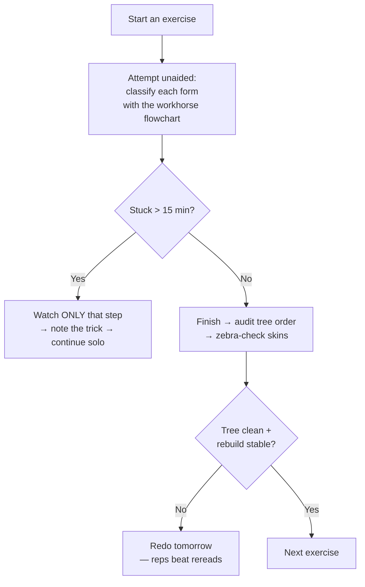

# Beginner Exercises (PL1 Drills + Numbered Ex 92–230)

## For future agent
First build-library page. Each exercise entry gives the feature recipe inferred from its title + the feature-combo vocabulary of the primers (TBC: full per-video verification awaits bulk transcripts post-429). Purpose: ordered practice reps that convert feature knowledge into speed. Video numbers below are PL1 playlist indices.

> **How to use this page:** model each exercise *before* peeking at any recipe — then compare. The gap between your approach and the recipe is the lesson. Redo any exercise where you needed more than two rebuild repairs.

---

## 1. Early drills (PL1 #19–#36 zone): first surfaces

- **#19 Surface tutorial for beginners + #9/#30 Basics of Surfacing:** the on-ramp — simple demo models covering the Surfaces tab layout. Model along, pausing after each feature to name it aloud (naming = retention).
- **#20 Bottle / #21 Jug / #22 Earphone:** first complete small products. Pattern per build: profile sketch → revolve/loft → trim openings → fillet. Bottles teach axisymmetric thinking; the earphone teaches small-scale fillet discipline (tiny radii fail first — see clinic).
- **#23 Beginner exercise 92:** treat as a timed rep — one sitting, no pauses, then audit your tree against [[part-assembly-drawing-workflow]] order (base → form → function → dress-up).
- **#28 Exercise 117 / #34 Exercise 146:** difficulty steps up; expect multi-feature sequences. If a step confuses you, the answer is in [[extrude-revolve-sweep]] or [[lofted-boss-boundary]], not in rewatching at 0.25×.
- **#36 Extruded Surface (Part 1):** the utility-feature primer — extruded sheets as patch material for later knit/thicken work ([[surfacing-utilities-troubleshooting]]).
- **#35 Thickened Cut + Cut With Surface:** surfaces as *tools* on solids — the concept that unlocks styled slots and parting cuts.

## 2. Combo exercises (the recipe titles)

These titles ARE the lesson plan — each lists its feature combo:

| Exercise | Combo recipe | Skills practiced |
|---|---|---|
| #37 Ex 154 | Extruded + Boundary + Trim + Loft surfaces | Multi-patch quilt assembly |
| #42 Ex 167 | Extruded + Lofted + Filled + Trim | Closure + trimming loop |
| #47 Swept + Trim + Thicken | Path-driven skins to solid | Sweep discipline, thicken test |
| #53 Ex 207 | Lofted + Trim + Filled | The classic triple |
| #57 Ex 230 | (advanced mix, TBC) | Full-pipeline rep |
| #58 Jug | Revolved + Swept + Trim | Multi-technique vessel + handle intersection (mutual trim) |

## 3. Self-check rubric (score each exercise /10)

- [ ] All sketches fully defined (2 pts — non-negotiable)
- [ ] Tree order: base → form → function → dress-up (2 pts)
- [ ] Named features (1 pt)
- [ ] Correct feature choice per form (2 pts — extrude where extrude fits)
- [ ] Surfaces (if any): knitted tight, thickened, zebra-checked (2 pts)
- [ ] One dimension changed → clean rebuild (1 pt)

**Real-world anchor:** this rubric is a hiring filter in miniature. CAD tests for internships score exactly these behaviors: defined sketches, editable trees, correct feature choice. The exercises are the gym; the rubric is the scoreboard.

## 4. Failure clinic (beginner-exercise edition)

| Symptom | Cause → Fix |
|---|---|
| Tiny fillets/chamfers fail on earphone-scale parts | Radius exceeds local geometry → apply small dress-ups before adjacent big ones; shrink radius |
| Exercise "works" but tree is 60 features of chaos | Mega-sketch + redundant features → redo with one-sketch-one-feature discipline |
| Dimensions differ from video but model looks same | Fine — dimensions are the YouTuber's choices; what matters is *fully defined + editable*, not matching numbers |
| Stuck on one step repeatedly | Missing prerequisite page, not missing talent → map the step to its feature page and drill there |

---

## 5. Recipe cards: Ex 154 / 167 / Swept-Trim-Thicken / 207 (step-by-step)

**Ex 154 (#37: Extruded + Boundary + Trim + Loft) — the quilt-assembly exam:**
1. Base patch: three-arc-style sketch → Extruded Surface, symmetric both directions (the PL1 #9 move — mid-plane thinking for surfaces).
2. Side patch: Boundary surface off the base edge with 2 profiles + 1 guide (Direction-2 control where the shape turns).
3. Crown patch: Lofted surface closing the top (2 profiles, connectors checked).
4. Mutual-trim all three where they overlap (overshoot deliberately in steps 1–3 — trim decides the final edges, not the patch sizes).
5. Fill any remaining corner holes → knit tight → thicken test. Score with §3 rubric; target 8+/10 before moving on.

**Ex 167 (#42: Extruded + Lofted + Filled + Trim) — the closure loop:**
1. Extruded side walls (2×, mirrored — half the work).
2. Lofted top skin between wall top edges (profiles = wall edge curves themselves — derive, don't redraw).
3. Filled end caps with Tangent continuity.
4. Trim bottom to the base plane → knit → thicken inward. The lesson: walls-first, skin-second, caps-last — an ordering that generalizes to every housing.

**Swept + Trim + Thicken (#47 pattern):**
1. Path sketch (the design gesture — spend half your time here; a fair path makes everything downstream easy).
2. 2–3 profiles along the path (start/mid/end sections) → Swept surface.
3. Trim ends to mounting planes → fill if open → knit → thicken. Path fairness decides quality — curvature-comb the path before surfacing, not after.

**Ex 207 (#53: Lofted + Trim + Filled) + Ex 230 (#57):** full-pipeline reps under time pressure — run the §2 flowchart strictly (unaided attempt → single-step help only when stuck 15+ min → audit). These two are graduation exams for the beginner tier: 9/10 on the rubric = ready for [[bottles-containers]].

---

## 6. The 4-week exercise arc (scope, not schedule)

- **Week A (solids fluency):** #19–#23 zone + Ex 92 — extrude/revolve/sweep only, rubric target 8/10. Failure mode to conquer: under-defined sketches (blue lines = redo).
- **Week B (first surfaces):** #28/#34/#36 + Ex 117/146 — extruded surfaces, first knit/thicken attempts. Failure mode: naked edges (extend/trim repair reps).
- **Week C (combos):** Ex 154/167 + #47-pattern + #58 jug — multi-patch quilts, mutual trims. Failure mode: connector twists + trim-keep/remove flips.
- **Week D (graduation):** Ex 207 + Ex 230 timed (single sitting each, no pauses) — full pipeline under pressure. 9/10 = product-family ready.

**Timing discipline (the honest version):** untimed practice builds understanding; TIMED reps build speed; only timed reps reveal which skills are actually automatic. Alternate: learn untimed → drill timed → audit → repeat. An exercise you can only finish by pausing the video every 30 seconds isn't learned yet — it's transcribed. Redo it solo within the week.

**Log template per exercise (daily note, 5 lines):** time taken · rubric score · feature-choice audit (any wrong picks?) · one failure + fix · one trick worth keeping. Ten exercises logged this way = a personal textbook no playlist can give you.

**Next:** [[bottles-containers]] (first product family).

## CROSS-REFERENCES
- [[INDEX]] · [[extrude-revolve-sweep]] · [[dressup-productivity]] · [[bottles-containers]] · [[solidworks-cheatsheet]]
