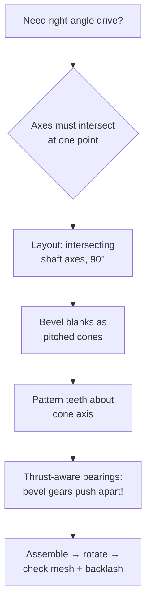
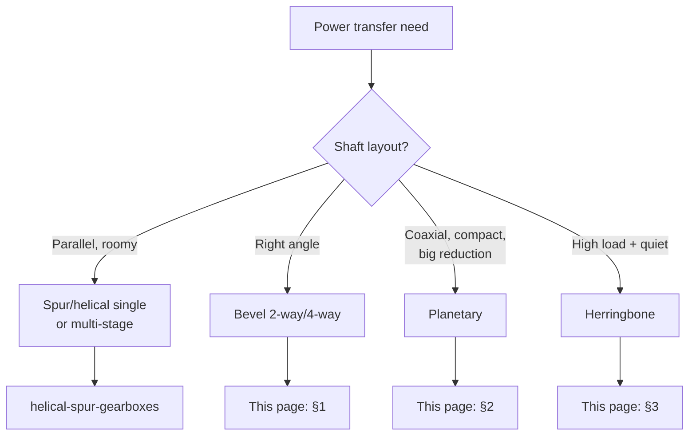

# Bevel & Planetary Gearboxes (Turning Corners, Going Coaxial)

## For future agent
PL2 build page. Videos: #18 two-way bevel #343 · #35 four-way bevel #349 · #12/#51 single-stage planetary #342 · #23/#44 planetary #347 · #36 four-planet spur #345 · #20 helical planetary #386 · #25/#40 herringbone #357. Per-video geometry TBC vs bulk transcripts. Bevel/planetary theory below is standard machine-design (textbook-stable).

> **Why these two families share a page:** both solve "parallel shafts won't fit the machine" — bevel turns power around corners, planetary folds big reductions into a coaxial can. Different math, same design question: how does power get from here to there in the available space?

---

## 1. Bevel boxes (right-angle power)

**Two-way #343 (#18):** input shaft + one output at 90° — two bevel gears meshing on intersecting axes. CAD keys: gear blanks are *cones* (revolve a triangular-ish profile at the pitch-cone angle — TBC exact angle construction per video), teeth patterned about the cone axis, shafts intersecting at exactly 90° in the layout sketch.

**Four-way #349 (#35):** one input driving three outputs (or reverse) — differential-style cross of bevel gears. The assembly puzzle: all axes must intersect at ONE point, and the housing must still split assemblably. Carrier/cross-pin parts appear (TBC per video).

**Real-world anchor:** bevel gears generate separating forces (they try to push each other apart along the axes) — bearings must trap the shafts axially, and the housing takes the spread load. A bevel box modeled without axial trapping is a grenade, not a gearbox. Mitre vs spiral-bevel tooth forms change noise/load behavior (awareness — TBC depth for this track).

## 2. Planetary sets (coaxial reduction)

**Anatomy:** central **sun** + 3–4 **planets** on a rotating **carrier** + outer **ring (annulus)**. Fix different members → different ratios from one hardware set (that's the magic: sun-in/carrier-out vs ring-fixed gives different reductions — TBC exact ratio formulas per configuration; the standard Willis equation governs).

**PL2 builds:** #342 single-stage (#12), #347 (#23), #345 four-planet spur (#36), #386 helical planetary (#20).

**CAD keys:**
- Planets MUST be identical and equally spaced (circular pattern the planet+pin sub-assembly, 3–4 instances).
- Ring gear = internal teeth (cut *into* a ring bore — inverse of external gear modeling; TBC exact video method).
- Carrier plate with planet pins — the part beginners forget; without it planets have no axes.
- Assembly: concentric everything on ONE axis; gear mates sun↔planet and planet↔ring with correct ratios (TBC per video).

## 3. Herringbone #357 (#25): the premium mesh

Double-helical V teeth cancel axial thrust internally — no thrust bearings needed, at the cost of manufacturing complexity (historically hard to cut; modern methods easier — awareness). CAD: mirror a helical tooth-cut to form the V. The modeling lesson is symmetry-as-function: the mirror isn't aesthetic, it *is* the thrust cancellation.

## 4. Decision map (all PL2 gearboxes)

## 5. Failure clinic

| Symptom | Cause → Fix |
|---|---|
| Bevel teeth clash or float | Axes don't intersect at one point OR cone angles wrong → fix layout sketch first, rebuild blanks |
| Planetary won't assemble | Planet spacing/count vs ring teeth mismatch → equal spacing + identical planets; recheck internal-mesh geometry |
| Box locks when rotated | No backlash modeled (perfect mesh = jammed mesh) → back off mesh slightly / verify tooth clearance (TBC values = manufacturing data) |
| Carrier missing | Planets floating → model carrier plate + pins before assembly |

---

## 6. Worked example: 3-planet set with numbers + Willis awareness

**Teeth (the assembly condition for equally-spaced planets):** $(z_{sun} + z_{ring}) / \text{planets}$ must be an integer (TBC: confirm with planetary-design references — the rule prevents half-tooth misalignment). Pick sun 24, ring 72 → (24+72)/3 = 32 ✓ integer. Planets: $(72-24)/2 = 24$ teeth each.
**Module 1.5 (compact learning size — TBC per build):** sun pitch Ø36, planet Ø36, ring pitch Ø108 (internal). All three share the module — planetary sets MUST (meshing gears share module, always).
**Parts:** sun (external, + input shaft) → 3× identical planet (bore + needle/pin fit — TBC per size) → planet pins pressed in carrier plate (carrier = two cheek plates + pins, the forgotten part) → ring (internal teeth cut into a bored ring + flange + housing register) → input/output arrangement: ring FIXED to housing, sun IN, carrier OUT (the classic reduction layout — TBC: other fixings give other ratios).
**Willis equation (awareness, the ratio machine):** $(n_s - n_c)/(n_r - n_c) = -z_r/z_s$ — plug ring-fixed ($n_r = 0$): ratio sun→carrier = $1 + z_r/z_s = 1 + 72/24 = 4$. One equation, whole family (fix carrier instead → different ratio from identical hardware — TBC: work all three fixings on paper once; it's the cheapest deep understanding in machine design).
**CAD assembly order:** ring fixed to housing first → carrier + pins → planets onto pins (concentric) → sun last down the middle → gear mates sun↔planet (24:24 = 1:1 spin, opposite) + planet↔ring (internal mate — TBC exact mate setup per version; verify rotation directions by hand) → rotate sun: carrier crawls at ¼ speed. If it binds: backlash (perfect internal mesh jams — back planets off a hair radially? TBC: confirm proper internal-mesh clearance practice, don't guess large).

**Bevel-blank appendix (#343-class numbers):** 90° shafts, 20/30 teeth, module 2 → pitch cones at $\arctan(20/30) ≈ 33.7°$ / $56.3°$ (TBC: confirm bevel-geometry references — pitch-cone angles sum to shaft angle). Blank = revolve of the cone-frustum profile (back cone included at this level? TBC depth — note it, move on) → teeth patterned about each cone axis → layout sketch with INTERSECTING axes (the single non-negotiable) → thrust shoulders BOTH sides (separating forces!).

**Verify in-app:** assemble a single-stage planetary (sun + 3 planets + carrier + ring), gear-mate it, rotate the sun and confirm carrier output is slower. If it moves correctly, you understand planetary; if not, the ratio/mate is the bug, never the geometry.

**Next:** [[shredders-recycling-machines]].

---

## 10. Tooth-contact + lapping appendix (mesh quality you can see — TBC per gear references)

**Contact-pattern reading (the senior tech's eye — TBC: confirm with gear-setup references, NOT this page):** marking compound on 3–4 teeth → rotate under LIGHT load → read the wipe: centered-oval (correct! — load spreads mid-face!) → heel-biased (contact toward outer cone end — pinion needs axial shift per setup tables, TBC!) → toe-biased (toward inner — shift opposite!) → face/flank bias (angular misalignment — housing bores suspect, NOT the gears! — the §8-housing-seat lesson restated as diagnostics!) → CAD consequence: NONE in geometry (patterns are setup, not shape!) — but the DRAWING carries setup data (backlash range + pattern acceptance sketch + shim schedule per §8-lash! — setup travels with hardware!).

**Lapping + running-in (mated-for-life finishing — TBC per gear-finishing practice):** lapping compound + low-speed loaded rotation (mild abrasive beds the flanks together — TBC per process!) → matched SETS serialized (lapped pairs stay paired — punch-mark + record! — TBC per shop!) → run-in oil changes EARLY (wear debris from bedding must leave — first change at hours, not months! — TBC per commissioning!) → CAD consequence: serialization CALLOUTS (matched-set marking notes on the drawing — logistics as engineering!) + run-in procedure referenced (the manual travels with the BOM per §9-commissioning habit!).

**Quiet-mesh design levers (ranked by effect — TBC: confirm with NVH references):** precision grade first (the §12-high-speed lesson: coarse + fast = hammer!) → contact ratio second (more teeth sharing = smoother handoff — helical + fine pitch help — TBC per geometry!) → profile modification third (tip relief for deflection under load — TBC depth: modification charts exist, confirm with gear references!) → housing stiffness fourth (the §11-NVH lesson: ringing housings amplify!) → damping treatments fifth (constrained-layer panels? — TBC per application!) → CAD consequence: grade + ratio + modification CALLOUTS on gear drawings (quiet specified, not hoped!).

---

## 9. Slewing + winch + hoist appendix (planetary/bevel at work in the world)

**Slewing drives (excavator/crane rotation — TBC: confirm with slewing-bearing references, NOT this page):** planetary + output pinion driving a large slew ring (ratios 50–200:1 multi-stage — TBC per drive) → moment + axial + radial COMBINED bearing duty (slew rings are bearing+gear hybrids — TBC per catalog!) → brake holding (spring-applied, pressure-released parking brakes — TBC per safety; gravity + wind back-drive unbraked slews!) → CAD consequence: interface flanges BOTH sides (machine + superstructure datum faces — TBC per mounting) + seal discipline (outdoor vertical-axis sealing against rain/dust ingress — TBC!).

**Winch/hoist gearing (lifting duty — TBC: confirm with hoist standards like FEM/ISO, NOT this page):** planetary-in-drum compactness (gearbox INSIDE the rope drum — space genius!) → multi-disc brakes on the high-speed shaft (TBC per fail-safe practice: brakes hold the LOAD side of the ratio — holding the fast shaft multiplies brake effectiveness by the ratio!) → rope-drum groove geometry (groove radius vs rope diameter + fleet angle limits — TBC per reeving practice!) → CAD consequence: brake + drum + gearbox as ONE envelope-checked assembly (heat from braking near seals/lube — TBC per layout!).

**Conveyor/bucket-wheel scale-up (the §9-conveyor world driven right):** shaft-mounted planetary with torque arm (the §10-mounting lesson at megawatt scale — TBC per mining practice!) → backstops on incline head shafts (anti-rollback per §6-conveyor-incline, industrial grade — TBC per device!) → fluid couplings for soft-start of loaded belts (the §9-transmission lesson restated at scale!) → CAD consequence: drive + take-up + structure as INTERFACE-managed modules (the §11-large-assembly modularity habit — mining conveyors are PLANTS, and plants need module boundaries!).

---

## 8. Differential + corner-box applications (bevel gears earning their keep)

**Automotive differential (the bevel masterpiece — awareness, TBC depth):** pinion drives crown wheel (hypoid-ish offset in reality — TBC: confirm with drivetrain references; model as bevel pair at learning level) → spider/side-gear bevel SET inside the carrier (straight bevels on intersecting axes — the §1 two-way generalized to a GEAR CLUSTER) → carrier rotates with the crown, spiders differentiate wheel speeds (the mechanism that lets cars corner — TBC: confirm with vehicle-dynamics references for the full story) → CAD consequence: FIVE+ bevel gears on FOUR intersecting axes in one carrier (the assembly-tolerance nightmare that justifies the §5-intersection rule absolutely — one axis off and nothing turns).

**Right-angle corner boxes (industrial #343-grown-up):** servo motor + right-angle reducer in one housing (compact automation axes — TBC per vendor catalogs) → hollow-shaft variants (cables/hoses pass THROUGH the gearbox — TBC per application; model the through-bore + seals both faces!) → high-ratio corner boxes (bevel FIRST stage for the turn + planetary/inline stages behind — hybrid architectures per §4-decision-map: turn THEN reduce) → mounting orientation freedom (any-face mounting with breather relocation per orientation — TBC per vendor; oil finds the lowest seal — breather/drain positions follow gravity, not the catalog photo!).

**Miter vs spiral bevel (the noise/load fork — TBC: confirm with gear references, NOT this page):** straight/miter teeth (cheap, noisy, impact-loaded — farm/utility duty) → spiral teeth (progressive contact, quiet, stronger — automotive/premium) → hypoid (offset axes, sliding contact, needs EP lube + specific materials — TBC depth) → CAD consequence at learning level: identical blanks, different tooth-cut patterns (straight cuts vs angled sweeps — the spur-vs-helical lesson from [[helical-spur-gearboxes]] §5 rotated 90°).

**Lash adjustment hardware (bevels need setup, not just assembly):** shims under bearing cups (mesh position tuned by shim stacks — TBC per practice: backlash AND contact pattern dialed by moving pinion vs gear axially) → threaded adjusters with locknuts (field-serviceable lash — TBC per design) → marking-compound check (paint the teeth, rotate, READ the pattern: heel/toe/face/flank bias tells you which way to shim — TBC: confirm with gear-setup references; the pattern-reading skill is the senior tech's signature) → model the shim PACKS (not single shims — stacks of 0.05/0.1/0.2 — TBC illustrative) + document the setup procedure ON the drawing (setup data travels with hardware, not in someone's head).

---

## 7. Planetary deep dive: ratios for all fixings + build script (the full mastery)

**All three fixings, one hardware set (sun 24 / planets 24×3 / ring 72, per §6):**

| Fixed member | Input → Output | Ratio (Willis) | Character |
|---|---|---|---|
| Ring fixed | Sun → Carrier | $1 + z_r/z_s$ = 1+3 = **4:1** | The classic reducer (PL2 default assumption — TBC per video) |
| Carrier fixed | Sun → Ring | $-z_r/z_s$ = **−3:1** (reversed!) | Fixed-axis gearbox in a can (reverse sign = output flips) |
| Sun fixed | Ring → Carrier | $1 + z_s/z_r$ = 1+1/3 = **1.33:1** | Overdrive-ish low reduction (rare as reducer — TBC per application) |

Derivation sketch (do once on paper): Willis $(n_s-n_c)/(n_r-n_c) = -z_r/z_s$ → set the fixed member's speed to 0, solve. Three substitutions, three ratios, permanent understanding. (TBC: verify sign conventions with a machine-design text — sign errors reverse outputs!)

**Full CAD build script (ring-fixed 4:1):**
1. Layout sketch: single axis + three pitch circles (Ø36 sun / Ø36 planets on Ø72 PCD / Ø108 ring ID — all module 1.5, per §6) + planet positions at 0/120/270°... 0/120/240° (equal spacing + assembly condition $(24+72)/3=32$ ✓ from §6).
2. Sun + input shaft (one part: gear + shaft + keyway — input side) → planets ×1 modeled (bore for pin + caged-needle envelope? plain bore at learning level — TBC per size/speed) → circular-pattern ×3 IN ASSEMBLY (not in the part — planets are separate physical pieces!).
3. Carrier: two cheek plates + 3 pressed pins (interference envelopes — model pin OD = planet bore + 0.02 press (TBC: confirm press-fit tables, NOT this page) → pins located by the SAME layout sketch (single source of truth — move a planet position once, carrier + assembly follow).
4. Ring: bored ring + INTERNAL teeth (cut INTO the bore: sketch one internal tooth gap → circular pattern ×72 — TBC exact video method; internal cuts need the gap profile mirrored vs external) + outer flange + housing register + anti-rotation key/tab (ring must NOT spin in the fixed arrangement — the forgotten constraint!).
5. Housing: cup + cover sandwiching the set (sun shaft exits one side with seal, carrier output flange exits the other) → assembly order: ring→housing, carrier+pins, planets onto pins, sun down the middle (the §5 order restated with parts named).
6. Mates: everything concentric on the main axis → sun↔planet gear mates (1:1 opposite) → planet↔ring internal mates (TBC exact mate setup per version — verify DIRECTIONS by hand-rotation) → drag sun: carrier crawls at ¼ speed FORWARD (same direction — ring-fixed gives same-direction reduction; carrier-fixed would reverse — the sign lesson made physical).

**Helical planetary appendix (#386-class):** same architecture, helix-angle tooth cuts (15–20° starting point per [[helical-spur-gearboxes]] §5) → planets need thrust control (planet pins get thrust washers both sides — TBC per size) → carrier cheeks trap axially → noticeably quieter + stronger, measurably harder to assemble (helix hands must match: all planets same hand, sun/ring opposite — TBC: confirm helix-hand rules with gear references; wrong hands = expensive paperweight).

**Four-planet variant (#345-class):** assembly condition recheck: $(24+72)/4 = 24$ ✓ integer (with THESE teeth — recompute per YOUR counts, never assume) → carrier with 4 pins at 90° → load shares 4 ways (smaller planets possible for same torque — TBC: confirm load-sharing derating with gear references; planets never share perfectly) → tighter assembly (more pieces in the same can — sequence matters more).

**Herringbone build notes (#357-class, expanded):** V-tooth = right-hand helical cut + mirrored left-hand cut meeting at center groove (groove for tool runout — TBC: confirm herringbone-manufacturing practice; the center gap isn't styling) → model ONE hand's cuts patterned, mirror across mid-plane, verify the apex alignment (misaligned apexes = noise + uneven load — the failure mode) → no thrust hardware anywhere (the V cancels internally — confirm by the ABSENCE of thrust washers vs the helical build; the comparison teaches the principle).

## CROSS-REFERENCES
- [[INDEX]] · [[gearbox-fundamentals]] · [[helical-spur-gearboxes]] · [[shredders-recycling-machines]] · [[flowcharts-master]]
