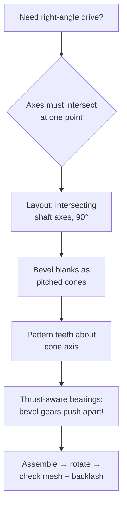
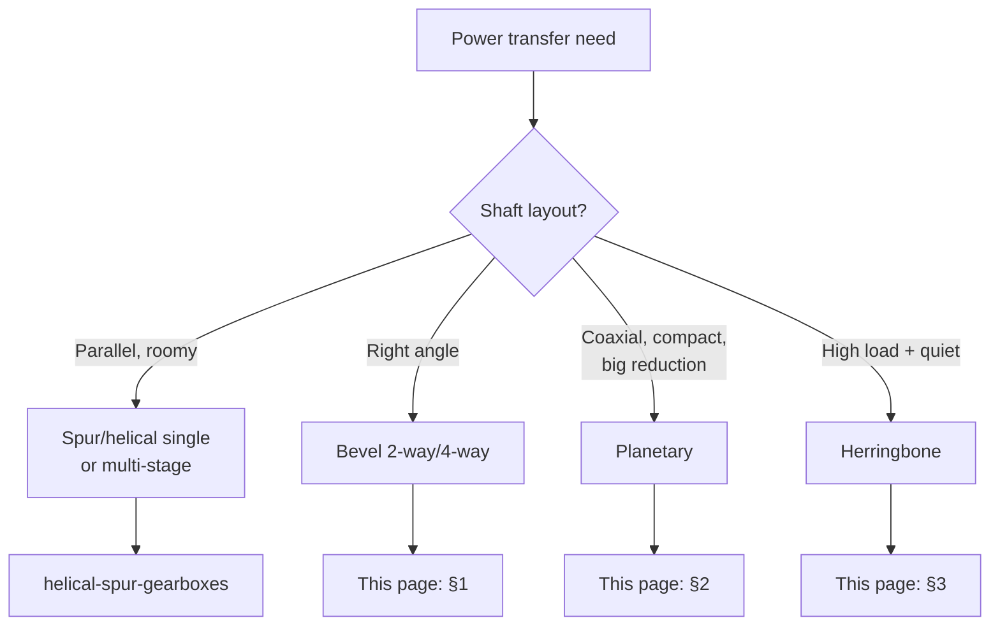

# Bevel & Planetary Gearboxes (Turning Corners, Going Coaxial)

## For future agent
PL2 build page. Videos: #18 two-way bevel #343 · #35 four-way bevel #349 · #12/#51 single-stage planetary #342 · #23/#44 planetary #347 · #36 four-planet spur #345 · #20 helical planetary #386 · #25/#40 herringbone #357. Per-video geometry TBC vs bulk transcripts. Bevel/planetary theory below is standard machine-design (textbook-stable).

> **Why these two families share a page:** both solve "parallel shafts won't fit the machine" — bevel turns power around corners, planetary folds big reductions into a coaxial can. Different math, same design question: how does power get from here to there in the available space?

---

## 1. Bevel boxes (right-angle power)

**Two-way #343 (#18):** input shaft + one output at 90° — two bevel gears meshing on intersecting axes. CAD keys: gear blanks are *cones* (revolve a triangular-ish profile at the pitch-cone angle — TBC exact angle construction per video), teeth patterned about the cone axis, shafts intersecting at exactly 90° in the layout sketch.

**Four-way #349 (#35):** one input driving three outputs (or reverse) — differential-style cross of bevel gears. The assembly puzzle: all axes must intersect at ONE point, and the housing must still split assemblably. Carrier/cross-pin parts appear (TBC per video).

**Real-world anchor:** bevel gears generate separating forces (they try to push each other apart along the axes) — bearings must trap the shafts axially, and the housing takes the spread load. A bevel box modeled without axial trapping is a grenade, not a gearbox. Mitre vs spiral-bevel tooth forms change noise/load behavior (awareness — TBC depth for this track).

## 2. Planetary sets (coaxial reduction)

**Anatomy:** central **sun** + 3–4 **planets** on a rotating **carrier** + outer **ring (annulus)**. Fix different members → different ratios from one hardware set (that's the magic: sun-in/carrier-out vs ring-fixed gives different reductions — TBC exact ratio formulas per configuration; the standard Willis equation governs).

**PL2 builds:** #342 single-stage (#12), #347 (#23), #345 four-planet spur (#36), #386 helical planetary (#20).

**CAD keys:**
- Planets MUST be identical and equally spaced (circular pattern the planet+pin sub-assembly, 3–4 instances).
- Ring gear = internal teeth (cut *into* a ring bore — inverse of external gear modeling; TBC exact video method).
- Carrier plate with planet pins — the part beginners forget; without it planets have no axes.
- Assembly: concentric everything on ONE axis; gear mates sun↔planet and planet↔ring with correct ratios (TBC per video).

## 3. Herringbone #357 (#25): the premium mesh

Double-helical V teeth cancel axial thrust internally — no thrust bearings needed, at the cost of manufacturing complexity (historically hard to cut; modern methods easier — awareness). CAD: mirror a helical tooth-cut to form the V. The modeling lesson is symmetry-as-function: the mirror isn't aesthetic, it *is* the thrust cancellation.

## 4. Decision map (all PL2 gearboxes)

## 5. Failure clinic

| Symptom | Cause → Fix |
|---|---|
| Bevel teeth clash or float | Axes don't intersect at one point OR cone angles wrong → fix layout sketch first, rebuild blanks |
| Planetary won't assemble | Planet spacing/count vs ring teeth mismatch → equal spacing + identical planets; recheck internal-mesh geometry |
| Box locks when rotated | No backlash modeled (perfect mesh = jammed mesh) → back off mesh slightly / verify tooth clearance (TBC values = manufacturing data) |
| Carrier missing | Planets floating → model carrier plate + pins before assembly |

---

## 6. Worked example: 3-planet set with numbers + Willis awareness

**Teeth (the assembly condition for equally-spaced planets):** $(z_{sun} + z_{ring}) / \text{planets}$ must be an integer (TBC: confirm with planetary-design references — the rule prevents half-tooth misalignment). Pick sun 24, ring 72 → (24+72)/3 = 32 ✓ integer. Planets: $(72-24)/2 = 24$ teeth each.
**Module 1.5 (compact learning size — TBC per build):** sun pitch Ø36, planet Ø36, ring pitch Ø108 (internal). All three share the module — planetary sets MUST (meshing gears share module, always).
**Parts:** sun (external, + input shaft) → 3× identical planet (bore + needle/pin fit — TBC per size) → planet pins pressed in carrier plate (carrier = two cheek plates + pins, the forgotten part) → ring (internal teeth cut into a bored ring + flange + housing register) → input/output arrangement: ring FIXED to housing, sun IN, carrier OUT (the classic reduction layout — TBC: other fixings give other ratios).
**Willis equation (awareness, the ratio machine):** $(n_s - n_c)/(n_r - n_c) = -z_r/z_s$ — plug ring-fixed ($n_r = 0$): ratio sun→carrier = $1 + z_r/z_s = 1 + 72/24 = 4$. One equation, whole family (fix carrier instead → different ratio from identical hardware — TBC: work all three fixings on paper once; it's the cheapest deep understanding in machine design).
**CAD assembly order:** ring fixed to housing first → carrier + pins → planets onto pins (concentric) → sun last down the middle → gear mates sun↔planet (24:24 = 1:1 spin, opposite) + planet↔ring (internal mate — TBC exact mate setup per version; verify rotation directions by hand) → rotate sun: carrier crawls at ¼ speed. If it binds: backlash (perfect internal mesh jams — back planets off a hair radially? TBC: confirm proper internal-mesh clearance practice, don't guess large).

**Bevel-blank appendix (#343-class numbers):** 90° shafts, 20/30 teeth, module 2 → pitch cones at $\arctan(20/30) ≈ 33.7°$ / $56.3°$ (TBC: confirm bevel-geometry references — pitch-cone angles sum to shaft angle). Blank = revolve of the cone-frustum profile (back cone included at this level? TBC depth — note it, move on) → teeth patterned about each cone axis → layout sketch with INTERSECTING axes (the single non-negotiable) → thrust shoulders BOTH sides (separating forces!).

**Verify in-app:** assemble a single-stage planetary (sun + 3 planets + carrier + ring), gear-mate it, rotate the sun and confirm carrier output is slower. If it moves correctly, you understand planetary; if not, the ratio/mate is the bug, never the geometry.

**Next:** [[shredders-recycling-machines]].

## CROSS-REFERENCES
- [[INDEX]] · [[gearbox-fundamentals]] · [[helical-spur-gearboxes]] · [[shredders-recycling-machines]] · [[flowcharts-master]]
