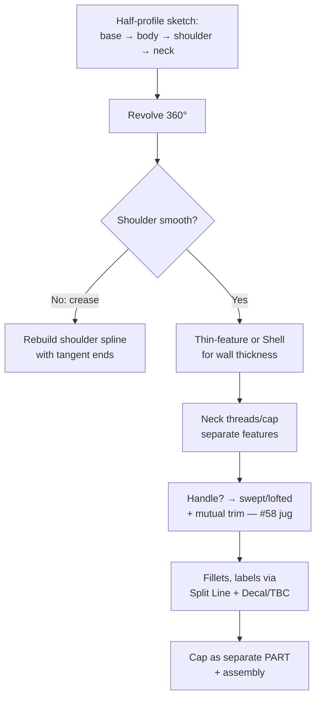

# Bottles, Jugs, Vases & Containers

## For future agent
PL1 product-family page. Vessel builds recur across the playlist (#20/#33/#40/#41 bottle variants, #21/#58 jugs, #69 vase, #80 perfume, #95 angle-neck, #27 bottle assembly, #52 bottle+cap). Recipes below follow the revolve-first vessel pattern standard to this genre (TBC per-video against bulk transcripts). Manufacturing notes are general packaging-CAD knowledge, flagged where shop-specific.

> **Why vessels first:** bottles are the kindest surfacing teacher — mostly axisymmetric (revolve does the heavy lifting), one hard part (the shoulder transition), and instant real-world feedback (you've held a thousand bottles; your eye already knows what's wrong).

---

## 1. The vessel workflow (memorize this)

**Profile anatomy (the four zones):** base (punt/dome for stability + mold release) → body (straight or gently curved — label panel flats go here) → shoulder (the money curve: tangent-continuous spline, never an arc-arc kink) → neck/finish (the standardized mouth the cap grips — model to cap spec, not by eye).

## 2. Playlist build map

| Build | Key technique (TBC per-video) | Lesson |
|---|---|---|
| #20 Bottle, #33/#40 Bottle variants | Revolve + shell + neck | Axisymmetric basics; compare variants to see design range from one workflow |
| #21 Jug, #41 Jug, #58 Jug (Revolved+Swept+Trim) | Body revolve + swept handle + mutual trim | Intersecting bodies: overshoot handle into body, mutual-trim, fillet the joint |
| #69 Vase, #100 Art vase (sketch picture) | Lofted/revolved organic profile; image-trace for art vase | Shoulder freedom; reverse-engineering via [[sketch-mastery#6-sketch-picture-reverse-engineering-on-ramp]] |
| #80 Perfume bottle | Small-scale precision + cap | Luxury packaging: tight tolerances, thick glass walls |
| #85 Plastic bottle, #95 Angle-neck bottle | Non-vertical necks, molded features | Angled axes: sketch planes at angles; draft for molding |
| #27 Bottle Assembly, #52 Bottle + Cap | Multi-part: vessel + cap + label | First assemblies: concentric + coincident mates, thread representation |

## 3. Caps, closures & threads (the assembly half)

- Model the cap as a **separate part** (it IS manufactured separately) — knurled grip via patterned cuts or cosmetic texture (TBC: knurl modeling varies; cosmetic appearance often suffices).
- Threads: **modeled threads** (helix + sweep-cut) for close-ups and 3D prints; **cosmetic threads** (Thread feature/decal callout) for drawings and performance. A bottle mouth with no thread callout is an unmanufacturable model — the drawing needs the spec (e.g., 28-400 finish — TBC: confirm standard with packaging references, not this page).
- Cap–neck fit: clearance for the seal + engagement length; verify with section view + interference detection in the assembly.

## 4. Packaging DFM (why factories will love/hate your model)

- **Draft:** all vertical walls need mold-release taper (1–3° typical, TBC per molder) — straight-walled bottle bodies without draft don't eject.
- **Uniform walls:** hollow vessels via thin-revolve or shell at even thickness; thick-to-thin transitions sink and warp in cooling.
- **Parting line placement:** put it where the mold halves meet sensibly (usually the silhouette edge) — split-line control from [[dressup-productivity]].
- **Label panels:** flat-ish zones dimensioned for the label size; recess them slightly (TBC: ~0.2–0.5 mm typical) so labels sit flush.

## 5. Failure clinic

| Symptom | Cause → Fix |
|---|---|
| Shoulder crease visible | Arc joints without tangency → single spline with tangent ends, curvature-comb it |
| Shell/thin-feature fails at shoulder | Wall thicker than local curvature → fair the curve or thin the wall |
| Handle joint looks glued-on | No mutual trim + fillet → intersect, trim, tangent-constrain, fillet the seam |
| Cap won't assemble | Thread/mouth mismatch → model cap FROM the neck dimensions (in-context), section-check |

---

## 6. Worked example: 500 ml-style bottle + screw cap (full numbers)

Dimensions illustrative (model YOUR real bottle with calipers for the full lesson — TBC: numbers below are practice values, not a standard).

**Vessel:**
1. Front Plane → half-profile per [[sketch-mastery#9-worked-example]]: base radius 33, body straight 120, shoulder spline to neck radius 14, total height 190, neck straight 25. Tangent spline ends, fully defined, axis-touching closed profile.
2. Revolve 360 → thin-feature revolve, wall 2 outward? No — **inward** (outer styling exact): 2 mm.
3. Base punt: revolve the bottom 8 mm upward as a dome (separate revolve feature merged — punt = stability + mold behavior, TBC depth) + 1 mm base fillet.
4. Shoulder check: curvature-comb the spline BEFORE revolving (fix wiggles in 2D, not in 3D).

**Threads (modeled, learning-grade):**
1. Helix/Spiral curve on the neck OD: pitch 3 (3 mm per turn — TBC: illustrative), 3 turns, starting at neck top.
2. Thread profile: small triangle (1.2 base × 1 high — TBC illustrative) sketched on a plane through the axis, positioned at helix start with Pierce relation.
3. Swept Cut along the helix → external thread. Start/end runouts will look abrupt (real threads fade — TBC: cosmetic fade is advanced; note it, move on).

**Cap (separate part, in-context from neck):**
1. Revolve cap shell: inner Ø = neck OD + 1 clearance diametral (TBC: confirm per closure design — illustrative), height covering threads + 5 tamper band.
2. Internal thread: same helix method, mirrored (internal cut into cap ID — TBC exact video method; internal sweeps need the profile flipped).
3. Knurl: cosmetic appearance at this level (modeled knurls = pattern-count pain for zero learning — TBC taste) + top deboss via split line.
4. Assembly: concentric + coincident (cap mouth to neck datum) → section view: threads interleave with clearance? Interference detection must show ZERO solid overlap (threads kiss, never intersect).

**Angle-neck variant (#95) drill:** tilt the neck straight 15° (new angled plane → rebuild neck+threads+cap on it). What breaks: revolve axis assumption, thread helix plane, cap mates. Fixing all three teaches why angled axes get their own planes from the start.

**Verify in-app:** build vessel + cap + assembly + section + interference. Then caliper-measure a real bottle and remodel to ITS numbers — the second build takes half the time and teaches 3× (measurement + standards-awareness + speed).

**Next:** [[consumer-electronics]].

---

## 7. Jug-handle engineering appendix (#58-class deep pass)

Handles carry full vessels by a curved arm — the highest-loaded plastic on the product. Design sequence:

1. **Attachment FIRST:** upper attach (neck/shoulder, thick zone) + lower attach (body sidewall) — both land on STIFF regions, never mid-panel (flexing panels pump the joint to failure — TBC: confirm with packaging references).
2. **Grip section:** oval 25×18 clear of the body by ≥25 finger clearance (TBC illustrative) — hand must pass without knuckle rub.
3. **Build:** swept/lofted surface along the handle path → mutual-trim BOTH ends into the body (overshoot generously) → thicken with the body (one continuous wall if same thickness — TBC per design) → fillet seams 3+ (stress + comfort).
4. **Load sanity:** full vessel weight hangs on two joints — section the joints (wall continuity? voids?) + oversized fillets + rib gussets inside where invisible (TBC per product). Handles that rip off in reviews failed here, not in styling.

**Finger-clearance rule restated generally:** every handle on every product needs a clearance volume check (fist envelope vs body) — model a simple fist block (TBC: 90×40×40 illustrative) and interference-check it against the body at the grip position. Five minutes, catches the #1 handle complaint.

## CROSS-REFERENCES
- [[INDEX]] · [[beginner-exercises]] · [[consumer-electronics]] · [[extrude-revolve-sweep]] · [[filled-knit-trim-thicken]]
