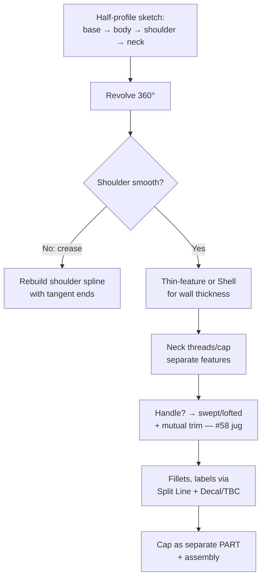

# Bottles, Jugs, Vases & Containers

## For future agent
PL1 product-family page. Vessel builds recur across the playlist (#20/#33/#40/#41 bottle variants, #21/#58 jugs, #69 vase, #80 perfume, #95 angle-neck, #27 bottle assembly, #52 bottle+cap). Recipes below follow the revolve-first vessel pattern standard to this genre (TBC per-video against bulk transcripts). Manufacturing notes are general packaging-CAD knowledge, flagged where shop-specific.

> **Why vessels first:** bottles are the kindest surfacing teacher — mostly axisymmetric (revolve does the heavy lifting), one hard part (the shoulder transition), and instant real-world feedback (you've held a thousand bottles; your eye already knows what's wrong).

---

## 1. The vessel workflow (memorize this)

**Profile anatomy (the four zones):** base (punt/dome for stability + mold release) → body (straight or gently curved — label panel flats go here) → shoulder (the money curve: tangent-continuous spline, never an arc-arc kink) → neck/finish (the standardized mouth the cap grips — model to cap spec, not by eye).

## 2. Playlist build map

| Build | Key technique (TBC per-video) | Lesson |
|---|---|---|
| #20 Bottle, #33/#40 Bottle variants | Revolve + shell + neck | Axisymmetric basics; compare variants to see design range from one workflow |
| #21 Jug, #41 Jug, #58 Jug (Revolved+Swept+Trim) | Body revolve + swept handle + mutual trim | Intersecting bodies: overshoot handle into body, mutual-trim, fillet the joint |
| #69 Vase, #100 Art vase (sketch picture) | Lofted/revolved organic profile; image-trace for art vase | Shoulder freedom; reverse-engineering via [[sketch-mastery#6-sketch-picture-reverse-engineering-on-ramp]] |
| #80 Perfume bottle | Small-scale precision + cap | Luxury packaging: tight tolerances, thick glass walls |
| #85 Plastic bottle, #95 Angle-neck bottle | Non-vertical necks, molded features | Angled axes: sketch planes at angles; draft for molding |
| #27 Bottle Assembly, #52 Bottle + Cap | Multi-part: vessel + cap + label | First assemblies: concentric + coincident mates, thread representation |

## 3. Caps, closures & threads (the assembly half)

- Model the cap as a **separate part** (it IS manufactured separately) — knurled grip via patterned cuts or cosmetic texture (TBC: knurl modeling varies; cosmetic appearance often suffices).
- Threads: **modeled threads** (helix + sweep-cut) for close-ups and 3D prints; **cosmetic threads** (Thread feature/decal callout) for drawings and performance. A bottle mouth with no thread callout is an unmanufacturable model — the drawing needs the spec (e.g., 28-400 finish — TBC: confirm standard with packaging references, not this page).
- Cap–neck fit: clearance for the seal + engagement length; verify with section view + interference detection in the assembly.

## 4. Packaging DFM (why factories will love/hate your model)

- **Draft:** all vertical walls need mold-release taper (1–3° typical, TBC per molder) — straight-walled bottle bodies without draft don't eject.
- **Uniform walls:** hollow vessels via thin-revolve or shell at even thickness; thick-to-thin transitions sink and warp in cooling.
- **Parting line placement:** put it where the mold halves meet sensibly (usually the silhouette edge) — split-line control from [[dressup-productivity]].
- **Label panels:** flat-ish zones dimensioned for the label size; recess them slightly (TBC: ~0.2–0.5 mm typical) so labels sit flush.

## 5. Failure clinic

| Symptom | Cause → Fix |
|---|---|
| Shoulder crease visible | Arc joints without tangency → single spline with tangent ends, curvature-comb it |
| Shell/thin-feature fails at shoulder | Wall thicker than local curvature → fair the curve or thin the wall |
| Handle joint looks glued-on | No mutual trim + fillet → intersect, trim, tangent-constrain, fillet the seam |
| Cap won't assemble | Thread/mouth mismatch → model cap FROM the neck dimensions (in-context), section-check |

---

## 6. Worked example: 500 ml-style bottle + screw cap (full numbers)

Dimensions illustrative (model YOUR real bottle with calipers for the full lesson — TBC: numbers below are practice values, not a standard).

**Vessel:**
1. Front Plane → half-profile per [[sketch-mastery#9-worked-example]]: base radius 33, body straight 120, shoulder spline to neck radius 14, total height 190, neck straight 25. Tangent spline ends, fully defined, axis-touching closed profile.
2. Revolve 360 → thin-feature revolve, wall 2 outward? No — **inward** (outer styling exact): 2 mm.
3. Base punt: revolve the bottom 8 mm upward as a dome (separate revolve feature merged — punt = stability + mold behavior, TBC depth) + 1 mm base fillet.
4. Shoulder check: curvature-comb the spline BEFORE revolving (fix wiggles in 2D, not in 3D).

**Threads (modeled, learning-grade):**
1. Helix/Spiral curve on the neck OD: pitch 3 (3 mm per turn — TBC: illustrative), 3 turns, starting at neck top.
2. Thread profile: small triangle (1.2 base × 1 high — TBC illustrative) sketched on a plane through the axis, positioned at helix start with Pierce relation.
3. Swept Cut along the helix → external thread. Start/end runouts will look abrupt (real threads fade — TBC: cosmetic fade is advanced; note it, move on).

**Cap (separate part, in-context from neck):**
1. Revolve cap shell: inner Ø = neck OD + 1 clearance diametral (TBC: confirm per closure design — illustrative), height covering threads + 5 tamper band.
2. Internal thread: same helix method, mirrored (internal cut into cap ID — TBC exact video method; internal sweeps need the profile flipped).
3. Knurl: cosmetic appearance at this level (modeled knurls = pattern-count pain for zero learning — TBC taste) + top deboss via split line.
4. Assembly: concentric + coincident (cap mouth to neck datum) → section view: threads interleave with clearance? Interference detection must show ZERO solid overlap (threads kiss, never intersect).

**Angle-neck variant (#95) drill:** tilt the neck straight 15° (new angled plane → rebuild neck+threads+cap on it). What breaks: revolve axis assumption, thread helix plane, cap mates. Fixing all three teaches why angled axes get their own planes from the start.

**Verify in-app:** build vessel + cap + assembly + section + interference. Then caliper-measure a real bottle and remodel to ITS numbers — the second build takes half the time and teaches 3× (measurement + standards-awareness + speed).

**Next:** [[consumer-electronics]].

---

## 14. Glass container appendix (glass as engineered packaging — TBC per glass-packaging references)

**Glass forming (how bottles are really born — awareness, TBC: confirm with glass-manufacturing references, NOT this page):** gob forming + blow-and-blow vs press-and-blow (narrow-neck vs wide-mouth processes differ! — TBC per process) → mold seams VERTICAL on glass (parting witness is EXPECTED, not a defect — TBC per quality!) → annealing lehrs (controlled cooling sets strength — TBC per thermal practice; unannealed glass shatters from internal stress!) → CAD consequence: generous radii EVERYWHERE (glass hates sharp inside corners more than plastic does — TBC per fracture practice!) + wall stock for the process (parisons distribute unevenly — TBC per forming!).

**Glass strength design (brittle thinking — TBC: confirm with glass-engineering references):** compression-strong, tension-weak (design sections to keep glass COMPRESSED — TBC per principle!) → surface flaws dominate (scratches = stress concentrators = the §8-edge-policy with fracture mechanics behind it! — TBC) → lightweighting limits (grams saved vs burst/impact ratings — TBC per testing standards!) → coatings (hot-end + cold-end treatments for lubricity/strength — TBC per process; CAD notes the SPEC, not the chemistry!) → CAD consequence: NO sharp inside corners, NO thin fins, NO stress-raising decoration (embossing depth limited — TBC per practice; beauty WITHIN fracture rules!).

**Closures on glass (crown/cork/lug/Roll-on — TBC per closure standards):** crown caps (crimped skirts + liner compression — TBC per bottling practice) → cork + wirehood (sparkling wines: pressure + tradition — TBC per standard!) → ROPP roll-on pilfer-proof (aluminum shell rolled INTO glass threads — TBC per process; glass thread profiles differ from plastic! — TBC) → CAD consequence: glass finish dimensions to closure spec FIRST (the §10-finish-first rule with brittle material — rework costs shatter literally!).

---

## 13. Pumps, sprayers + dispensing closures appendix (products that MOVE liquid)

**Trigger sprayers (the mechanism in every cleaning aisle — TBC: confirm with dispensing references, NOT this page):** piston + cylinder bore (toleranced sliding fit — TBC per seal practice) → spring return (metal vs plastic spring per chemical compatibility — TBC) → ball-check valves in/out (cracking pressure sets prime reliability — TBC per design) → nozzle insert (spray/stream/foam patterns via insert geometry — TBC per product) → shroud styling over the mechanism (the §10-closure lesson: mechanism first, styling second!) → CAD consequence: BORE-first modeling (cylinder bores are the datums; everything hangs off bore position + diameter!).

**Lotions + pumps (airless vs dip-tube — TBC per dispensing references):** dip-tube length to container depth (TBC per fill — short tubes strand product, the consumer complaint!) → airless piston-follower (vacuum-take-up as product dispenses — TBC per mechanism; no dip tube, no air contact — premium preservation!) → dosage metering (stroke volume per actuation — TBC per spec; pharma dosing is REGULATED — TBC per standard!) → lock-up/lock-down closures (shipping vs use positions — TBC per design; two-state mechanisms modeled in BOTH states!) → CAD consequence: stroke + states as CONFIGURATIONS (shipped-locked, priming, dispensing, empty — the §8-config habit applied to mechanisms!).

**Caps + dosing cups (measured pour — TBC per product):** cup graduations (molded raised ribs, not print — TBC per durability) → dual-chamber (mix-at-use chemistry — TBC per formulation; barrier + burst mechanism modeled!) → child-resistance per §10 (squeeze-turn geometries with spring fingers — TBC per regulation; test with REAL hands across ages — TBC per protocol, NOT this page!) → CAD consequence: graduation CAD as equation-driven pattern (units right FIRST time — metric/imperial per market, TBC per SKU!).

---

## 12. Pail/drum handling + automation appendix (packaging at industrial scale)

**Handling features (hands + machines grip these):** bail ears (pivot strength for full weight + swing clearance vs body — TBC per pail standard) → handholds (integrated grip recesses with finger clearance per §7-fist-rule — TBC) → lifting lugs on drums (crane-rated points with WLL marks — TBC: confirm with handling references, NOT this page; lugs carry the FULL drum — the §6-hook lesson at container scale!) → fork pockets on IBCs/pallets (forklift interface dimensions — TBC per pallet standards) → CAD consequence: handling points modeled FIRST (they constrain body geometry more than styling ever will — structure follows handling, beauty follows structure).

**Filling-line compatibility (your bottle meets a $1M machine):** base stability on conveyors (punt + diameteryes? No — punt depth vs conveyor transfers: deep punts rock on dead plates — TBC per line practice) → neck-ring conveying (air conveyors GRIP the neck ring — ring dimensions to conveyor spec, TBC per line!) → label orientation (notch/registration for oriented labeling — TBC per line) → cap application torque window (the §10-torque spec as LINE parameter — TBC per capper) → CAD consequence: the FINISH (neck) is a machine interface first, a closure seat second, styling never (priority order for every dimension on the neck!).

**Pallet + ship testing (the packaged PRODUCT proves itself):** vibration profiles (truck/rail/air spectra — TBC: confirm with distribution-testing references like ASTM D4169, NOT this page) → compression (warehouse stacking per §9 + vehicle stacking — TBC per test) → drop (handling drops per product tier — TBC per standard) → CAD consequence: design margins you can NAME (which drop height? which stack load? — TBC per spec; untested margins are wishes, and wishes break in transit).

---

## 11. Beverage + hot-fill + aerosol appendix (liquid-specific packaging)

**Carbonated beverage (pressure packaging — TBC: confirm with beverage references, NOT this page):** PET with pressure-rated base (champagne-style punt + petaloid feet — 5-point base spreading pressure load, TBC per bottle design) → neck ring (transfer bead for conveying + tamper band support — TBC per finish standard) → fill height + headspace for CO2 expansion (warm storage pressurizes — TBC per volumes) → cap torque + liner spec'd for pressure retention (the §10-closure lesson with stakes: flat soda = failed product) → CAD consequence: base geometry is STRUCTURAL (pressure vessels wear bottle costumes — section + pressure-thinking, TBC depth).

**Hot-fill (juice/sauce — TBC per packaging references):** fill at ~85–95°C then cool (vacuum forms as contents contract — panels FLEX inward by design: vacuum panels/grip ribs absorb the volume change — TBC per bottle design!) → heat-set PET (crystallized for temperature resistance — TBC per material) → CAD consequence: model the vacuum panels (they're styling AND engineering — the best kind of feature) + fill-line + headspace per §8.

**Aerosol (pressure + dispensing — TBC: confirm with aerosol references, NOT this page):** can (steel/aluminum drawn + necked — TBC per process) → valve cup clinched (pressure boundary — TBC) → actuator + nozzle insert (spray pattern geometry — TBC per product) → CAD consequence: pressure envelope thinking (can + cup + valve as pressure ASSEMBLY with rated burst — TBC per regulation) → dip tube length to can depth (TBC per fill) → overcap as separate part (the §6-cap lesson restated at pressure).

**Chemical/agro packaging (awareness — TBC: confirm with hazmat references, NOT this page):** compatibility (product attacks packaging — TBC per chemical-resistance tables: fluorinated HDPE, barrier layers — TBC) → child-resistance + tamper evidence (regulatory, TBC) → UN-rating marks modeled on the drawing (the §9-drum lesson restated) → venting for off-gassing products (TBC per chemistry). CAD consequence: material callout + wall decisions upstream of styling — compatibility first, beauty second.

---

## 10. Closure engineering appendix (caps as mechanisms, not lids)

**Thread-form selection (beyond §6's modeled helix):** continuous-thread (CT) beverage style (single-start, fast application — TBC per closure standards) → lug/bayonet (quarter-turn pharma/food — TBC per standard) → snap-bead (press-on + tamper evidence — TBC) → cork/crown (glass-bottle legacy systems — TBC depth). Each pairs with a NECK FINISH standard (the finish name, e.g., 28-400-class, encodes thread + seal + dimensions — TBC: confirm with packaging-closure references, NOT this page). CAD rule: model the NECK to the finish spec FIRST (it constrains everything), design the cap to mate — never freelance thread geometry on real packaging.

**Seal systems (what actually keeps product in):** liner compression (foam/foil liners squeezed by application torque — TBC per closure spec) → plug seals (cap skirt plugs the bore — tolerance-critical diameters, TBC per spec) → induction foil (hermetic + tamper-evident for food/pharma — TBC per process; the seal head is line equipment, your CAD provides the flat land it seals to!) → venting closures (carbonated/aggressive chemistry needs pressure management — TBC: confirm with packaging references). Model the SEAL LAND (flat concentric face, controlled finish — TBC per spec) with more care than the threads — threads retain, seals seal, and leaking bottles fail at seals.

**Application + removal torque window (TBC numbers per closure vendor — the spec YOU request, not invent):** over-torque strips/cracks (especially hot-filled thin walls — TBC per application) → under-torque leaks + backs off in transit (vibration loosens — TBC per distribution testing) → removal must suit the user (elderly/child-resistant regulations DIVERGE — TBC: confirm with packaging regulations, NOT this page) → torque testers exist (production QA equipment — TBC per practice; design for testability = consistent grip features).

---

## 9. Jug + pail + drum appendix (scaling vessels up)

**Handle-load scaling (physics restated at size):** teaspoons ignore handle stress; 20 L pails hang 20 kg on one grip (TBC: confirm with packaging references) → handle cross-section AND joint design scale with filled weight (not volume — DENSITY matters: oil vs water vs pellets differ 2×; TBC per product) → metal bails (wire/strap handles pivoting on ear mounts — the hardware-store solution: model ears + pivot + bail sweep, TBC per pail construction) vs integrated plastic grips (molded hollow handles — blow-molded INTO the body, TBC depth: blow molding is its own process universe, confirm with packaging references NOT this page).

**Lid systems at scale (beyond screw caps):** press-fit lids with gasket grooves (pail lids — lever-off opening forces modeled? TBC: opening ergonomics matter, confirm per product) → tamper-evident tear bands (TBC per regulation for food/chemical) → UN ratings for dangerous goods (drop/stack/pressure tested packaging — TBC: confirm with hazmat-packaging standards, NOT this page; awareness that the rating EXISTS shapes wall/closure design) → bung openings on drums (2-inch + 3/4-inch standard bungs with gaskets — TBC per drum standards; model the bung flanges + cap envelopes).

**Stacking + palletization (the warehouse reads your CAD):** nesting tapers (empty pails stack — draft angles double as nesting angles, TBC per product) → filled stacking load (bottom pail carries the column — top-load strength via corrugation/ribs, TBC: confirm with packaging-testing references) → pallet footprint modularity (footprints divide 1200×1000 pallets evenly — TBC per logistics standard; off-module sizes waste freight = purchasing will reject your beautiful bottle) → label visibility in stacked/palletized state (the shelf-facing rule from §8 extended to the warehouse).

**Blow-molding awareness (where most plastic bottles REALLY come from):** extrusion-blow (hollow bodies with handle voids pinched in — the pinch-off seam is a visible witness line to DESIGN AROUND, TBC depth) → stretch-blow (PET clarity + strength from biaxial stretch — TBC: confirm with packaging references; preform design is its own discipline) → wall distribution follows stretch ratios (corners thin — TBC per process; CAD walls model NOMINAL, process notes carry the reality). Model for the process that will actually make it — injection-blow vs extrusion-blow vs stretch-blow diverge in what geometry they allow (TBC: confirm per project, NOT this page).

---

## 8. Labels, decoration + cap-torque appendix (the shelf-facing details)

**Label panel engineering:** flat-ish zone sized to label + applicator tolerance (TBC: confirm with packaging references — illustrative: label minus 2 per side) → recess 0.3–0.5 (TBC illustrative) so edges don't peel on conveyors → panel positioned for the FILL LINE (label must clear liquid-level sight strips where applicable — TBC per product) → shrink-sleeve alternative (full-body decoration needs NO panel — body must then be sleeve-smooth; TBC per decoration process).

**Decoration in CAD (honest tiers):** paper-label zone (split-line boundary only — the printer does the rest) → direct-print (pad/screen zones split-lined + artwork callout on drawing — TBC per vendor) → embossed logo (modeled relief 0.3–0.5 high — TBC illustrative: embossing needs draft on the relief walls, confirm with molding references) → never model label TEXT as geometry (rebuild pain for zero manufacturing value — decal/appearance only, TBC per version).

**Cap-torque + seal appendix (closures that actually seal):** liner/seal compression sets the torque window (too loose = leaks, too tight = stripped threads / stressed caps — TBC: torque specs come from closure vendors, NOT this page) → tamper band + bridge geometry (band must BREAK on first open while surviving shipping vibration — TBC: confirm with packaging references; model the bridges, note the spec) → application angle (caps applied to a rotational position for logo alignment — TBC per premium-packaging practice; awareness, not CAD).

**Fill-line + headspace (the product inside matters):** fill volume drives body sizing (500 ml means 500 ml UNDER the neck start, not total vessel volume — TBC per filling practice) → headspace for thermal expansion + carbonation pressure (TBC: confirm with beverage-packaging references for real products) → sight-stripes where users dose (detergent caps, oil bottles — TBC per product). CAD the product cavity, not just the shell.

---

## 7. Jug-handle engineering appendix (#58-class deep pass)

Handles carry full vessels by a curved arm — the highest-loaded plastic on the product. Design sequence:

1. **Attachment FIRST:** upper attach (neck/shoulder, thick zone) + lower attach (body sidewall) — both land on STIFF regions, never mid-panel (flexing panels pump the joint to failure — TBC: confirm with packaging references).
2. **Grip section:** oval 25×18 clear of the body by ≥25 finger clearance (TBC illustrative) — hand must pass without knuckle rub.
3. **Build:** swept/lofted surface along the handle path → mutual-trim BOTH ends into the body (overshoot generously) → thicken with the body (one continuous wall if same thickness — TBC per design) → fillet seams 3+ (stress + comfort).
4. **Load sanity:** full vessel weight hangs on two joints — section the joints (wall continuity? voids?) + oversized fillets + rib gussets inside where invisible (TBC per product). Handles that rip off in reviews failed here, not in styling.

**Finger-clearance rule restated generally:** every handle on every product needs a clearance volume check (fist envelope vs body) — model a simple fist block (TBC: 90×40×40 illustrative) and interference-check it against the body at the grip position. Five minutes, catches the #1 handle complaint.

## CROSS-REFERENCES
- [[INDEX]] · [[beginner-exercises]] · [[consumer-electronics]] · [[extrude-revolve-sweep]] · [[filled-knit-trim-thicken]]
